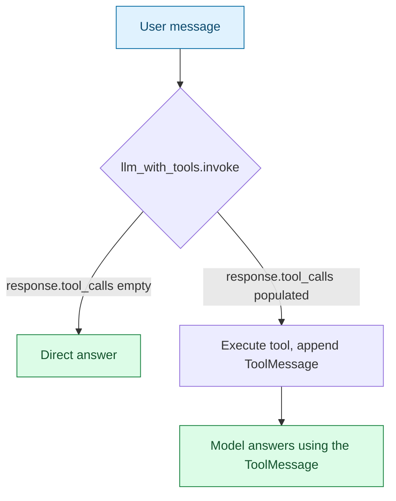

# Step 2, LangChain Variant — Chat With Web Search

> A side-by-side alternative to [02-chat-with-web-search](../02-chat-with-web-search/README.md), rebuilt on [LangChain](https://python.langchain.com/)'s native tool-calling instead of a hand-rolled text protocol. Same tool, same Docker Model Runner backend, same "at most one tool hop" behavior — the only thing that changed is who parses the model's decision to call a tool.

## What This Is, and Why It Exists

The original app teaches Gemma a plain-text protocol in the system prompt (`ACTION: web_search {"query": "..."}`) because small local models weren't assumed to reliably support a provider-native "tools" API parameter. This variant tests that assumption directly: `ChatOpenAI(...).bind_tools([web_search])` asks the model to return a structured tool call over Docker Model Runner's OpenAI-compatible API, and LangChain parses and validates it — no `ACTION_NAME_PATTERN`, no `JSON_OBJECT_PATTERN`, no `try_parse_action`.



## What Changed vs. the Hand-Rolled Version

| Concern | [02-chat-with-web-search](../02-chat-with-web-search/) | This app |
| --- | --- | --- |
| Telling the model a tool exists | `tools_prompt_block()` renders tool names/descriptions into the system prompt by hand | `@tool` docstring + type hints; `bind_tools()` generates the schema and sends it as a proper API parameter |
| Deciding a tool was called | Regex over the raw text reply (`ACTION_NAME_PATTERN`, `JSON_OBJECT_PATTERN`) | `response.tool_calls` — already parsed, already validated against the tool's argument schema |
| Malformed arguments | Caught by hand in `resolve_tool_call`, fed back as a `ValidationError` message | Handled by LangChain before the call ever reaches your code — a genuinely malformed call from the model is rare here because the API-level schema constrains what it can emit |
| Hallucinated tool name | `difflib.get_close_matches` suggests the nearest real tool | Still guarded in `run_turn()` (a confused model could still emit *some* string as a name), but this path is far less likely to trigger since the model is choosing from an explicit, API-provided tool list rather than free-texting a name |
| Result fed back to the model | A `user`-role message containing `Observation: ...` | A proper `ToolMessage` tied to the originating `tool_call_id` — the structurally correct way to represent "here's what that call returned" in a chat transcript |

Net effect: [tools.py](../02-chat-with-web-search/tools.py)'s `tools_prompt_block()` and [chat_with_tools.py](../02-chat-with-web-search/chat_with_tools.py)'s entire parsing layer (`try_parse_action`, most of `resolve_tool_call`) disappear. What's left in [chat_with_tools.py](chat_with_tools.py) is close to just: define the tool, bind it, run the loop.

## Is This Actually More Reliable?

Untested claim until you run it against your own setup — small local models are not guaranteed to honor structured tool-calling every turn the way hosted frontier models do. In manual testing against `docker.io/ai/gemma4:E4B` through this repo's Docker Model Runner setup, tool-calling worked correctly: a trivial arithmetic question was answered directly with no tool call, and a current-events question correctly triggered `web_search` and used the result. Your mileage may vary by model tag and quantization — run both apps on the same prompts and compare. If tool-calling turns out flaky for your model, the hand-rolled version's explicit text protocol and retry loop are the fallback, not a worse design — they exist for exactly that reliability gap.

## Setup

1. Start the local model — see [00-local-model-setup/README.md](../00-local-model-setup/README.md).
2. Install dependencies:

   ```bash
   cd week-02/agentic-ai/code/02-chat-with-web-search-langchain
   uv sync
   ```

`web_search` calls the live web (via `ddgs`, a no-API-key DuckDuckGo client) — you need internet access to use it, but not an API key.

## Run

```bash
uv run chat_with_tools.py
```

Optional flags (both also read from `DMR_MODEL` / `DMR_BASE_URL` env vars):

```bash
uv run chat_with_tools.py --model docker.io/ai/gemma4:E4B --base-url http://localhost:12434/v1
```

## Example Session

```text
Chatting with docker.io/ai/gemma4:E4B (web search enabled, LangChain tool-calling) — type 'exit' to leave.

You: What's 12 * 7?
Assistant: 12 * 7 is 84.

You: Who won the most recent F1 world championship?
Assistant: The most recent F1 World Drivers' Champion is Max Verstappen.

You: exit
Bye!
```

The first question needs no external information, so `response.tool_calls` comes back empty and the model answers directly. The second triggers a `web_search` tool call behind the scenes — LangChain surfaces it as a structured call, not text you'd otherwise see printed to the user by mistake.

## Gotchas

| Symptom | Cause | Fix |
| --- | --- | --- |
| Model never calls the tool, even when it should | Some Gemma tags/quantizations don't reliably emit tool calls through Docker Model Runner's OpenAI-compat layer | Fall back to [02-chat-with-web-search](../02-chat-with-web-search/)'s text-protocol approach, or try a different model tag |
| `[error] ... Is Docker Model Runner running?` | Docker Model Runner not running / model not pulled | See [00-local-model-setup](../00-local-model-setup/README.md) |
| `pip`/`uv` pulls in a lot more than the hand-rolled version | `langchain-openai` brings `langchain-core`, `langsmith`, `tiktoken`, and friends | Expected — this is the real cost of the simplification; see the dependency tree with `uv tree` if you want specifics |

## Quick Reference Card

| Concept | Where it lives in this app |
| --- | --- |
| Tool definition | `@tool`-decorated `web_search()` in [chat_with_tools.py](chat_with_tools.py) |
| Native tool-calling | `llm.bind_tools(TOOLS)` in `main()` |
| Reading a tool call | `response.tool_calls` in `run_turn()` |
| Feeding a result back | `ToolMessage(content=..., tool_call_id=...)` |
| Bounded self-correction retries | `MAX_TOOL_RETRIES` in `run_turn()` (still hand-rolled — LangChain doesn't guardrail this for you) |

## What's Next

Compare this against [02-chat-with-web-search](../02-chat-with-web-search/README.md) directly, then look at whether the same trade applies to [03-small-agent](../03-small-agent/README.md)'s full ReAct loop — that's a bigger win, since LangGraph's `create_react_agent` replaces the entire hand-rolled loop/dispatcher there, not just the single-hop tool parsing this app removes.
