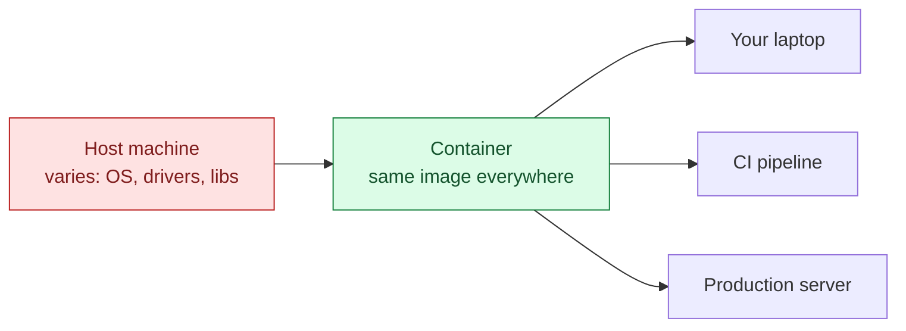
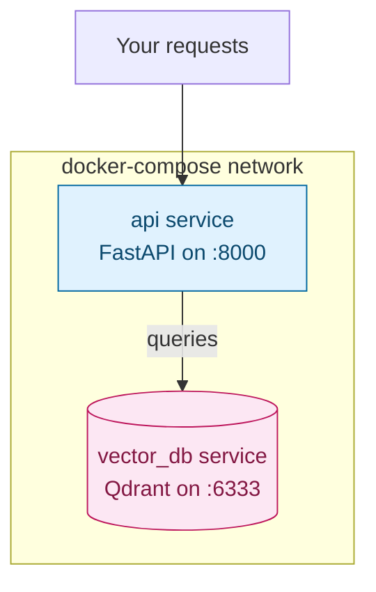

# Docker Essentials — Why It Matters for AI Work

> Part 1 of the Docker series. This note opens Week 1's Docker refresher: why AI projects specifically lean on containers, then the core mechanics — images, containers, Dockerfiles, volumes, env vars, GPU access, and multi-service stacks with `docker-compose`.

## 1. Why Docker Matters for AI

AI stacks pin exact versions of CUDA, PyTorch/TensorFlow, native BLAS libraries, and vector DB clients — a single mismatch (e.g. CUDA driver vs PyTorch build) can break everything. Docker freezes the whole environment so "works on my machine" becomes "works everywhere."



**Where this shows up across the curriculum:**

| Use case | Why Docker helps |
| --- | --- |
| Reproducible experiments (Week 6, evaluation) | A Dockerfile is executable documentation of your exact setup — reproducible months later, unlike `requirements.txt` alone, which can't capture system-level deps (`ffmpeg`, native BLAS, etc.) |
| Serving models / agents behind an API | Packages app + runtime into one deployable image — no drift between what you tested and what's running in prod |
| Multi-service agentic stacks (Week 5, Agentic RAG) | `docker-compose` spins up a vector DB, API layer, and model server together with one command |
| GPU workloads | The NVIDIA Container Toolkit isolates CUDA versions per project — run CUDA 11.8 and 12.x projects side by side without host conflicts |
| Sandboxing agent tool execution | An agent that can run code or shell commands as a tool does it inside an ephemeral container — blast radius stays inside the box |
| CI/CD eval pipelines (Week 7, governance) | Containerizing the eval harness keeps the eval logic itself constant when comparing model versions |

---

## 2. Images vs Containers

- An **image** is a read-only template — a filesystem snapshot plus metadata (entrypoint, exposed ports, env defaults).
- A **container** is a running (or stopped) *instance* of an image — same relationship as a class and an object.

```bash
docker images              # list images on this machine
docker ps                  # list RUNNING containers
docker ps -a                # list ALL containers, including stopped ones
```

---

## 3. Your First Dockerfile

```dockerfile
# Dockerfile
FROM python:3.12-slim

WORKDIR /app

# Copy dependency files first — leverages Docker's layer cache so
# `uv sync` only reruns when dependencies actually change, not on every code edit
COPY pyproject.toml uv.lock ./
RUN pip install uv && uv sync --frozen

COPY . .

CMD ["uv", "run", "uvicorn", "main:app", "--host", "0.0.0.0", "--port", "8000"]
```

```bash
docker build -t agent-service .        # build an image, tagged "agent-service"
docker run -p 8000:8000 agent-service  # run it, mapping host port 8000 -> container port 8000
```

> **Layer order matters.** Docker caches each instruction as a layer and reuses cached layers if nothing above them changed. Copying `pyproject.toml`/`uv.lock` *before* the rest of the code means editing a Python file doesn't force a full dependency reinstall on the next build.

---

## 4. Volumes — Persisting Data & Live Code Reload

Containers are ephemeral by default — anything written inside one disappears when it's removed. **Volumes** persist data or share it with the host.

```bash
# Bind mount: map a host directory into the container (great for local dev — edits
# on the host show up inside the container immediately, no rebuild needed)
docker run -v $(pwd):/app -p 8000:8000 agent-service

# Named volume: Docker-managed storage that survives container removal
# (e.g. a vector DB's on-disk index)
docker run -v vector_data:/data qdrant/qdrant
```

| Mount type | Use case |
| --- | --- |
| Bind mount (`-v $(pwd):/app`) | Local dev — live code edits without rebuilding |
| Named volume (`-v vector_data:/data`) | Persisting a database's data across container restarts |
| No volume | Stateless services — fine to lose data on restart |

---

## 5. Environment Variables & Secrets

LLM API keys and config belong in env vars, never baked into the image.

```bash
docker run -e ANTHROPIC_API_KEY=$ANTHROPIC_API_KEY agent-service

# Or from a file, kept out of version control (.gitignore it)
docker run --env-file .env agent-service
```

```dockerfile
# Dockerfile — declare it, but never hardcode the value
ENV ANTHROPIC_API_KEY=""
```

> **Never `COPY` a `.env` file into an image** or hardcode a secret in a `RUN`/`ENV` instruction — image layers persist in history and can leak the value even if a later layer "removes" it. Pass secrets at `docker run` time instead.

---

## 6. GPU Access for AI Workloads

```bash
# Requires the NVIDIA Container Toolkit installed on the host
docker run --gpus all pytorch/pytorch:2.4.0-cuda12.4-cudnn9-runtime \
  python -c "import torch; print(torch.cuda.is_available())"
# True
```

The container sees the host's GPU directly, but its own CUDA/cuDNN versions are whatever the image specifies — independent of what else is installed on the host.

---

## 7. `docker-compose` — Multi-Service Stacks

Real agentic RAG setups need more than one container: an API, a vector DB, maybe a local model server. `docker-compose` describes the whole stack in one file.

```yaml
# docker-compose.yml
services:
  api:
    build: .
    ports:
      - "8000:8000"
    environment:
      - ANTHROPIC_API_KEY=${ANTHROPIC_API_KEY}
    depends_on:
      - vector_db

  vector_db:
    image: qdrant/qdrant
    ports:
      - "6333:6333"
    volumes:
      - vector_data:/qdrant/storage

volumes:
  vector_data:
```

```bash
docker compose up          # build + start every service, wired together on one network
docker compose up -d       # same, but detached (runs in the background)
docker compose down        # stop and remove containers (add -v to also drop volumes)
```



Inside the compose network, `api` reaches `vector_db` by **service name** (e.g. `http://vector_db:6333`) — Docker's internal DNS resolves it, no hardcoded IPs.

---

## Quick Reference Card

| Task | Command |
| --- | --- |
| Build an image | `docker build -t <name> .` |
| Run a container | `docker run -p <host>:<container> <image>` |
| Run with a bind mount | `docker run -v $(pwd):/app <image>` |
| Run with an env var | `docker run -e KEY=value <image>` |
| Run with GPU access | `docker run --gpus all <image>` |
| List images / containers | `docker images` / `docker ps -a` |
| Stop / remove a container | `docker stop <id>` / `docker rm <id>` |
| Start a multi-service stack | `docker compose up -d` |
| Tear down a stack | `docker compose down` |
| View logs | `docker logs <id>` / `docker compose logs -f` |

---

## What's Next in This Series

1. **Dockerizing an AI Service** — packaging a FastAPI + LLM app end-to-end, from the notes in [python-refresher Note 9](../../python-refresher/notes/09-fastapi-essentials.md), into a shippable image.
