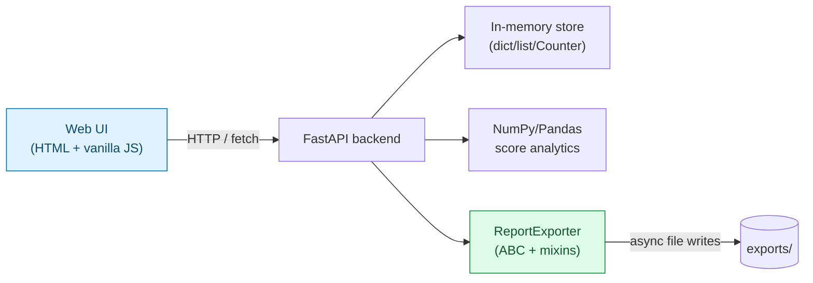
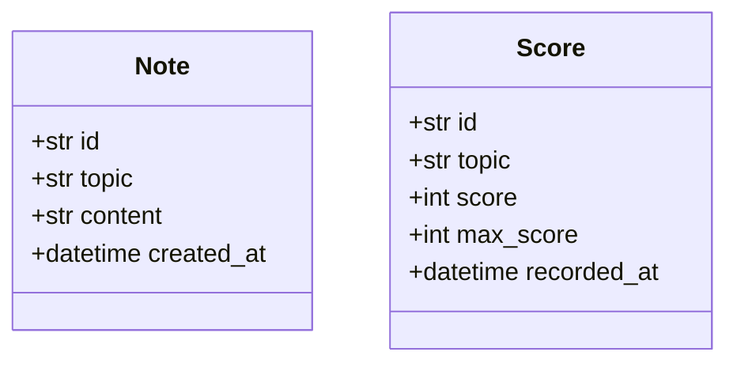
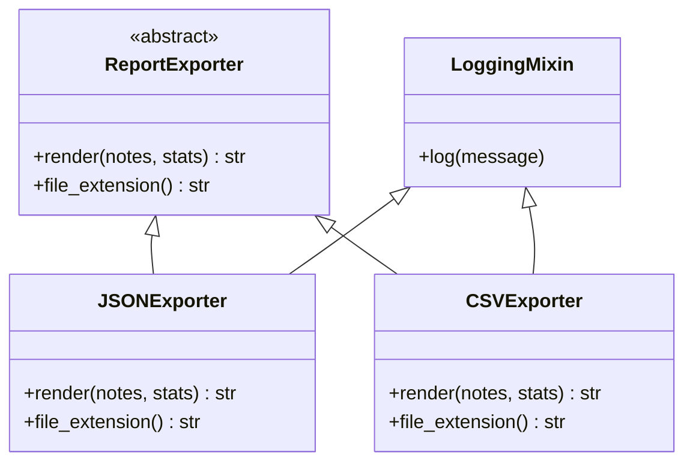
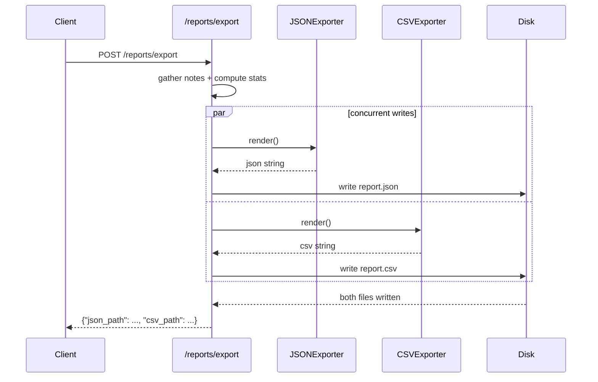

# Case Study 1 — Study Buddy: A Notes & Quiz-Score Tracker

> A hands-on project that pulls together the core-Python side of the [notes series](../notes/01-python-for-ai.md): data structures, NumPy/Pandas, OOP (ABCs, mixins, dunder methods), async, Pydantic, and FastAPI. Build it note-by-note, or all at once — either way, this is where the concepts stop being examples and start being a real (small) system.

## What You're Building

**Study Buddy** is a small service for tracking study notes and quiz scores: save notes per topic, log quiz scores, see aggregate stats, and export everything as a report. No LLM, no agent — just solid Python and a clean API.



---

## Feature Overview

1. **Notes** — add, list, and search short study notes tagged by topic.
2. **Quiz scores** — log a score per topic; get aggregate stats (mean, best/worst topic).
3. **Topic counts** — how many notes/scores exist per topic, using `Counter`.
4. **Report export** — generate a JSON or CSV report combining notes + stats, writing both files concurrently.
5. **UI** — one simple page: a notes panel, a scores panel, and an export button.

---

## Suggested Tech Stack

| Layer | Choice | Notes-series reference |
| --- | --- | --- |
| Backend framework | FastAPI + `uvicorn` | [Note 9](../notes/09-fastapi-essentials.md) |
| Validation / schemas | Pydantic models | [Note 8](../notes/08-pydantic-structured-outputs.md) |
| Data structures | `dict`/`list`/`Counter`/`defaultdict` for the in-memory store | [Note 3](../notes/03-data-structures-deep-dive.md) |
| Analytics | NumPy for score math, Pandas for the notes/scores table | [Notes 4](../notes/04-numpy-essentials.md) & [5](../notes/05-pandas-data-wrangling.md) |
| Report exporters | ABC + mixins + dunder methods | [Note 6](../notes/06-oop-deep-dive.md) |
| Concurrency | `asyncio` for concurrent file writes during export | [Note 7](../notes/07-async-concurrency.md) |
| Environment | `uv` for the venv + dependencies | [Note 2](../notes/02-python-refreshr.md) |
| UI | Plain HTML/CSS/JS served as static files by FastAPI (no framework needed) | — |

```bash
uv init study-buddy
cd study-buddy
uv add fastapi uvicorn pydantic numpy pandas aiofiles
```

---

## Suggested Project Structure

```text
study-buddy/
├── main.py                  # FastAPI app + static file mount
├── schemas.py                # Pydantic models (Note, Score, ...)
├── store.py                   # In-memory data store (dict/list/Counter based)
├── analytics.py                 # NumPy/Pandas score statistics
├── exporters.py                   # ReportExporter ABC + JSON/CSV subclasses
├── scorebook.py                     # ScoreBook — a class with __len__/__getitem__/__iter__
├── routers/
│   ├── notes.py                      # /notes endpoints
│   ├── scores.py                      # /scores endpoints
│   └── reports.py                      # /reports/export endpoint
└── static/
    ├── index.html                       # the UI
    ├── app.js
    └── style.css
```

---

## Data Model



```python
# schemas.py — starter shape, extend as needed (Note 8)
from pydantic import BaseModel, Field
from datetime import datetime

class NoteCreate(BaseModel):
    topic: str = Field(..., min_length=1)
    content: str = Field(..., min_length=1, max_length=2000)

class Note(NoteCreate):
    id: str
    created_at: datetime

class ScoreCreate(BaseModel):
    topic: str
    score: int = Field(..., ge=0)
    max_score: int = Field(..., gt=0)

class Score(ScoreCreate):
    id: str
    recorded_at: datetime
```

---

## REST API Surface

Design and implement these endpoints — signatures are a starting contract, adjust as you go.

| Method | Path | Purpose | Notes reference |
| --- | --- | --- | --- |
| `POST` | `/notes` | Create a note | [Note 9 §3](../notes/09-fastapi-essentials.md#3-request-bodies-with-pydantic) |
| `GET` | `/notes` | List all notes, optional `?topic=` filter | [Note 9 §2](../notes/09-fastapi-essentials.md#2-path--query-parameters) |
| `GET` | `/notes/search?q=` | Full-text search over note content | [Note 3](../notes/03-data-structures-deep-dive.md) (filtering) |
| `GET` | `/notes/topic-counts` | Count of notes per topic | [Note 3](../notes/03-data-structures-deep-dive.md#counter--frequency-counting) (`Counter`) |
| `POST` | `/scores` | Log a quiz score | — |
| `GET` | `/scores` | List all scores, optional `?topic=` filter | — |
| `GET` | `/scores/stats` | Aggregate stats: mean, best/worst topic | [Notes 4](../notes/04-numpy-essentials.md) & [5](../notes/05-pandas-data-wrangling.md) |
| `POST` | `/reports/export` | Generate a report (`?format=json` or `csv`) | [Note 7](../notes/07-async-concurrency.md), [Note 6](../notes/06-oop-deep-dive.md) |

---

## The OOP Piece: `ReportExporter`

Instead of an agent framework, this case study's OOP centerpiece is a small **exporter hierarchy** — the same ABC + mixin pattern from [Note 6](../notes/06-oop-deep-dive.md), applied to a concrete, non-AI problem.



```python
# exporters.py — starter shape (Note 6: ABC + mixin)
from abc import ABC, abstractmethod

class LoggingMixin:
    def log(self, message: str):
        print(f"[{self.__class__.__name__}] {message}")

class ReportExporter(ABC):
    @abstractmethod
    def render(self, notes: list[dict], stats: dict) -> str:
        ...

    @abstractmethod
    def file_extension(self) -> str:
        ...

class JSONExporter(ReportExporter, LoggingMixin):
    def render(self, notes, stats) -> str:
        import json
        self.log("rendering JSON report")
        return json.dumps({"notes": notes, "stats": stats}, indent=2, default=str)

    def file_extension(self) -> str:
        return "json"

class CSVExporter(ReportExporter, LoggingMixin):
    def render(self, notes, stats) -> str:
        self.log("rendering CSV report")
        # build a CSV string from notes + a flattened stats row — your implementation
        ...

    def file_extension(self) -> str:
        return "csv"
```

**The dunder-method piece** — wrap the raw list of scores in a small class so the rest of the codebase interacts with it like a native collection ([Note 6 §3](../notes/06-oop-deep-dive.md#3-dunder-magic-methods--the-hooks-behind-pythons-syntax)):

```python
# scorebook.py — starter shape
class ScoreBook:
    def __init__(self, scores: list[dict]):
        self._scores = scores

    def __len__(self):
        return len(self._scores)

    def __getitem__(self, idx):
        return self._scores[idx]

    def __iter__(self):
        return iter(self._scores)

    def __repr__(self):
        return f"ScoreBook({len(self)} scores)"

    def by_topic(self, topic: str) -> "ScoreBook":
        return ScoreBook([s for s in self._scores if s["topic"] == topic])
```

---

## The Async Piece: Concurrent Export

The export endpoint writes **both** a JSON and a CSV file to disk concurrently instead of one after another — a genuine (if small) I/O-bound win from [Note 7](../notes/07-async-concurrency.md), using real async file writes (`aiofiles`) rather than a simulated `asyncio.sleep`.



```python
# routers/reports.py — starter shape (Note 7: asyncio.gather + real file I/O)
import aiofiles
import asyncio

async def write_file(path: str, content: str):
    async with aiofiles.open(path, "w") as f:
        await f.write(content)

async def export_report(notes: list[dict], stats: dict):
    json_content = JSONExporter().render(notes, stats)
    csv_content = CSVExporter().render(notes, stats)

    await asyncio.gather(
        write_file("exports/report.json", json_content),
        write_file("exports/report.csv", csv_content),
    )
    return {"json_path": "exports/report.json", "csv_path": "exports/report.csv"}
```

---

## The UI (Keep It Simple)

One HTML page, three panels, no build step required:

1. **Notes panel** — a form to add a note (topic + content), a list below it, a search box.
2. **Scores panel** — a form to log a score, a small table or bar-per-topic view of stats pulled from `/scores/stats`.
3. **Export panel** — a button that calls `/reports/export` and shows the resulting file paths (or offers a download link).

```javascript
// static/app.js — sketch of the pattern, not the full implementation
async function addNote(topic, content) {
  const res = await fetch("/notes", {
    method: "POST",
    headers: { "Content-Type": "application/json" },
    body: JSON.stringify({ topic, content }),
  });
  if (!res.ok) throw new Error(await res.text());
  return res.json();
}

async function loadStats() {
  const res = await fetch("/scores/stats");
  return res.json();
}

async function exportReport(format) {
  const res = await fetch(`/reports/export?format=${format}`, { method: "POST" });
  return res.json();
}
```

```python
# main.py — mounting the UI as static files alongside the API
from fastapi import FastAPI
from fastapi.staticfiles import StaticFiles

app = FastAPI(title="Study Buddy")
# ...include your routers here...
app.mount("/", StaticFiles(directory="static", html=True), name="static")
```

---

## User Stories to Implement

Work through these roughly in order — each builds on the last, and each leans on a specific note.

### 1. Project setup

**As a developer**, I want a `uv`-managed project with FastAPI running, so that I have a working base to build on.

- [ ] `uv init` project, dependencies added via `uv add`
- [ ] `GET /health` returns `{"status": "ok"}`
- [ ] `uvicorn main:app --reload` runs, `/docs` loads
- *Reference:* [Note 2](../notes/02-python-refreshr.md), [Note 9 §1](../notes/09-fastapi-essentials.md#1-your-first-endpoint)

### 2. Add and list notes

**As a learner**, I want to save a short note under a topic, so that I can capture what I learned without losing it.

- [ ] `POST /notes` validates `topic` and `content` via Pydantic, rejects empty content
- [ ] `GET /notes` returns all notes; `GET /notes?topic=numpy` filters
- [ ] Notes are stored with a generated `id` and `created_at` timestamp
- *Reference:* [Note 8](../notes/08-pydantic-structured-outputs.md), [Note 3](../notes/03-data-structures-deep-dive.md) (list of dicts pattern)

### 3. Search notes

**As a learner**, I want to search my notes by keyword, so that I can find what I wrote about a topic without scrolling through everything.

- [ ] `GET /notes/search?q=broadcasting` returns notes whose content or topic contains the query (case-insensitive)
- [ ] Empty/missing `q` returns a 422 or an empty list — your call, but document which
- *Reference:* [Note 3](../notes/03-data-structures-deep-dive.md) (comprehensions, string methods)

### 4. Topic counts with `Counter`

**As a learner**, I want to see how many notes I have per topic, so that I can spot topics I'm neglecting.

- [ ] `GET /notes/topic-counts` returns `{topic: count}` built with `collections.Counter`
- [ ] Sorted by count descending (`.most_common()`)
- *Reference:* [Note 3 §5](../notes/03-data-structures-deep-dive.md#counter--frequency-counting)

### 5. Log quiz scores

**As a learner**, I want to record a score after a quiz, so that I can track progress over time per topic.

- [ ] `POST /scores` validates `score <= max_score` (custom Pydantic validator)
- [ ] Scores are stored with an `id` and `recorded_at` timestamp
- *Reference:* [Note 8 §5](../notes/08-pydantic-structured-outputs.md#5-custom-validators)

### 6. Score analytics

**As a learner**, I want to see my average score, and which topic I'm strongest/weakest in, so that I know where to focus.

- [ ] `GET /scores/stats` returns overall mean (as a percentage), and per-topic mean using NumPy
- [ ] Best and worst topic identified via `argmax`/`argmin` or Pandas `groupby` + `idxmax`/`idxmin`
- [ ] Handle the empty-state (no scores yet) without crashing
- *Reference:* [Note 4](../notes/04-numpy-essentials.md) (aggregates, `argmax`), [Note 5](../notes/05-pandas-data-wrangling.md) (`groupby`)

### 7. `ScoreBook` — a collection with dunder methods

**As a developer**, I want to treat my scores as a native-feeling collection, so that the rest of the code can use `len()`, indexing, and iteration instead of raw list access everywhere.

- [ ] `ScoreBook` implements `__len__`, `__getitem__`, `__iter__`, `__repr__`
- [ ] `ScoreBook.by_topic(topic)` returns a filtered `ScoreBook`
- [ ] `/scores/stats` (or its internals) is refactored to use `ScoreBook` instead of a raw list
- *Reference:* [Note 6 §3](../notes/06-oop-deep-dive.md#3-dunder-magic-methods--the-hooks-behind-pythons-syntax)

### 8. Report exporters — ABC + mixin

**As a learner**, I want to export my notes and stats as a report, so that I have a snapshot I can keep or share.

- [ ] `ReportExporter(ABC)` defines `render()` and `file_extension()` as abstract methods
- [ ] `JSONExporter` and `CSVExporter` implement both, and mix in `LoggingMixin`
- [ ] Attempting to instantiate `ReportExporter` directly raises `TypeError`
- *Reference:* [Note 6 §1 & §2](../notes/06-oop-deep-dive.md#1-abstract-base-classes-abcs--enforcing-a-contract)

### 9. Concurrent export endpoint

**As a learner**, I want both report formats generated in one request, so that I don't wait for them one after another.

- [ ] `POST /reports/export` renders JSON and CSV, then writes both files **concurrently** via `asyncio.gather` + `aiofiles`
- [ ] Response includes both file paths
- [ ] A failure in one exporter doesn't silently corrupt the other's output
- *Reference:* [Note 7 §3](../notes/07-async-concurrency.md#3-running-things-concurrently-asynciogather)

### 10. The UI

**As a learner**, I want a single web page to add notes, log scores, see stats, and trigger an export, so that I don't need `curl` to use any of this.

- [ ] Notes panel: add-note form + live list + search box
- [ ] Scores panel: log-score form + stats display (numbers are fine; a simple bar chart is a nice stretch)
- [ ] Export panel: button + result display (file paths or a download link)
- [ ] Basic error states shown to the user (e.g., failed request, empty content)

---

## Stretch Goals (Optional)

- Swap the in-memory store for SQLite (still no external DB server needed) — a good excuse to compare against the pure dict/list version.
- Add a `/reports/export/stream` endpoint that streams export progress via `StreamingResponse` ([Note 9 §6](../notes/09-fastapi-essentials.md#6-streaming-responses--token-by-token-output)) instead of blocking until both files are done.
- Add a `MarkdownExporter` — a third `ReportExporter` subclass — to confirm the ABC contract scales cleanly to a new format.
- Add simple auth (`Depends(verify_api_key)` from [Note 9 §5](../notes/09-fastapi-essentials.md#5-dependency-injection--shared-setup-auth-clients-db-sessions)) before exposing this beyond localhost.
- Add a `Depends`-based pagination helper for `GET /notes` once the list grows.

---

## Definition of Done

- [ ] All core user stories (1–10) implemented and manually tested via `/docs` and the UI
- [ ] `GET /scores/stats` never crashes on an empty dataset
- [ ] `POST /reports/export` writes both files and you can verify (via timing or a log line) that the writes happened concurrently, not sequentially
- [ ] `ReportExporter` cannot be instantiated directly; adding a new exporter format requires no changes to the export endpoint itself
- [ ] A malformed request (e.g., `score` greater than `max_score`, empty note content) returns a clear 422, not a 500
- [ ] You can explain, out loud, which note in the series taught you each piece you just built
