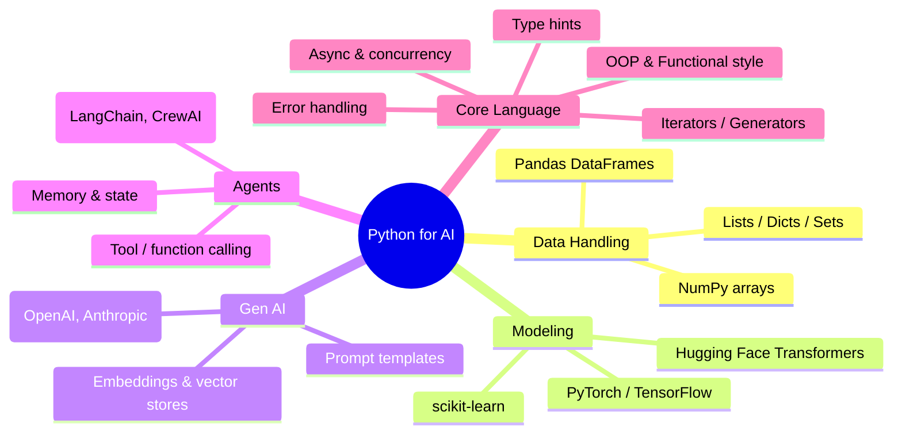
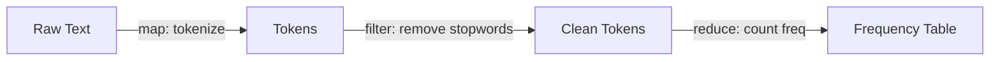
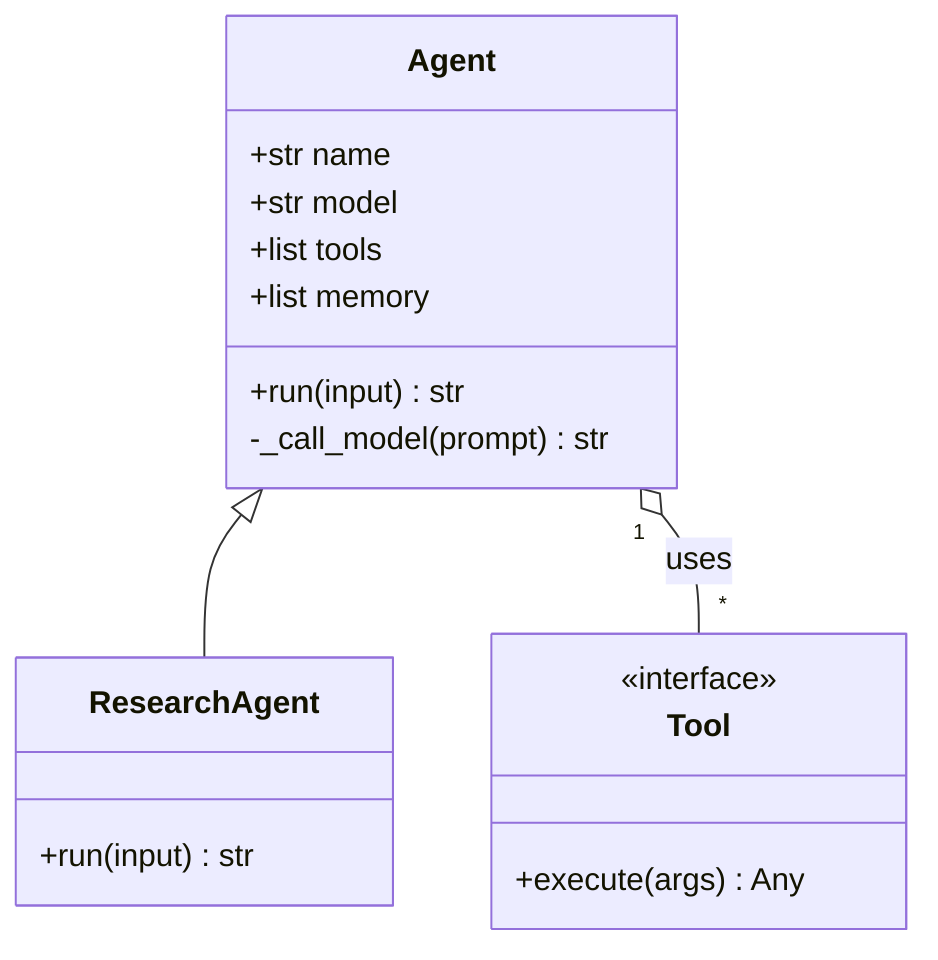
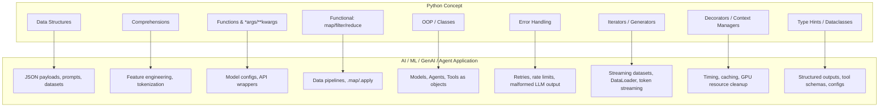

# Python for AI, ML, Gen AI & Agents — Essential Concepts

> Part 1 of the Python refresher series. This note maps out **why** Python is the default language for AI work and lays down the **core language concepts** you need before touching NumPy, PyTorch, or an agent framework. Later notes in this folder will go deep on each pillar (data structures, OOP, functional patterns, async, typing, etc.).

## Why Python for AI/ML/GenAI/Agents?

- **Readable + expressive** — fast to prototype, easy to review, close to pseudocode.
- **Ecosystem gravity** — NumPy, Pandas, PyTorch, TensorFlow, scikit-learn, Hugging Face, LangChain, LlamaIndex all live here.
- **Glue language** — AI systems are mostly plumbing (data in → model → data out); Python glues C/CUDA-backed numerical libraries to real-world APIs effortlessly.
- **Interactive workflows** — Jupyter/IPython make experimentation and visualization tight feedback loops.
- **Agent-native** — most LLM tool-calling, orchestration, and function-calling SDKs (OpenAI, Anthropic, LangChain, CrewAI) ship Python-first.



## The Learning Path


This note covers **A → H** at a conceptual level (the "essentials"). Each will get its own deep-dive file.

---

## 1. Core Data Structures

The bread and butter of every data pipeline, dataset loader, and prompt builder.

| Structure | Mutable? | Ordered? | Typical AI use |
| --- | --- | --- | --- |
| `list` | ✅ | ✅ | Batches of samples, token sequences |
| `tuple` | ❌ | ✅ | Fixed records (e.g., `(input, label)`), function returns |
| `dict` | ✅ | ✅ (3.7+) | JSON payloads, config, prompt templates, API responses |
| `set` | ✅ | ❌ | Vocabulary, deduplication, feature flags |
| `str` | ❌ | ✅ | Raw text, prompts, tokenization input |

```python
# A single training example, expressed with core structures
sample = {
    "id": 42,
    "text": "The transformer architecture revolutionized NLP.",
    "labels": {"topic", "nlp", "deep-learning"},   # a set
    "embedding": (0.12, -0.98, 0.33),              # a tuple (fixed-size vector)
}

vocab = set()
for token in sample["text"].split():
    vocab.add(token.lower())
```

**Why it matters for AI:** virtually every dataset, API response (JSON ≈ nested dicts/lists), and prompt template is built from these primitives before it ever reaches a tensor.

---

## 2. List/Dict/Set Comprehensions

Comprehensions replace verbose loops with vectorized-feeling, readable one-liners — the Pythonic bridge to array-style thinking (NumPy).

```python
# Tokenize and lowercase a batch of texts
texts = ["Hello World", "Deep Learning Rocks"]
tokenized = [t.lower().split() for t in texts]

# Build a word -> length lookup (dict comprehension)
word_lengths = {w: len(w) for sentence in tokenized for w in sentence}

# Filter tokens with length > 4 (set comprehension)
long_words = {w for w in word_lengths if word_lengths[w] > 4}
```

**AI relevance:** feature engineering, quick dataset filtering, building lookup tables (id→label, token→index) all lean on comprehensions before you reach for Pandas.

---

## 3. Functions, `*args`, `**kwargs`, and Default Parameters

Model configs, training loops, and API wrappers all rely on flexible function signatures.

```python
def train_model(model, data, epochs=10, lr=1e-3, **hyperparams):
    """hyperparams might hold: batch_size, weight_decay, warmup_steps, ..."""
    print(f"Training for {epochs} epochs at lr={lr}, extra={hyperparams}")

train_model(model="gpt-mini", data=[...], epochs=5, batch_size=32, dropout=0.1)
```

- `*args` → variable positional args (e.g., stacking multiple loss terms).
- `**kwargs` → variable keyword args (e.g., forwarding hyperparameters, LLM API options like `temperature`, `top_p`).
- Default parameters → sensible model/training defaults, just like `sklearn` estimators or `openai.chat.completions.create(temperature=0.7, ...)`.

---

## 4. Functional Programming Essentials

ML pipelines are conceptually a chain of transformations — functional idioms map directly onto that.

```python
from functools import reduce

texts = ["I love AI", "ML is fun", "Agents are cool"]

# map: apply a transformation to every element
lengths = list(map(len, texts))

# filter: keep elements matching a predicate
short_texts = list(filter(lambda t: len(t) < 12, texts))

# reduce: fold a sequence into a single value
total_chars = reduce(lambda acc, t: acc + len(t), texts, 0)

# lambda: throwaway inline functions (common in sorting, callbacks, Pandas .apply)
sorted_by_len = sorted(texts, key=lambda t: len(t))
```

**Where this shows up:**

- `dataset.map(preprocess_fn)` in Hugging Face `datasets`.
- `df.apply(lambda row: ...)` in Pandas.
- Functional-style data pipelines (`torch.utils.data` transforms are literally composable functions).



---

## 5. Object-Oriented Programming (OOP)

Almost every model, dataset, and agent in the Python AI ecosystem is a **class**. Understanding classes is non-negotiable.

```python
class Agent:
    """Minimal agent skeleton — the shape you'll see in every framework."""

    def __init__(self, name: str, model: str, tools: list | None = None):
        self.name = name
        self.model = model
        self.tools = tools or []
        self.memory = []  # conversation/state history

    def add_tool(self, tool):
        self.tools.append(tool)

    def run(self, user_input: str) -> str:
        self.memory.append({"role": "user", "content": user_input})
        response = self._call_model(user_input)
        self.memory.append({"role": "assistant", "content": response})
        return response

    def _call_model(self, prompt: str) -> str:
        # placeholder for an actual LLM API call
        return f"[{self.model}] responding to: {prompt}"


class ResearchAgent(Agent):          # inheritance
    def run(self, user_input: str) -> str:
        result = super().run(user_input)   # reuse parent logic
        return f"[researched] {result}"
```

Key OOP concepts to know cold:

| Concept | AI/Agent parallel |
| --- | --- |
| Class / Instance | `nn.Module` subclass / a trained model object |
| Inheritance | `ResearchAgent(Agent)`, custom PyTorch layers extending `nn.Module` |
| Encapsulation | Hiding tokenizer internals behind `.encode()` / `.decode()` |
| Polymorphism | Every LangChain "tool" implements the same `.run()` interface |
| Magic methods (`__call__`, `__repr__`, `__len__`) | `model(x)` calls `forward()` via `__call__`; `Dataset.__len__` / `__getitem__` |



---

## 6. Error Handling

AI pipelines fail constantly — flaky APIs, malformed JSON from an LLM, GPU OOM errors, rate limits. Robust `try/except` is essential, not optional.

```python
import time

def call_llm_with_retry(prompt: str, max_retries: int = 3):
    for attempt in range(1, max_retries + 1):
        try:
            return call_llm(prompt)          # could raise RateLimitError, TimeoutError
        except RateLimitError:
            wait = 2 ** attempt
            print(f"Rate limited, retrying in {wait}s...")
            time.sleep(wait)
        except (TimeoutError, ConnectionError) as e:
            print(f"Network issue: {e}")
        except Exception as e:
            print(f"Unrecoverable error: {e}")
            raise
    raise RuntimeError("Max retries exceeded")
```

**Patterns you'll reuse constantly:**

- Retry with exponential backoff (LLM API calls, rate limits).
- `try/except json.JSONDecodeError` when parsing LLM structured output.
- Custom exceptions (`class ToolExecutionError(Exception)`) for agent tool failures.
- `finally` blocks to release GPU memory / close file handles / log token usage.

---

## 7. Iterators & Generators

Datasets in AI are often too large for memory — generators let you **stream** data lazily instead of loading everything at once.

```python
def batch_generator(data, batch_size):
    """Yield successive batches without materializing them all in memory."""
    for i in range(0, len(data), batch_size):
        yield data[i:i + batch_size]

for batch in batch_generator(large_dataset, batch_size=32):
    train_step(batch)
```

- `yield` → the mechanism behind PyTorch `DataLoader`, Hugging Face streaming `datasets`, and token-by-token LLM streaming responses.
- Custom iterators (`__iter__` / `__next__`) power epoch loops (`for epoch in range(num_epochs)`) and data pipelines under the hood.
- **Generator expressions** (`(x**2 for x in range(10))`) are the memory-efficient cousin of list comprehensions — critical when iterating huge token streams.

```mermaid
sequenceDiagram
    participant Loop as Training Loop
    participant Gen as batch_generator()
    participant Mem as Memory

    Loop->>Gen: next()
    Gen->>Mem: load batch 1 only
    Gen-->>Loop: yield batch 1
    Loop->>Gen: next()
    Gen->>Mem: load batch 2 only
    Gen-->>Loop: yield batch 2
    Note over Mem: Full dataset never loaded at once
```

---

## 8. Decorators & Context Managers

Cross-cutting concerns (timing, caching, logging, resource cleanup) show up everywhere in ML code, and Python solves this elegantly.

```python
import time
from functools import wraps
from contextlib import contextmanager

def timed(func):
    """Decorator: measure inference/training time — ubiquitous in ML code."""
    @wraps(func)
    def wrapper(*args, **kwargs):
        start = time.time()
        result = func(*args, **kwargs)
        print(f"{func.__name__} took {time.time() - start:.3f}s")
        return result
    return wrapper

@timed
def run_inference(model, inputs):
    return model.predict(inputs)


@contextmanager
def gpu_session():
    """Context manager: guarantee cleanup even if training crashes."""
    print("Allocating GPU resources...")
    try:
        yield "gpu:0"
    finally:
        print("Releasing GPU resources...")

with gpu_session() as device:
    train_model(device=device)
```

**Where you'll see these in the wild:**

- `@torch.no_grad()` — decorator that disables gradient tracking during inference.
- `@lru_cache` — caching embeddings or repeated LLM calls.
- `with open(...) as f`, `with torch.cuda.device(...)`, `with mlflow.start_run():` — all context managers.

---

## 9. Type Hints & Dataclasses

Agent and LLM SDKs (OpenAI, Anthropic, Pydantic-based frameworks) lean heavily on typed, structured data — this is how you define tool schemas, structured outputs, and config objects.

```python
from dataclasses import dataclass, field

@dataclass
class ToolCall:
    name: str
    arguments: dict[str, str]
    result: str | None = None

@dataclass
class ConversationState:
    messages: list[dict] = field(default_factory=list)
    tool_calls: list[ToolCall] = field(default_factory=list)

def summarize(state: ConversationState) -> str:
    return f"{len(state.messages)} messages, {len(state.tool_calls)} tool calls"
```

- Type hints (`str`, `list[int]`, `dict[str, Any]`, `Optional[X]`) make function signatures self-documenting — critical when reading model/agent library source.
- `@dataclass` removes boilerplate for config objects (`TrainingArguments`, `AgentConfig`, `ToolSchema`).
- Libraries like **Pydantic** extend this into runtime validation — the backbone of structured LLM outputs and tool-argument parsing in agent frameworks.

---

## Quick Reference: Concept → AI Application



---

## What's Next in This Series

1. **Data Structures Deep Dive** — advanced list/dict/set operations, `collections` module (`Counter`, `defaultdict`, `deque`).
2. **NumPy Essentials** — arrays, broadcasting, vectorization (the foundation under every tensor library).
3. **Pandas for Data Wrangling** — DataFrames, groupby, merging datasets.
4. **OOP Deep Dive** — abstract base classes, mixins, `__call__`, building a mini `nn.Module`-style framework.
5. **Async & Concurrency** — `async`/`await`, `asyncio`, why it matters for calling multiple LLM/tool APIs concurrently.
6. **Pydantic & Structured Outputs** — schema validation for tool calling and agent I/O.
7. **Building Your First Agent Loop** — putting it all together: memory, tools, planning, and execution.

> Each file will build on this one — treat this note as the map, not the territory.
