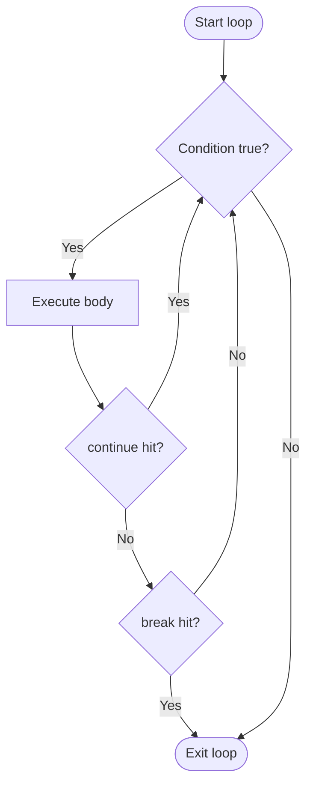
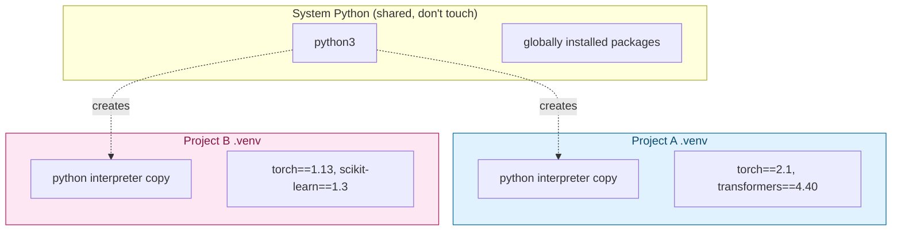
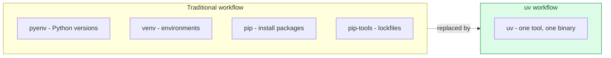

# Python Refresher — Basics, Virtual Environments, pip & uv

> Part 2 of the series. [Note 1](01-python-for-ai.md) mapped *why* Python matters for AI and previewed the concepts ahead. This note starts at the ground floor: **core language basics** with runnable examples, then **environment & package management** — `venv`, `pip`, and the newer `uv` — which you'll use in every single project from here on.

## What This Note Covers


---

## 1. Variables & Data Types

Python is **dynamically typed** — a variable's type is inferred at runtime and can change.

```python
name = "Ada"            # str
age = 36                # int
height_m = 1.68          # float
is_pioneer = True        # bool
skills = None             # NoneType

print(type(name), type(age), type(height_m), type(is_pioneer), type(skills))
# <class 'str'> <class 'int'> <class 'float'> <class 'bool'> <class 'NoneType'>
```

**Type conversion (casting):**

```python
age_str = "36"
age_int = int(age_str)        # "36" -> 36
pi_str = str(3.14159)         # 3.14159 -> "3.14159"
score = float("9.5")          # "9.5" -> 9.5
flag = bool(0)                 # 0 -> False (0, "", None, [], {} are all falsy)
```

| Type | Example | Notes |
| --- | --- | --- |
| `int` | `42`, `-7` | Arbitrary precision (no overflow) |
| `float` | `3.14`, `1e-3` | 64-bit double precision |
| `str` | `"hello"` | Immutable sequence of characters |
| `bool` | `True`, `False` | Subclass of `int` (`True == 1`) |
| `NoneType` | `None` | Represents "no value" (like `null`) |

---

## 2. Operators

```python
# Arithmetic
print(7 + 3, 7 - 3, 7 * 3, 7 / 3, 7 // 3, 7 % 3, 7 ** 2)
# 10  4  21  2.333...  2  1  49

# Comparison
print(5 == 5, 5 != 3, 5 > 3, 5 <= 5)

# Logical
print(True and False, True or False, not True)

# Identity vs equality
a = [1, 2, 3]
b = [1, 2, 3]
print(a == b)   # True  -> same contents
print(a is b)   # False -> different objects in memory
```

---

## 3. Control Flow

```python
temperature = 41

if temperature > 40:
    status = "extreme heat"
elif temperature > 30:
    status = "hot"
elif temperature > 15:
    status = "mild"
else:
    status = "cold"

print(status)  # extreme heat
```

**Ternary (conditional expression):**

```python
label = "adult" if age >= 18 else "minor"
```

**Walrus operator (`:=`)** — assign and use in one expression (Python 3.8+):

```python
data = [1, 2, 3, 4, 5]
if (n := len(data)) > 3:
    print(f"List is long: {n} items")
```

---

## 4. Loops

```python
# for loop over a range
for i in range(5):
    print(i, end=" ")   # 0 1 2 3 4
print()

# for loop over an iterable
for fruit in ["apple", "banana", "cherry"]:
    print(fruit)

# while loop
count = 0
while count < 3:
    print(f"count = {count}")
    count += 1

# break / continue
for n in range(10):
    if n == 3:
        continue     # skip 3
    if n == 6:
        break        # stop at 6
    print(n, end=" ")   # 0 1 2 4 5
print()

# enumerate — get index + value together
for idx, fruit in enumerate(["apple", "banana", "cherry"]):
    print(idx, fruit)

# zip — iterate multiple sequences in parallel
names = ["Ada", "Grace", "Alan"]
scores = [95, 88, 91]
for name, score in zip(names, scores):
    print(f"{name}: {score}")
```



---

## 5. Functions

```python
def greet(name, greeting="Hello"):
    """Return a formatted greeting."""
    return f"{greeting}, {name}!"

print(greet("Ada"))                 # Hello, Ada!
print(greet("Grace", "Hi"))         # Hi, Grace!

# Multiple return values (actually a tuple under the hood)
def min_max(numbers):
    return min(numbers), max(numbers)

lo, hi = min_max([4, 1, 9, 2])
print(lo, hi)   # 1 9
```

**Scope basics:**

```python
x = "global"

def show_scope():
    x = "local"       # shadows the global x inside this function
    print(x)           # local

show_scope()
print(x)                # global (unchanged outside)
```

---

## 6. Strings & f-strings

```python
name = "Ada Lovelace"

print(name.upper())          # ADA LOVELACE
print(name.lower())          # ada lovelace
print(name.split())          # ['Ada', 'Lovelace']
print(name.replace("Ada", "Grace"))  # Grace Lovelace
print(len(name))              # 12
print(name[0:3])              # 'Ada' (slicing)
print(name[::-1])             # 'ecalevoL adA' (reversed)

# f-strings (Python 3.6+) — the standard way to format strings
pi = 3.14159265
print(f"Pi rounded to 2 places: {pi:.2f}")   # Pi rounded to 2 places: 3.14
print(f"{name=}")                              # name='Ada Lovelace' (debug format, 3.8+)

# Multi-line strings
bio = """Ada Lovelace was a mathematician
often regarded as the first programmer."""
```

---

## 7. Modules & Imports

```python
import math
from datetime import datetime
from collections import Counter as Cnt   # alias

print(math.sqrt(16))          # 4.0
print(datetime.now().year)     # current year
print(Cnt("mississippi"))       # Counter({'i': 4, 's': 4, 'p': 2, 'm': 1})
```

A file becomes a **module** automatically; a folder with `__init__.py` (or an implicit namespace package) becomes a **package**.

```text
my_project/
├── main.py
└── utils/
    ├── __init__.py
    └── text_helpers.py     # import via: from utils.text_helpers import clean_text
```

---

## 8. Virtual Environments (`venv`)

**Why:** every project has different dependency versions. Without isolation, installing `torch==2.1` for one project can silently break another that needs `torch==1.13`. A virtual environment gives each project its own private Python + package install location.



**Creating and using a venv:**

```bash
# Create a virtual environment in a folder called .venv
python3 -m venv .venv

# Activate it
source .venv/bin/activate        # macOS / Linux
# .venv\Scripts\activate         # Windows (cmd)
# .venv\Scripts\Activate.ps1     # Windows (PowerShell)

# Your shell prompt now shows (.venv) — you're isolated.
which python                      # points inside .venv/bin/python

# Deactivate when done
deactivate
```

**Key facts:**

- `.venv/` should almost always go in `.gitignore` — never commit it.
- Each venv is disposable: if it breaks, delete the folder and recreate it.
- Activating a venv only changes your **current shell session** — new terminals need re-activation.

---

## 9. `pip` — Python's Package Installer

```bash
# Install a package (into whatever environment is currently active)
pip install requests

# Install a specific version
pip install "torch==2.1.0"

# Install multiple, with version constraints
pip install "numpy>=1.24,<2.0" pandas

# Upgrade a package
pip install --upgrade requests

# Uninstall
pip uninstall requests

# List installed packages
pip list

# Show details about one package
pip show numpy
```

**`requirements.txt`** — the traditional way to pin and share dependencies:

```bash
# Freeze current environment's exact versions to a file
pip freeze > requirements.txt

# Install everything from a requirements file (e.g., after cloning a repo)
pip install -r requirements.txt
```

```text
# requirements.txt example
numpy==1.26.4
pandas==2.2.1
requests>=2.31.0
```

**Pain points `pip` + `venv` have:**

- Dependency resolution can be slow, and conflicts are sometimes cryptic.
- `pip` alone doesn't manage *which Python version* you're using — you need `pyenv` or similar for that.
- No built-in lockfile with hashes for fully reproducible installs (unless you add extra tooling like `pip-tools`).

This is the gap **`uv`** fills.

---

## 10. `uv` — The Fast, Modern Alternative

[`uv`](https://github.com/astral-sh/uv) (by Astral, the Ruff creators) is a single Rust-based binary that replaces `pip`, `venv`, `pip-tools`, and even parts of `pyenv` — and it's typically **10-100x faster** thanks to a global cache and parallel downloads.



**Installing `uv`:**

```bash
curl -LsSf https://astral.sh/uv/install.sh | sh   # macOS / Linux
# or: pip install uv
# or: brew install uv
```

**Everyday commands:**

```bash
# Create a virtual environment (much faster than python -m venv)
uv venv

# Activate it — same as before, uv doesn't change this part
source .venv/bin/activate

# Install a package into the active/associated environment
uv pip install requests

# Install from a requirements file
uv pip install -r requirements.txt

# Compile a lockfile from top-level dependencies (like pip-tools' pip-compile)
uv pip compile requirements.in -o requirements.txt
```

**Project-based workflow (the more "modern" `uv` way, similar to `poetry`/`npm`):**

```bash
# Initialize a new project (creates pyproject.toml)
uv init my-agent-project
cd my-agent-project

# Add a dependency — resolves, installs, AND updates pyproject.toml + uv.lock
uv add openai anthropic pydantic

# Add a dev-only dependency
uv add --dev pytest ruff

# Remove a dependency
uv remove pydantic

# Run a script inside the project's environment (auto-manages the venv for you)
uv run python main.py

# Install an exact, reproducible environment from the lockfile
uv sync

# Pin/manage the Python version itself (uv can download interpreters!)
uv python install 3.12
uv python pin 3.12
```

**`pip`/`venv` vs `uv` — quick comparison:**

| Task | Traditional | uv |
| --- | --- | --- |
| Create venv | `python -m venv .venv` | `uv venv` |
| Install package | `pip install requests` | `uv pip install requests` |
| Reproducible lockfile | `pip-compile` (extra tool) | built-in (`uv.lock`) |
| Manage Python versions | `pyenv install 3.12` | `uv python install 3.12` |
| Speed | baseline | 10-100x faster (Rust, global cache) |
| Project scaffolding | manual / `poetry init` | `uv init` |

---

## Recommended Setup for This Course

```bash
# One-time: install uv
curl -LsSf https://astral.sh/uv/install.sh | sh

# Per-project
uv init hsbc-agentic-ai
cd hsbc-agentic-ai
uv add numpy pandas jupyter
uv run jupyter lab
```

> You'll see both `pip`/`venv` (still the most common in tutorials, docs, and existing codebases) and `uv` (fastest, increasingly the default for new projects) throughout this repo — know both.

---

## What's Next in This Series

1. **Data Structures Deep Dive** — `collections` module (`Counter`, `defaultdict`, `deque`, `namedtuple`).
2. **NumPy Essentials** — arrays, broadcasting, vectorization.
3. **Pandas for Data Wrangling** — DataFrames, groupby, merging datasets.
4. **OOP Deep Dive** — abstract base classes, mixins, dunder methods.
5. **Async & Concurrency** — `async`/`await`, `asyncio` for concurrent LLM/tool calls.
6. **Pydantic & Structured Outputs** — schema validation for agent tool calling.
7. **Building Your First Agent Loop** — putting it all together.
