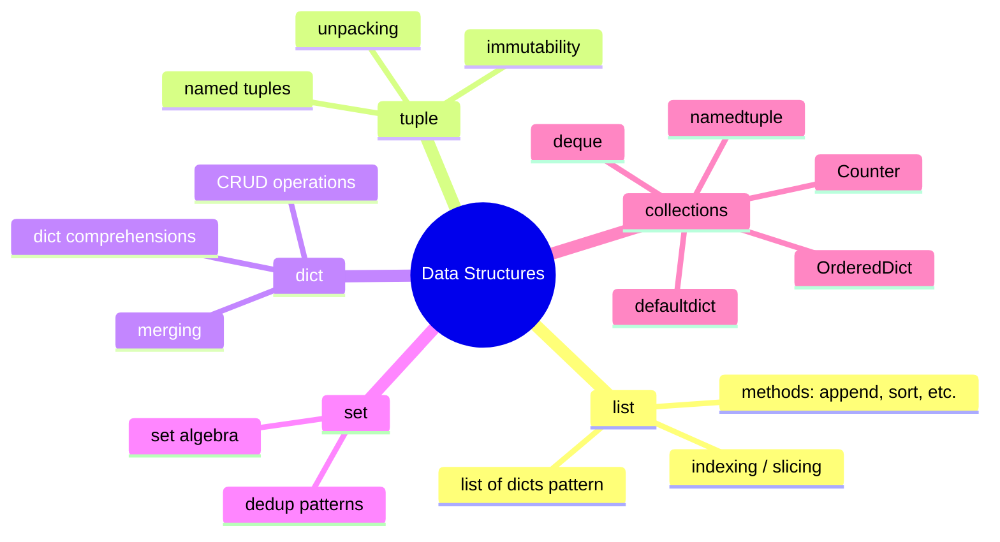
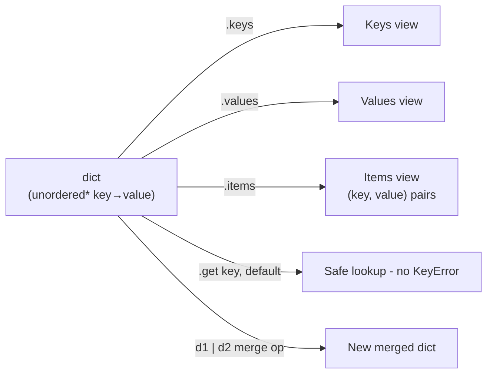
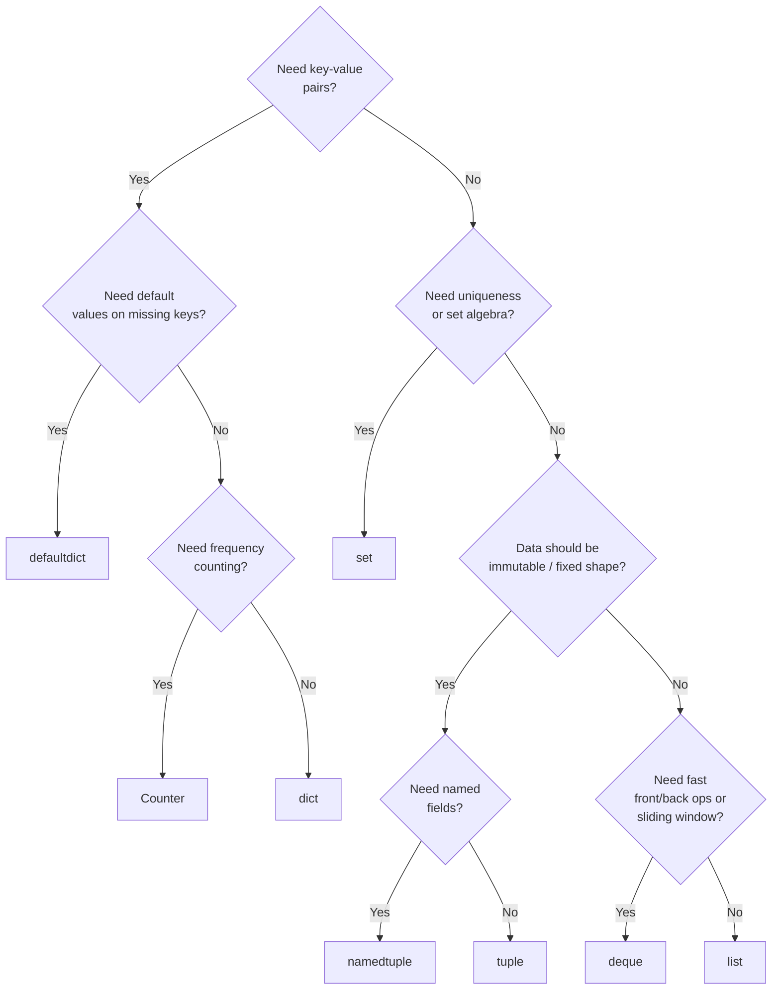

# Data Structures Deep Dive — `list`, `dict`, `set`, `tuple` & `collections`

> Part 3 of the series. [Note 1](01-python-for-ai.md) introduced core data structures at a glance; [Note 2](02-python-refreshr.md) covered language basics and tooling. This note goes deep on the structures themselves — the operations you'll use daily — plus the `collections` module, which shows up constantly in data preprocessing and agent code.

## Map of This Note



---

## 1. Lists — the workhorse sequence

```python
scores = [88, 92, 75, 100, 60]

# Indexing & slicing
print(scores[0])       # 88 (first)
print(scores[-1])      # 60 (last)
print(scores[1:3])     # [92, 75]
print(scores[:2])      # [88, 92]
print(scores[::2])     # [88, 75, 60]  (every 2nd element)

# Mutating operations
scores.append(95)              # add to end
scores.insert(0, 100)          # insert at index
scores.remove(60)              # remove first matching value
popped = scores.pop()          # remove & return last element
scores.sort()                  # in-place ascending sort
scores.sort(reverse=True)      # in-place descending sort
scores.reverse()               # in-place reverse

# Non-mutating alternatives (return new objects)
sorted_scores = sorted(scores)          # doesn't touch original
reversed_view = list(reversed(scores))

# Membership & search
print(92 in scores)            # True
print(scores.index(92))        # position of first match
print(scores.count(88))        # occurrences of a value

# Copying (important! avoids aliasing bugs)
shallow_copy = scores.copy()   # or scores[:]
import copy
deep_copy = copy.deepcopy(scores)   # needed for nested lists/dicts
```

**Common AI pattern: list of dicts (like rows of a small dataset)**

```python
records = [
    {"id": 1, "text": "great product", "label": "positive"},
    {"id": 2, "text": "terrible service", "label": "negative"},
    {"id": 3, "text": "it's okay", "label": "neutral"},
]

# Filter
positives = [r for r in records if r["label"] == "positive"]

# Extract a single field across all records
texts = [r["text"] for r in records]

# Sort by a field
by_id_desc = sorted(records, key=lambda r: r["id"], reverse=True)
```

**Aliasing pitfall — the #1 list bug:**

```python
a = [1, 2, 3]
b = a              # b is NOT a copy — same object!
b.append(4)
print(a)           # [1, 2, 3, 4]  <- a changed too, surprise!

c = a.copy()        # correct way to get an independent list
c.append(5)
print(a)            # [1, 2, 3, 4]  <- unaffected
```

---

## 2. Tuples — immutable, fixed-shape records

```python
point = (3, 4)
rgb = (255, 0, 128)

# Unpacking — extremely common in AI code
x, y = point
r, g, b = rgb

# Function returning multiple values is really a tuple
def divmod_custom(a, b):
    return a // b, a % b

quotient, remainder = divmod_custom(17, 5)

# Tuples are immutable — this raises TypeError:
# point[0] = 10   # ❌ TypeError: 'tuple' object does not support item assignment

# Why use tuples over lists?
# 1. Immutability = safe to use as dict keys or set elements
lookup = {(0, 0): "origin", (1, 1): "diagonal"}

# 2. Signals intent: "this is a fixed record", not a growable collection
# 3. Slightly more memory-efficient than lists
```

**`namedtuple` — tuples with field names (preview; more in the `collections` section below):**

```python
from collections import namedtuple

Point = namedtuple("Point", ["x", "y"])
p = Point(3, 4)
print(p.x, p.y)      # 3 4 (readable, unlike p[0], p[1])
```

---

## 3. Dictionaries — key/value at the center of everything

```python
config = {
    "model": "gpt-mini",
    "temperature": 0.7,
    "max_tokens": 512,
}

# Access
print(config["model"])                  # KeyError if missing
print(config.get("top_p"))              # None if missing (safe)
print(config.get("top_p", 1.0))         # default value if missing

# Add / update
config["top_p"] = 0.9
config.update({"temperature": 0.5, "stream": True})

# Remove
del config["stream"]
removed = config.pop("top_p", None)     # safe pop with default

# Iterate
for key in config:                       # keys only
    print(key)
for key, value in config.items():        # key + value
    print(key, value)
for value in config.values():             # values only
    print(value)

# Membership
print("model" in config)                 # True (checks keys)

# Merging dicts (Python 3.9+)
defaults = {"temperature": 1.0, "max_tokens": 256}
overrides = {"temperature": 0.7}
merged = defaults | overrides             # {'temperature': 0.7, 'max_tokens': 256}

# Dict comprehension
squared = {n: n**2 for n in range(5)}     # {0:0, 1:1, 2:4, 3:9, 4:16}
```

**Nested dicts — the shape of real JSON/API data:**

```python
api_response = {
    "id": "chatcmpl-123",
    "choices": [
        {"message": {"role": "assistant", "content": "Hello!"}}
    ],
    "usage": {"prompt_tokens": 12, "completion_tokens": 5},
}

reply_text = api_response["choices"][0]["message"]["content"]
tokens_used = api_response["usage"]["prompt_tokens"] + api_response["usage"]["completion_tokens"]
```



---

## 4. Sets — uniqueness & set algebra

```python
tags_a = {"nlp", "transformers", "python"}
tags_b = {"python", "pytorch", "deep-learning"}

# Add / remove
tags_a.add("agents")
tags_a.discard("python")     # no error if missing (unlike .remove())

# Set algebra — genuinely useful, not just trivia
print(tags_a | tags_b)        # union: all unique tags from both
print(tags_a & tags_b)        # intersection: tags in both
print(tags_a - tags_b)        # difference: in a but not b
print(tags_a ^ tags_b)        # symmetric difference: in exactly one

# Deduplication — the #1 real-world use case
raw_tokens = ["the", "cat", "sat", "the", "cat", "mat"]
unique_tokens = set(raw_tokens)               # {'the', 'cat', 'sat', 'mat'}
unique_ordered = list(dict.fromkeys(raw_tokens))  # dedup but preserve order!

# Fast membership testing — O(1) average vs O(n) for lists
stopwords = {"the", "a", "an", "in", "on"}
filtered = [w for w in raw_tokens if w not in stopwords]  # fast lookup
```

**Why this matters for AI:** vocabulary building, deduplicating training examples, and fast "is this token/id in my allow-list" checks all lean on sets for O(1) lookups instead of O(n) list scans.

---

## 5. The `collections` Module

Python's standard library ships purpose-built structures that outperform hand-rolled dict/list logic.

### `Counter` — frequency counting

```python
from collections import Counter

words = "the cat sat on the mat the cat ran".split()
freq = Counter(words)
print(freq)                       # Counter({'the': 3, 'cat': 2, 'sat': 1, 'on': 1, 'mat': 1, 'ran': 1})
print(freq.most_common(2))         # [('the', 3), ('cat', 2)]
print(freq["cat"])                  # 2
print(freq["missing"])              # 0 (no KeyError!)

# Counters support arithmetic
more_words = Counter(["the", "dog"])
print(freq + more_words)             # combines counts
```

**AI use:** building a vocabulary with token frequencies, class balance checks (`Counter(labels)`), quick exploratory data analysis.

### `defaultdict` — dicts with automatic default values

```python
from collections import defaultdict

# Group items by category without checking "if key exists" every time
grouped = defaultdict(list)
records = [("nlp", "bert"), ("cv", "resnet"), ("nlp", "gpt")]

for category, model in records:
    grouped[category].append(model)     # no KeyError, no manual init!

print(dict(grouped))   # {'nlp': ['bert', 'gpt'], 'cv': ['resnet']}

# Compare to the manual, error-prone version without defaultdict:
manual = {}
for category, model in records:
    if category not in manual:
        manual[category] = []
    manual[category].append(model)
```

### `deque` — fast double-ended queue

```python
from collections import deque

# Regular lists are O(n) for inserting/removing at the front — deque is O(1)
history = deque(maxlen=3)      # fixed-size sliding window — perfect for chat context!

for msg in ["msg1", "msg2", "msg3", "msg4", "msg5"]:
    history.append(msg)
    print(list(history))
# ['msg1']
# ['msg1', 'msg2']
# ['msg1', 'msg2', 'msg3']
# ['msg2', 'msg3', 'msg4']   <- msg1 auto-evicted, maxlen=3
# ['msg3', 'msg4', 'msg5']

history.appendleft("priority_msg")   # O(1) insert at front
history.pop()                          # remove from right
history.popleft()                      # remove from left
```

**AI use:** a `deque(maxlen=N)` is the simplest possible implementation of a **sliding conversation window** for an LLM agent that can only keep the last N turns in context.

### `namedtuple` — lightweight immutable records

```python
from collections import namedtuple

TokenInfo = namedtuple("TokenInfo", ["text", "id", "score"])

token = TokenInfo(text="hello", id=1523, score=0.98)
print(token.text, token.id, token.score)   # readable field access
print(token[0])                              # still tuple-indexable

# Great for lightweight structured data before reaching for a full class/dataclass
tokens = [TokenInfo("hello", 1523, 0.98), TokenInfo("world", 892, 0.91)]
best = max(tokens, key=lambda t: t.score)
```

### `OrderedDict` — explicit ordering (mostly legacy since 3.7+)

```python
from collections import OrderedDict

# Since Python 3.7, regular dicts preserve insertion order by default,
# so OrderedDict is mostly needed when you specifically need:
# - move_to_end() functionality
# - equality checks that care about order

od = OrderedDict()
od["first"] = 1
od["second"] = 2
od.move_to_end("first")            # moves 'first' to the end
print(od)   # OrderedDict([('second', 2), ('first', 1)])
```

---

## 6. Choosing the Right Structure



| Need | Use |
| --- | --- |
| Ordered, growable, mutable collection | `list` |
| Fixed-shape, immutable record | `tuple` |
| Fixed-shape record with named fields | `namedtuple` |
| Key → value lookup | `dict` |
| Key → value with auto-init on missing key | `collections.defaultdict` |
| Uniqueness / membership tests / set algebra | `set` |
| Frequency counting | `collections.Counter` |
| Fast append/pop from both ends, sliding window | `collections.deque` |

---

## What's Next in This Series

1. **NumPy Essentials** — arrays, broadcasting, vectorization (the foundation under every tensor library).
2. **Pandas for Data Wrangling** — DataFrames, groupby, merging datasets.
3. **OOP Deep Dive** — abstract base classes, mixins, dunder methods.
4. **Async & Concurrency** — `async`/`await`, `asyncio` for concurrent LLM/tool calls.
5. **Pydantic & Structured Outputs** — schema validation for agent tool calling.
6. **Building Your First Agent Loop** — putting it all together.
