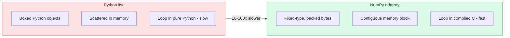
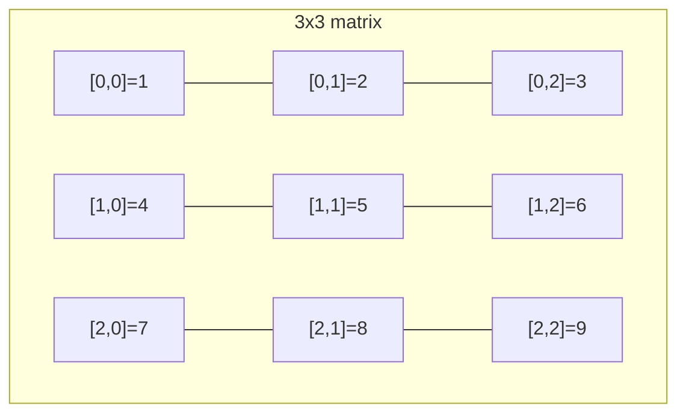
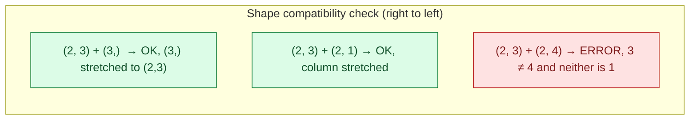
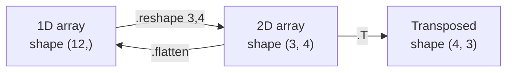
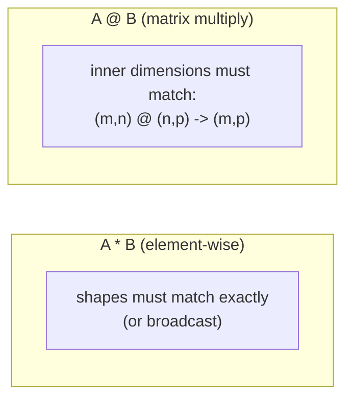

# NumPy Essentials — Arrays, Broadcasting & Vectorization

> Part 4 of the series. [Note 3](03-data-structures-deep-dive.md) covered Python's built-in structures. Those are great for general-purpose code, but every ML/DL framework (PyTorch, TensorFlow, scikit-learn) is built on the same foundation: **NumPy arrays**. This note covers the essentials you need before touching a single tensor.

## Why NumPy Instead of Python Lists?



- A Python `list` stores **pointers** to separate Python objects scattered across memory — flexible, but slow for numeric work.
- A NumPy `ndarray` stores **raw numbers in one contiguous block**, all the same type — operations run as compiled C loops (or SIMD/vectorized instructions), not Python bytecode.
- Every tensor library (`torch.Tensor`, `tf.Tensor`) is conceptually "NumPy array + GPU support + autograd." Learning NumPy's array model transfers directly.

```bash
pip install numpy
# or: uv add numpy
```

```python
import numpy as np   # universal convention — always import as np
```

---

## 1. Creating Arrays

```python
import numpy as np

# From a Python list
a = np.array([1, 2, 3, 4])
print(a, a.dtype)          # [1 2 3 4] int64

# From a nested list -> 2D array (matrix)
matrix = np.array([[1, 2, 3], [4, 5, 6]])
print(matrix.shape)         # (2, 3) -> 2 rows, 3 columns

# Common constructors
zeros = np.zeros((2, 3))            # 2x3 array of 0.0
ones = np.ones((3, 3))               # 3x3 array of 1.0
identity = np.eye(3)                  # 3x3 identity matrix
range_arr = np.arange(0, 10, 2)       # [0 2 4 6 8]  (like Python range)
linspace = np.linspace(0, 1, 5)       # [0. 0.25 0.5 0.75 1.]  (5 evenly spaced points)
random_arr = np.random.rand(2, 2)      # 2x2 uniform random [0, 1)
random_norm = np.random.randn(2, 2)    # 2x2 standard normal (mean 0, std 1)

# Explicit dtype (important for memory & GPU compatibility)
float32_arr = np.array([1, 2, 3], dtype=np.float32)   # common for ML (vs float64 default)
```

---

## 2. Array Attributes — Know Your Shape

```python
x = np.array([[1, 2, 3], [4, 5, 6]])

print(x.shape)     # (2, 3)         — dimensions
print(x.ndim)       # 2              — number of axes
print(x.size)        # 6              — total elements
print(x.dtype)        # int64          — element type
print(x.itemsize)      # 8              — bytes per element
print(x.nbytes)         # 48             — total bytes
```

> **The single most common bug in ML code is a shape mismatch.** Get comfortable printing `.shape` liberally when debugging — it's the array-world equivalent of `print(type(x))`.

---

## 3. Indexing & Slicing

```python
a = np.array([10, 20, 30, 40, 50])
print(a[0], a[-1], a[1:3])      # 10 50 [20 30]

matrix = np.array([[1, 2, 3],
                    [4, 5, 6],
                    [7, 8, 9]])

print(matrix[0, 0])       # 1        (row 0, col 0)
print(matrix[1, :])        # [4 5 6]  (entire row 1)
print(matrix[:, 2])         # [3 6 9]  (entire column 2)
print(matrix[0:2, 0:2])      # top-left 2x2 sub-matrix
print(matrix[-1])             # [7 8 9] (last row)

# Boolean (mask) indexing — extremely common in data filtering
scores = np.array([55, 92, 71, 88, 40])
passing_mask = scores >= 60
print(passing_mask)               # [False  True  True  True False]
print(scores[passing_mask])       # [92 71 88]
print(scores[scores >= 60])       # same thing, one line

# Fancy indexing — select by list of indices
indices = [0, 2, 4]
print(scores[indices])            # [55 71 40]
```



---

## 4. Vectorized Operations — No More `for` Loops

```python
a = np.array([1, 2, 3, 4])
b = np.array([10, 20, 30, 40])

# Element-wise arithmetic — applied to every element at once, in compiled code
print(a + b)         # [11 22 33 44]
print(a * b)          # [10 40 90 160]
print(a ** 2)          # [1 4 9 16]
print(b / a)            # [10. 10. 10. 10.]

# Compare: the "slow" pure-Python way you should AVOID
result = [x + y for x, y in zip(a, b)]   # works, but no vectorization speedup

# Aggregate functions
print(a.sum(), a.mean(), a.std(), a.min(), a.max())
print(a.argmax())    # index of the max value (very common: "which class had highest score")

# Universal functions (ufuncs) — element-wise math
print(np.sqrt(a))
print(np.exp(a))       # e^x for each element — the heart of softmax!
print(np.log(a))
```

**Why this matters for AI:** a "vectorized" softmax, loss function, or normalization computed over a whole batch in one line is not just cleaner — it's often **50-100x faster** than looping in Python, because NumPy dispatches to optimized, often SIMD-parallelized C code.

```python
# A real example: softmax, vectorized
def softmax(logits):
    exp_logits = np.exp(logits - np.max(logits))   # subtract max for numerical stability
    return exp_logits / exp_logits.sum()

logits = np.array([2.0, 1.0, 0.1])
print(softmax(logits))   # [0.659 0.242 0.099] — probabilities summing to 1
```

---

## 5. Broadcasting — NumPy's Superpower

Broadcasting lets NumPy perform operations between arrays of **different shapes** without writing explicit loops — smaller arrays are conceptually "stretched" to match larger ones, with zero extra memory copy.

```python
# Scalar broadcast — every element gets +10
a = np.array([1, 2, 3])
print(a + 10)              # [11 12 13]

# Vector + matrix broadcast — the vector is applied to every row
matrix = np.array([[1, 2, 3],
                    [4, 5, 6]])
row_vector = np.array([10, 20, 30])
print(matrix + row_vector)
# [[11 22 33]
#  [14 25 36]]

# Real ML use: normalizing a batch of feature vectors
batch = np.array([[1.0, 2.0, 3.0],
                   [4.0, 5.0, 6.0]])
feature_means = batch.mean(axis=0)     # mean per column: [2.5 3.5 4.5]
normalized = batch - feature_means      # broadcast subtract across all rows
```

**Broadcasting rules** (compared dimension-by-dimension, from the right):
1. If dimensions match → fine.
2. If one dimension is `1` → it's stretched to match the other.
3. If dimensions differ and neither is `1` → error.



```python
# axis parameter — controls WHICH dimension an aggregate collapses
matrix = np.array([[1, 2, 3],
                    [4, 5, 6]])

print(matrix.sum())              # 21          — sum of everything
print(matrix.sum(axis=0))        # [5 7 9]     — sum DOWN each column (collapses rows)
print(matrix.sum(axis=1))        # [6 15]      — sum ACROSS each row (collapses columns)
```

> `axis=0` vs `axis=1` confuses everyone at first. Mnemonic: **axis=0 moves down rows** (collapsing them into a per-column result); **axis=1 moves across columns** (collapsing them into a per-row result).

---

## 6. Reshaping Arrays

```python
a = np.arange(12)              # [0 1 2 ... 11]
print(a.shape)                  # (12,)

reshaped = a.reshape(3, 4)       # 3 rows, 4 columns
print(reshaped.shape)             # (3, 4)

reshaped2 = a.reshape(3, -1)       # -1 means "figure this dimension out for me"
print(reshaped2.shape)              # (3, 4)

flattened = reshaped.flatten()        # back to 1D (copy)
raveled = reshaped.ravel()             # back to 1D (view when possible — faster)

transposed = reshaped.T                 # swap rows/columns -> shape (4, 3)

# Adding/removing dimensions — very common when feeding a single sample to a model
# expecting a batch
single = np.array([1, 2, 3])            # shape (3,)
batched = single[np.newaxis, :]          # shape (1, 3) — "batch of 1"
# equivalently: single.reshape(1, -1)
squeezed = batched.squeeze()              # back to shape (3,)
```



---

## 7. Stacking & Combining Arrays

```python
a = np.array([1, 2, 3])
b = np.array([4, 5, 6])

print(np.concatenate([a, b]))          # [1 2 3 4 5 6]
print(np.vstack([a, b]))                # stack as rows -> shape (2, 3)
print(np.hstack([a, b]))                 # stack horizontally -> [1 2 3 4 5 6]
print(np.stack([a, b]))                   # new axis -> shape (2, 3), like vstack here
print(np.stack([a, b], axis=1))            # shape (3, 2) — interleaved by column
```

**AI use:** batching individual samples (`np.stack([sample1, sample2, ...])`) into a single array before feeding a model — this is exactly what a `DataLoader`'s `collate_fn` does under the hood.

---

## 8. Random Number Generation (for reproducible experiments)

```python
# The modern, recommended API — use a Generator with an explicit seed
rng = np.random.default_rng(seed=42)

print(rng.random(3))                  # 3 uniform floats in [0, 1)
print(rng.integers(0, 10, size=5))     # 5 random ints in [0, 10)
print(rng.normal(loc=0, scale=1, size=(2, 2)))   # 2x2 normal samples
print(rng.choice([1, 2, 3, 4], size=2, replace=False))  # random sample without replacement

# Why seeding matters: reproducibility!
rng_a = np.random.default_rng(seed=42)
rng_b = np.random.default_rng(seed=42)
print(np.array_equal(rng_a.random(5), rng_b.random(5)))   # True — identical sequence
```

**AI use:** seeding RNGs is essential for reproducible train/test splits, weight initialization, and debugging — "it worked yesterday but not today" is often an unseeded RNG.

---

## 9. Matrix Operations (the math behind neural networks)

```python
A = np.array([[1, 2], [3, 4]])
B = np.array([[5, 6], [7, 8]])

print(A * B)          # element-wise multiply: [[5 12] [21 32]]
print(A @ B)           # MATRIX multiply (dot product): [[19 22] [43 50]]
print(np.dot(A, B))     # same as @ for 2D arrays

v = np.array([1, 0])
print(A @ v)              # matrix-vector product: [1 3]

print(np.linalg.inv(A))    # matrix inverse
print(np.linalg.det(A))     # determinant
print(np.linalg.norm(v))     # vector magnitude (L2 norm) — used in normalization & loss functions
```

> **`*` is element-wise. `@` is matrix multiplication.** Confusing these is one of the most common — and silent — bugs when implementing anything neural-network-adjacent by hand. A `(2,3) * (2,3)` works but means something completely different from `(2,3) @ (3,2)`.



---

## Quick Reference Card

| Task | NumPy |
| --- | --- |
| Create from list | `np.array([1,2,3])` |
| Zeros / ones | `np.zeros((r,c))`, `np.ones((r,c))` |
| Range | `np.arange(start, stop, step)` |
| Shape info | `.shape`, `.ndim`, `.size`, `.dtype` |
| Element-wise op | `a + b`, `a * b`, `np.sqrt(a)` |
| Matrix multiply | `a @ b` |
| Aggregate | `.sum()`, `.mean()`, `.std()`, `.max()`, `.argmax()` |
| Aggregate per axis | `.sum(axis=0)` (down columns), `.sum(axis=1)` (across rows) |
| Reshape | `.reshape(r, c)`, `.flatten()`, `.T` |
| Filter | `a[a > threshold]` (boolean mask) |
| Stack samples into batch | `np.stack([...])` |
| Reproducible random | `np.random.default_rng(seed=...)` |

---

## What's Next in This Series

1. **Pandas for Data Wrangling** — DataFrames, groupby, merging datasets (built on top of NumPy).
2. **OOP Deep Dive** — abstract base classes, mixins, dunder methods.
3. **Async & Concurrency** — `async`/`await`, `asyncio` for concurrent LLM/tool calls.
4. **Pydantic & Structured Outputs** — schema validation for agent tool calling.
5. **Building Your First Agent Loop** — putting it all together.
