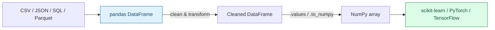
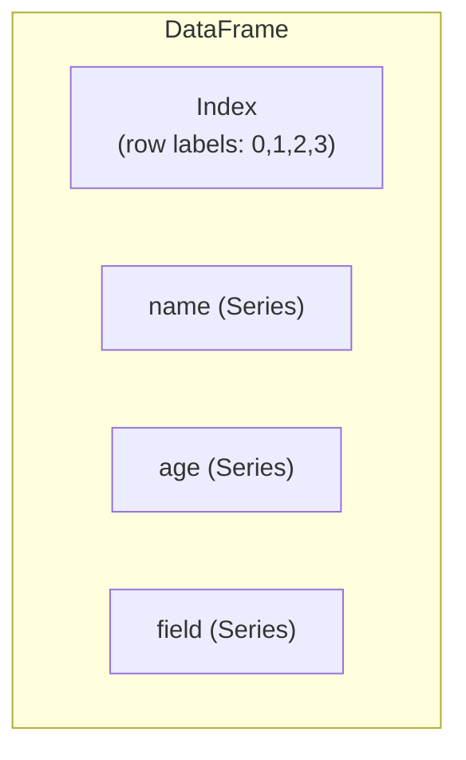
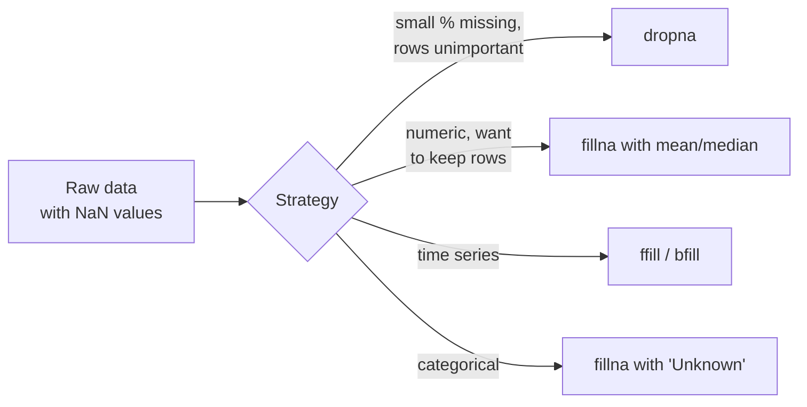
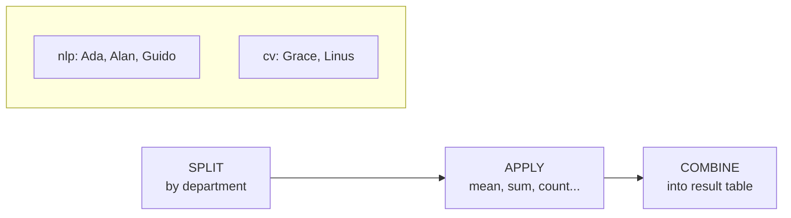
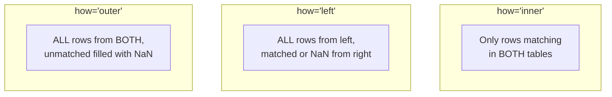

# Pandas for Data Wrangling — DataFrames, groupby & Merging

> Part 5 of the series. [Note 4](04-numpy-essentials.md) covered NumPy arrays — fast, homogeneous, numeric. Real-world datasets are messier: mixed types, missing values, labeled columns. **Pandas** sits on top of NumPy and gives you a spreadsheet-like structure with a powerful API — the standard tool for loading, cleaning, and exploring data before it ever reaches a model.

## Where Pandas Fits



```bash
pip install pandas
# or: uv add pandas
```

```python
import pandas as pd   # universal convention — always import as pd
```

---

## 1. Core Structures: `Series` and `DataFrame`

```python
import pandas as pd

# Series — a single labeled column (1D)
ages = pd.Series([25, 32, 45, 29], name="age")
print(ages)
#  0    25
#  1    32
#  2    45
#  3    29
#  Name: age, dtype: int64

# DataFrame — a labeled table (2D), like a spreadsheet or SQL table
df = pd.DataFrame({
    "name": ["Ada", "Grace", "Alan", "Linus"],
    "age": [36, 85, 41, 55],
    "field": ["math", "cs", "cs", "os"],
})
print(df)
#     name  age field
# 0    Ada   36  math
# 1  Grace   85    cs
# 2   Alan   41    cs
# 3  Linus   55    os
```

**Anatomy of a DataFrame:**



---

## 2. Loading & Inspecting Data

```python
# Reading data (the most common entry point)
df = pd.read_csv("data.csv")
# df = pd.read_json("data.json")
# df = pd.read_parquet("data.parquet")
# df = pd.read_sql("SELECT * FROM table", connection)

# First things to run on any new dataset
df.head()          # first 5 rows
df.tail(3)          # last 3 rows
df.shape             # (rows, columns)
df.info()             # dtypes, non-null counts, memory usage
df.describe()          # summary stats for numeric columns (mean, std, min, max, quartiles)
df.columns               # list of column names
df.dtypes                 # dtype of each column
df.isnull().sum()          # count of missing values per column
```

---

## 3. Selecting Data

```python
# Column selection
df["age"]                    # single column -> Series
df[["name", "age"]]           # multiple columns -> DataFrame

# Row selection by label: .loc
df.loc[0]                      # row with index label 0
df.loc[0:2]                     # rows 0 through 2 (inclusive!)
df.loc[df["age"] > 40]           # boolean filter — very common

# Row selection by position: .iloc
df.iloc[0]                        # first row, by position
df.iloc[0:2]                       # first 2 rows (exclusive end, like Python slicing)
df.iloc[0, 1]                       # row 0, column 1 (age) -> single value

# Combined row + column selection
df.loc[df["age"] > 40, "name"]        # names of people over 40
df.loc[df["field"] == "cs", ["name", "age"]]

# Boolean filtering with multiple conditions
df[(df["age"] > 30) & (df["field"] == "cs")]     # AND — use & with parentheses!
df[(df["age"] < 30) | (df["field"] == "os")]      # OR — use |
```

> **`.loc` vs `.iloc`**: `.loc` uses **labels** (index names, column names), `.iloc` uses **integer positions**. When the index is the default `0,1,2,...`, they often look the same — but `.loc[0:2]` is inclusive of `2` while `.iloc[0:2]` is not. This trips everyone up at least once.

---

## 4. Adding, Modifying & Dropping Columns

```python
# Add a new column
df["age_in_months"] = df["age"] * 12

# Column from a function applied row-wise
df["category"] = df["age"].apply(lambda a: "senior" if a >= 60 else "regular")

# Vectorized string operations (avoid .apply for strings when possible — it's slower)
df["name_upper"] = df["name"].str.upper()
df["name_length"] = df["name"].str.len()

# Conditional column with np.where (vectorized if/else)
import numpy as np
df["is_veteran"] = np.where(df["age"] > 50, "yes", "no")

# Rename columns
df = df.rename(columns={"field": "domain"})

# Drop columns / rows
df = df.drop(columns=["age_in_months"])
df = df.drop(index=[0])            # drop row by label

# Sort
df = df.sort_values("age", ascending=False)
```

---

## 5. Handling Missing Data

Real datasets always have gaps — this is where a lot of "data cleaning" time goes.

```python
df = pd.DataFrame({
    "name": ["Ada", "Grace", "Alan", None],
    "score": [95, None, 88, 70],
})

print(df.isnull())            # boolean mask of missing values
print(df.isnull().sum())       # count missing per column

# Drop rows/columns with missing data
df_dropped = df.dropna()                     # drop any row with a missing value
df_dropped_cols = df.dropna(axis=1)           # drop any column with a missing value

# Fill missing data
df_filled = df.fillna({"score": df["score"].mean(), "name": "Unknown"})

# Forward/backward fill (common in time-series)
df_ffill = df.fillna(method="ffill")            # carry last valid value forward
```



---

## 6. `groupby` — Split, Apply, Combine

The single most powerful Pandas operation for exploratory analysis.

```python
df = pd.DataFrame({
    "department": ["nlp", "cv", "nlp", "cv", "nlp"],
    "employee": ["Ada", "Grace", "Alan", "Linus", "Guido"],
    "salary": [95000, 88000, 91000, 87000, 99000],
})

# Group and aggregate
print(df.groupby("department")["salary"].mean())
# department
# cv     87500.0
# nlp    95000.0

# Multiple aggregations at once
print(df.groupby("department")["salary"].agg(["mean", "min", "max", "count"]))

# Group by multiple columns
df.groupby(["department"]).agg({"salary": "mean", "employee": "count"})

# Custom aggregation function
df.groupby("department")["salary"].agg(lambda s: s.max() - s.min())
```



**AI relevance:** `groupby` is exactly how you'd compute per-class accuracy, average loss per epoch, token frequency per label, or dataset balance across categories.

---

## 7. Merging & Joining DataFrames

```python
students = pd.DataFrame({
    "student_id": [1, 2, 3],
    "name": ["Ada", "Grace", "Alan"],
})

scores = pd.DataFrame({
    "student_id": [1, 2, 4],
    "score": [95, 88, 70],
})

# Inner join — only matching student_ids (student 3 and score-row 4 dropped)
inner = pd.merge(students, scores, on="student_id", how="inner")

# Left join — keep all students, fill missing scores with NaN
left = pd.merge(students, scores, on="student_id", how="left")

# Outer join — keep everything from both sides
outer = pd.merge(students, scores, on="student_id", how="outer")

# Concatenating (stacking) DataFrames — e.g., combining multiple CSV files
batch1 = pd.DataFrame({"id": [1, 2], "text": ["a", "b"]})
batch2 = pd.DataFrame({"id": [3, 4], "text": ["c", "d"]})
combined = pd.concat([batch1, batch2], ignore_index=True)
```



| Join type | Keeps |
| --- | --- |
| `inner` | Only rows with matching keys in both tables |
| `left` | All rows from left table, matched data from right (or NaN) |
| `right` | All rows from right table, matched data from left (or NaN) |
| `outer` | All rows from both tables, unmatched filled with NaN |

---

## 8. From DataFrame to Model Input

The endpoint of most data wrangling: converting a clean DataFrame into arrays a model can consume.

```python
df = pd.DataFrame({
    "text_length": [120, 85, 200, 60],
    "num_words": [20, 15, 35, 10],
    "label": [1, 0, 1, 0],
})

# Split features (X) and target (y)
X = df[["text_length", "num_words"]]
y = df["label"]

# Convert to NumPy for scikit-learn / PyTorch
X_array = X.to_numpy()          # or X.values (legacy, still works)
y_array = y.to_numpy()

print(X_array.shape, y_array.shape)   # (4, 2) (4,)

# One-hot encoding categorical columns (common preprocessing step)
categories = pd.DataFrame({"color": ["red", "blue", "red", "green"]})
one_hot = pd.get_dummies(categories, columns=["color"])
print(one_hot)
#    color_blue  color_green  color_red
# 0       False        False       True
# 1        True        False      False
# 2       False        False       True
# 3       False         True      False
```

---

## Quick Reference Card

| Task | Pandas |
| --- | --- |
| Load CSV | `pd.read_csv("file.csv")` |
| Inspect | `.head()`, `.info()`, `.describe()`, `.shape` |
| Select column(s) | `df["col"]`, `df[["a","b"]]` |
| Select rows by label | `df.loc[...]` |
| Select rows by position | `df.iloc[...]` |
| Filter rows | `df[df["col"] > x]` |
| Add column | `df["new"] = ...` |
| Handle missing | `.isnull()`, `.dropna()`, `.fillna()` |
| Group & aggregate | `df.groupby("col")["other"].mean()` |
| Combine tables (by key) | `pd.merge(a, b, on="key", how="inner")` |
| Stack tables | `pd.concat([a, b])` |
| To NumPy for ML | `.to_numpy()` |
| One-hot encode | `pd.get_dummies(df, columns=[...])` |

---

## What's Next in This Series

1. **OOP Deep Dive** — abstract base classes, mixins, dunder methods.
2. **Async & Concurrency** — `async`/`await`, `asyncio` for concurrent LLM/tool calls.
3. **Pydantic & Structured Outputs** — schema validation for agent tool calling.
4. **Building Your First Agent Loop** — putting it all together.
