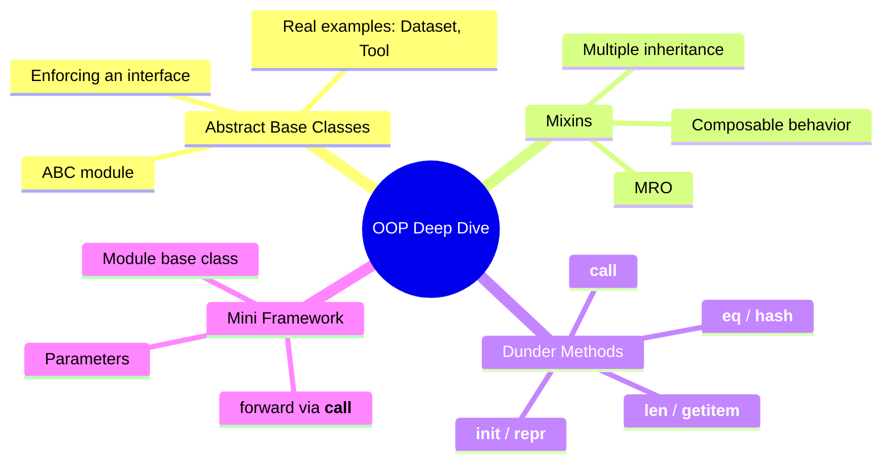
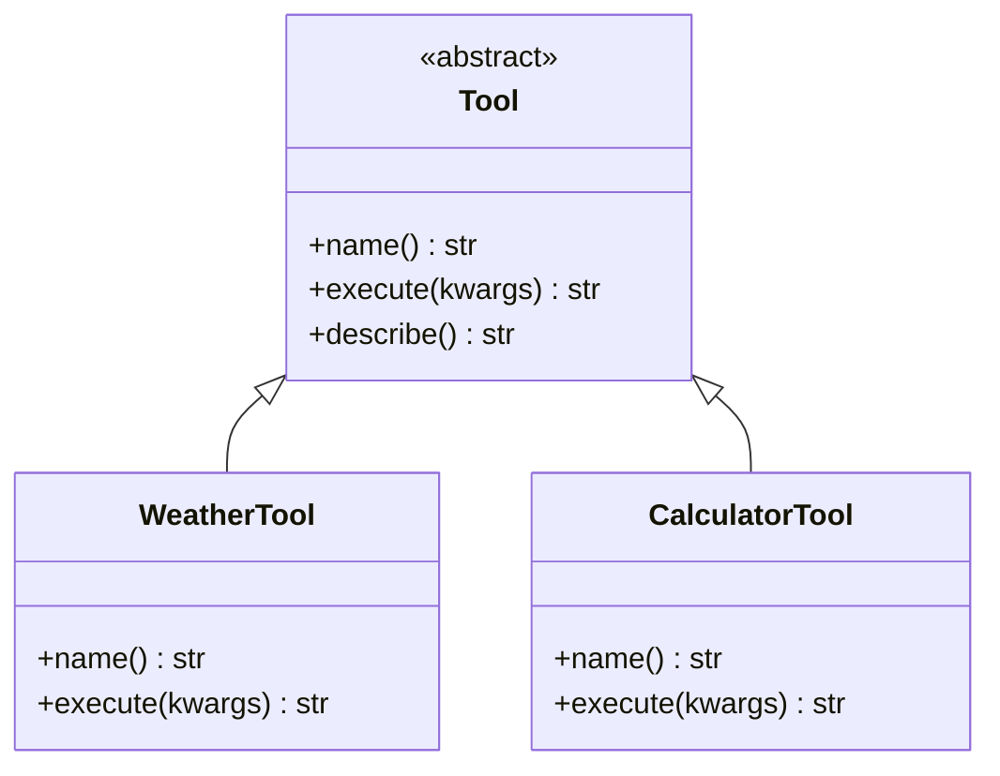
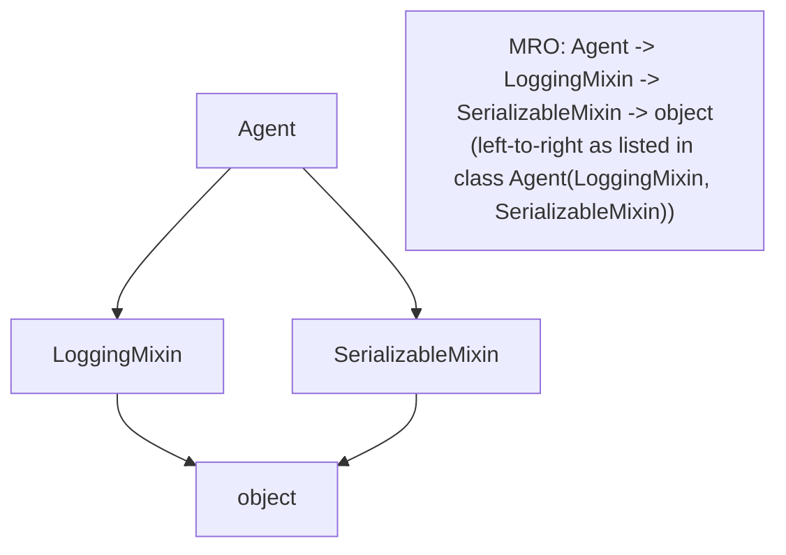
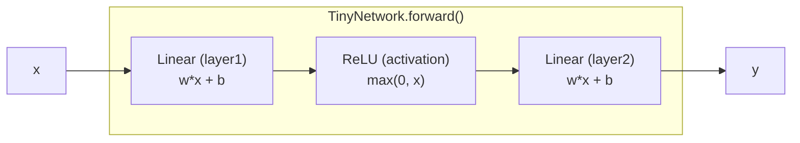

# OOP Deep Dive — ABCs, Mixins, Dunder Methods & a Mini `nn.Module`

> Part 6 of the series. [Note 1](01-python-for-ai.md) introduced classes at a glance with a minimal `Agent` example. This note goes deep on the OOP machinery that every ML/agent framework leans on: abstract base classes (the contracts behind "any model," "any tool," "any dataset"), mixins (composable behavior), and dunder methods (the hooks that make `model(x)`, `len(dataset)`, and `dataset[i]` work). We close by building a tiny `nn.Module`-style framework from scratch to see how it all fits together.

## Map of This Note



---

## 1. Abstract Base Classes (ABCs) — Enforcing a Contract

A regular base class *suggests* an interface. An **abstract base class** *enforces* one — subclasses that don't implement required methods fail at instantiation, not at some confusing runtime call three layers deep.

```python
from abc import ABC, abstractmethod

class Tool(ABC):
    """Every agent tool must implement this interface."""

    @abstractmethod
    def name(self) -> str:
        ...

    @abstractmethod
    def execute(self, **kwargs) -> str:
        ...

    def describe(self) -> str:
        # Concrete methods are allowed too — shared behavior for all tools
        return f"Tool: {self.name()}"


class WeatherTool(Tool):
    def name(self) -> str:
        return "weather_lookup"

    def execute(self, **kwargs) -> str:
        city = kwargs.get("city", "unknown")
        return f"Weather in {city}: sunny, 24°C"


# tool = Tool()          # ❌ TypeError: Can't instantiate abstract class Tool
tool = WeatherTool()      # ✅ works — all abstract methods implemented
print(tool.describe())     # "Tool: weather_lookup"
```

**Why this matters for AI/agents:** this is *exactly* the pattern behind `torch.utils.data.Dataset` (must implement `__len__`/`__getitem__`), LangChain's `BaseTool` (must implement `_run`), and any plugin-style agent tool registry. If you understand this one pattern, half of every framework's source code becomes readable.



---

## 2. Mixins — Composable Behavior via Multiple Inheritance

A **mixin** is a small class that adds one specific capability, meant to be combined with other classes rather than used alone. This is how you add "loggable," "cacheable," or "serializable" behavior without deep, rigid inheritance trees.

```python
class LoggingMixin:
    """Adds logging capability to anything that mixes it in."""
    def log(self, message: str):
        print(f"[{self.__class__.__name__}] {message}")


class SerializableMixin:
    """Adds a to_dict() method based on instance attributes."""
    def to_dict(self) -> dict:
        return {k: v for k, v in self.__dict__.items() if not k.startswith("_")}


class Agent(LoggingMixin, SerializableMixin):
    def __init__(self, name: str, model: str):
        self.name = name
        self.model = model

    def run(self, prompt: str) -> str:
        self.log(f"running prompt: {prompt}")     # from LoggingMixin
        return f"[{self.model}] response to: {prompt}"


agent = Agent("assistant", "gpt-mini")
agent.run("hello")               # [Agent] running prompt: hello
print(agent.to_dict())            # {'name': 'assistant', 'model': 'gpt-mini'}
```

**Method Resolution Order (MRO)** — when multiple parent classes define the same method, Python resolves which one wins using a predictable left-to-right, depth-first order (technically the C3 linearization algorithm):

```python
print(Agent.__mro__)
# (<class 'Agent'>, <class 'LoggingMixin'>, <class 'SerializableMixin'>, <class 'object'>)
```



**Real-world parallel:** scikit-learn's estimators mix in `BaseEstimator` + `ClassifierMixin`/`RegressorMixin` to get `.get_params()`, `.score()`, etc. "for free" without duplicating that logic in every model class.

---

## 3. Dunder (Magic) Methods — the Hooks Behind Python's Syntax

"Dunder" = **d**ouble **under**score. These methods let your objects plug into Python's built-in syntax (`len()`, `[]`, `()`, `==`, `print()`) instead of exposing custom method names everyone has to learn separately.

### `__init__` and `__repr__` — construction and debugging

```python
class Vector:
    def __init__(self, x: float, y: float):
        self.x = x
        self.y = y

    def __repr__(self):
        # __repr__ is what you see in a REPL, in lists, in debugger output
        return f"Vector({self.x}, {self.y})"


v = Vector(3, 4)
print(v)          # Vector(3, 4)  — without __repr__ you'd get <__main__.Vector object at 0x...>
print([v, v])       # [Vector(3, 4), Vector(3, 4)]
```

### `__call__` — making an object callable like a function

```python
class Model:
    """This single dunder is why `model(x)` works instead of `model.forward(x)`."""
    def __init__(self, weight: float):
        self.weight = weight

    def __call__(self, x: float) -> float:
        return self.weight * x


model = Model(weight=2.5)
print(model(4))       # 10.0  — looks like calling a function, actually calls __call__
```

> This is precisely how PyTorch works: `output = model(input)` calls `Model.__call__`, which internally calls your `forward()` method (plus hooks for autograd, training-mode checks, etc.). You are never supposed to call `.forward()` directly — always call the model itself.

### `__len__` and `__getitem__` — making an object iterable/indexable

```python
class TextDataset:
    """Minimal reimplementation of the shape of torch.utils.data.Dataset."""
    def __init__(self, texts: list[str], labels: list[int]):
        self.texts = texts
        self.labels = labels

    def __len__(self):
        return len(self.texts)

    def __getitem__(self, idx):
        return self.texts[idx], self.labels[idx]


dataset = TextDataset(
    texts=["great movie", "terrible plot", "loved it"],
    labels=[1, 0, 1],
)

print(len(dataset))          # 3          — calls __len__
print(dataset[0])             # ('great movie', 1)  — calls __getitem__

for text, label in dataset:    # __getitem__ also enables iteration!
    print(text, label)
```

### `__eq__` and `__hash__` — custom equality

```python
class Point:
    def __init__(self, x, y):
        self.x, self.y = x, y

    def __eq__(self, other):
        return isinstance(other, Point) and self.x == other.x and self.y == other.y

    def __hash__(self):
        # Needed if you want Point instances usable as dict keys / in sets
        return hash((self.x, self.y))


p1, p2 = Point(1, 2), Point(1, 2)
print(p1 == p2)          # True (without __eq__, this would be False — default is identity check)
print({p1, p2})            # a set with ONE element, because they hash/compare equal
```

### Common dunder methods at a glance

| Method | Triggered by | AI/framework example |
| --- | --- | --- |
| `__init__` | `ClassName(...)` | any model/config constructor |
| `__repr__` | `print(obj)`, REPL | readable model/config debugging |
| `__call__` | `obj(...)` | `model(x)` in PyTorch/Keras |
| `__len__` | `len(obj)` | `len(dataset)` |
| `__getitem__` | `obj[i]` | `dataset[i]`, `batch["input_ids"]` |
| `__iter__` | `for x in obj` | streaming a `DataLoader` |
| `__eq__` | `obj == other` | comparing config objects |
| `__enter__` / `__exit__` | `with obj:` | `with torch.no_grad():` |
| `__add__` | `obj + other` | tensor/vector arithmetic overloading |

---

## 4. Building a Mini `nn.Module`-Style Framework

Let's tie ABCs, `__call__`, and encapsulation together into a tiny framework that mirrors PyTorch's core design — not to reimplement deep learning, just to see *why* it's shaped the way it is.

```python
from abc import ABC, abstractmethod

class Module(ABC):
    """Base class every 'layer' inherits from — mirrors torch.nn.Module's shape."""

    def __init__(self):
        self._parameters = {}

    def register_parameter(self, name: str, value):
        self._parameters[name] = value

    def parameters(self):
        """Collect this module's parameters (and, recursively, sub-modules')."""
        params = dict(self._parameters)
        for attr_name, attr_value in self.__dict__.items():
            if isinstance(attr_value, Module):
                for p_name, p_val in attr_value.parameters().items():
                    params[f"{attr_name}.{p_name}"] = p_val
        return params

    @abstractmethod
    def forward(self, x):
        """Subclasses define their computation here."""
        ...

    def __call__(self, x):
        # This is the trick: calling the object runs forward() under the hood,
        # and is the seam where real frameworks inject autograd/hooks/eval-mode checks.
        return self.forward(x)


class Linear(Module):
    """A tiny stand-in for nn.Linear: y = w*x + b"""
    def __init__(self, weight: float, bias: float):
        super().__init__()
        self.register_parameter("weight", weight)
        self.register_parameter("bias", bias)

    def forward(self, x):
        return self._parameters["weight"] * x + self._parameters["bias"]


class ReLU(Module):
    """A tiny stand-in for nn.ReLU: activation function, no parameters."""
    def forward(self, x):
        return max(0.0, x)


class TinyNetwork(Module):
    """Composing modules — this is what a real nn.Sequential-style model looks like."""
    def __init__(self):
        super().__init__()
        self.layer1 = Linear(weight=2.0, bias=-1.0)
        self.activation = ReLU()
        self.layer2 = Linear(weight=0.5, bias=0.0)

    def forward(self, x):
        x = self.layer1(x)          # calls Linear.__call__ -> Linear.forward
        x = self.activation(x)       # calls ReLU.__call__ -> ReLU.forward
        x = self.layer2(x)
        return x


net = TinyNetwork()
print(net(3))                 # calling the network like a function -> forward pass
print(net.parameters())        # {'layer1.weight': 2.0, 'layer1.bias': -1.0, 'layer2.weight': 0.5, 'layer2.bias': 0.0}
```



**What this mini-framework demonstrates, mapped to real ML libraries:**

| Concept here | Real-world equivalent |
| --- | --- |
| `Module(ABC)` with abstract `forward` | `torch.nn.Module` |
| `__call__` delegating to `forward` | Same exact pattern in PyTorch |
| `register_parameter` / `.parameters()` | `nn.Parameter` tracking, `model.parameters()` for the optimizer |
| Composing modules as attributes | `nn.Sequential`, or any custom model with sub-layers |
| Recursive `.parameters()` walk | How `optimizer = torch.optim.SGD(model.parameters())` sees *every* nested layer's weights |

---

## Quick Reference Card

| Concept | Use it when... |
| --- | --- |
| `ABC` + `@abstractmethod` | You're defining a contract multiple implementations must follow (tools, datasets, models) |
| Mixin | You want to add one reusable capability (logging, serialization) across unrelated classes |
| `__repr__` | Always — makes debugging dramatically easier |
| `__call__` | Your object represents "a thing you *do*", not just "a thing you *have*" (models, tools, functions-as-objects) |
| `__len__` / `__getitem__` | Your object represents a collection/dataset that should support `len()`, indexing, iteration |
| `__eq__` / `__hash__` | Your objects need value-based comparison or need to go in a `set`/dict key |

---

## What's Next in This Series

1. **Async & Concurrency** — `async`/`await`, `asyncio` for concurrent LLM/tool calls.
2. **Pydantic & Structured Outputs** — schema validation for agent tool calling.
3. **Building Your First Agent Loop** — putting it all together.
