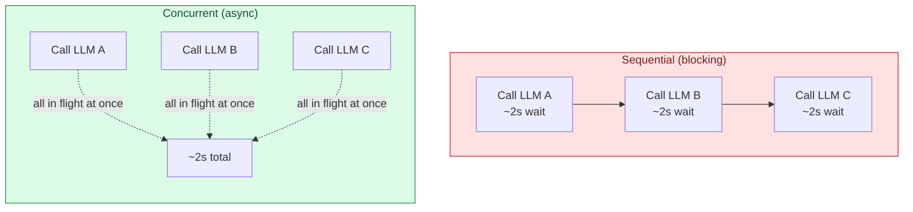
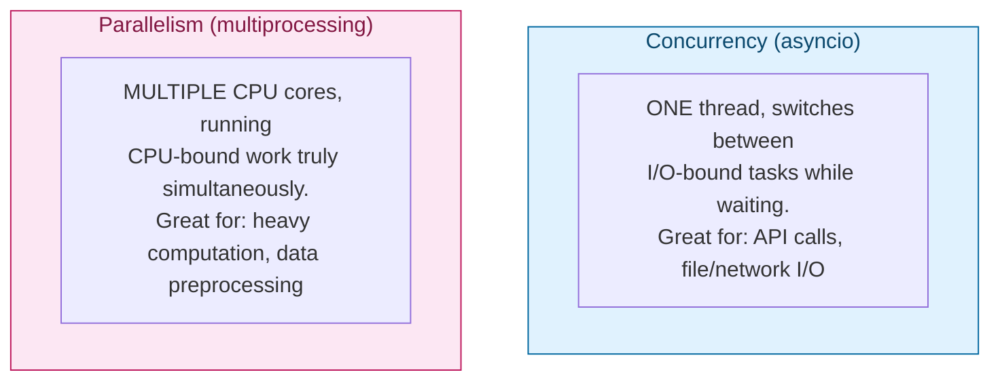

# Async & Concurrency — `async`/`await`, `asyncio` & Concurrent LLM Calls

> Part 7 of the series. [Note 6](06-oop-deep-dive.md) covered the object model powering ML/agent frameworks. This note covers **concurrency** — essential the moment your code calls an LLM API, a tool, or a database, because those calls spend most of their time *waiting*, not computing. Agent systems that call multiple tools or multiple LLMs per turn live or die on getting this right.

## Why This Matters for Agents



A single agent turn that calls 3 independent tools sequentially takes the *sum* of their latencies. Run them **concurrently** and it takes roughly the *max* — often a 3x+ speedup with zero extra hardware, because the bottleneck is network waiting, not CPU work.

---

## 1. The Core Problem: I/O-Bound Waiting

```python
import time

def call_llm_sync(prompt: str) -> str:
    time.sleep(2)                     # simulates network latency waiting on an API
    return f"response to: {prompt}"

start = time.time()
r1 = call_llm_sync("summarize this")
r2 = call_llm_sync("translate this")
r3 = call_llm_sync("classify this")
print(f"Sequential took {time.time() - start:.1f}s")   # ~6.0s
```

During that `time.sleep(2)` (standing in for an API round-trip), your program does **nothing** — the CPU sits idle waiting for a response. `asyncio` lets Python work on *other* tasks during that dead time instead of blocking.

---

## 2. `async def` and `await` — the Basics

```python
import asyncio

async def call_llm_async(prompt: str) -> str:
    await asyncio.sleep(2)        # non-blocking "wait" — yields control back to the event loop
    return f"response to: {prompt}"

async def main():
    result = await call_llm_async("summarize this")
    print(result)

asyncio.run(main())   # entry point — starts the event loop
```

**Key rules:**

- `async def` defines a **coroutine function** — calling it doesn't run the body immediately, it returns a coroutine object.
- `await` actually runs it and suspends the current coroutine until it completes, **without blocking the whole program** — other coroutines can run during that wait.
- You can only use `await` inside an `async def` function.
- `asyncio.run(main())` is the standard entry point — it starts the event loop, runs `main()` to completion, and shuts the loop down.

```mermaid
sequenceDiagram
    participant Main as main() coroutine
    participant Loop as Event Loop
    participant API as LLM API (simulated)

    Main->>Loop: await call_llm_async(...)
    Loop->>API: send request
    Note over Loop: Loop is free to run other coroutines while waiting
    API-->>Loop: response arrives
    Loop-->>Main: resume execution with result
```

---

## 3. Running Things Concurrently: `asyncio.gather`

This is the payoff — running multiple independent coroutines **at the same time**.

```python
import asyncio
import time

async def call_llm_async(prompt: str) -> str:
    await asyncio.sleep(2)
    return f"response to: {prompt}"

async def main():
    start = time.time()

    # Sequential (still slow — awaiting one at a time)
    r1 = await call_llm_async("summarize this")
    r2 = await call_llm_async("translate this")
    print(f"Sequential awaits: {time.time() - start:.1f}s")   # ~4.0s

    # Concurrent — all three start immediately, run in parallel
    start = time.time()
    results = await asyncio.gather(
        call_llm_async("summarize this"),
        call_llm_async("translate this"),
        call_llm_async("classify this"),
    )
    print(f"Concurrent gather: {time.time() - start:.1f}s")    # ~2.0s, not 6.0s!
    print(results)   # ['response to: summarize this', 'response to: translate this', ...]

asyncio.run(main())
```

**This is the pattern for a fan-out agent step** — e.g., calling three different tools an LLM requested in a single turn, or querying multiple retrieval sources before combining results into one prompt.

```python
# Realistic agent pattern: fan out multiple tool calls, then combine
async def run_tool_calls(tool_calls: list[dict]) -> list[str]:
    async def run_one(call):
        # dispatch to whichever async tool function this call needs
        await asyncio.sleep(1)   # simulated tool latency
        return f"result of {call['tool_name']}"

    return await asyncio.gather(*(run_one(call) for call in tool_calls))

async def main():
    calls = [{"tool_name": "search"}, {"tool_name": "calculator"}, {"tool_name": "weather"}]
    results = await run_tool_calls(calls)
    print(results)

asyncio.run(main())
```

---

## 4. Tasks — Fire-and-Manage Concurrency

`asyncio.gather` is great when you want to wait for everything. Sometimes you want more control: start work now, check on it later.

```python
import asyncio

async def background_job(name: str, seconds: int):
    await asyncio.sleep(seconds)
    return f"{name} done"

async def main():
    # create_task schedules the coroutine to start running immediately,
    # without blocking — unlike a bare `await`, which would block right here
    task1 = asyncio.create_task(background_job("logging", 1))
    task2 = asyncio.create_task(background_job("analytics", 2))

    print("Both tasks are running in the background now...")
    await asyncio.sleep(0.5)
    print("Doing other work while tasks run...")

    result1 = await task1   # wait for task1 to finish (if not already)
    result2 = await task2
    print(result1, result2)

asyncio.run(main())
```

---

## 5. Timeouts — Don't Let One Slow Call Hang Everything

Agent tool calls and LLM APIs can hang. Always bound your waits.

```python
import asyncio

async def flaky_api_call():
    await asyncio.sleep(10)     # simulate a hung/slow API
    return "finally done"

async def main():
    try:
        result = await asyncio.wait_for(flaky_api_call(), timeout=3)
        print(result)
    except asyncio.TimeoutError:
        print("API call timed out after 3s — falling back to default response")

asyncio.run(main())
```

---

## 6. `async for` and `async with` — Streaming & Async Context Managers

LLM responses often **stream** token-by-token — `async for` is the natural way to consume that.

```python
import asyncio

async def stream_llm_response(prompt: str):
    """Simulates an LLM streaming tokens back one at a time."""
    tokens = ["The", " transformer", " architecture", " is", " powerful", "."]
    for token in tokens:
        await asyncio.sleep(0.2)   # simulated network delay per token
        yield token                 # async generator — yields inside an async def

async def main():
    print("Streaming response: ", end="")
    async for token in stream_llm_response("explain transformers"):
        print(token, end="", flush=True)
    print()

asyncio.run(main())
```

```python
# async with — for resources that need async setup/teardown (e.g., an HTTP client session)
import asyncio

class AsyncAPIConnection:
    async def __aenter__(self):
        print("Opening connection...")
        await asyncio.sleep(0.1)
        return self

    async def __aexit__(self, exc_type, exc_val, exc_tb):
        print("Closing connection...")
        await asyncio.sleep(0.1)

    async def call(self, prompt):
        await asyncio.sleep(1)
        return f"response: {prompt}"

async def main():
    async with AsyncAPIConnection() as conn:
        result = await conn.call("hello")
        print(result)
    # connection automatically closed here, even if an exception occurred

asyncio.run(main())
```

This is exactly the shape of real async HTTP clients (`httpx.AsyncClient`, `aiohttp.ClientSession`) that the OpenAI/Anthropic async SDKs are built on.

---

## 7. Concurrency vs Parallelism — Know the Difference



| Tool | Best for | Why |
| --- | --- | --- |
| `asyncio` | I/O-bound: API calls, DB queries, file/network I/O | One thread cooperatively switches during waits — no GIL contention |
| `threading` | I/O-bound, or working with libraries that aren't async-native | Real OS threads, but limited by the GIL for CPU-bound work |
| `multiprocessing` | CPU-bound: numeric computation, image processing, tokenizing huge corpora | Separate processes, separate memory, true parallel execution across cores |

> **Rule of thumb for agent code:** if you're waiting on a network response (LLM API, tool API, vector DB), reach for `asyncio`. If you're crunching numbers (embeddings math, batch tokenization) with no I/O, that's a `multiprocessing`/vectorization (NumPy) problem instead — `asyncio` won't speed up CPU-bound work at all.

---

## 8. Sync vs Async LLM Clients — What You'll Actually Write

```python
# Sync version — simple, fine for scripts / one-off calls
from anthropic import Anthropic

client = Anthropic()
response = client.messages.create(
    model="claude-opus-5",
    max_tokens=100,
    messages=[{"role": "user", "content": "Hello"}],
)

# Async version — needed when serving multiple users, or fanning out multiple calls
import asyncio
from anthropic import AsyncAnthropic

async def main():
    client = AsyncAnthropic()
    response = await client.messages.create(
        model="claude-opus-5",
        max_tokens=100,
        messages=[{"role": "user", "content": "Hello"}],
    )
    print(response)

asyncio.run(main())
```

```python
# Fanning out multiple LLM calls concurrently — a realistic multi-agent pattern
import asyncio
from anthropic import AsyncAnthropic

async def ask(client, question: str) -> str:
    response = await client.messages.create(
        model="claude-opus-5",
        max_tokens=100,
        messages=[{"role": "user", "content": question}],
    )
    return response.content[0].text

async def main():
    client = AsyncAnthropic()
    questions = ["Summarize the French Revolution", "Explain photosynthesis", "Define entropy"]
    answers = await asyncio.gather(*(ask(client, q) for q in questions))
    for q, a in zip(questions, answers):
        print(f"Q: {q}\nA: {a}\n")

asyncio.run(main())
```

---

## Quick Reference Card

| Task | Syntax |
| --- | --- |
| Define a coroutine | `async def f(): ...` |
| Run a coroutine and wait for it | `await f()` |
| Start the event loop | `asyncio.run(main())` |
| Run many coroutines concurrently | `await asyncio.gather(f1(), f2(), f3())` |
| Start work without blocking now | `task = asyncio.create_task(f())` |
| Bound a slow call | `await asyncio.wait_for(f(), timeout=5)` |
| Non-blocking sleep | `await asyncio.sleep(seconds)` |
| Consume a stream | `async for chunk in stream(): ...` |
| Async resource management | `async with resource() as r: ...` |

---

## What's Next in This Series

1. **Pydantic & Structured Outputs** — schema validation for agent tool calling.
2. **FastAPI Essentials** — serving models and agents as APIs.
3. **Building Your First Agent Loop** — putting it all together: memory, tools, planning, and execution.
