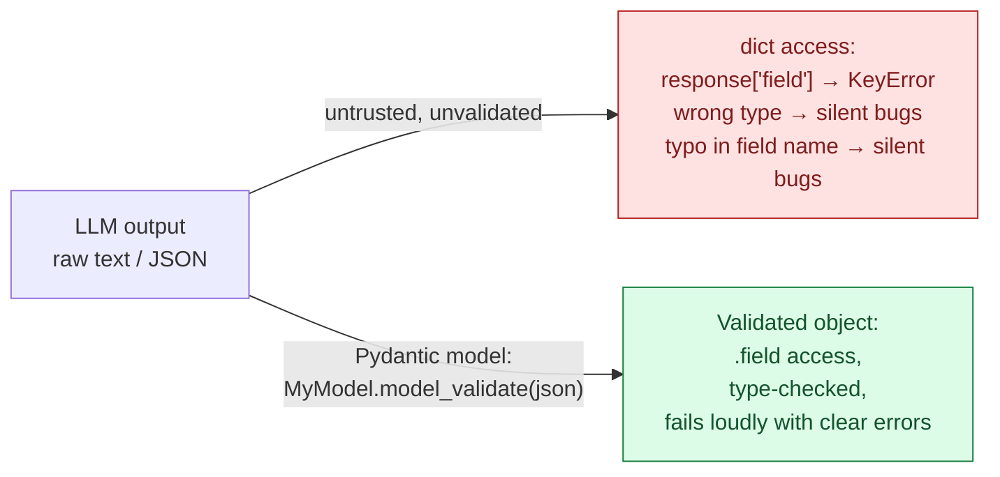
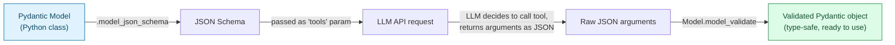

# Pydantic & Structured Outputs — Schema Validation for Agent Tool Calling

> Part 8 of the series. [Note 6](06-oop-deep-dive.md) built a mini class-based framework by hand; [Note 7](07-async-concurrency.md) covered calling LLMs concurrently. This note covers **Pydantic** — the library that turns "the LLM said some JSON" into "a validated, typed Python object you can trust." It's the backbone of tool-calling schemas, structured LLM outputs, and config objects across virtually every agent framework (LangChain, OpenAI SDK, Anthropic SDK, FastAPI).

## The Problem Pydantic Solves



Plain dicts and dataclasses (from [Note 1](01-python-for-ai.md)) don't validate anything at runtime — a dataclass happily accepts a string where you expected an int. Pydantic **validates and coerces data at the boundary**, which is exactly where LLM outputs, API requests, and config files live — all untrusted, all "probably" the right shape.

```bash
pip install pydantic
# or: uv add pydantic
```

---

## 1. Basic Models

```python
from pydantic import BaseModel

class User(BaseModel):
    name: str
    age: int
    email: str

# Validates on construction
user = User(name="Ada", age=36, email="ada@example.com")
print(user)                 # name='Ada' age=36 email='ada@example.com'
print(user.name, user.age)   # Ada 36

# Type coercion — Pydantic tries to convert compatible types
user2 = User(name="Grace", age="85", email="grace@example.com")   # "85" -> 85 (str -> int)
print(user2.age, type(user2.age))    # 85 <class 'int'>

# Validation failure — fails LOUDLY with a clear error, not a silent bug later
try:
    User(name="Bad", age="not a number", email="bad@example.com")
except Exception as e:
    print(e)
    # 1 validation error for User
    # age
    #   Input should be a valid integer, unable to parse string as an integer
```

**Compare to a plain dataclass**, which would accept `age="not a number"` without complaint and crash three functions later when you try `age + 1`.

---

## 2. Field Constraints & Defaults

```python
from pydantic import BaseModel, Field

class ChatRequest(BaseModel):
    prompt: str = Field(..., min_length=1, max_length=4000)     # ... means required
    temperature: float = Field(default=0.7, ge=0.0, le=2.0)      # ge/le = >=, <=
    max_tokens: int = Field(default=512, gt=0)                     # gt = strictly greater than
    model: str = "claude-opus-5"                                     # simple default

req = ChatRequest(prompt="Explain quantum computing")
print(req.temperature, req.max_tokens, req.model)   # 0.7 512 claude-opus-5

try:
    ChatRequest(prompt="hi", temperature=5.0)   # out of range!
except Exception as e:
    print(e)   # temperature: Input should be less than or equal to 2
```

---

## 3. Nested Models — the Shape of Real API Payloads

```python
from pydantic import BaseModel

class Message(BaseModel):
    role: str
    content: str

class Usage(BaseModel):
    prompt_tokens: int
    completion_tokens: int

class ChatResponse(BaseModel):
    id: str
    messages: list[Message]
    usage: Usage

# Parsing a realistic nested API response
raw = {
    "id": "chatcmpl-123",
    "messages": [
        {"role": "user", "content": "Hi"},
        {"role": "assistant", "content": "Hello! How can I help?"},
    ],
    "usage": {"prompt_tokens": 5, "completion_tokens": 8},
}

response = ChatResponse.model_validate(raw)
print(response.messages[1].content)         # Hello! How can I help?
print(response.usage.prompt_tokens + response.usage.completion_tokens)  # 13
```

**This is exactly the pattern the OpenAI/Anthropic Python SDKs use internally** — API responses are parsed into nested Pydantic models, so you get `.choices[0].message.content` with autocomplete and type-checking instead of blind dict indexing.

---

## 4. Optional Fields & Unions

```python
from pydantic import BaseModel
from typing import Optional

class ToolResult(BaseModel):
    tool_name: str
    result: Optional[str] = None       # can be None, defaults to None if omitted
    error: str | None = None            # same thing, modern syntax (Python 3.10+)

r1 = ToolResult(tool_name="calculator", result="42")
r2 = ToolResult(tool_name="weather", error="API timeout")   # result defaults to None
print(r1.result, r2.result)   # 42 None

# Union types — "this field is one of several possible types"
class Event(BaseModel):
    payload: int | str | list[int]

Event(payload=5)              # OK
Event(payload="hello")         # OK
Event(payload=[1, 2, 3])        # OK
```

---

## 5. Custom Validators

For rules that go beyond type + range (`ge`/`le`), write a validator.

```python
from pydantic import BaseModel, field_validator

class AgentConfig(BaseModel):
    name: str
    model: str

    @field_validator("name")
    @classmethod
    def name_must_be_slug(cls, v: str) -> str:
        if not v.replace("_", "").isalnum():
            raise ValueError("name must be alphanumeric (underscores allowed)")
        return v.lower()      # validators can also TRANSFORM the value

config = AgentConfig(name="Research_Agent", model="claude-opus-5")
print(config.name)   # research_agent (lowercased by the validator)

try:
    AgentConfig(name="bad name!", model="claude-opus-5")
except Exception as e:
    print(e)   # name must be alphanumeric (underscores allowed)
```

---

## 6. Serialization — Model ↔ dict ↔ JSON

```python
from pydantic import BaseModel

class ToolCall(BaseModel):
    name: str
    arguments: dict

call = ToolCall(name="search", arguments={"query": "python asyncio"})

# Model -> dict
print(call.model_dump())          # {'name': 'search', 'arguments': {'query': 'python asyncio'}}

# Model -> JSON string
print(call.model_dump_json())      # '{"name":"search","arguments":{"query":"python asyncio"}}'

# dict/JSON -> Model
data = {"name": "calculator", "arguments": {"expression": "2+2"}}
call2 = ToolCall.model_validate(data)                    # from dict
call3 = ToolCall.model_validate_json('{"name": "x", "arguments": {}}')   # from JSON string
```

---

## 7. Auto-Generated JSON Schema — the Bridge to LLM Tool Calling

This is the feature that makes Pydantic central to agent frameworks: **every model can describe its own shape as JSON Schema**, which is exactly the format LLM APIs expect for function/tool definitions.

```python
from pydantic import BaseModel, Field

class GetWeatherArgs(BaseModel):
    """Get the current weather for a city."""
    city: str = Field(description="The city name, e.g. 'Paris'")
    units: str = Field(default="celsius", description="Temperature units: 'celsius' or 'fahrenheit'")

print(GetWeatherArgs.model_json_schema())
```

```json
{
  "title": "GetWeatherArgs",
  "description": "Get the current weather for a city.",
  "type": "object",
  "properties": {
    "city": {"type": "string", "description": "The city name, e.g. 'Paris'"},
    "units": {"type": "string", "default": "celsius", "description": "..."}
  },
  "required": ["city"]
}
```



**End-to-end tool-calling round trip:**

```python
from pydantic import BaseModel, Field
from anthropic import Anthropic

class GetWeatherArgs(BaseModel):
    """Get the current weather for a city."""
    city: str = Field(description="The city name")

client = Anthropic()
response = client.messages.create(
    model="claude-opus-5",
    max_tokens=200,
    tools=[{
        "name": "get_weather",
        "description": GetWeatherArgs.__doc__,
        "input_schema": GetWeatherArgs.model_json_schema(),
    }],
    messages=[{"role": "user", "content": "What's the weather in Tokyo?"}],
)

# The LLM's tool call arguments arrive as a raw dict — validate before using them!
for block in response.content:
    if block.type == "tool_use":
        args = GetWeatherArgs.model_validate(block.input)   # now type-safe
        print(args.city)   # "Tokyo" — guaranteed to be a string, guaranteed present
```

> **Why validate the LLM's own tool arguments?** Because an LLM can still hallucinate a malformed call (wrong type, missing field, extra text). Pydantic turns "hope the LLM got it right" into "fail fast with a clear error if it didn't" — critical for any agent that executes real actions (API calls, file writes, payments) based on model output.

---

## 8. Structured Output Parsing (Not Just Tool Calls)

Many workflows want the LLM's *entire response* to be structured JSON matching a schema — e.g., extracting fields from a document, classifying with metadata.

```python
from pydantic import BaseModel

class SentimentAnalysis(BaseModel):
    sentiment: str          # "positive" | "negative" | "neutral"
    confidence: float
    key_phrases: list[str]

# Ask the LLM to return JSON matching your schema (via prompt instructions,
# or a provider's native structured-output / JSON-mode feature), then validate:
raw_llm_output = '{"sentiment": "positive", "confidence": 0.92, "key_phrases": ["great service", "fast delivery"]}'

result = SentimentAnalysis.model_validate_json(raw_llm_output)
print(result.sentiment, result.confidence)   # positive 0.92
print(result.key_phrases)                     # ['great service', 'fast delivery']
```

**This pattern — "prompt the LLM to emit JSON, validate it against a Pydantic model" — is the foundation of:**

- Structured extraction pipelines (pulling fields out of unstructured documents).
- Agent "planning" steps that output a structured plan object instead of free text.
- Reliable classification/labeling where you need a guaranteed schema, not prose.

---

## Quick Reference Card

| Task | Pydantic |
| --- | --- |
| Define a model | `class X(BaseModel): field: type` |
| Required field with constraints | `field: int = Field(..., ge=0, le=100)` |
| Optional field | `field: str \| None = None` |
| Validate from dict | `Model.model_validate(data)` |
| Validate from JSON string | `Model.model_validate_json(json_str)` |
| Custom validation logic | `@field_validator("field")` |
| Model → dict | `.model_dump()` |
| Model → JSON string | `.model_dump_json()` |
| Model → JSON Schema (for tool calling) | `.model_json_schema()` |

---

## What's Next in This Series

1. **FastAPI Essentials** — serving models and agents as APIs.
2. **Building Your First Agent Loop** — putting it all together: memory, tools, planning, and execution.
