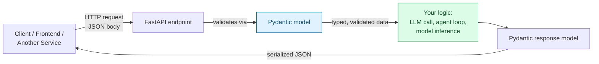
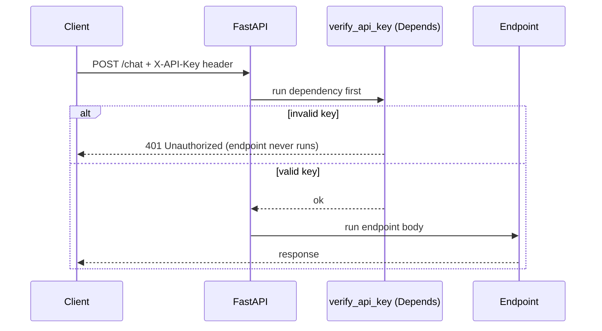

# FastAPI Essentials — Serving Models & Agents as APIs

> Part 9 of the series. [Note 7](07-async-concurrency.md) covered `async`/`await`; [Note 8](08-pydantic-structured-outputs.md) covered Pydantic validation. **FastAPI** combines both directly — it's an async-native web framework that uses Pydantic models for request/response validation. This is how you turn a model, a RAG pipeline, or an agent loop into a real HTTP service other systems (or a frontend) can call.

## Where FastAPI Fits



**Why FastAPI specifically (vs Flask/Django) for AI work:**

- **Native `async def` support** — critical for endpoints that call LLM APIs (I/O-bound, per [Note 7](07-async-concurrency.md)).
- **Pydantic-based validation is built in**, not bolted on — request bodies, query params, and responses are all just Pydantic models.
- **Automatic interactive docs** (Swagger UI / ReDoc) generated from your type hints — no separate API spec to maintain.
- It's the de facto standard for wrapping ML models and agents behind an HTTP interface.

```bash
pip install fastapi uvicorn
# or: uv add fastapi uvicorn
```

---

## 1. Your First Endpoint

```python
# main.py
from fastapi import FastAPI

app = FastAPI()

@app.get("/")
def root():
    return {"message": "Hello, world"}

@app.get("/health")
def health():
    return {"status": "ok"}
```

```bash
# Run the dev server (auto-reloads on file changes)
uvicorn main:app --reload

# Visit:
# http://127.0.0.1:8000        -> your endpoint
# http://127.0.0.1:8000/docs   -> auto-generated interactive Swagger UI
```

FastAPI turns a plain Python function into an HTTP endpoint via a **decorator** ([Note 1](01-python-for-ai.md#8-decorators--context-managers)) that maps an HTTP method + path to that function.

---

## 2. Path & Query Parameters

```python
from fastapi import FastAPI

app = FastAPI()

# Path parameter — part of the URL itself, type-hinted and auto-validated
@app.get("/agents/{agent_id}")
def get_agent(agent_id: int):
    return {"agent_id": agent_id, "name": f"agent-{agent_id}"}
# GET /agents/42          -> {"agent_id": 42, "name": "agent-42"}
# GET /agents/not-a-number -> 422 Unprocessable Entity, automatically!

# Query parameters — anything after ? in the URL, with defaults
@app.get("/search")
def search(query: str, limit: int = 10, include_archived: bool = False):
    return {"query": query, "limit": limit, "include_archived": include_archived}
# GET /search?query=python&limit=5
# -> {"query": "python", "limit": 5, "include_archived": false}
```

FastAPI reads your **type hints** and does the validation work for you — a non-integer `agent_id` is rejected before your function body even runs.

---

## 3. Request Bodies with Pydantic

This is where FastAPI and Pydantic ([Note 8](08-pydantic-structured-outputs.md)) become one workflow.

```python
from fastapi import FastAPI
from pydantic import BaseModel, Field

app = FastAPI()

class ChatRequest(BaseModel):
    prompt: str = Field(..., min_length=1, max_length=4000)
    temperature: float = Field(default=0.7, ge=0.0, le=2.0)
    max_tokens: int = Field(default=512, gt=0)

class ChatResponse(BaseModel):
    reply: str
    tokens_used: int

@app.post("/chat", response_model=ChatResponse)
def chat(request: ChatRequest):
    # request is ALREADY a validated ChatRequest instance here —
    # no manual dict parsing, no manual type checks, no manual range checks
    reply_text = f"[echo] {request.prompt}"    # stand-in for a real LLM call
    return ChatResponse(reply=reply_text, tokens_used=len(reply_text.split()))
```

```bash
curl -X POST http://127.0.0.1:8000/chat \
  -H "Content-Type: application/json" \
  -d '{"prompt": "Hello", "temperature": 0.5}'
# {"reply":"[echo] Hello","tokens_used":2}

# Send an invalid request — a temperature out of range
curl -X POST http://127.0.0.1:8000/chat \
  -H "Content-Type: application/json" \
  -d '{"prompt": "Hi", "temperature": 5.0}'
# 422 Unprocessable Entity — full explanation of exactly which field failed and why
```

`response_model=ChatResponse` does double duty: it validates what your function returns (catching bugs where you forget a field) **and** it's what powers the auto-generated docs schema.

---

## 4. Async Endpoints — Calling LLMs Without Blocking

```python
from fastapi import FastAPI
from pydantic import BaseModel
from anthropic import AsyncAnthropic

app = FastAPI()
client = AsyncAnthropic()

class ChatRequest(BaseModel):
    prompt: str

class ChatResponse(BaseModel):
    reply: str

@app.post("/chat", response_model=ChatResponse)
async def chat(request: ChatRequest):
    # await here means the server can handle OTHER requests while waiting
    # on the LLM API — critical under real concurrent traffic (see Note 7)
    response = await client.messages.create(
        model="claude-opus-5",
        max_tokens=500,
        messages=[{"role": "user", "content": request.prompt}],
    )
    return ChatResponse(reply=response.content[0].text)
```

> **Use `async def` whenever your endpoint does I/O** (LLM calls, database queries, other HTTP calls). A `def` endpoint still works — FastAPI runs it in a thread pool — but under real traffic, a blocking `def` endpoint that calls a slow API ties up a whole worker thread per request, while `async def` lets one process juggle many concurrent LLM calls at once (exactly the `asyncio.gather` benefit from Note 7, now applied per-request).

---

## 5. Dependency Injection — Shared Setup (Auth, Clients, DB Sessions)

FastAPI's `Depends` mechanism lets you declare reusable setup logic (auth checks, DB connections, shared API clients) once and inject it into any endpoint that needs it.

```python
from fastapi import FastAPI, Depends, HTTPException, Header
from anthropic import AsyncAnthropic

app = FastAPI()

# A dependency — any function FastAPI can call before your endpoint runs
def get_llm_client() -> AsyncAnthropic:
    return AsyncAnthropic()

def verify_api_key(x_api_key: str = Header(...)):
    if x_api_key != "expected-secret-key":
        raise HTTPException(status_code=401, detail="Invalid API key")
    return x_api_key

@app.post("/chat")
async def chat(
    prompt: str,
    client: AsyncAnthropic = Depends(get_llm_client),   # injected automatically
    api_key: str = Depends(verify_api_key),               # runs BEFORE the endpoint body
):
    response = await client.messages.create(
        model="claude-opus-5",
        max_tokens=200,
        messages=[{"role": "user", "content": prompt}],
    )
    return {"reply": response.content[0].text}
```



**AI relevance:** this is exactly how you'd share one long-lived LLM client, database connection pool, or vector-store connection across every endpoint without recreating it per-request, and how you'd gate access to an expensive agent endpoint behind auth.

---

## 6. Streaming Responses — Token-by-Token Output

Combines directly with the async generators from [Note 7](07-async-concurrency.md#6-async-for-and-async-with--streaming--async-context-managers).

```python
from fastapi import FastAPI
from fastapi.responses import StreamingResponse
from anthropic import AsyncAnthropic

app = FastAPI()
client = AsyncAnthropic()

async def token_stream(prompt: str):
    async with client.messages.stream(
        model="claude-opus-5",
        max_tokens=500,
        messages=[{"role": "user", "content": prompt}],
    ) as stream:
        async for text in stream.text_stream:
            yield text     # each chunk sent to the client as soon as it arrives

@app.get("/chat/stream")
async def chat_stream(prompt: str):
    return StreamingResponse(token_stream(prompt), media_type="text/plain")
```

The client sees tokens arrive incrementally instead of waiting for the entire response — the same UX as ChatGPT/Claude's typing effect.

---

## 7. Error Handling

```python
from fastapi import FastAPI, HTTPException

app = FastAPI()

agents_db = {1: "research-agent", 2: "coding-agent"}

@app.get("/agents/{agent_id}")
def get_agent(agent_id: int):
    if agent_id not in agents_db:
        raise HTTPException(status_code=404, detail=f"Agent {agent_id} not found")
    return {"agent_id": agent_id, "name": agents_db[agent_id]}
```

```python
# Global exception handler — catch a whole category of errors in one place
from fastapi import Request
from fastapi.responses import JSONResponse

class LLMProviderError(Exception):
    def __init__(self, provider: str):
        self.provider = provider

@app.exception_handler(LLMProviderError)
async def llm_error_handler(request: Request, exc: LLMProviderError):
    return JSONResponse(
        status_code=503,
        content={"error": f"{exc.provider} is currently unavailable"},
    )
```

This mirrors the retry/error-handling patterns from [Note 1](01-python-for-ai.md#6-error-handling) — but at the API boundary, turning internal exceptions into clean, structured HTTP responses instead of a raw 500 stack trace.

---

## 8. Project Structure for a Small Agent API

```text
agent_service/
├── main.py               # FastAPI app, includes routers
├── routers/
│   ├── chat.py             # /chat endpoints
│   └── agents.py            # /agents endpoints
├── schemas.py              # Pydantic request/response models
├── dependencies.py          # shared Depends() functions (auth, clients)
└── services/
    └── llm_client.py          # LLM API wrapper logic
```

```python
# routers/chat.py
from fastapi import APIRouter
from schemas import ChatRequest, ChatResponse

router = APIRouter(prefix="/chat", tags=["chat"])

@router.post("/", response_model=ChatResponse)
async def chat(request: ChatRequest):
    ...

# main.py
from fastapi import FastAPI
from routers import chat, agents

app = FastAPI(title="Agent Service")
app.include_router(chat.router)
app.include_router(agents.router)
```

`APIRouter` lets you split endpoints across files as a project grows — the same idea as splitting a large module into packages ([Note 2](02-python-refreshr.md#7-modules--imports)).

---

## Quick Reference Card

| Task | FastAPI |
| --- | --- |
| Define the app | `app = FastAPI()` |
| GET endpoint | `@app.get("/path")` |
| POST endpoint with body | `@app.post("/path")` + Pydantic model parameter |
| Path parameter | `def f(item_id: int):` with `{item_id}` in the route |
| Query parameter | plain function parameter with a default value |
| Validate request body | type-hint the parameter as a `BaseModel` subclass |
| Validate response shape | `@app.post(..., response_model=MyModel)` |
| Async (I/O-bound) endpoint | `async def` + `await` inside |
| Shared setup / auth | `Depends(dependency_fn)` |
| Streaming output | `StreamingResponse(async_generator)` |
| Custom error responses | `raise HTTPException(status_code=..., detail=...)` |
| Run dev server | `uvicorn main:app --reload` |
| Interactive docs | `/docs` (Swagger) or `/redoc` |

---

## What's Next in This Series

1. **Building Your First Agent Loop** — putting it all together: memory, tools, planning, execution — and wrapping it behind the FastAPI endpoints from this note.
