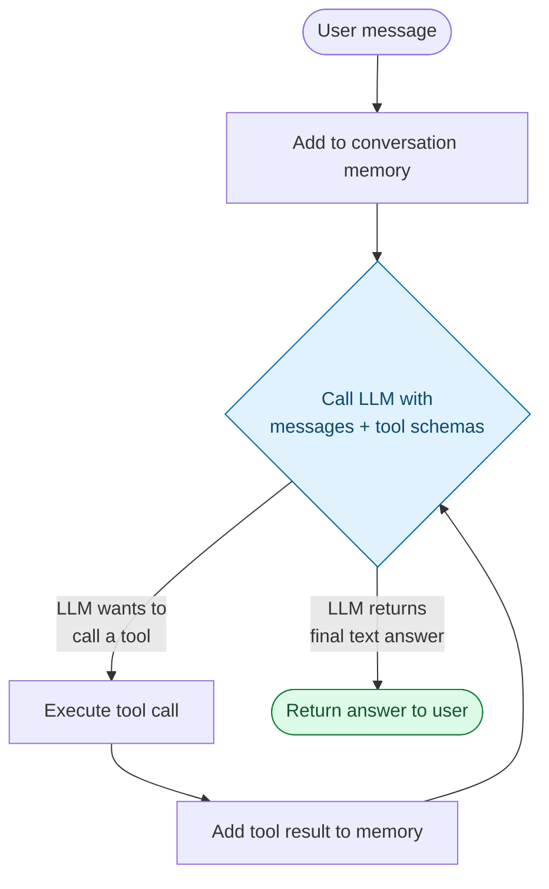
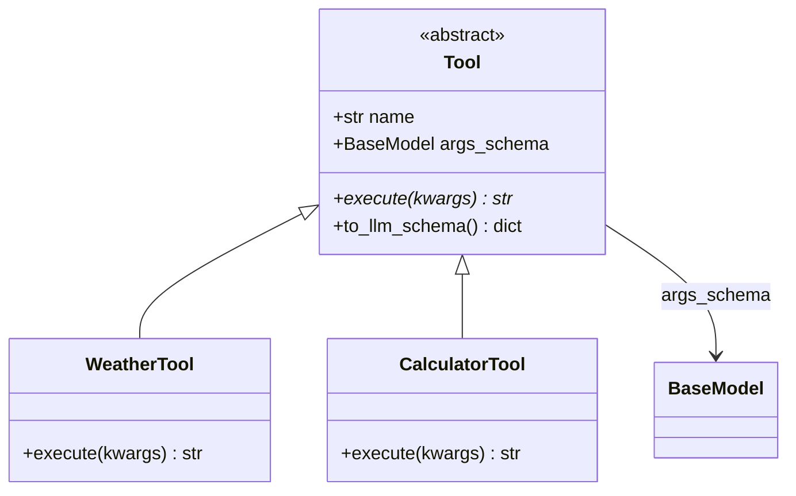
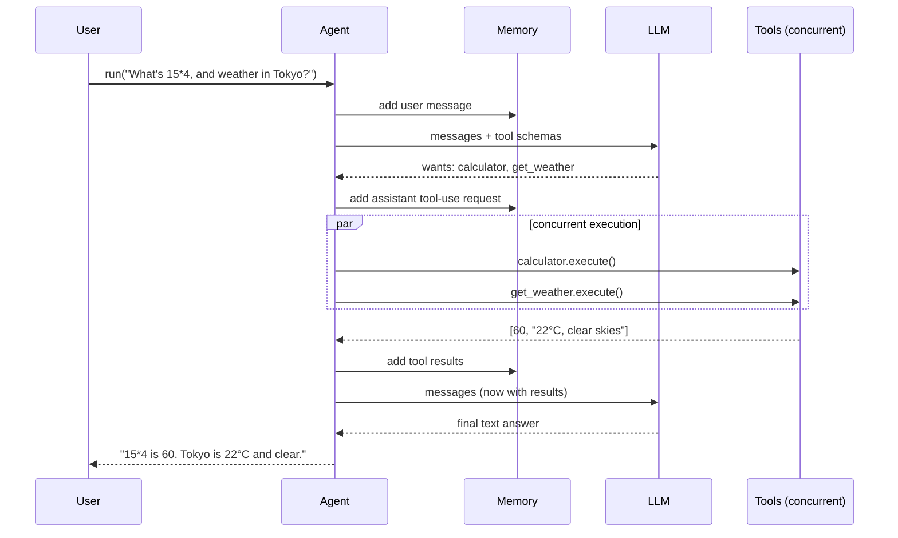
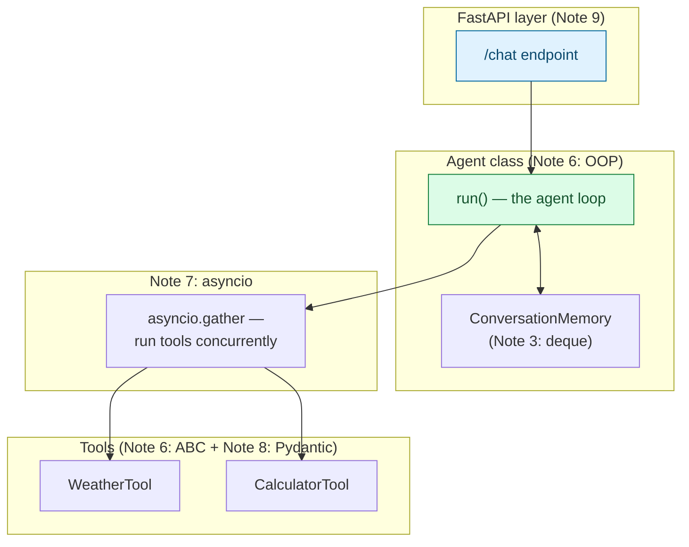

# Building Your First Agent Loop — Memory, Tools, Planning & Execution

> Part 10, the finale of this series. Every prior note built one piece: [OOP](06-oop-deep-dive.md) gave us classes, ABCs, and `__call__`; [async](07-async-concurrency.md) gave us concurrent tool execution; [Pydantic](08-pydantic-structured-outputs.md) gave us validated tool schemas; [FastAPI](09-fastapi-essentials.md) gave us a way to serve it. This note assembles all four into a real, working **agent loop** — the core control structure behind every LLM agent framework (LangChain, CrewAI, the Claude Agent SDK itself).

## What Is an "Agent Loop"?

At its core, an agent is a **loop** that alternates between asking an LLM "what should I do next?" and actually doing it, feeding the result back in, until the LLM decides it's done.



Everything in this loop maps directly onto concepts from earlier notes:

| Loop component | Built with | Covered in |
| --- | --- | --- |
| Agent class, tool interface | ABCs, `__call__`, dunder methods | [Note 6](06-oop-deep-dive.md) |
| Concurrent tool execution | `asyncio.gather` | [Note 7](07-async-concurrency.md) |
| Tool argument validation | Pydantic models + JSON Schema | [Note 8](08-pydantic-structured-outputs.md) |
| Serving the agent over HTTP | FastAPI + streaming | [Note 9](09-fastapi-essentials.md) |
| Conversation memory | `deque(maxlen=N)` | [Note 3](03-data-structures-deep-dive.md#collections) |

---

## 1. Defining Tools — ABC + Pydantic Schema

Reusing the `Tool` ABC pattern from [Note 6](06-oop-deep-dive.md#1-abstract-base-classes-abcs--enforcing-a-contract), but now each tool declares its arguments as a Pydantic model, so we get both an enforced interface *and* a validated, LLM-describable schema.

```python
from abc import ABC, abstractmethod
from pydantic import BaseModel, Field

class Tool(ABC):
    """Every tool must expose a name, an args schema, and an execute method."""

    name: str
    args_schema: type[BaseModel]

    @abstractmethod
    async def execute(self, **kwargs) -> str:
        ...

    def to_llm_schema(self) -> dict:
        """The bridge to LLM tool-calling APIs (see Note 8, section 7)."""
        return {
            "name": self.name,
            "description": self.__doc__ or "",
            "input_schema": self.args_schema.model_json_schema(),
        }


class WeatherArgs(BaseModel):
    city: str = Field(description="City name, e.g. 'Tokyo'")

class WeatherTool(Tool):
    """Get the current weather for a city."""
    name = "get_weather"
    args_schema = WeatherArgs

    async def execute(self, **kwargs) -> str:
        args = WeatherArgs.model_validate(kwargs)     # validate before using — Note 8
        return f"Weather in {args.city}: 22°C, clear skies"


class CalculatorArgs(BaseModel):
    expression: str = Field(description="A basic arithmetic expression, e.g. '2 + 2'")

class CalculatorTool(Tool):
    """Evaluate a basic arithmetic expression."""
    name = "calculator"
    args_schema = CalculatorArgs

    async def execute(self, **kwargs) -> str:
        args = CalculatorArgs.model_validate(kwargs)
        try:
            result = eval(args.expression, {"__builtins__": {}}, {})   # sandboxed eval
            return str(result)
        except Exception as e:
            return f"Error evaluating expression: {e}"
```



---

## 2. Memory — a Bounded Conversation Window

Reusing `deque(maxlen=N)` from [Note 3](03-data-structures-deep-dive.md#collections) as the simplest possible sliding-window memory.

```python
from collections import deque

class ConversationMemory:
    def __init__(self, max_turns: int = 20):
        self._messages = deque(maxlen=max_turns)

    def add(self, role: str, content):
        self._messages.append({"role": role, "content": content})

    def as_list(self) -> list[dict]:
        return list(self._messages)
```

A production agent might swap this for a summarizing memory (compress old turns into a running summary) or a vector-store-backed long-term memory — but the *interface* (`add`, `as_list`) stays the same, which is the point of designing to an interface rather than a concrete structure.

---

## 3. The Agent Class — Tying It Together with `__call__`

```python
import asyncio
import json
from anthropic import AsyncAnthropic

class Agent:
    def __init__(self, model: str, tools: list[Tool], system_prompt: str = ""):
        self.model = model
        self.tools = {tool.name: tool for tool in tools}
        self.system_prompt = system_prompt
        self.memory = ConversationMemory()
        self.client = AsyncAnthropic()

    async def run(self, user_message: str) -> str:
        self.memory.add("user", user_message)

        while True:   # the agent loop itself
            response = await self.client.messages.create(
                model=self.model,
                max_tokens=1000,
                system=self.system_prompt,
                messages=self.memory.as_list(),
                tools=[tool.to_llm_schema() for tool in self.tools.values()],
            )

            tool_uses = [b for b in response.content if b.type == "tool_use"]

            if not tool_uses:
                # LLM returned a final text answer — loop ends
                final_text = "".join(b.text for b in response.content if b.type == "text")
                self.memory.add("assistant", final_text)
                return final_text

            # LLM wants to call one or more tools — record its request, then execute
            self.memory.add("assistant", response.content)
            tool_results = await self._execute_tools(tool_uses)
            self.memory.add("user", tool_results)   # tool results go back in as a "user" turn

    async def _execute_tools(self, tool_uses: list) -> list[dict]:
        """Run all requested tool calls CONCURRENTLY — see Note 7, asyncio.gather."""
        async def run_one(call):
            tool = self.tools[call.name]
            result = await tool.execute(**call.input)
            return {"type": "tool_result", "tool_use_id": call.id, "content": result}

        return await asyncio.gather(*(run_one(call) for call in tool_uses))
```



**Notice how this class mirrors the `Module.__call__` pattern from [Note 6](06-oop-deep-dive.md#4-building-a-mini-nnmodule-style-framework):** there, `model(x)` delegated to `forward()`; here, `agent.run(message)` delegates through a loop of LLM calls and tool executions. Same principle — a clean public interface hiding an internal control flow.

---

## 4. Serving the Agent with FastAPI

Wrapping the `Agent` class from section 3 behind the endpoint patterns from [Note 9](09-fastapi-essentials.md).

```python
from fastapi import FastAPI
from pydantic import BaseModel

app = FastAPI(title="Agent Service")

agent = Agent(
    model="claude-opus-5",
    tools=[WeatherTool(), CalculatorTool()],
    system_prompt="You are a helpful assistant with access to tools.",
)

class ChatRequest(BaseModel):
    message: str

class ChatResponse(BaseModel):
    reply: str

@app.post("/chat", response_model=ChatResponse)
async def chat(request: ChatRequest):
    reply = await agent.run(request.message)
    return ChatResponse(reply=reply)
```

```bash
uvicorn main:app --reload

curl -X POST http://127.0.0.1:8000/chat \
  -H "Content-Type: application/json" \
  -d '{"message": "What is 15*4, and what is the weather in Tokyo?"}'
# {"reply": "15*4 is 60. The weather in Tokyo is 22°C with clear skies."}
```

---

## 5. Guardrails Worth Adding

A toy agent loop like this needs a few safety nets before it's production-shaped:

```python
class Agent:
    def __init__(self, model: str, tools: list[Tool], max_iterations: int = 10, **kwargs):
        ...
        self.max_iterations = max_iterations

    async def run(self, user_message: str) -> str:
        self.memory.add("user", user_message)

        for _ in range(self.max_iterations):     # cap the loop — never run forever
            response = await self._call_llm_with_timeout()
            ...
        raise RuntimeError("Agent exceeded max iterations without a final answer")

    async def _call_llm_with_timeout(self):
        import asyncio
        try:
            return await asyncio.wait_for(self._call_llm(), timeout=30)   # Note 7, section 5
        except asyncio.TimeoutError:
            raise RuntimeError("LLM call timed out")
```

| Risk | Guardrail |
| --- | --- |
| Infinite tool-calling loop | Cap iterations (`max_iterations`), as above |
| Hung LLM/tool call | `asyncio.wait_for(..., timeout=...)` — [Note 7](07-async-concurrency.md#5-timeouts--dont-let-one-slow-call-hang-everything) |
| Malformed tool arguments from LLM | `args_schema.model_validate(kwargs)` — [Note 8](08-pydantic-structured-outputs.md#7-auto-generated-json-schema--the-bridge-to-llm-tool-calling) |
| One failing tool crashing the whole turn | Wrap `tool.execute()` in `try/except` — [Note 1](01-python-for-ai.md#6-error-handling) |
| Unbounded memory growth | `deque(maxlen=N)` — [Note 3](03-data-structures-deep-dive.md#collections) |
| Unauthenticated access to the agent endpoint | FastAPI `Depends(verify_api_key)` — [Note 9](09-fastapi-essentials.md#5-dependency-injection--shared-setup-auth-clients-db-sessions) |

---

## 6. The Full Picture



Every box in this diagram is a concept from an earlier note in this series. There's no new magic in "agent frameworks" — LangChain, CrewAI, and similar tools formalize and extend exactly this shape (more tool types, more memory strategies, more planning styles), but the core loop — **LLM decides → code executes → result feeds back → repeat until done** — is what you just built from first principles.

---

## Series Recap

| # | Note | Core takeaway |
| --- | --- | --- |
| 1 | [Python for AI](01-python-for-ai.md) | Map of why each language feature matters for AI |
| 2 | [Python Refresher](02-python-refreshr.md) | Basics + `venv`/`pip`/`uv` tooling |
| 3 | [Data Structures Deep Dive](03-data-structures-deep-dive.md) | `list`/`dict`/`set`/`tuple` + `collections` |
| 4 | [NumPy Essentials](04-numpy-essentials.md) | Arrays, broadcasting, vectorization |
| 5 | [Pandas Data Wrangling](05-pandas-data-wrangling.md) | DataFrames, `groupby`, merging |
| 6 | [OOP Deep Dive](06-oop-deep-dive.md) | ABCs, mixins, dunder methods, a mini `nn.Module` |
| 7 | [Async & Concurrency](07-async-concurrency.md) | `asyncio`, concurrent LLM/tool calls |
| 8 | [Pydantic & Structured Outputs](08-pydantic-structured-outputs.md) | Validated schemas, LLM tool-calling |
| 9 | [FastAPI Essentials](09-fastapi-essentials.md) | Serving models/agents as APIs |
| 10 | **Building Your First Agent Loop** (this note) | Assembling it all into a working agent |

> From here, the natural next steps are: swapping the toy tools for real ones (web search, code execution, RAG retrieval), adding a proper planning step before tool selection, and exploring existing frameworks (LangChain, CrewAI, the Claude Agent SDK) — which you're now equipped to read the source code of, not just the docs.
