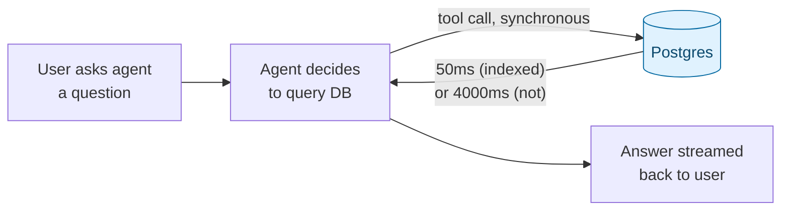

# Indexing & Query Performance — Why Retrieval Speed Matters for AI

> Part 2 of the SQL refresher series. [Note 1](01-sql-refresher.md) covered the queries themselves; this note covers why the *same* query can take 2ms or 2 seconds depending on the table's indexes — directly relevant once a database sits in the hot path of an agent's response time, not just behind a nightly report.

## Why This Matters More for AI Apps Than "Normal" CRUD



A slow query behind a dashboard means someone waits an extra second. A slow query inside an **agent tool call** means every step of the agent's reasoning loop stalls — and if the agent retries or calls the tool multiple times per turn, that latency multiplies. Retrieval-augmented generation makes this worse: a similarity search over millions of embeddings (see [Note 6](06-vector-search-pgvector.md)) without the right index isn't slow, it's a full table scan comparing the query vector to every row.

---

## 1. The Default: Sequential Scan

Without an index, Postgres reads every row to answer a filter — a **sequential scan**. Fine for a few thousand rows, ruinous for millions.

```sql
EXPLAIN ANALYZE
SELECT * FROM orders WHERE customer_id = 3;
```

```text
Seq Scan on orders  (cost=0.00..1.09 rows=1 width=24) (actual time=0.02..0.03 rows=1 loops=1)
  Filter: (customer_id = 3)
Planning Time: 0.05 ms
Execution Time: 0.04 ms
```

`EXPLAIN ANALYZE` actually **runs** the query and shows the real plan and timing (plain `EXPLAIN` only estimates — never run `EXPLAIN ANALYZE` on a statement with side effects like `DELETE` unless you mean to execute it). At this table size a seq scan is *already* the fastest option — Postgres's planner isn't wrong to skip an index on tiny tables. Indexing is a decision you validate with data, not apply reflexively everywhere.

---

## 2. B-Tree Indexes — the Default Case

```sql
CREATE INDEX idx_orders_customer_id ON orders (customer_id);

EXPLAIN ANALYZE
SELECT * FROM orders WHERE customer_id = 3;
```

```text
Index Scan using idx_orders_customer_id on orders  (cost=0.15..8.17 rows=1 width=24)
  Index Cond: (customer_id = 3)
```

A B-tree index is a sorted structure the planner can binary-search instead of scanning linearly — it's the right default for equality (`=`) and range (`<`, `>`, `BETWEEN`) filters on a column with reasonably unique values. Foreign key columns (like `orders.customer_id`) are the single most common place a missing index turns into a production incident: Postgres does **not** auto-index them, unlike the primary key side.

---

## 3. Composite Indexes and Column Order

```sql
CREATE INDEX idx_orders_customer_status ON orders (customer_id, status);
```

A composite index on `(customer_id, status)` speeds up filters on `customer_id` alone, and on `customer_id AND status` together — but **not** on `status` alone. Column order matters: the index is only useful as a left-to-right prefix, the same way a phone book sorted by (last name, first name) doesn't help you find everyone named "Grace."

```sql
-- Uses the composite index (leading column present)
SELECT * FROM orders WHERE customer_id = 1 AND status = 'paid';

-- Does NOT use it (leading column missing) -- falls back to seq scan or a separate index
SELECT * FROM orders WHERE status = 'paid';
```

---

## 4. Selectivity — When an Index Doesn't Help

An index on `orders.status` (three or four possible values, spread evenly across millions of rows) often gets *ignored* by the planner even if it exists — reading half the table via the index, then fetching each matching row separately, can be slower than one sequential pass. Indexes pay off on **high-selectivity** columns (ones that narrow the result set a lot: emails, IDs, timestamps), not low-selectivity ones (status enums, booleans, country codes) — unless combined with a more selective column in a composite index, as above.

---

## 5. Reading a Query Plan, Practically

```text
Seq Scan on orders            -- how a step accesses data
  Filter: (customer_id = 3)   -- what it's checking
(cost=0.00..1.09 rows=1 width=24)   -- planner's cost ESTIMATE (arbitrary units, relative only)
(actual time=0.02..0.03 rows=1 loops=1)  -- REAL measured time and row count
```

- `cost=X..Y`: startup cost `X`, total cost `Y` — planner's own estimate, useful for comparing plans, not wall-clock time.
- `actual time=X..Y`: real milliseconds, from `EXPLAIN ANALYZE` only.
- `rows=`: estimated vs. actual row count — a large gap between them means Postgres's statistics are stale (`ANALYZE tablename;` refreshes them) and it may be choosing a bad plan.
- Read plans **bottom-up**: the innermost/lowest step runs first, feeding rows up to the steps above it.

---

## 6. Don't Over-Index

Every index speeds up reads but slows down every `INSERT`/`UPDATE`/`DELETE` on that table (the index has to be maintained too), and takes disk space. For an agent system logging every tool call to a table like `agent_runs`, indexing every JSONB field "just in case" will quietly tax your write throughput. Index for the queries you actually run — check with `EXPLAIN ANALYZE`, not intuition.

---

## Quick Reference Card

| Task | SQL |
| --- | --- |
| See the query plan (real timing) | `EXPLAIN ANALYZE <query>` |
| See the query plan (estimate only, no side effects) | `EXPLAIN <query>` |
| Add a basic index | `CREATE INDEX idx_name ON table (col);` |
| Add a composite index | `CREATE INDEX idx_name ON table (col1, col2);` |
| Refresh planner statistics | `ANALYZE table;` |
| List indexes on a table | `\d table` (in `psql`) |
| Drop an unused index | `DROP INDEX idx_name;` |

---

## What's Next in This Series

1. **[JSONB for AI Apps](03-json-jsonb-for-ai-apps.md)** — and how `GIN` indexes make JSONB queries fast too.
2. **[Window Functions & Analytics](04-window-functions-and-analytics.md)**.
3. **[Transactions & Concurrency](05-transactions-and-concurrency.md)**.
4. **[Vector Search with pgvector](06-vector-search-pgvector.md)** — where indexing strategy (HNSW vs. IVFFlat) is the entire performance story.
