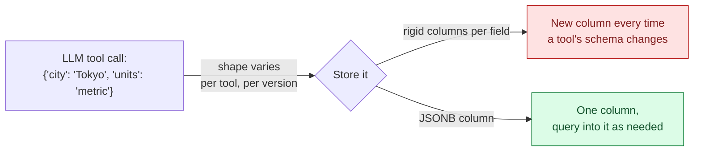

# JSONB for AI Apps — Semi-Structured Data in a Relational Database

> Part 3 of the SQL refresher series. [Note 1](01-sql-refresher.md) covered rigid relational tables; this note covers Postgres's `JSONB` type — the natural fit for the parts of an AI system that don't have a fixed shape: raw LLM responses, tool-call arguments, agent state, retrieved-document metadata. Compare to [Note 8 of the Python series](../python-refresher/notes/08-pydantic-structured-outputs.md), which validates this same kind of data on the way *in*; JSONB is where it lives at rest.

## Why Not Just Add More Columns?



An `agent_runs` table logs every tool call an agent makes. Different tools take different arguments, and any given tool's schema changes as you iterate on it. Modeling that with one column per possible field means constant migrations. `JSONB` stores the payload as-is, in a binary-parsed form Postgres can still index and query — the seed data in [`docker/init.sql`](docker/init.sql) already has this in `agent_runs.input`/`agent_runs.output` and `documents.metadata`.

**`JSON` vs `JSONB`:** always prefer `JSONB` for anything you'll query. `JSON` stores an exact text copy (preserves key order/whitespace, re-parses on every read); `JSONB` stores a decomposed binary form (faster to query, supports indexing, but doesn't preserve formatting or duplicate keys). There is essentially no case where plain `JSON` is the right choice in a new schema.

---

## 1. Inserting and Reading JSONB

```sql
INSERT INTO agent_runs (agent_name, status, input, output)
VALUES (
    'weather-agent', 'success',
    '{"city": "Tokyo", "units": "metric"}',
    '{"temp_c": 18, "conditions": "cloudy"}'
);

SELECT input, output FROM agent_runs WHERE agent_name = 'weather-agent';
```

---

## 2. Operators: `->`, `->>`, `#>`, `#>>`

```sql
-- ->  : get a JSON value (stays JSONB, keeps nesting)
-- ->> : get a value AS TEXT (what you want for comparisons/display)

SELECT input -> 'city' FROM agent_runs;         -- "Tokyo"   (JSONB, quoted)
SELECT input ->> 'city' FROM agent_runs;        -- Tokyo     (text, unquoted)

-- Nested access with a path array: #> and #>>
SELECT metadata #>> '{tags,0}' FROM documents;  -- first element of a "tags" array

-- Filtering on a JSONB field -- cast the ->> result since it comes back as text
SELECT title FROM documents WHERE (metadata ->> 'views')::int > 100;
```

`->>` is almost always what you want in a `WHERE` clause, since `=` and comparison operators work on text/numbers, not on a JSONB-wrapped value.

---

## 3. Containment: `@>` — "Does This JSON Contain That?"

```sql
-- Documents tagged "ai" -- @> checks if the left JSONB CONTAINS the right JSONB
SELECT title FROM documents WHERE metadata @> '{"tags": ["ai"]}';

-- Equivalent, more explicit for array membership:
SELECT title FROM documents WHERE metadata -> 'tags' ? 'ai';   -- ? checks key/element existence
```

`@>` is the workhorse for "find rows where this JSON field matches a pattern" — filtering agent logs by a subset of their input, finding documents by tag, matching on structured metadata attached to a retrieved chunk.

---

## 4. Indexing JSONB — GIN Indexes

A JSONB column with no index still needs a sequential scan to evaluate `@>` or `->>` filters, same as [Note 2](02-indexing-and-query-performance.md)'s discussion of unindexed columns — except a plain B-tree can't index "any key inside this blob." Postgres's answer is a **GIN index**:

```sql
CREATE INDEX idx_documents_metadata ON documents USING GIN (metadata);

EXPLAIN ANALYZE
SELECT title FROM documents WHERE metadata @> '{"tags": ["ai"]}';
-- now uses: Bitmap Index Scan on idx_documents_metadata
```

A GIN index on a JSONB column speeds up `@>`, `?`, `?|`, `?&` containment/existence queries. For filtering repeatedly on one specific key (e.g. always querying `metadata ->> 'source'`), a targeted **expression index** is more efficient than indexing the whole blob:

```sql
CREATE INDEX idx_documents_source ON documents ((metadata ->> 'source'));
```

---

## 5. The Tradeoff: Flexibility vs. Guarantees

JSONB has no schema enforcement — a typo'd key (`"citty"` instead of `"city"`) or a value of the wrong type is invisible to Postgres. This is the same failure mode [Note 8 of the Python series](../python-refresher/notes/08-pydantic-structured-outputs.md) solves at the application boundary: **validate with Pydantic before you write JSONB, and again after you read it back**, rather than trusting the database to enforce shape. Use JSONB for data whose shape genuinely varies (tool arguments across many tools, arbitrary metadata); keep data with a known, stable shape (customer email, order status) as real typed columns — you get indexing, `NOT NULL`, foreign keys, and `CHECK` constraints "for free" that JSONB can't give you.

---

## Quick Reference Card

| Task | SQL |
| --- | --- |
| Get a field as JSONB | `col -> 'key'` |
| Get a field as text | `col ->> 'key'` |
| Get a nested path as text | `col #>> '{a,b}'` |
| Does JSONB contain this? | `col @> '{"key": "value"}'` |
| Does key/array element exist? | `col ? 'key'` |
| Filter on a numeric field | `(col ->> 'key')::numeric > 10` |
| Index for containment queries | `CREATE INDEX ... USING GIN (col);` |
| Index one specific key | `CREATE INDEX ... ((col ->> 'key'));` |
| Update one key in place | `UPDATE t SET col = col \|\| '{"key": "new"}';` |

---

## What's Next in This Series

1. **[Window Functions & Analytics](04-window-functions-and-analytics.md)** — aggregating agent_runs-style logs over time.
2. **[Transactions & Concurrency](05-transactions-and-concurrency.md)** — safely writing agent state under concurrent access.
3. **[Vector Search with pgvector](06-vector-search-pgvector.md)** — combining JSONB metadata filters with similarity search for hybrid retrieval.
