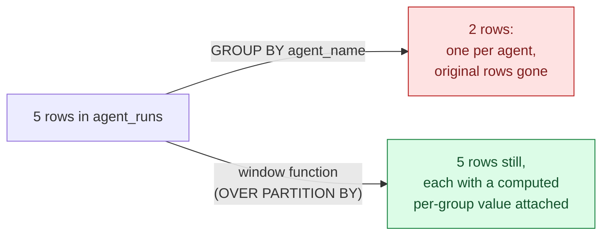

# Window Functions & Analytics — Ranking, Running Totals, and Usage Metrics

> Part 4 of the SQL refresher series. [Note 1](01-sql-refresher.md) covered `GROUP BY`, which collapses rows into one per group. Window functions do the opposite: they compute an aggregate **without collapsing rows** — exactly the shape you need for cost dashboards, per-agent leaderboards, and "how has this changed over time" queries.

## `GROUP BY` vs. Window Functions



If the question is "total tokens per agent" → `GROUP BY`. If the question is "each run's tokens, *and* what rank that run is within its agent's history, and a running total" → you need every original row intact, with extra computed columns. That's what `OVER (...)` gives you.

---

## 1. `ROW_NUMBER`, `RANK`, `DENSE_RANK`

```sql
SELECT
    agent_name,
    id,
    started_at,
    ROW_NUMBER() OVER (PARTITION BY agent_name ORDER BY started_at) AS run_number
FROM agent_runs
ORDER BY agent_name, run_number;
```

`PARTITION BY` splits rows into groups (like `GROUP BY`, but rows aren't collapsed); `ORDER BY` inside `OVER (...)` defines the order the ranking is computed in *within* each partition.

- `ROW_NUMBER()` — 1, 2, 3, 4... always unique, even on ties.
- `RANK()` — ties share a rank, next rank skips (1, 2, 2, 4).
- `DENSE_RANK()` — ties share a rank, next rank doesn't skip (1, 2, 2, 3).

```sql
-- "Most expensive order per customer" -- classic top-N-per-group pattern
SELECT * FROM (
    SELECT o.customer_id, o.id AS order_id,
           sum(oi.quantity * oi.unit_price_cents) AS total_cents,
           RANK() OVER (PARTITION BY o.customer_id ORDER BY sum(oi.quantity * oi.unit_price_cents) DESC) AS rnk
    FROM orders o
    JOIN order_items oi ON oi.order_id = o.id
    GROUP BY o.customer_id, o.id
) ranked
WHERE rnk = 1;
```

---

## 2. Running Totals — `SUM() OVER`

```sql
SELECT
    started_at,
    agent_name,
    (output ->> 'tokens')::int AS tokens,
    SUM((output ->> 'tokens')::int) OVER (
        PARTITION BY agent_name
        ORDER BY started_at
    ) AS running_total_tokens
FROM agent_runs
WHERE output ? 'tokens'
ORDER BY agent_name, started_at;
```

The default frame for `ORDER BY` inside `OVER (...)` is "from the start of the partition up to the current row" — which is exactly what makes `SUM() OVER` a running total instead of a grand total. This is the query behind any "cumulative cost so far this month" dashboard tile.

---

## 3. `LAG` / `LEAD` — Comparing a Row to Its Neighbor

```sql
-- How much longer did each run take than the previous run by the same agent?
SELECT
    agent_name,
    started_at,
    finished_at - started_at AS duration,
    started_at - LAG(started_at) OVER (PARTITION BY agent_name ORDER BY started_at) AS gap_since_prev_run
FROM agent_runs
WHERE finished_at IS NOT NULL
ORDER BY agent_name, started_at;
```

`LAG(col)` looks at the previous row's value (within the partition, in the specified order); `LEAD(col)` looks ahead to the next row. Useful for detecting jumps in latency, spotting a sudden spike in token usage between consecutive calls, or computing session gaps without a self-join.

---

## 4. Percent of Total — `SUM() OVER ()` With No Partition

```sql
SELECT
    p.category,
    sum(oi.quantity * oi.unit_price_cents) AS category_revenue,
    round(
        100.0 * sum(oi.quantity * oi.unit_price_cents) / sum(sum(oi.quantity * oi.unit_price_cents)) OVER (),
        1
    ) AS pct_of_total
FROM order_items oi
JOIN products p ON p.id = oi.product_id
GROUP BY p.category;
```

`OVER ()` with nothing inside means "the whole result set is one partition" — here it computes a grand total alongside each group's `GROUP BY` aggregate, in a single pass, without a self-join or a second query.

---

## Quick Reference Card

| Task | SQL |
| --- | --- |
| Number rows per group | `ROW_NUMBER() OVER (PARTITION BY col ORDER BY col2)` |
| Rank with gaps on ties | `RANK() OVER (...)` |
| Rank without gaps on ties | `DENSE_RANK() OVER (...)` |
| Running total | `SUM(col) OVER (PARTITION BY g ORDER BY t)` |
| Previous row's value | `LAG(col) OVER (PARTITION BY g ORDER BY t)` |
| Next row's value | `LEAD(col) OVER (PARTITION BY g ORDER BY t)` |
| Value as % of grand total | `100.0 * col / SUM(col) OVER ()` |
| Top-N per group | wrap in a subquery/CTE, filter `WHERE rnk <= N` |

---

## What's Next in This Series

1. **[Transactions & Concurrency](05-transactions-and-concurrency.md)** — safely writing agent state under concurrent access.
2. **[Vector Search with pgvector](06-vector-search-pgvector.md)** — the retrieval half of RAG.
