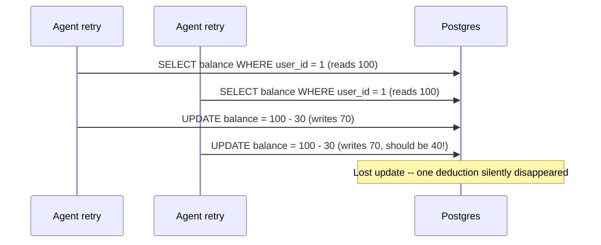

# Transactions & Concurrency — Why Agent Writes Need Locking Too

> Part 5 of the SQL refresher series. Notes 1-4 covered reading data; this note covers **writing** it safely — which matters the moment more than one process touches the database at once. For an agent system that's not a hypothetical: multiple users' agent sessions, a retry after a timeout, and a background worker can all be writing to `agent_runs` or updating shared state at the same moment.

## The Problem: Two Writers, One Row



This is the classic **lost update**: without a transaction and proper locking, two concurrent read-modify-write cycles can clobber each other. Replace "balance" with "an agent's step count," "a rate-limit counter," or "whether this tool call has already run" and the same bug causes double-charging, double-execution, or corrupted agent state — all realistic outcomes of naive retry logic around a DB write.

---

## 1. `BEGIN` / `COMMIT` / `ROLLBACK` — the Basics

```sql
BEGIN;

UPDATE orders SET status = 'shipped' WHERE id = 1;
INSERT INTO agent_runs (agent_name, status, input) VALUES ('shipping-agent', 'success', '{"order_id": 1}');

COMMIT;   -- both writes become visible together, or neither does
```

A transaction groups statements so they succeed or fail **as a unit** (this is the "A" — Atomicity — in ACID). If anything goes wrong mid-transaction, `ROLLBACK` undoes everything since `BEGIN` — there's no partial state where the order shipped but the log entry didn't get written.

```sql
BEGIN;
UPDATE orders SET status = 'shipped' WHERE id = 999;   -- id doesn't exist, 0 rows affected
-- application code notices 0 rows affected and decides to abort
ROLLBACK;
```

---

## 2. ACID, Briefly

| Property | What it guarantees | Why an AI app cares |
| --- | --- | --- |
| **Atomicity** | All-or-nothing per transaction | An agent's "log the tool call + update state" is one unit, never half-applied |
| **Consistency** | Constraints (FKs, `CHECK`) always hold | An `order_items` row can't reference a deleted order |
| **Isolation** | Concurrent transactions don't see each other's half-finished work | Two retries of the same agent step don't race |
| **Durability** | Once committed, survives a crash | A logged agent decision doesn't vanish if Postgres restarts |

---

## 3. Row Locking — `SELECT ... FOR UPDATE`

The lost-update bug above is fixed by making the second reader **wait** instead of reading stale data:

```sql
BEGIN;

SELECT balance FROM accounts WHERE user_id = 1 FOR UPDATE;   -- locks this row until COMMIT/ROLLBACK
-- application computes new_balance = balance - 30
UPDATE accounts SET balance = 30 - 30 WHERE user_id = 1;

COMMIT;   -- lock released here; the second transaction's SELECT ... FOR UPDATE was blocked until now
```

`FOR UPDATE` takes a row-level lock: any other transaction trying to `SELECT ... FOR UPDATE` (or `UPDATE`/`DELETE`) the same row **blocks** until this transaction commits or rolls back. This turns the race in the diagram above into a queue of one-at-a-time updates instead of two writers stomping on each other.

---

## 4. Isolation Levels — How Much Overlap Is Visible

Postgres defaults to `READ COMMITTED`: each statement sees data committed *before that statement started* (not before the transaction started). For most CRUD this is fine. Two levels worth knowing:

```sql
BEGIN ISOLATION LEVEL REPEATABLE READ;   -- this transaction sees one consistent snapshot for its whole duration
...
COMMIT;

BEGIN ISOLATION LEVEL SERIALIZABLE;      -- strictest: behaves as if transactions ran one at a time
...
COMMIT;   -- may fail with a serialization error if a real conflict occurred -- catch this and retry
```

`SERIALIZABLE` is the right default for financial-style logic (rate limiting, balance deduction, "has this idempotency key been used") where correctness matters more than raw throughput — but it requires your application to catch serialization failures and retry the transaction, since Postgres will actively abort one side of a genuine conflict rather than silently corrupt data.

---

## 5. Idempotency Keys — the Pattern Agent Tool Calls Actually Need

Agents retry. A tool call that "charges a card" or "sends an email" must not re-execute just because a network timeout made the agent think it failed. The standard fix is a unique constraint doing the locking for you:

```sql
CREATE TABLE tool_executions (
    idempotency_key TEXT PRIMARY KEY,
    tool_name       TEXT NOT NULL,
    result          JSONB,
    created_at      TIMESTAMPTZ NOT NULL DEFAULT now()
);

-- Before running the real side effect, try to claim the key:
INSERT INTO tool_executions (idempotency_key, tool_name)
VALUES ('run-42-charge-card', 'charge_card')
ON CONFLICT (idempotency_key) DO NOTHING
RETURNING idempotency_key;
-- 1 row back  -> you claimed it, safe to run the side effect
-- 0 rows back -> someone already ran (or is running) it, skip
```

`ON CONFLICT ... DO NOTHING` relies on the `PRIMARY KEY` constraint to make "has this exact operation already been attempted" an atomic, race-free check — no explicit locking required, because uniqueness enforcement *is* the lock.

---

## Quick Reference Card

| Task | SQL |
| --- | --- |
| Start a transaction | `BEGIN;` |
| Commit (make permanent) | `COMMIT;` |
| Undo everything since BEGIN | `ROLLBACK;` |
| Lock a row for update | `SELECT ... FOR UPDATE;` |
| Stricter isolation | `BEGIN ISOLATION LEVEL SERIALIZABLE;` |
| Insert-or-skip (idempotency) | `INSERT ... ON CONFLICT (key) DO NOTHING RETURNING key;` |
| Insert-or-update | `INSERT ... ON CONFLICT (key) DO UPDATE SET col = EXCLUDED.col;` |

---

## What's Next in This Series

1. **[Vector Search with pgvector](06-vector-search-pgvector.md)** — the retrieval half of RAG, in the same transactional database as everything above.
