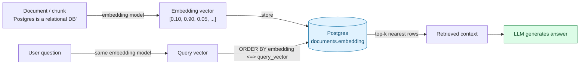

# Vector Search with pgvector — The Retrieval Half of RAG

> Part 6 of the SQL refresher series. Notes 1-5 covered "normal" relational and semi-structured data; this note covers the reason many AI teams reach for Postgres specifically: **`pgvector`**, an extension that stores embeddings and does similarity search inside the same database as your business data. The docker setup in [Note 1](01-sql-refresher.md) already runs `pgvector/pgvector:pg16`, and `docker/init.sql` seeds a `documents` table with a toy `VECTOR(3)` column.

## Where This Fits in a RAG Pipeline



Embeddings turn "meaning" into geometry: two pieces of text with similar meaning end up as vectors that are *close together* in high-dimensional space (typically 384–4096 dimensions from a real embedding model; the seed data here uses toy 3-dim vectors so the numbers stay human-readable while you learn the syntax). "Similarity search" is then just: given a query vector, find the rows whose vectors are nearest to it.

---

## 1. The `VECTOR` Column Type

```sql
CREATE EXTENSION IF NOT EXISTS vector;   -- already run by docker/init.sql

CREATE TABLE documents (
    id        SERIAL PRIMARY KEY,
    title     TEXT NOT NULL,
    content   TEXT NOT NULL,
    metadata  JSONB NOT NULL DEFAULT '{}',
    embedding VECTOR(3)          -- fixed dimension, set once per column
);

INSERT INTO documents (title, content, embedding)
VALUES ('Example', 'Some text', '[0.1, 0.9, 0.05]');
```

The dimension (`VECTOR(3)` here, `VECTOR(1536)` for OpenAI's `text-embedding-3-small`, `VECTOR(1024)` for many open models) must match whatever embedding model produced the vectors — it's fixed per column, not per row.

---

## 2. Distance Operators — `<->`, `<#>`, `<=>`

```sql
-- <->  Euclidean (L2) distance      -- smaller = more similar
-- <#>  negative inner product        -- smaller = more similar (note the sign)
-- <=>  cosine distance               -- smaller = more similar, 0 = identical direction

SELECT title, embedding <=> '[0.8, 0.15, 0.25]' AS distance
FROM documents
ORDER BY distance
LIMIT 3;
```

**Cosine distance (`<=>`) is the standard default** for text embeddings — most embedding models are trained so that *direction* (not magnitude) carries the meaning, which is exactly what cosine similarity measures. Use `<->` if your embedding model's docs specifically call for Euclidean distance (some do, e.g. certain image-embedding models).

```sql
-- The actual "top-k nearest neighbor" query -- this is a RAG retrieval step
SELECT id, title, content
FROM documents
ORDER BY embedding <=> '[0.80, 0.15, 0.30]'   -- query vector, would come from your embedding model
LIMIT 3;
```

---

## 3. Indexing Vectors — Why Exact Search Doesn't Scale

Without an index, a nearest-neighbor query compares the query vector against **every row** — exact, but O(n), and unusable past a few hundred thousand rows. `pgvector` offers two approximate index types that trade a small amount of recall for a large speedup:

```sql
-- HNSW: better query speed and recall, more expensive to build -- the modern default
CREATE INDEX idx_documents_embedding_hnsw
    ON documents USING hnsw (embedding vector_cosine_ops);

-- IVFFlat: faster/cheaper to build, needs a "lists" tuning parameter, needs table data to exist first
CREATE INDEX idx_documents_embedding_ivfflat
    ON documents USING ivfflat (embedding vector_cosine_ops) WITH (lists = 100);
```

Both are **approximate nearest neighbor (ANN)** indexes — occasionally the true 5th-nearest row is missed in favor of the 6th-nearest, in exchange for orders-of-magnitude faster queries at scale. `vector_cosine_ops` must match the operator you actually query with (`<=>`) — there are parallel `vector_l2_ops`/`vector_ip_ops` operator classes for `<->`/`<#>`. For a table this small (four seed rows), Postgres will just sequentially scan regardless of which index exists — same "the planner ignores small tables" behavior as [Note 2](02-indexing-and-query-performance.md).

---

## 4. Hybrid Search — Combining Vector Similarity With Filters

Real RAG retrieval is rarely *pure* similarity search — you usually also want to filter by metadata, tying together everything from [Note 3](03-json-jsonb-for-ai-apps.md):

```sql
-- "Find the most relevant AI-tagged documents from the blog, published recently"
SELECT title, content
FROM documents
WHERE metadata @> '{"tags": ["ai"]}'
  AND metadata ->> 'source' = 'blog'
ORDER BY embedding <=> '[0.80, 0.15, 0.30]'
LIMIT 5;
```

This single query does semantic search *and* structured filtering, in one round trip, on one consistent snapshot of data — no separate call to a vector DB followed by a second call to a metadata store to intersect result sets. That consistency and simplicity is the core argument for `pgvector` over a standalone vector database when your data already lives in Postgres.

---

## 5. Keeping Embeddings Fresh

Embeddings go stale the moment the source content changes (a doc gets edited) or you switch embedding models (dimensions may even change, requiring a new column). There's no SQL magic here — the common pattern is a `content_hash` or `updated_at` column on `documents`, checked by an application job that re-embeds and `UPDATE`s only rows whose source content changed since the last embedding run.

---

## Quick Reference Card

| Task | SQL |
| --- | --- |
| Enable pgvector | `CREATE EXTENSION IF NOT EXISTS vector;` |
| Vector column | `embedding VECTOR(1536)` |
| Cosine distance (standard for text) | `embedding <=> '[...]'` |
| Euclidean distance | `embedding <-> '[...]'` |
| Top-k nearest neighbors | `ORDER BY embedding <=> query LIMIT k` |
| Fast approximate index (recommended) | `CREATE INDEX ... USING hnsw (embedding vector_cosine_ops);` |
| Hybrid search (filter + similarity) | `WHERE metadata @> '{...}' ORDER BY embedding <=> query` |

---

## Series Recap

1. [SQL Refresher — Core Queries](01-sql-refresher.md)
2. [Indexing & Query Performance](02-indexing-and-query-performance.md)
3. [JSONB for AI Apps](03-json-jsonb-for-ai-apps.md)
4. [Window Functions & Analytics](04-window-functions-and-analytics.md)
5. [Transactions & Concurrency](05-transactions-and-concurrency.md)
6. **Vector Search with pgvector** — you are here.
