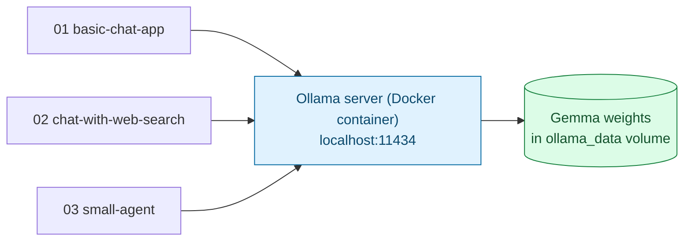

# Local Model Setup — Ollama + Gemma in Docker

Shared infrastructure for all three apps in this series ([01](../01-basic-chat-app/), [02](../02-chat-with-web-search/), [03](../03-small-agent/)). Every app is a plain Python script that talks over HTTP to whatever's running here — none of them call a hosted API or need an API key, per [Note 3 §5](../../notes/03-techs-and-tools.md#5-embeddings--local-models) (`ollama`: run open models locally, no API key/cost while iterating).

## 1. What's Running Here

[Ollama](https://ollama.com) is a small server that downloads open-weight models and serves them over a local HTTP API (`/api/chat`, `/api/generate`, ...). `docker-compose.yml` runs that server in a container so nothing gets installed on your machine directly, and a named volume (`ollama_data`) keeps downloaded model weights across restarts.



## 2. Start the Server

```bash
cd week-02/agentic-ai/code/00-local-model-setup
docker compose up -d
```

Check it's up:

```bash
curl http://localhost:11434
# "Ollama is running"
```

## 3. Pull a Gemma Model

```bash
docker compose exec ollama ollama pull gemma3:4b
```

| Tag | Size (download) | When to use |
| --- | --- | --- |
| `gemma3:1b` | ~0.8 GB | Slow machine / low RAM, quick smoke-testing |
| `gemma3:4b` | ~3.3 GB | **Default for this series** — a good reasoning/speed balance for a laptop |
| `gemma3:12b` | ~8 GB | If you have 16GB+ RAM/VRAM to spare and want noticeably better tool-use reliability |

All three apps read the tag from the `OLLAMA_MODEL` environment variable (default `gemma3:4b`), so switching models doesn't require touching any code:

```bash
export OLLAMA_MODEL=gemma3:1b
```

Sanity-check the model directly before running any app:

```bash
docker compose exec ollama ollama run gemma3:4b "Say hi in five words."
```

## 4. Point the Apps at It

Each app defaults to `OLLAMA_HOST=http://localhost:11434`, which is correct as long as the container's port mapping (`11434:11434`) is intact. Override it only if you're running Ollama somewhere else:

```bash
export OLLAMA_HOST=http://localhost:11434
```

## Gotchas

| Symptom | Likely cause | Fix |
| --- | --- | --- |
| `curl: (7) Failed to connect` | Container not running | `docker compose up -d`, then `docker compose ps` |
| App errors with "model not found" | Model tag was never pulled | `docker compose exec ollama ollama pull <tag>` |
| First reply is very slow | Model is loading into memory for the first time after a restart | Normal — subsequent replies are faster while the container stays up |
| Container OOM-killed / machine grinds to a halt | Model too large for available RAM | Switch to a smaller tag (`gemma3:1b`) via `OLLAMA_MODEL` |
| Port 11434 already in use | Another Ollama instance (e.g. installed natively) is already bound to it | Stop the other instance, or change the host port in `docker-compose.yml` |

## What's Next

1. **[01 — Basic Chat App](../01-basic-chat-app/README.md)** — a plain LLM app: one call in, one reply out, no tools.
2. **[02 — Chat With Web Search](../02-chat-with-web-search/README.md)** — the model decides whether to call one tool.
3. **[03 — Small Agent](../03-small-agent/README.md)** — a full multi-step, multi-tool ReAct loop with guardrails.
