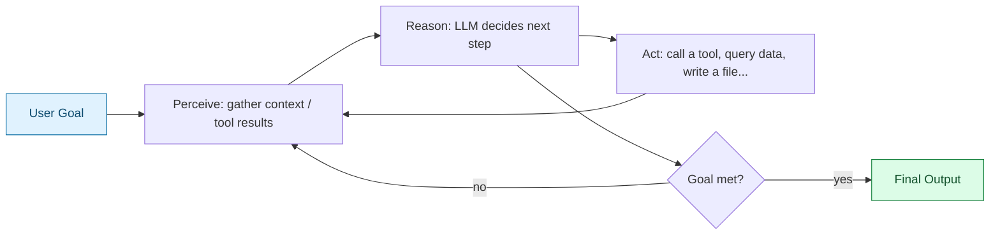
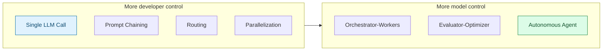
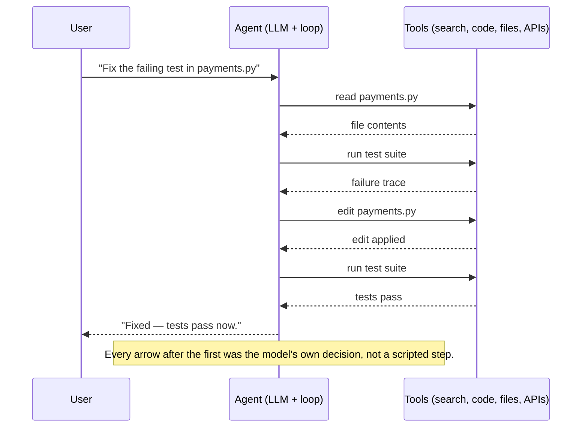

# Agentic AI — What Is an Agent?

> Part 1 of the Agentic AI series (Week 2). This series builds on the Week 1 refreshers — in particular the `Agent` class sketch from [Python for AI, Note 1 §5](../../python-refresher/notes/01-python-for-ai.md#5-object-oriented-programming-oop), which already hinted at `tools`, `memory`, and a `run()` loop. This note answers three questions: what is an agent, what is an "agentic workflow," and how do you tell an agent apart from a chatbot.

## 1. The Core Shift: From "Answer" to "Act"

A plain LLM call is a **function**: text in, text out. Nothing changes in the world as a result.

An **agent** wraps that same LLM in a loop that can **observe**, **decide**, and **act** — where "act" means calling tools, reading/writing state, and using the results to decide what to do next, repeatedly, until the goal is met (not just once).



This **perceive → reason → act → repeat** cycle is the defining shape of an agent. Everything else (memory, planning, multi-agent orchestration) is built on top of this loop.

## 2. What Is an Agent?

> **Agent** — a system where an LLM decides its own steps (which tools to call, in what order, with what inputs) to accomplish a goal, using the output of each step to inform the next, and stopping on its own judgment rather than a fixed script.

The three ingredients that must all be present:

| Ingredient | Without it, it's just... |
| --- | --- |
| **A model that can decide** (not a human/code deciding for it) | A regular script calling an LLM once |
| **Tools it can call** (search, code exec, APIs, DB reads/writes) | A chatbot — can talk, can't act |
| **A loop with state/memory across steps** | A single function call — no iteration |

```python
class Agent:
    def __init__(self, model, tools: list, goal: str):
        self.model = model
        self.tools = {t.name: t for t in tools}
        self.goal = goal
        self.history = []

    def run(self, max_steps: int = 10) -> str:
        for _ in range(max_steps):
            decision = self.model.decide_next_step(self.goal, self.history)
            if decision.is_final_answer:
                return decision.content

            tool_result = self.tools[decision.tool_name].execute(decision.tool_args)
            self.history.append({"step": decision, "result": tool_result})

        return "Stopped: max steps reached without resolving the goal."
```

Note what's absent: there's no fixed sequence of steps written by a human. `decide_next_step` is the LLM choosing, at runtime, what happens next — that's the entire difference from a hardcoded pipeline.

## 3. Agentic Workflows

"Agentic workflow" and "agent" get used interchangeably, but they sit on a spectrum of **how much control is handed to the LLM** vs. **how much is fixed by the developer**:



| Pattern | Shape | Example |
| --- | --- | --- |
| **Prompt chaining** | Step 1's output feeds fixed Step 2, feeds fixed Step 3 | Draft → critique → revise, in that order, always |
| **Routing** | LLM classifies input, then a fixed handler runs | "Is this a refund or a bug report?" → route to the matching handler |
| **Parallelization** | Same task run N times / N ways, then aggregated | 3 models vote on one answer; or split a task into independent subtasks run at once |
| **Orchestrator-workers** | A lead LLM breaks a goal into subtasks and dispatches them to worker LLMs | "Refactor this repo" → orchestrator assigns one file per worker |
| **Evaluator-optimizer** | One LLM produces, another critiques, loop until it passes | Generate code → evaluator runs tests/critiques → regenerate |
| **Autonomous agent** | No fixed graph at all — the LLM picks its own tool sequence and stopping point | A coding agent that reads files, edits, runs tests, and decides when it's done |

**The distinguishing question for "is this agentic?"**: *does the LLM decide the control flow, or does code decide it?* Prompt chaining and routing are *workflows* using LLMs at fixed points. Orchestrator-workers and autonomous agents are *agentic* because the model itself chooses what happens next.

## 4. Chatbot vs. Agent

This is the distinction people flatten most often, so it's worth being precise:

| | Chatbot | Agent |
| --- | --- | --- |
| **Primary output** | A conversational reply | A completed task / side effect in the world |
| **Turn-taking** | One exchange per turn, waits for human | Can take many internal steps per single user turn |
| **Tools** | Optional, usually none or one-shot (e.g., a single retrieval call) | Core to the design — search, code exec, file I/O, APIs |
| **Control flow** | Fixed: user asks → model answers | Dynamic: model decides how many steps, which tools, in what order |
| **State across steps** | Conversation history only | Conversation history **+** intermediate tool results **+** a working plan |
| **Stopping condition** | Turn ends when the model finishes generating text | Model itself judges "is the goal accomplished?" |
| **Failure mode** | A wrong or unhelpful reply | A wrong *action* — a bad file edit, a bad API call, a wasted tool-call loop |

> **Gotcha:** a chatbot with a retrieval tool bolted on (classic RAG-for-chat) is *not* automatically an agent — if the model always calls the same retrieval step in the same place, that's routing/prompt chaining, not agentic control flow. The test isn't "does it use a tool," it's "does the model decide *whether*, *when*, and *how* to use it."

## 5. Putting It Together



## Quick Reference Card

| Task | Definition |
| --- | --- |
| Agent | Model decides its own tool-use steps toward a goal, in a loop, until it judges the goal met |
| Agentic workflow | Any multi-step LLM system; only "agentic" in the strict sense once the *model* controls the flow |
| Prompt chaining / routing | Fixed control flow, LLM used at specific points — not agentic on its own |
| Orchestrator-workers / autonomous agent | Model controls the flow — the agentic end of the spectrum |
| Chatbot | One-turn-in, one-reply-out; no autonomous multi-step tool use |
| Agent vs. chatbot test | "Does the model decide *whether/when/how* to act, or does code decide for it?" |

## What's Next in This Series

1. **Tool / Function Calling** — how an LLM actually expresses "call this tool with these arguments," and how the runtime executes it.
2. **Memory & State in Agents** — short-term (conversation) vs. long-term (persisted) memory, and why unbounded history breaks agents.
3. **Planning Strategies** — ReAct, plan-and-execute, reflection loops.
4. **Multi-Agent Orchestration** — orchestrator-worker patterns, when to split one agent into many.
5. **Guardrails & Stopping Conditions** — max-step limits, human-in-the-loop checkpoints, why autonomous loops need a leash.

> Each file will build on this one — treat this note as the map, not the territory.
