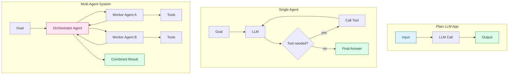
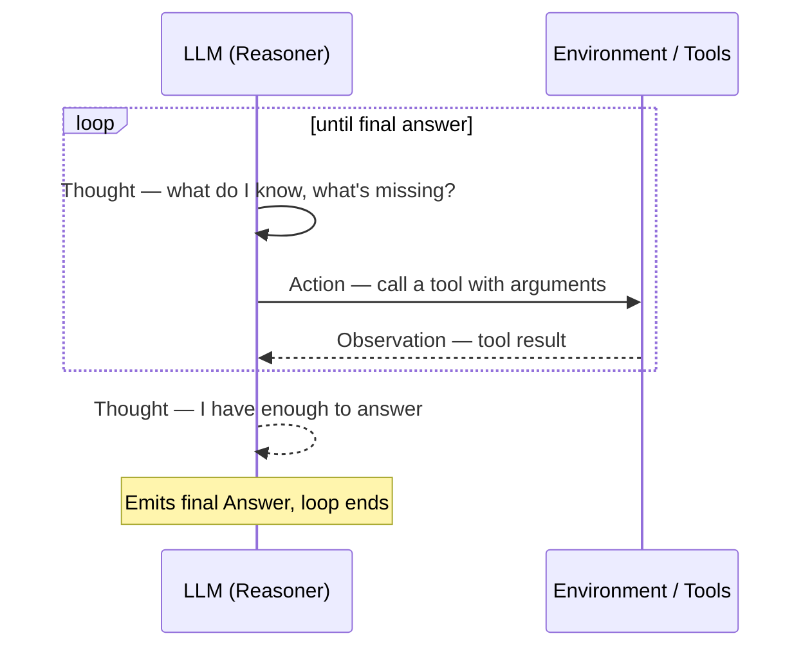
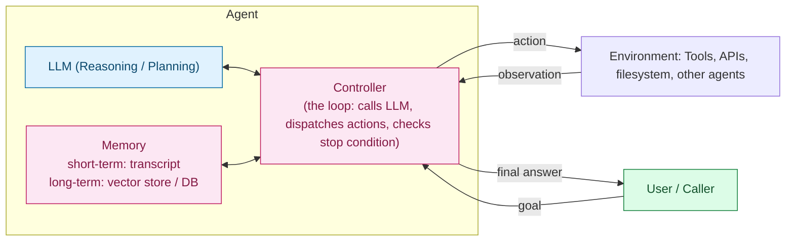

# Agentic AI — Agent vs. Plain LLM App vs. Multi-Agent System, and the ReAct Loop

> Part 2 of the Agentic AI series. [Note 1](01-intro.md) defined what makes something an "agent" and laid out the workflow spectrum (fixed control flow vs. model-controlled control flow). This note gets concrete: three system shapes you'll actually choose between when designing a system, the **ReAct** reasoning pattern that powers most single-agent loops, and a basic reference architecture you can reuse as a template.

## 1. Three System Shapes

Every LLM-powered system you'll build falls into roughly one of three shapes. The differences aren't cosmetic — they change what can go wrong and how you debug it.



| | Plain LLM App | Single Agent | Multi-Agent System |
| --- | --- | --- | --- |
| **Control flow** | One call, no loop | Model-controlled loop (ReAct-style) | An orchestrator's loop delegates to other agents' loops |
| **Tools** | None, or one fixed call | Several, chosen dynamically | Each sub-agent has its own tool set/specialty |
| **State** | Stateless (or just chat history) | Working memory across steps | Shared/coordinated state across agents |
| **Failure surface** | Bad single response | Bad step in a loop (wrong tool, bad args, infinite loop) | Miscommunication between agents, orchestrator misrouting, compounding errors |
| **When to use** | Classification, extraction, summarization, single-shot generation | Task needs multiple dependent steps decided at runtime | Task naturally splits into independent specialties (research + writing + coding) or needs parallel throughput |
| **Example** | "Summarize this email" | "Find and fix the failing test" | "Research this topic, write a report, and generate the slides" |

**The escalation rule of thumb:** don't reach for a multi-agent system just because "agents" sound more capable. Each additional agent is another place for context to get lost or instructions to be misinterpreted. Escalate only when a single agent's context window, tool set, or reasoning focus is genuinely being overloaded by trying to do everything itself.

## 2. The ReAct Loop (Reason + Act)

**ReAct** (Reason + Act) is the pattern behind almost every single-agent implementation you'll encounter (LangChain agents, OpenAI/Anthropic tool-use loops, coding agents). Instead of the model silently deciding what to do, it's prompted to **narrate its reasoning** before each action:

```text
Thought: I need to know the current weather in Tokyo before I can answer.
Action: get_weather(city="Tokyo")
Observation: 18°C, light rain
Thought: I have what I need to answer the user.
Answer: It's 18°C and rainy in Tokyo right now.
```

This `Thought → Action → Observation` cycle repeats until the model emits a final answer instead of another action.



**Why narrate the reasoning instead of just acting?** Making the model state its `Thought` before each `Action` measurably improves tool-choice accuracy and gives you a debuggable trace — when the agent does something wrong, the `Thought` line usually tells you *why*, instead of leaving you to guess from the action alone.

A minimal ReAct loop, structurally:

```python
from dataclasses import dataclass, field

@dataclass
class Step:
    thought: str
    action: str | None = None       # None on the final step
    action_input: dict = field(default_factory=dict)
    observation: str | None = None

def react_loop(llm, tools: dict, goal: str, max_steps: int = 6) -> str:
    transcript: list[Step] = []

    for _ in range(max_steps):
        # The LLM sees the goal + full transcript so far, and produces the next step
        step = llm.next_step(goal=goal, transcript=transcript, available_tools=tools.keys())

        if step.action is None:
            return step.thought  # model signaled it's ready to answer

        step.observation = tools[step.action].execute(**step.action_input)
        transcript.append(step)

    return "Stopped: exceeded max_steps without reaching a final answer."
```

> **Gotcha:** `max_steps` is not optional decoration — a ReAct loop with no step cap can spin forever if the model keeps re-trying a failing tool call (e.g., malformed arguments it never corrects). Always cap steps, and log the transcript so a stuck loop is diagnosable, not just truncated.

## 3. Basic Agent Architecture

Strip away framework-specific naming (LangChain, CrewAI, custom) and every single agent is built from the same five parts:



| Component | Role | Concrete example |
| --- | --- | --- |
| **LLM (brain)** | Turns (goal + memory + observations) into the next thought/action | Claude/GPT call with a system prompt describing available tools |
| **Memory — short-term** | The running transcript for this task | The `transcript: list[Step]` from the ReAct loop above |
| **Memory — long-term** | Persists across tasks/sessions | Vector DB for retrieved facts, a file of past resolutions |
| **Controller (the loop)** | Orchestrates: call LLM → dispatch action → check stop condition → repeat | The `react_loop` function itself |
| **Environment** | Everything the agent can act on | Tools/functions, file system, web APIs, other agents |

This is deliberately the same shape as the `Agent` class sketched in [Python for AI, Note 1 §5](../../python-refresher/notes/01-python-for-ai.md#5-object-oriented-programming-oop) — `tools` is the Environment, `memory` is short-term Memory, and `run()` is the Controller. Everything you'll see in Week 2 is an elaboration of that same skeleton.

## Quick Reference Card

| Task | Definition |
| --- | --- |
| Plain LLM app | One-shot call, no loop, no dynamic tool choice |
| Single agent | Model-controlled ReAct-style loop over one tool set |
| Multi-agent system | An orchestrator's loop delegates to other agents, each running their own loop |
| ReAct | `Thought → Action → Observation`, repeated until the model emits a final answer instead of an action |
| Controller | The code that runs the loop: call LLM → dispatch action → check stop condition |
| Escalation rule | Add agents only when one agent's context/tools/focus is genuinely overloaded — not by default |

## What's Next in This Series

1. **Tool / Function Calling** — how the LLM expresses "call this tool with these arguments" in a way the controller can parse and execute safely.
2. **Memory & State in Agents** — short-term vs. long-term memory in more depth, and why unbounded transcripts break agents.
3. **Planning Strategies Beyond ReAct** — plan-and-execute, reflection/self-critique loops.
4. **Multi-Agent Orchestration** — patterns for splitting one agent into many, and how orchestrators avoid compounding errors.
5. **Guardrails & Stopping Conditions** — step limits, human-in-the-loop checkpoints, why autonomous loops need a leash.

> Each file builds on the last — treat [Note 1](01-intro.md) as the map and this note as the first zoom-in.
