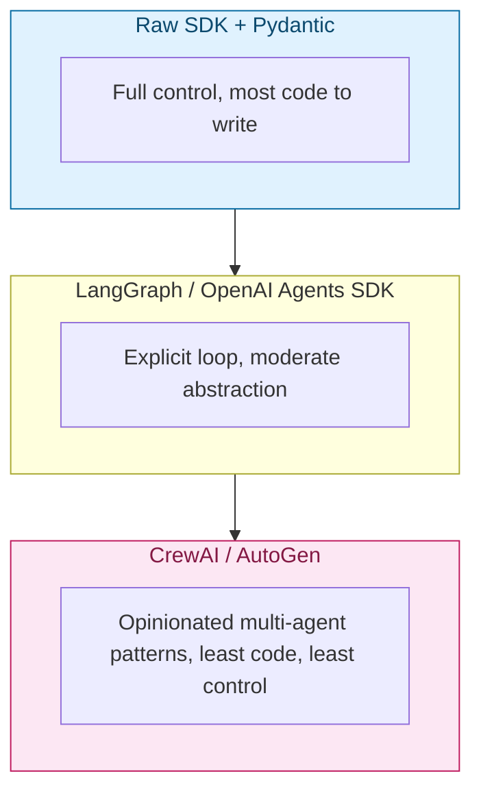
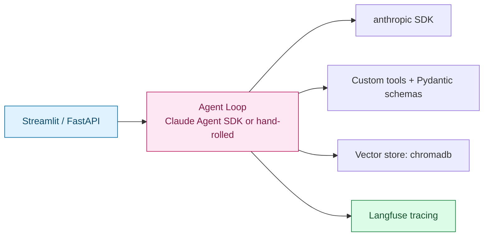

# Python Tools & Libraries for AI, Gen AI & Agent Development

> A reference doc (not a numbered note in the series) mapping the Python ecosystem onto the concepts from [Note 1](notes/01-intro.md) and [Note 2](notes/02-agent-vs-multiagent-react.md) — which library you reach for depends on which piece of the agent architecture (LLM call, tool calling, memory, orchestration) you're building. Install everything with `uv add <package>`, per the repo's [tooling convention](../../CLAUDE.md).

## 1. LLM Provider SDKs — Talking to a Model

The foundation layer: sending a prompt (or a message history + tool schema) to a model and getting a response back.

| Library | Features | Use case |
| --- | --- | --- |
| `anthropic` | Messages API, native tool use, streaming, prompt caching, extended thinking | Calling Claude directly — the SDK this curriculum leans on |
| `openai` | Chat Completions + Responses API, function calling, structured outputs (JSON schema), Assistants API | Calling GPT models; still the most-copied API shape industry-wide |
| `google-generativeai` / `google-genai` | Gemini API, multimodal input, function calling | Calling Gemini models |
| `litellm` | One interface over 100+ providers (OpenAI-compatible calls to Anthropic, Gemini, Bedrock, local models...) | Swapping providers without rewriting call sites; useful when comparing models |

```python
import anthropic

client = anthropic.Anthropic()
response = client.messages.create(
    model="claude-sonnet-5",
    max_tokens=1024,
    messages=[{"role": "user", "content": "Explain ReAct in one sentence."}],
)
print(response.content[0].text)
```

## 2. Structured Output & Validation

An agent's tool calls and an LLM's "structured" responses are only useful if they're actually parseable — this layer turns free text into typed data your code can trust.

| Library | Features | Use case |
| --- | --- | --- |
| `pydantic` | Typed models, runtime validation, JSON schema generation | Defining tool argument schemas and validating LLM-produced JSON before you act on it |
| `instructor` | Wraps OpenAI/Anthropic/etc. clients to return validated Pydantic objects directly, with automatic retry on validation failure | Skipping manual `json.loads` + validation boilerplate for structured extraction |

```python
from pydantic import BaseModel

class ToolCall(BaseModel):
    tool_name: str
    arguments: dict[str, str]

# response.tool_calls[0] validated + typed instead of raw dict from the API
parsed = ToolCall.model_validate(raw_tool_call)
```

> **Gotcha:** don't skip validation because "the model usually gets the JSON right." Malformed tool arguments are one of the most common agent failure modes — validate every tool call before executing it, the same way you'd validate any external input.

## 3. Agent & Orchestration Frameworks

These implement the **Controller** from [Note 2 §3](notes/02-agent-vs-multiagent-react.md#3-basic-agent-architecture) for you — the ReAct-style loop, tool dispatch, and (for multi-agent frameworks) delegation between agents.

| Library | Features | Use case |
| --- | --- | --- |
| **Claude Agent SDK** | First-party agent loop for Claude — tool use, subagents, permissioning, hooks (this is what Claude Code itself is built on) | Building a Claude-native agent without reimplementing the loop |
| **LangChain / LangGraph** | LangChain: chains, tool abstractions, huge integration ecosystem. LangGraph: explicit graph-based control flow for agents (nodes = steps, edges = transitions), better suited to agentic loops than classic LangChain chains | Complex, stateful agent workflows where you want to see/control the graph explicitly |
| **LlamaIndex** | Data connectors, indexing, retrieval-first agent abstractions | Agents whose core job is "answer questions over my documents" (heavier RAG focus) |
| **CrewAI** | Role-based multi-agent framework — define agents with roles/goals, they collaborate on a shared task | Quickly prototyping a multi-agent "team" (researcher + writer + reviewer) |
| **AutoGen (Microsoft)** | Conversable multi-agent framework, agents "talk" to each other in a shared chat loop | Multi-agent systems modeled as a group conversation rather than a strict orchestrator/worker hierarchy |
| **OpenAI Agents SDK** | Lightweight agent loop + handoffs between agents, tracing built in | Building agents on OpenAI models with minimal abstraction overhead |



> **Gotcha:** more abstraction isn't automatically better. Framework-heavy agents are harder to debug when a step misbehaves, because the ReAct loop is hidden inside the library. Many production teams start with the raw SDK + Pydantic (full visibility into the loop) and only adopt a framework once the orchestration complexity genuinely outgrows hand-rolled code.

## 4. RAG & Vector Stores

Covered in depth in Weeks 3–5, but these are the libraries that will show up:

| Library | Features | Use case |
| --- | --- | --- |
| `chromadb` | Embedded, file-based vector store, zero infra to stand up | Local prototyping, small-to-medium RAG projects |
| `faiss` (Meta) | In-memory similarity search, extremely fast, no server | Research-style RAG experiments, in-process vector search |
| `qdrant-client` / Qdrant | Server-based vector DB, filtering, hybrid search | Production RAG needing metadata filters and scale |
| Pinecone / Weaviate (hosted) | Managed vector DB, scales without ops | Production RAG without managing your own vector infra |

## 5. Embeddings & Local Models

| Library | Features | Use case |
| --- | --- | --- |
| `sentence-transformers` | Local embedding models, no API calls | Free/offline embeddings, cheaper at scale than API embeddings |
| `transformers` (Hugging Face) | Load and run open models locally (text, embeddings, classification) | Running open-weight models yourself instead of calling a hosted API |
| `ollama` | Run open models locally via a simple CLI/API (Llama, Mistral, etc.) | Fully local dev loop, no API key/cost while iterating |

## 6. Observability, Tracing & Evaluation

Relevant now for debugging agent loops, and central to Week 6 (Evaluating an AI Agent):

| Library | Features | Use case |
| --- | --- | --- |
| **LangSmith** | Trace every LLM call/tool call in an agent run, dataset-based evals | Debugging *why* an agent loop went wrong, step by step |
| **Langfuse** | Open-source tracing + eval, self-hostable | Same as LangSmith, when you want it self-hosted/open-source |
| **Ragas** | RAG-specific metrics (faithfulness, answer relevance, context precision) | Scoring a RAG pipeline's retrieval + generation quality |
| **DeepEval** | Unit-test-style framework for LLM outputs (pytest-like) | Writing evals as part of a normal test suite |

## 7. Serving & UI Layers

For turning an agent into something a user can actually interact with:

| Library | Features | Use case |
| --- | --- | --- |
| `streamlit` | Fast Python-only web UI, no frontend code | Quick internal demo UI for an agent/chatbot |
| `gradio` | Similar to Streamlit, popular for ML/model demos, easy sharing links | Demoing a model or agent with minimal setup |
| `fastapi` | Async Python web framework, typed request/response models (pairs naturally with Pydantic) | Exposing an agent as a real HTTP API/backend service |

## A Minimal Stack, End to End



This is a reasonable default for a single learner-built agent: raw `anthropic` SDK + `pydantic` for tool schemas (full visibility into the loop, per the gotcha in §3), `chromadb` for any retrieval, `streamlit` for a UI, and tracing added once the loop is complex enough to need debugging.

## Quick Reference Card

| Need | Reach for |
| --- | --- |
| Call an LLM directly | `anthropic`, `openai`, `google-genai` |
| Validate tool arguments / structured output | `pydantic`, `instructor` |
| Hand-roll an agent loop with full visibility | raw SDK + `pydantic` (see [Note 2 §2](notes/02-agent-vs-multiagent-react.md#2-the-react-loop-reason--act)) |
| Explicit graph-based agent control flow | LangGraph |
| Quick multi-agent prototype | CrewAI, AutoGen |
| RAG over local documents | LlamaIndex, `chromadb`/`faiss` |
| Run models without an API key | `ollama`, `sentence-transformers` |
| Debug an agent's step-by-step trace | LangSmith, Langfuse |
| Score RAG/agent output quality | Ragas, DeepEval |
| Ship a quick UI | `streamlit`, `gradio` |
| Ship a real API | `fastapi` |

## What's Next

This doc will grow as later weeks introduce their own tools — RAG-specific libraries get their deep dive in Week 3–4, evaluation tooling in Week 6. Treat this page as a living index, not a numbered note in the reading sequence.
