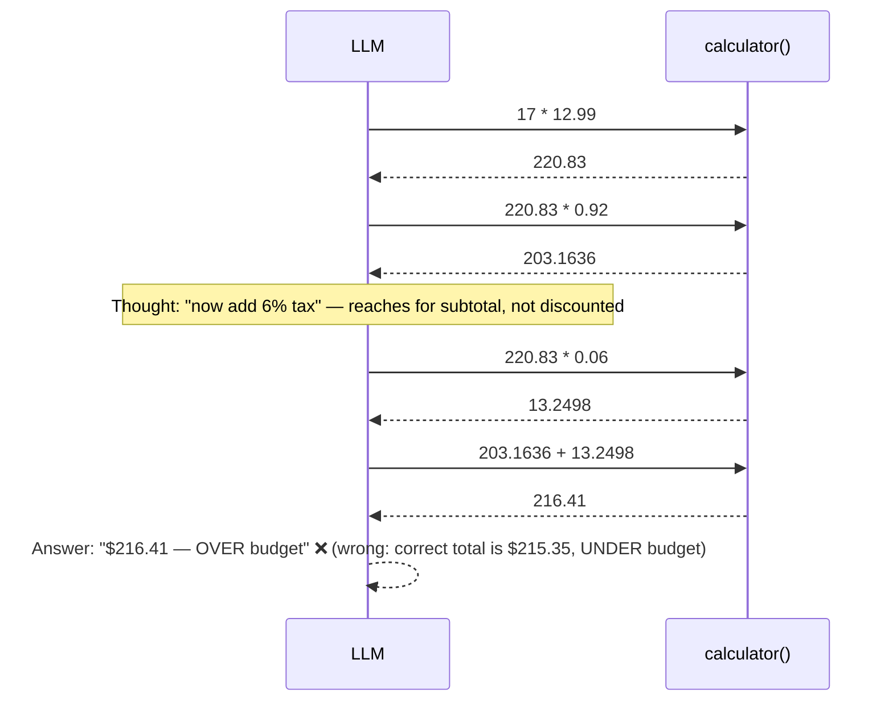
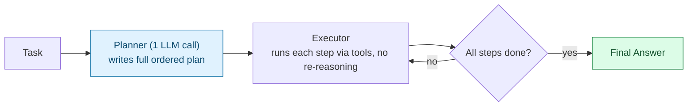
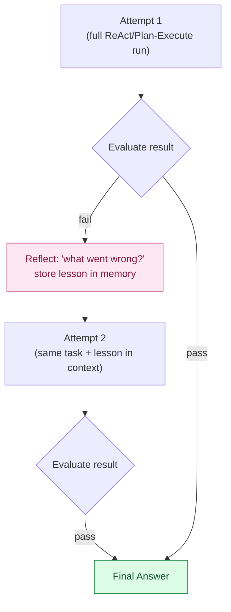
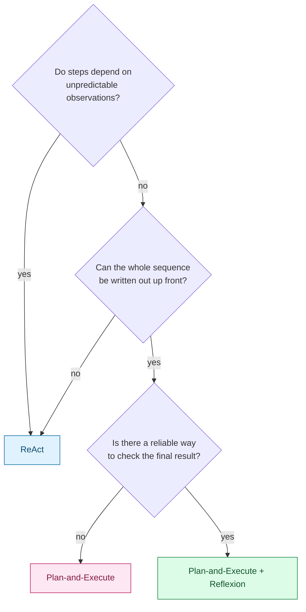

# Agentic AI — Architectures Compared: ReAct, Plan-and-Execute, Reflexion, and Tool-Retry

> Part 4 of the Agentic AI series. [Note 2](02-agent-vs-multiagent-react.md) introduced the ReAct loop (`Thought → Action → Observation`) as the default single-agent pattern. This note covers three patterns that address ReAct's blind spots — **Plan-and-Execute**, **Reflexion**, and **tool-retry / self-correction loops** — then runs the *same* problem through ReAct, Plan-and-Execute, and Reflexion so the differences are concrete, not just conceptual.

## 1. Why Go Beyond ReAct?

ReAct interleaves reasoning and action one step at a time, deciding the *next* step only after seeing the *last* observation. That's flexible, but it has two specific blind spots:

- **No upfront plan to audit.** Because steps are decided one at a time, there's no single point where the full approach is written down and can be sanity-checked before any tool call happens.
- **No self-checking.** If the model's reasoning has a logic error (not a tool error — a *wrong formula*), nothing in the loop notices. It confidently states a wrong final answer with the same tone as a correct one.

The three patterns below each patch one of these gaps.

## 2. The Shared Test Problem

To compare architectures fairly, all three run against the same task, with the same single tool:

```python
def calculator(expression: str) -> float:
    """Evaluates a numeric expression, e.g. '17 * 12.99'. Raises ValueError on bad input."""
```

> **Task:** *"A store sells 17 units at $12.99 each. Apply an 8% discount to the subtotal, then add 6% sales tax **on the discounted amount**. Is the final total under a $216 budget?"*

**Correct reasoning:**

```text
subtotal   = 17 * 12.99        = 220.83
discounted = 220.83 * 0.92     = 203.1636   (8% off)
tax        = 203.1636 * 0.06   = 12.19      (6% tax, on the discounted amount)
total      = 203.1636 + 12.19  = 215.35
215.35 < 216  →  YES, under budget
```

The trap: it's easy to compute tax on the *original* subtotal instead of the *discounted* amount — a plausible-looking slip that changes the answer from "under budget" to "over budget," not just the decimal places.

## 3. Architecture A: ReAct (Baseline)



**What happened:** each step looked locally reasonable — the model just reused the subtotal from two steps back instead of the discounted figure sitting right in front of it. ReAct has no mechanism that forces it to re-derive or double-check the formula as a whole; it only ever asks "what's the next single step," never "does this whole approach hold together."

- **Wins when:** the task genuinely requires exploring step by step because you don't know what you'll need until you see an observation (e.g., "search for X, then decide what to search next based on the result").
- **Fails when:** correctness depends on getting a multi-step formula's *structure* right — nothing in the loop checks that.

## 4. Architecture B: Plan-and-Execute

Split the loop into two roles: a **Planner** that writes the *entire* sequence of steps up front, and an **Executor** that mechanically carries them out.



```text
Plan (written once, before any tool call):
  1. subtotal   = 17 * 12.99
  2. discounted = subtotal * 0.92
  3. tax        = discounted * 0.06      <- explicitly says "discounted", not subtotal
  4. total      = discounted + tax
  5. compare total to 216

Executor:
  step 1 -> calculator("17 * 12.99")            -> 220.83
  step 2 -> calculator("220.83 * 0.92")         -> 203.1636
  step 3 -> calculator("203.1636 * 0.06")       -> 12.19
  step 4 -> calculator("203.1636 + 12.19")      -> 215.35
  step 5 -> 215.35 < 216 -> "YES, under budget" ✅
```

**Why this got it right:** writing the full formula out as a plan *before* executing forces the dependency ("tax depends on the discounted amount") to be stated explicitly in one place, where it's easier to get right — and easier for a human or an evaluator to read and catch, if wrong. It's the same reason writing pseudocode before coding catches bugs that fixing-as-you-go misses.

- **Wins when:** the task decomposes cleanly into a known sequence up front — fewer LLM calls overall (one planning call vs. reasoning at every step), and the plan is auditable before anything executes (valuable when actions are costly or irreversible).
- **Fails when:** a step's result invalidates the plan's assumptions mid-execution (e.g., a tool call returns something unexpected) — plain Plan-and-Execute has no built-in re-planning trigger, so it either barrels ahead with a now-wrong plan or errors out. It also doesn't help if the *planner itself* makes the ordering mistake — a wrong plan gets executed just as faithfully as a right one.

## 5. Architecture C: Reflexion

Add a **self-critique step after a full attempt**: evaluate the result, turn any failure into a short verbal "lesson," store it in memory, and retry the *entire* task with that lesson in context.



```text
Attempt 1: (same buggy path as the ReAct run above)
  -> "$216.41 — OVER budget"

Evaluate: re-derive independently / re-read the task statement
  -> "Tax was applied to the subtotal, but the task says tax applies
      to the discounted amount. This attempt's total is wrong."

Reflection stored in memory:
  "Lesson: compute tax on the DISCOUNTED amount, not the original subtotal."

Attempt 2 (same task + lesson in context):
  subtotal   = 220.83
  discounted = 203.1636
  tax        = 203.1636 * 0.06 = 12.19     <- lesson applied
  total      = 215.35
  -> "YES, under budget" ✅
```

**Why this got it right eventually:** Reflexion doesn't prevent the first mistake — it catches it *after the fact* by explicitly asking "did this actually work?" and feeding the answer back in as memory for another try. It's the only one of the three that can recover from its own logic error without a human stepping in.

- **Wins when:** you have *some* reliable way to check success/failure (a unit test, a checker function, a ground-truth comparison) and errors are costly enough that a second attempt is worth paying for.
- **Fails when:** there's no trustworthy evaluator. If the "evaluate" step is just the same model grading its own work, it can confidently approve a wrong answer or "fix" a correct one into a wrong one — self-grading is a known weak point. It's also the most expensive pattern here: a failed attempt costs a full extra pass, not one extra step.

## 6. Tool-Retry / Self-Correction Loops (a different layer)

This one isn't a competing top-level architecture — it's a narrow, cheap mechanism that composes with *any* of the three above. It catches **execution failures**, not logic errors: a tool call that errors out or returns something unparseable.

```python
def call_with_retry(tool, args: dict, llm, max_retries: int = 2):
    for attempt in range(max_retries + 1):
        try:
            return tool.execute(**args)
        except (ValueError, TypeError) as e:
            if attempt == max_retries:
                raise
            args = llm.fix_arguments(tool=tool, bad_args=args, error=str(e))
```

```text
Action: calculator("17 * $12.99")
Observation: ValueError: could not parse '$12.99'
  -> fed back to the model: "Fix these arguments given this error."
Action (retry): calculator("17 * 12.99")
Observation: 220.83
```

**Distinction that matters:** tool-retry fixes *"the call was malformed or crashed."* Reflexion fixes *"the call succeeded but the reasoning was wrong."* You need both — a self-correction loop would never have caught the tax-on-subtotal bug above, because `calculator("220.83 * 0.06")` executed just fine; it just computed the wrong thing on purpose.

## 7. Head-to-Head

| Dimension | ReAct | Plan-and-Execute | Reflexion | + Tool-Retry (any of the above) |
| --- | --- | --- | --- | --- |
| LLM calls for this task | ~5 (one per step) | ~1 plan + mechanical execution | ~10+ (2 full attempts + evaluation) | +1 per malformed call |
| Catches tool/execution errors | No | No | No | **Yes** |
| Catches logic/formula errors | No | Partially (plan is auditable, but not self-checked) | **Yes** (if evaluator is trustworthy) | No |
| Needs an external evaluator | No | No | **Yes** | No |
| Best for | Exploratory, path depends on observations | Known decomposable sequences, auditability matters | Tasks with a verifiable pass/fail signal | Any architecture calling real tools/APIs |
| Fails when | Multi-step formula correctness matters and nothing double-checks it | A step's result invalidates the plan, or the plan itself is wrong | No reliable way to judge success; cost of 2x+ attempts is prohibitive | Never fixes wrong-but-successful reasoning |

## 8. Choosing One



> **Gotcha:** tool-retry is not optional in the way Reflexion is — almost every production agent needs it, because real tools (APIs, file I/O, search) fail for mundane reasons (bad args, timeouts, rate limits) constantly. Reflexion is the expensive, opt-in layer you add when *being right* matters more than *being fast/cheap*; tool-retry is baseline hygiene you should have regardless of which top-level architecture you pick.

## Quick Reference Card

| Task | Pattern |
| --- | --- |
| Decide the next step interleaved with each observation | ReAct |
| Write the full step sequence once, then execute mechanically | Plan-and-Execute |
| Retry the whole task with a lesson learned from a failed attempt | Reflexion |
| Retry a single malformed/failed tool call with corrected arguments | Tool-retry / self-correction loop |
| Formula/logic correctness across multiple steps is the risk | Plan-and-Execute (auditable) or Reflexion (self-correcting) |
| Malformed arguments or flaky tools are the risk | Tool-retry (layer onto any architecture) |

## What's Next in This Series

1. **Multi-Agent Orchestration** — patterns for splitting one agent into many, and how orchestrators avoid compounding the same logic errors seen here.
2. **Guardrails & Stopping Conditions** — step limits, human-in-the-loop checkpoints, and why Reflexion-style retry loops especially need a leash.

> [Note 2](02-agent-vs-multiagent-react.md) is the map; this note is the first real fork in the road — which loop shape you pick changes what kinds of mistakes your agent can and can't catch on its own.
