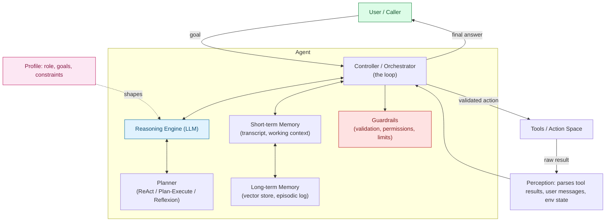
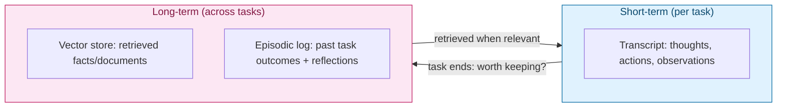

# Agentic AI — The Components of an Agent, In Detail

> Part 5 of the Agentic AI series. [Note 2 §3](02-agent-vs-multiagent-react.md#3-basic-agent-architecture) sketched a basic agent architecture in five boxes (LLM, memory, controller, environment). This note opens each of those boxes up — plus two that get skipped in the quick version (**Profile** and **Guardrails**) — and shows how [Note 4](04-architecture-comparison.md)'s planning patterns and ReAct from [Note 2](02-agent-vs-multiagent-react.md) slot into this fuller picture.

## 1. The Full Picture



Seven components, each answering a different question:

| # | Component | Question it answers |
| --- | --- | --- |
| 1 | Profile | "Who is this agent, and what is it allowed to care about?" |
| 2 | Reasoning Engine (LLM) | "Given everything known so far, what should happen next?" |
| 3 | Perception | "What just happened, in a form the LLM can use?" |
| 4 | Memory (short + long-term) | "What does the agent need to remember, and for how long?" |
| 5 | Planning | "One step at a time, or a full plan, or plan-then-critique?" |
| 6 | Tools / Action Space | "What can the agent actually *do*?" |
| 7 | Controller + Guardrails | "Who runs the loop, and what stops it from going wrong?" |

## 2. Profile — Role, Goals, Constraints

The part every framework calls something different (system prompt, persona, role definition) but every agent has one. It's the fixed context that shapes *every* decision the Reasoning Engine makes, without appearing in the visible transcript.

```python
PROFILE = """
You are a budget-checking assistant for a retail finance team.
Goal: given a purchase scenario, compute the final cost and state whether
it fits the stated budget.
Constraints:
- Always show each arithmetic step via the calculator tool; never compute
  totals mentally.
- Tax is always applied to the post-discount amount unless stated otherwise.
- If the task is ambiguous, ask a clarifying question instead of guessing.
"""
```

**Why it's its own component, not "just the system prompt":** the Profile is what makes the *same* underlying LLM behave like a specialized agent instead of a generic assistant. Change the Profile and every other component (planning style, which tools get reached for, how cautious it is) shifts without touching a line of code. In multi-agent systems, the Profile is also what differentiates a "researcher" agent from a "writer" agent built on the identical LLM.

## 3. The Reasoning Engine (the "Brain")

The LLM itself, called repeatedly by the Controller. Three practical choices live here:

| Choice | Trade-off |
| --- | --- |
| **Model size/capability** | Bigger models plan more reliably (fewer logic errors like the tax bug in [Note 4](04-architecture-comparison.md#2-the-shared-test-problem)) but cost more per step and add latency to every loop iteration |
| **Temperature** | Near 0 for deterministic, auditable tool use; higher only for creative sub-tasks (drafting, brainstorming) inside an otherwise deterministic loop |
| **Context provided per call** | Full transcript = most context but grows expensive and can dilute attention; summarized/windowed context = cheaper but risks dropping something the model needed |

The Reasoning Engine never acts directly — it only ever produces a *decision* (a thought, a tool call, or a final answer) that the Controller then carries out. That separation is what makes the other components possible: memory, guardrails, and tool execution all sit *between* what the model decides and what actually happens.

## 4. Perception — Turning Raw Results into Usable Input

Easy to overlook because it's rarely more than a few lines of code, but it's a distinct responsibility: taking whatever comes back from a tool, a user, or the environment, and shaping it into something the Reasoning Engine can actually use.

```python
def perceive(raw_tool_result, tool_name: str) -> str:
    if tool_name == "calculator" and isinstance(raw_tool_result, float):
        return f"{raw_tool_result:.4f}"          # consistent precision
    if tool_name == "web_search":
        return summarize_for_context(raw_tool_result, max_tokens=300)  # don't dump 5 pages of HTML
    return str(raw_tool_result)
```

**Why it matters:** a tool that returns a 50KB JSON blob or an HTML page will blow through context budget and bury the one field that mattered. Perception is the filtering/formatting layer — without it, "memory" in the next section just accumulates noise.

## 5. Memory — Short-Term and Long-Term

Two genuinely different mechanisms, often conflated:



| Type | Lifetime | Holds | Example |
| --- | --- | --- | --- |
| **Short-term / working memory** | One task, discarded after | The running `Thought/Action/Observation` transcript | The `transcript: list[Step]` from [Note 2](02-agent-vs-multiagent-react.md#2-the-react-loop-reason--act) |
| **Long-term — semantic** | Persists across tasks | Facts/documents retrieved by similarity search | A vector store (`chromadb`, from [Note 3](03-techs-and-tools.md#4-rag--vector-stores)) queried at the start of a task |
| **Long-term — episodic** | Persists across tasks | Records of *past attempts and their outcomes* | Reflexion's stored lessons ("tax applies to the discounted amount, not the subtotal") from [Note 4 §5](04-architecture-comparison.md#5-architecture-c-reflexion) |

> **Gotcha:** unbounded short-term memory is a silent failure mode. A transcript that grows every step eventually crowds out the system prompt's guidance or exceeds the context window outright. Production agents window, summarize, or periodically compact the transcript — they don't just append forever.

## 6. Planning — How Steps Get Decided

This is the component [Note 2](02-agent-vs-multiagent-react.md) and [Note 4](04-architecture-comparison.md) covered in full, so it's summarized here as *one interchangeable component* in the larger architecture — swapping it doesn't require touching Profile, Memory, or Tools:

| Strategy | Decides steps... | Covered in |
| --- | --- | --- |
| ReAct | one at a time, interleaved with observations | [Note 2 §2](02-agent-vs-multiagent-react.md#2-the-react-loop-reason--act) |
| Plan-and-Execute | all at once, up front | [Note 4 §4](04-architecture-comparison.md#4-architecture-b-plan-and-execute) |
| Reflexion | via retry-with-lessons after evaluating a full attempt | [Note 4 §5](04-architecture-comparison.md#5-architecture-c-reflexion) |

## 7. Tools / Action Space

The only component that lets the agent affect anything outside its own context window. Each tool is really a contract: a name, a typed schema for arguments, and a typed (or at least predictable) return shape.

```python
from pydantic import BaseModel

class CalculatorArgs(BaseModel):
    expression: str

TOOL_SCHEMA = {
    "name": "calculator",
    "description": "Evaluates a numeric arithmetic expression and returns a float.",
    "input_schema": CalculatorArgs.model_json_schema(),
}
```

Good tool design principles:

- **Narrow and single-purpose** — a `calculator` tool that only evaluates expressions is easier for the model to use correctly than a `do_math_stuff` tool that also formats currency and rounds.
- **Described for the model, not for a human reader** — the `description` field is prompt content; vague descriptions produce vague tool choices.
- **Predictable failure** — raise a clear, typed error (`ValueError: could not parse expression`) so the tool-retry loop from [Note 4 §6](04-architecture-comparison.md#6-tool-retry--self-correction-loops-a-different-layer) has something specific to react to.

## 8. Controller + Guardrails

The Controller is the piece of ordinary code that ties everything above together — it's the `react_loop` function from [Note 2](02-agent-vs-multiagent-react.md#2-the-react-loop-reason--act), just drawn out with every component visible this time:

```python
def controller(profile, llm, tools, memory, max_steps=6):
    transcript = memory.short_term
    for _ in range(max_steps):
        decision = llm.decide(profile=profile, transcript=transcript,
                               long_term_context=memory.retrieve_relevant())
        if decision.is_final_answer:
            memory.commit_episode(transcript, outcome=decision.content)
            return decision.content

        guard.validate(decision.tool_name, decision.tool_args)   # <- guardrail checkpoint
        raw_result = tools[decision.tool_name].execute(**decision.tool_args)
        transcript.append(perceive(raw_result, decision.tool_name))

    return "Stopped: max_steps reached."
```

**Guardrails are not one thing** — they're every checkpoint that can stop or reshape a decision before it becomes an action:

| Guardrail | Stops... |
| --- | --- |
| Argument validation (Pydantic) | Malformed tool calls from executing at all |
| Permission checks | An agent calling a tool its Profile/role shouldn't have access to (e.g., a read-only research agent calling a `delete_file` tool) |
| `max_steps` | Infinite or runaway loops |
| Human-in-the-loop approval | Irreversible or high-stakes actions (sending an email, spending money) proceeding without sign-off |
| Output filtering | Leaking sensitive data pulled from long-term memory into a final answer |

This is deliberately the last component covered, and it's covered in full depth in its own note next — everything above this line is "what the agent can do," and guardrails are "what stops it from doing that badly."

## Worked Example: Mapping the Budget-Check Agent

Using the calculator scenario from [Note 4](04-architecture-comparison.md#2-the-shared-test-problem):

| Component | In this agent |
| --- | --- |
| Profile | "Budget-checking assistant... tax always on post-discount amount... show every step" |
| Reasoning Engine | Claude, temperature 0, called once per step (ReAct) or once for planning (Plan-and-Execute) |
| Perception | Formats each `calculator` float result to 4 decimal places before adding to transcript |
| Short-term memory | The running list of `subtotal → discounted → tax → total` steps |
| Long-term memory | Not needed for this single-shot task — would matter if the agent handled *many* budget checks and needed to recall past corrections |
| Planning | ReAct (baseline), Plan-and-Execute (got it right the first time), or Reflexion (self-corrected on attempt 2) |
| Tools | `calculator(expression: str) -> float` |
| Controller | The loop calling LLM → validate → execute → perceive → repeat |
| Guardrails | Pydantic validation on `expression`, `max_steps=6` |

## Quick Reference Card

| Component | One-line job |
| --- | --- |
| Profile | Fixed identity/constraints shaping every decision |
| Reasoning Engine | Decides the next thought/action/answer |
| Perception | Turns raw tool/environment output into usable context |
| Short-term memory | This task's running transcript |
| Long-term memory | Facts (semantic) + past outcomes (episodic) across tasks |
| Planning | The strategy for deciding steps: ReAct, Plan-and-Execute, Reflexion |
| Tools | The agent's only way to affect anything outside its context |
| Controller | The ordinary code running the loop |
| Guardrails | Validation, permissions, step limits, human checkpoints |

## What's Next in This Series

1. **Multi-Agent Orchestration** — how these seven components change shape when several agents (each with their own Profile) coordinate.
2. **Guardrails & Stopping Conditions, In Depth** — the component introduced briefly in §8, covered fully: permission models, approval workflows, and designing step limits that don't just truncate a task mid-thought.

> [Note 2](02-agent-vs-multiagent-react.md) gave the five-box sketch; this note is the seven-box blueprint. Everything from here on is a deep-dive into one of these boxes.
