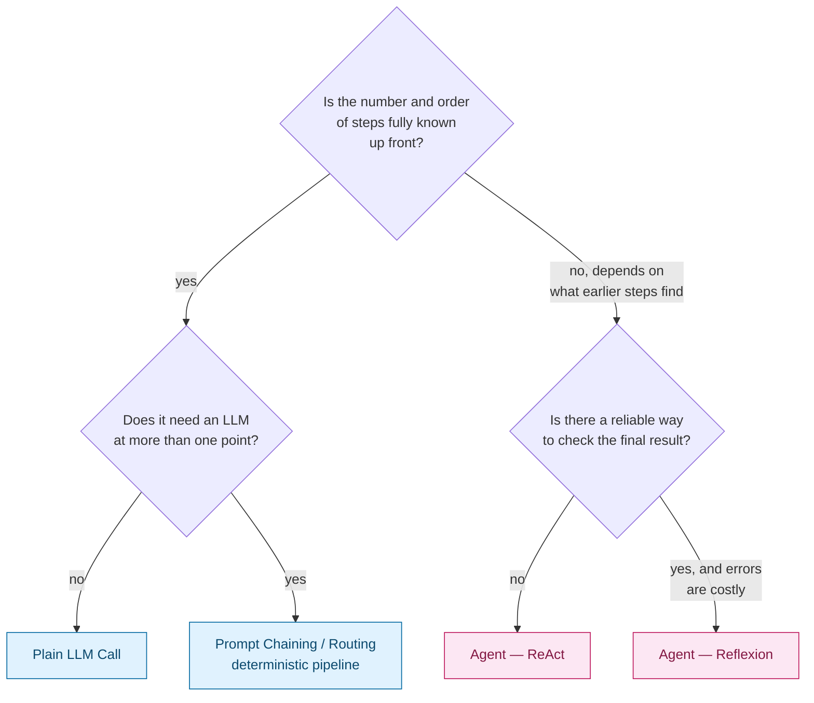

# Agentic AI — Use Cases and the "Should This Be an Agent?" Decision Framework

> Part 6 of the Agentic AI series. [Note 1](01-intro.md) drew the line between a chatbot, a workflow, and an agent; [Note 2](02-agent-vs-multiagent-react.md) added plain-LLM-app and multi-agent-system as neighboring shapes. This note is about a question those earlier notes only touched on: **given a real problem, should you actually reach for an agent** — and closes with a pitch-and-red-team activity for practicing that judgment call.

## 1. Where Agents Actually Win

Agents earn their overhead when a task has **an unpredictable number of steps, whose order depends on what earlier steps turn up** — not just "it involves an LLM."

| Use case | Why it's genuinely agentic |
| --- | --- |
| **Coding agents** (fix a failing test, implement a feature) | Number of edit/run/test cycles isn't known ahead of time; each test run changes what to do next |
| **Research & synthesis** ("investigate X and report findings") | Which sources to check next depends on what the last search turned up |
| **DevOps remediation** (diagnose and fix a production incident) | Root cause is unknown at the start; diagnostic steps branch based on findings |
| **Data analysis / SQL agents** (iterative query refinement) | Query needs adjusting based on returned data — schema exploration is inherently exploratory |
| **Support ticket resolution with tool access** (look up account, check logs, issue refund) | Which lookups are needed varies per ticket; some resolve in one step, others need several |
| **Multi-agent report generation** (research + write + review) | Each sub-agent's output changes what the next needs to do — genuinely dynamic delegation |

Notice what's *not* on this list: **single-shot classification, extraction, summarization, translation, or a fixed sequence of LLM calls** — those are plain LLM apps or prompt chains ([Note 2 §1](02-agent-vs-multiagent-react.md#1-three-system-shapes)), not agents, no matter how the product marketing labels them.

## 2. The Decision Framework

Beyond the shape of the task, weigh these four dimensions — an agent should win on at least the first, and not be disqualified by the rest:

| Dimension | Favors an agent | Favors simpler (LLM call / pipeline) |
| --- | --- | --- |
| **Step predictability** | Steps genuinely depend on intermediate results | Steps are the same every time |
| **Cost/latency budget** | Task is infrequent or high-value enough to justify multiple LLM round-trips | High-volume, latency-sensitive, or cost-capped (an agent loop can be 5–10x the LLM calls of a single prompt) |
| **Failure tolerance & auditability** | Some non-determinism is acceptable, and/or there's an evaluator to catch mistakes | Mistakes are costly and must be traceable to one deterministic step |
| **Tool surface** | Genuinely needs several tools, chosen dynamically | Zero or one fixed tool, called the same way every time |

> **Gotcha:** "it uses an LLM and calls an API" is not sufficient to call something an agent. If the *order* of calls is fixed by your code (call retrieval, then call the LLM, then call a formatter), that's a pipeline with an LLM step in it — routing or prompt chaining from [Note 1 §3](01-intro.md#3-agentic-workflows), not an agent. The test, restated from Note 1, is still: **does the model decide whether/when/how to act, or does code decide for it?**

## 3. Red-Team Questions

Before committing to an agent design, run it through these — they're the questions that expose "agent" used as a buzzword rather than a genuine architectural need:

1. **"Could a single well-crafted prompt do this?"** — if the task is one transformation (summarize, classify, extract, translate), no loop is needed.
2. **"Are the steps actually fixed, and you're calling it an agent out of habit?"** — walk through 5 real examples of the task; if the sequence of actions is identical every time, it's a pipeline.
3. **"What happens if it picks the wrong tool or a wrong argument at step 3 — and how would you know?"** — if there's no good answer, the design is missing guardrails ([Note 5 §8](05-agent-details.md#8-controller--guardrails)) at minimum, and might not deserve autonomy at all.
4. **"What does this cost per run vs. the deterministic alternative — is the flexibility worth it?"** — an agent that averages 6 LLM calls to do what a 2-call pipeline could do needs to justify that 3x cost with genuine unpredictability, not convenience.
5. **"Could a human just fill out a form / click a button for this instead of a natural-language agent?"** — if the inputs are structured and known, a UI with a deterministic backend is often more reliable *and* cheaper than an agent parsing intent from free text.
6. **"What's the blast radius if it's autonomous and wrong?"** — read-only research tasks tolerate agent autonomy far better than tasks that send emails, spend money, or delete data; those need human-in-the-loop checkpoints regardless of how "smart" the agent is.

## 4. Example Activity — Pitch and Red-Team

**Format:** in pairs or small groups, pick a real use case from your own work. Sketch a lightweight design using the vocabulary from Notes 1–5 (Profile, tools, planning strategy — [Note 5](05-agent-details.md)), then pitch it in ~3–5 minutes. The rest of the group (or the instructor) red-teams the pitch using the six questions above, and the group has to reach a verdict: **agent, pipeline, or plain LLM call.**

**Worked example — a pitch that gets red-teamed down:**

> *Pitch:* "An agent that reads incoming support emails and drafts a reply."
>
> *Red-team:* "Walk me through 5 emails. What actually varies?" → For every email, the steps are identical: classify intent → look up account by email address → fill a reply template → send for review. Nothing about *which* step runs next depends on what an earlier step found — it's the same four steps in the same order every time.
>
> *Verdict:* **Not an agent** — it's routing (classify → dispatch to a template) using an LLM at one point, which is a prompt-chaining pipeline from [Note 1 §3](01-intro.md#3-agentic-workflows). Framing it as an "agent" would add a loop, a step-limit guardrail, and non-determinism that buys nothing here.

**Worked example — a pitch that survives:**

> *Pitch:* "An agent that debugs a failing CI pipeline: reads the failure log, forms a hypothesis, edits the relevant file, re-runs the pipeline, and repeats until it passes or hits a step limit."
>
> *Red-team:* "Could a single prompt do this?" → No — the fix depends on what the log says, and whether the first fix worked determines whether there's a second attempt at all. "Are the steps fixed?" → No — a dependency-version bug and a syntax-error bug lead down completely different edit paths. "What's the blast radius if it's wrong?" → It edits files and re-runs CI, which is reversible (git diff is reviewable, CI doesn't touch production) — an acceptable autonomy level with a step-limit guardrail and human review of the final diff.
>
> *Verdict:* **Genuinely an agent** — unpredictable step count, order depends on intermediate results (the log/test output), and the blast radius is low enough to tolerate autonomy inside a bounded loop.

**Debrief prompt for the group:** for every pitch that gets downgraded to "pipeline" or "plain LLM call," ask what made it *feel* like it needed an agent — usually it's "the input is natural language" or "there's an LLM involved somewhere," neither of which is actually the deciding factor.

## Quick Reference Card

| Signal | Verdict |
| --- | --- |
| Same steps, same order, every time | Plain LLM call or prompt-chaining pipeline |
| Step count/order depends on intermediate results | Agent (ReAct, or Reflexion if there's an evaluator) |
| High volume + tight latency/cost budget | Favor pipeline, even if steps vary somewhat |
| Irreversible or high-stakes actions | Agent only with guardrails + human-in-the-loop, never fully autonomous |
| "It uses an LLM" as the only justification | Red flag — not sufficient on its own |
| Could a form + deterministic backend do it? | Probably not an agent |

## What's Next in This Series

1. **Multi-Agent Orchestration** — once a use case clears this bar for one agent, when does it clear the (higher) bar for splitting into several?
2. **Guardrails & Stopping Conditions, In Depth** — the permission models and approval workflows that make autonomy safe once a use case genuinely earns agent status.

> Use this note's framework *before* reaching for [Note 4](04-architecture-comparison.md)'s architecture choices — deciding *whether* to build an agent comes before deciding *which kind*.
