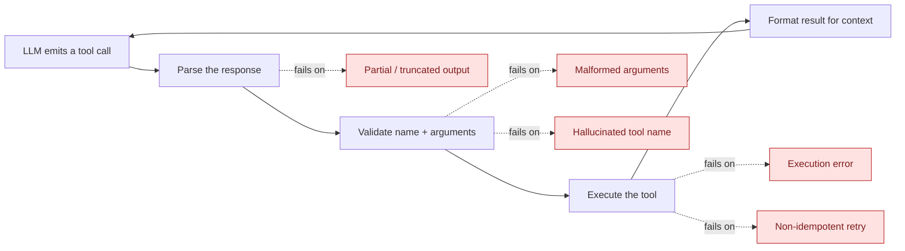

# Agentic AI — Tools in Agents: Reliable Tool-Calling Under Real-World Failure Modes

> Part 7 of the Agentic AI series. [Note 5 §7](05-agent-details.md#7-tools--action-space) introduced tools as the agent's only way to affect anything outside its context window, and [Note 4 §6](04-architecture-comparison.md#6-tool-retry--self-correction-loops-a-different-layer) introduced the basic retry loop. This note goes deep on the failure modes that make tool-calling the least reliable part of most agents in practice, and builds a dispatcher that handles them deliberately instead of hoping they don't happen.

## 1. The Tool-Calling Lifecycle

Every tool call passes through the same five stages — and each failure mode below enters at a specific one:



## 2. Failure Mode 1 — Malformed Arguments

The model emits a syntactically valid tool call, but the arguments are wrong: wrong type (`"quantity": "seventeen"` instead of `17`), a missing required field, or an invented field that isn't in the schema.

```json
{"tool_name": "calculator", "arguments": {"expresion": "17 * 12.99"}}
```

(Note the typo — `expresion`, not `expression`. Schema validation rejects this; a naive `dict.get("expression")` would silently return `None` and the tool would crash somewhere less informative.)

**Mitigation:** validate every call against a strict schema (Pydantic) *before* execution, and when validation fails, feed the **exact validation error** back to the model rather than a generic "that didn't work" — the error message ("missing required field 'expression'; got 'expresion'") is usually enough for the model to self-correct on the next attempt, per the retry loop in [Note 4 §6](04-architecture-comparison.md#6-tool-retry--self-correction-loops-a-different-layer).

## 3. Failure Mode 2 — Hallucinated Tool Names

The model calls a tool that doesn't exist — often a plausible-sounding name it half-remembers from training data or a similar tool in a different project (`get_weather_data` instead of the registered `get_weather`).

**Mitigation:**

- **Strict allow-listing** — never attempt to execute a tool name that isn't in the registered set, no matter how close it looks.
- **Fuzzy-match and suggest, don't guess** — offer the closest registered name back to the model rather than silently substituting it yourself; the model, not your dispatcher, should decide whether that's actually what it meant.
- **Re-list available tools in the error** — the correction prompt should restate the exact valid tool names, not just say "invalid tool."

```python
import difflib

def suggest_tool_name(bad_name: str, valid_names: list[str]) -> str | None:
    matches = difflib.get_close_matches(bad_name, valid_names, n=1, cutoff=0.6)
    return matches[0] if matches else None

# suggest_tool_name("get_weather_data", ["get_weather", "calculator"]) -> "get_weather"
```

> **Gotcha:** don't auto-execute the fuzzy-matched suggestion. Silently rerouting `get_weather_data` → `get_weather` on the dispatcher's own judgment hides a real signal (the model is confused about what tools exist) and can execute something the model didn't actually intend. Surface the suggestion, let the model confirm.

## 4. Failure Mode 3 — Partial or Truncated Outputs

Two different truncation problems hide under one symptom ("the tool call looks broken"):

- **The model's own output got cut off** — hit a `max_tokens` limit mid-JSON, so the tool-call arguments are literally incomplete (`{"expression": "17 * 12.`). Check the API response's stop/finish reason before attempting to parse; a `max_tokens` stop reason on a tool-call turn means "incomplete," not "malformed" — the fix is raising the token budget or asking the model to re-emit the call, not correcting arguments that were never finished.
- **The tool's own result is truncated** — a search tool returns page 1 of 50 results with no indication more exist, and the model treats it as the complete picture. Design tools to say so explicitly (`{"results": [...], "has_more": true, "total": 50}`) rather than returning a bare, ambiguous list — an agent can't compensate for truncation it doesn't know happened.

```python
def perceive_search_result(raw: dict) -> str:
    note = f" ({raw['total'] - len(raw['results'])} more results not shown)" if raw.get("has_more") else ""
    return f"Top {len(raw['results'])} results{note}:\n" + "\n".join(raw["results"])
```

## 5. Failure Mode 4 — Execution Errors (Network, Permission, Rate Limit)

The call is well-formed and the tool exists, but running it fails for reasons that have nothing to do with the model's reasoning: a timeout, a 429 rate limit, a permission denial.

**Mitigation — and this is the key distinction from Failure Modes 1–2:** these are **infrastructure** failures, not **reasoning** failures. Feeding a raw stack trace back to the model and asking it to "fix" its arguments is a category error — there's nothing wrong with the arguments. Handle these with standard backoff/retry at the code layer, and only surface it to the model as a final answer ("the weather service is currently unavailable") once retries are exhausted.

| Error type | Who should handle it | How |
| --- | --- | --- |
| `ValidationError` (bad args) | The model, via retry-with-error-message | Feed the schema error back, let it correct arguments |
| Unknown tool name | The model, via retry-with-suggestion | Feed the valid tool list + closest match back |
| `TimeoutError` / `ConnectionError` | The code layer | Exponential backoff, bounded retries, no model involvement |
| `PermissionError` | Neither — a guardrail | Refuse outright; this is a [Note 5 §8](05-agent-details.md#8-controller--guardrails) permission boundary, not something to retry past |
| Rate limit (`429`) | The code layer | Backoff honoring `Retry-After`, or queue and defer |

## 6. Failure Mode 5 — Retrying a Non-Idempotent Tool

The most dangerous failure mode, because it doesn't look like a failure at all: a tool call times out *after* it already took effect (an email actually sent, a refund actually issued), and a naive retry loop fires it again — now the user has two refunds.

**Mitigation:**

- **Classify every tool as idempotent (safe to retry blindly) or side-effecting (never blind-retry).** Read-only lookups, calculators, and searches are idempotent. Anything that sends, charges, deletes, or mutates external state is not.
- **For side-effecting tools, require an idempotency key** (a request ID the underlying API can use to recognize "I already did this one") wherever the tool's own API supports it, so even a legitimate retry is a no-op the second time.
- **When in doubt, escalate instead of retrying** — a timeout on a side-effecting call should surface to a human ("the refund call timed out; unknown whether it completed — please verify before retrying") rather than silently retrying.

## 7. A Reliable Dispatcher

Putting Failure Modes 1, 2, 4, and 5 together into one dispatcher, replacing the single `tools[name].execute(**args)` line from [Note 5 §8](05-agent-details.md#8-controller--guardrails)'s controller:

```python
from pydantic import BaseModel, ValidationError

IDEMPOTENT_TOOLS = {"calculator", "get_weather", "web_search"}       # safe to auto-retry
SIDE_EFFECTING_TOOLS = {"send_email", "issue_refund"}                # never auto-retry

class ToolError(BaseModel):
    message: str
    retryable_by_model: bool   # True: feed back for the model to correct; False: final

def dispatch_tool_call(tool_name: str, raw_args: dict, tools: dict, llm, max_retries=2):
    for attempt in range(max_retries + 1):
        if tool_name not in tools:
            suggestion = suggest_tool_name(tool_name, list(tools))
            return ToolError(
                message=f"Unknown tool '{tool_name}'. Available: {list(tools)}. Closest match: {suggestion}",
                retryable_by_model=True,
            )

        schema = tools[tool_name].args_schema
        try:
            args = schema.model_validate(raw_args)
        except ValidationError as e:
            return ToolError(message=f"Invalid arguments for '{tool_name}': {e}", retryable_by_model=True)

        if attempt > 0 and tool_name in SIDE_EFFECTING_TOOLS:
            return ToolError(
                message=f"'{tool_name}' failed once already and is not safe to auto-retry — escalating.",
                retryable_by_model=False,
            )

        try:
            return tools[tool_name].execute(**args.model_dump())
        except (TimeoutError, ConnectionError):
            if tool_name not in IDEMPOTENT_TOOLS or attempt == max_retries:
                return ToolError(message=f"'{tool_name}' unavailable after {attempt + 1} attempt(s).",
                                  retryable_by_model=False)
            continue  # transient + idempotent: safe to retry silently at the code layer
        except PermissionError as e:
            return ToolError(message=f"Blocked by guardrail: {e}", retryable_by_model=False)

    return ToolError(message=f"Gave up correcting '{tool_name}' after {max_retries} attempts.",
                      retryable_by_model=False)
```

The `retryable_by_model` flag is the load-bearing design choice here: it's what lets the controller decide whether to feed the error back into the transcript for another model attempt, or to stop the loop and surface a final answer — collapsing that distinction (as a bare `raise` or a generic error string does) is what causes agents to either loop forever on unfixable errors or give up on errors the model could have corrected in one more turn.

## 8. Head-to-Head: Failure Mode → Detection → Mitigation

| Failure mode | Detected at | Fix layer | Safe to auto-retry? |
| --- | --- | --- | --- |
| Malformed arguments | Validation | Model (feed back schema error) | Yes — cheap, usually self-corrects |
| Hallucinated tool name | Validation | Model (feed back valid list + suggestion) | Yes, but never auto-substitute |
| Partial/truncated model output | Parse (check stop reason) | Code (raise token budget / re-prompt) | Yes, at the code layer |
| Truncated tool result | Perception | Code (tool design: explicit `has_more`) | N/A — prevent, don't retry |
| Network/timeout/rate-limit | Execution | Code (backoff) | Yes, if the tool is idempotent |
| Permission denied | Execution | Guardrail | No — this is a boundary, not a bug |
| Side-effecting call after failure | Execution | Human escalation | **No — never auto-retry** |

> **Gotcha:** a dispatcher that treats every exception the same way (catch-all → feed back to model → retry) is the single most common source of unreliable agents in practice. The four rows above that say "No" or "code layer" are exactly the cases where feeding the error back to the model and letting it retry either wastes a turn (network blips have nothing to do with reasoning) or causes real damage (retrying a side-effecting call).

## Quick Reference Card

| Symptom | Likely cause | Fix |
| --- | --- | --- |
| Tool call has wrong/missing fields | Malformed arguments | Validate with Pydantic, feed the error back |
| `KeyError` / "tool not found" | Hallucinated tool name | Allow-list + fuzzy-match suggestion, never auto-substitute |
| JSON parse error on the tool call itself | Truncated model output | Check stop reason; raise `max_tokens`, don't "fix" arguments |
| Agent acts on incomplete data without noticing | Truncated tool result | Tool design: explicit `has_more`/pagination fields |
| Intermittent crashes unrelated to arguments | Execution/network error | Backoff + retry at code layer, not model layer |
| Duplicate side effects (double refund, double email) | Retried a non-idempotent tool | Classify tools; never auto-retry side-effecting ones; use idempotency keys |

## What's Next in This Series

1. **Multi-Agent Orchestration** — tool-calling reliability compounds when several agents share (or don't share) a tool registry.
2. **Guardrails & Stopping Conditions, In Depth** — permission boundaries (§5 above) and human-escalation paths, covered fully.

> [Note 5 §7](05-agent-details.md#7-tools--action-space) said a tool is a contract; this note is about what happens the many times that contract gets violated in practice.
