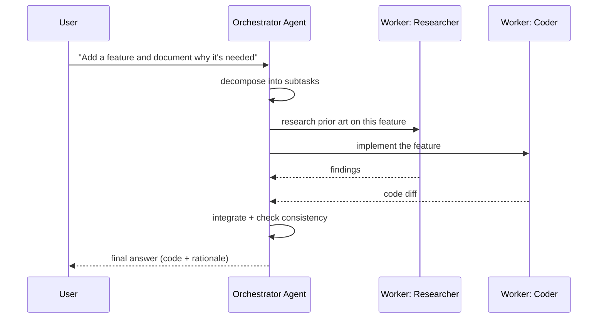
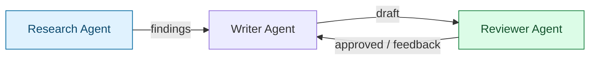
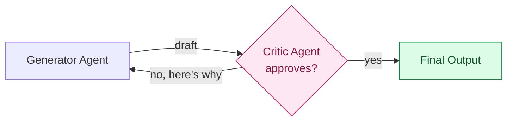
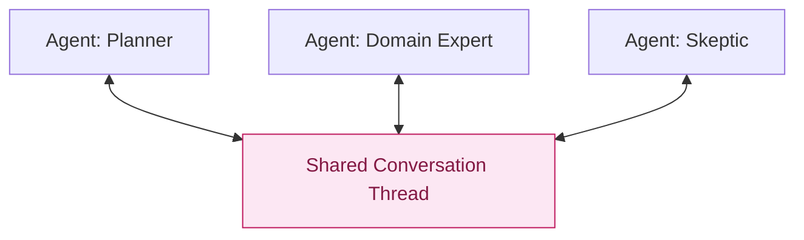
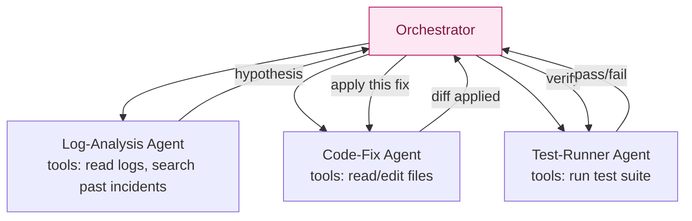
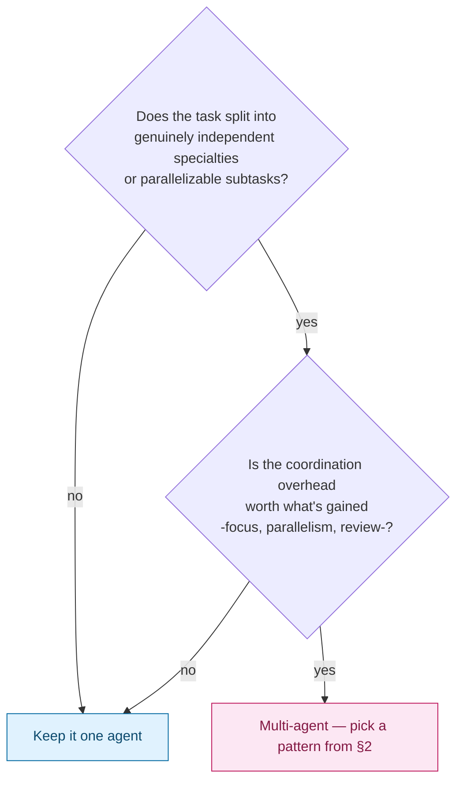

# Agentic AI — Multi-Agent Workflows: How They Work, and Why You'd Need One

> Part 8 of the Agentic AI series. [Note 2 §1](02-agent-vs-multiagent-react.md#1-three-system-shapes) first drew multi-agent systems as a third shape alongside plain LLM apps and single agents, with a warning not to reach for one by default. [Note 5](05-agent-details.md) gave the seven components of a single agent; [Note 6](06-agent-use-cases.md) gave the framework for deciding an agent is warranted at all; [Note 7](07-tool-calling.md) covered tool-calling reliability. This note is about what changes when more than one of those single-agent loops has to work together.

## 1. Why Multi-Agent At All?

A single agent is one Profile, one tool registry, one transcript, one Reasoning Engine call at a time ([Note 5](05-agent-details.md)). That breaks down in a few specific, recognizable ways — and each is a genuine reason to split into multiple agents, not just a excuse to use the word:

| Symptom in a single agent | What splitting fixes |
| --- | --- |
| **Context overload** — the transcript juggles research notes, code, and formatting instructions at once, and quality drops on all three | Each agent's transcript only holds what's relevant to *its* job |
| **Tool registry sprawl** — 30 tools in one agent, and it increasingly picks the wrong one ([Note 7 §3](07-tool-calling.md#3-failure-mode-2--hallucinated-tool-names)) | Each agent gets a small, focused tool set it can reliably choose from |
| **Conflicting Profiles** — "be a rigorous critic" and "be a fast, creative drafter" fight each other in one system prompt | Each agent gets its own [Profile](05-agent-details.md#2-profile--role-goals-constraints) tuned to one job |
| **Throughput** — independent subtasks run one after another when they don't depend on each other | Independent agents run **in parallel** |
| **No check on a single point of failure** — one agent's mistake ships straight through, nothing reviews it | A second agent can review/critique before anything is final — a multi-agent Reflexion, in effect |

**The rule from [Note 2](02-agent-vs-multiagent-react.md#1-three-system-shapes) still holds:** each additional agent is another place for a handoff to lose context or an instruction to be misread. Multi-agent buys you focus, parallelism, and a second opinion — at the cost of coordination overhead and a wider failure surface (§5). It's a trade, not a strict upgrade.

## 2. How It Works: Coordination Patterns

Every multi-agent system is one of a small number of communication shapes. The pattern determines who talks to whom, and who decides what happens next.

### Orchestrator–Workers (hierarchical)

A lead agent decomposes the goal, dispatches subtasks to specialized workers, and integrates their results. This is the pattern from [Note 1 §3](01-intro.md#3-agentic-workflows), drawn out in full:

**Who decides what happens next:** the orchestrator, every time. Workers never talk to each other directly — this keeps the failure surface contained (§5) but makes the orchestrator a single point of failure for coordination.

### Sequential Pipeline (handoff chain)

Each agent finishes its whole job, then hands its output to the next agent as input — no shared loop, no back-and-forth.

**Who decides what happens next:** whichever agent currently holds the baton, plus one fixed rule for where output goes next — closer to [Note 1](01-intro.md#3-agentic-workflows)'s prompt-chaining than a fully agentic hierarchy, but with each *stage* internally a full agent (its own tool use, its own loop).

### Debate / Critic Pattern

Two agents with opposing Profiles — a generator and a critic — argue over the same artifact until the critic is satisfied or a round limit is hit. This is Reflexion ([Note 4 §5](04-architecture-comparison.md#5-architecture-c-reflexion)) lifted to two agents: instead of one agent evaluating its own work (a known weak point), a separate agent with a dedicated "find the flaws" Profile does the evaluating.

**Why a separate critic agent beats self-reflection:** a dedicated critic Profile ("your only job is to find errors, be skeptical by default") doesn't share the generator's blind spots or its incentive to declare success. It's the multi-agent answer to Reflexion's biggest weakness — an unreliable self-evaluator.

### Peer Group Chat

All agents post to one shared conversation; any agent (or a lightweight moderator) can decide whose turn is next. No fixed hierarchy.

**Who decides what happens next:** genuinely distributed — often the least predictable pattern, since no single agent (or piece of code) controls turn order. Best reserved for exploratory/brainstorming tasks where that unpredictability isn't a liability.

## 3. Anatomy: What Each Agent Still Needs

Multi-agent doesn't replace the seven components from [Note 5](05-agent-details.md) — every agent in the system still has its own Profile, Reasoning Engine calls, memory, and controller loop. What's new is the **coordination layer** sitting on top:

| New concern | What it answers |
| --- | --- |
| **Message format** | Do agents pass structured data (a typed handoff object) or free-form text? Structured is more reliable but requires every agent to agree on a schema — the multi-agent version of [Note 7](07-tool-calling.md)'s tool-argument validation. |
| **Shared vs. private memory** | Does each agent see the full history, or only what's handed to it? Full visibility avoids lost context but reintroduces the context-overload problem §1 was trying to fix. |
| **Turn-taking authority** | Fixed (orchestrator decides, sequential pipeline) vs. dynamic (group chat) — this is the same "who controls the loop" question from [Note 1 §3](01-intro.md#3-agentic-workflows), one level up. |
| **Tool registry ownership** | Does each agent get its own scoped tool set (a Researcher can't call `send_email`), or is there one shared registry? Scoping tools per agent is a guardrail almost for free — see [Note 5 §8](05-agent-details.md#8-controller--guardrails). |

## 4. Worked Example: Extending the CI-Debugging Agent

[Note 6](06-agent-use-cases.md#4-example-activity--pitch-and-red-team) ended with a single CI-debugging agent that survived the red-team. Here's the multi-agent version, and why you'd actually split it:

**Why split it:** the single-agent version worked, but as the log-analysis step grows (querying a knowledge base of past incidents, cross-referencing multiple log sources) its context starts crowding out the code-editing task's focus — exactly the "context overload" symptom from §1. Splitting gives the Log-Analysis Agent a tool registry scoped to read-only diagnostics (safer — it never touches files) and the Code-Fix Agent a registry scoped to edits (never queries external incident databases it doesn't need).

## 5. New Failure Modes Multi-Agent Introduces

These don't exist in a single agent — they're specific to coordination:

| Failure mode | What happens |
| --- | --- |
| **Compounding errors** | Worker A's small mistake becomes Worker B's confidently-used input; by the time it reaches the orchestrator, it's baked into the final answer with no single "wrong step" to point to. |
| **Lossy handoffs** | A sequential pipeline agent summarizes its output for the next stage and drops a caveat or edge case the next agent needed. |
| **Orchestrator misrouting** | The lead agent sends a subtask to the wrong worker (or a worker whose tool registry can't actually accomplish it), and the failure looks like the worker's fault when it's a delegation error. |
| **Runaway coordination cost** | Every hop between agents is another full Reasoning Engine call — a task that took 5 LLM calls as one agent can take 20+ once orchestration and handoffs are added. |
| **Diffused accountability** | When something goes wrong, "which agent decided this?" is harder to answer than in a single transcript — debugging requires reconstructing the whole message trail, not one loop. |

> **Gotcha:** splitting into multiple agents does not fix a badly-designed single agent — it multiplies it. If one worker's Profile is vague or its tool registry is wrong, an orchestrator dispatching to it just produces the same bad output with extra latency and cost on top. Fix the single-agent design first (Notes 5–7); reach for multi-agent only for the reasons in §1, not to paper over an agent that doesn't work alone.

## 6. Extending the Decision Framework

[Note 6 §2](06-agent-use-cases.md#2-the-decision-framework) asked whether a task needs to be an agent at all. Once it clears that bar, ask one more question before splitting it into several:

Run this through the same red-team spirit as [Note 6 §3](06-agent-use-cases.md#3-red-team-questions): "could one agent with a slightly bigger tool registry do this?" is usually the honest answer, and multi-agent should only win when the specialties or parallelism are real, not just organizationally tidy.

## Quick Reference Card

| Pattern | Who decides "what's next" | Best for |
| --- | --- | --- |
| Orchestrator–Workers | The orchestrator, every time | Decomposable tasks with clear specialties, contained failure surface |
| Sequential Pipeline | Whoever holds the baton + a fixed handoff rule | Linear multi-stage work (research → draft → review) |
| Debate / Critic | Alternates by fixed rule until critic approves | Replacing unreliable self-evaluation (multi-agent Reflexion) |
| Peer Group Chat | Distributed / dynamic | Exploratory, brainstorming tasks tolerant of unpredictability |
| Reason to split | — | Context overload, tool sprawl, conflicting Profiles, parallelism, need for review |
| Reason NOT to split | — | The underlying single-agent design is itself unreliable — fix that first |

## What's Next in This Series

1. **Guardrails & Stopping Conditions, In Depth** — permission boundaries, approval workflows, and step limits, now including the multi-agent versions: which agent can approve another's action, and how step limits compose across an orchestrator and its workers.

> [Note 5](05-agent-details.md) was the single-agent blueprint; this note is what happens when you wire several of those blueprints together. The next note closes the series' architecture arc by covering what stops any of this — one agent or many — from running away.
