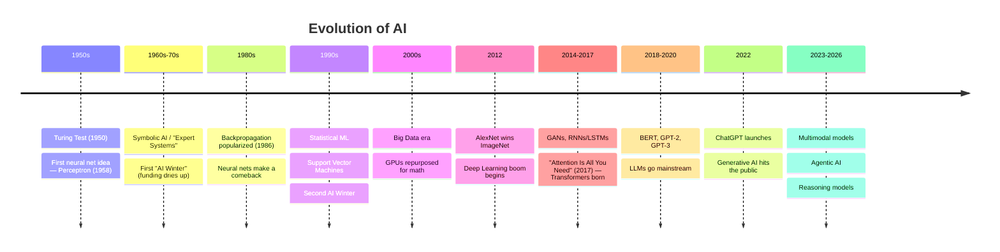
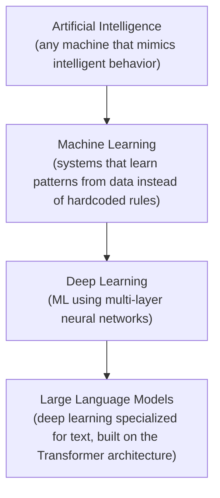
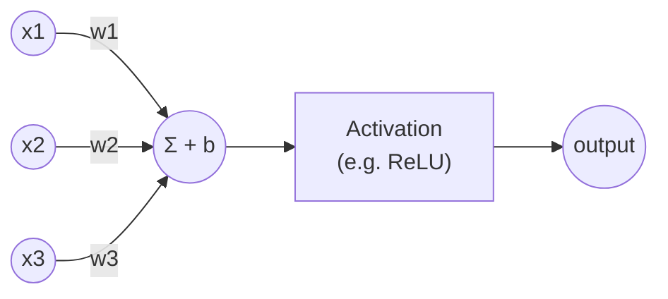
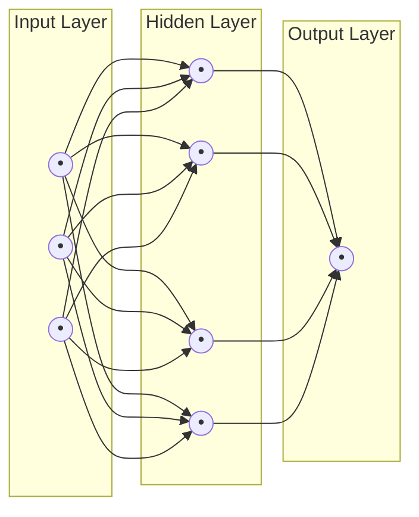
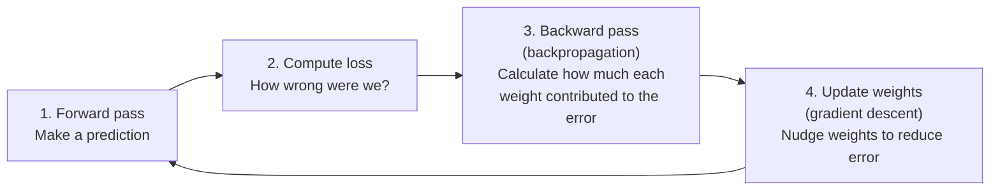
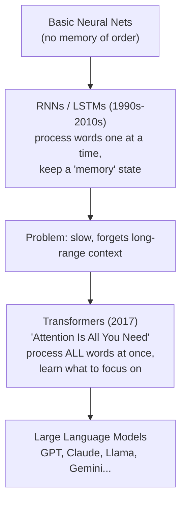
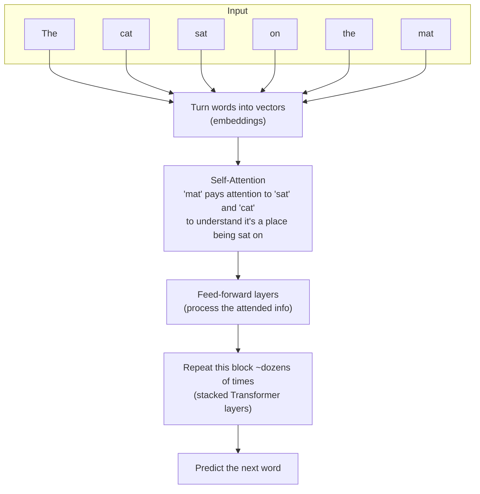
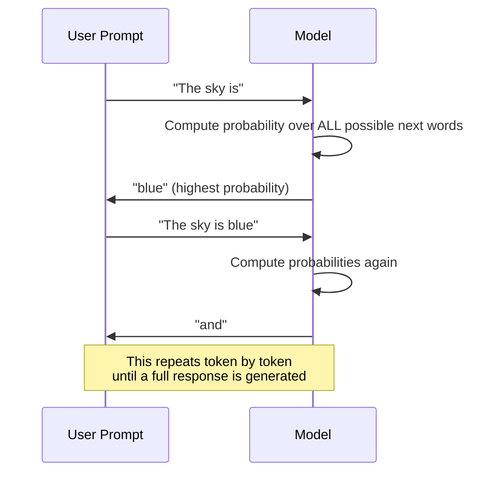
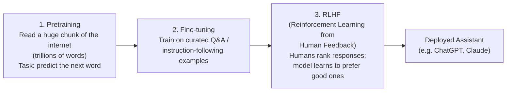

# AI, Neural Networks & LLMs — The Complete Picture

A guided tour: what these things are, how they evolved, how they actually work under the hood, and how to build tiny versions yourself.

---

## 1. The Evolution of AI



**Why two "AI Winters"?** Each boom over-promised (symbolic AI in the 70s, neural nets in the 80s). Funding collapsed when reality didn't match hype. What changed by 2012: **way more data**, **way more compute (GPUs)**, and a few key algorithmic tricks. Deep learning didn't need a new *idea* so much as the old idea (neural nets, known since the 1950s-80s) finally having enough fuel.

---

## 2. AI vs ML vs Deep Learning vs LLMs

These terms nest inside each other like Russian dolls:



| Term | Example |
|---|---|
| AI | A chess program with hand-coded rules |
| ML | A spam filter that learns from labeled emails |
| Deep Learning | A model that recognizes cats in photos via layers of neurons |
| LLM | GPT-style models that predict the next word in text |

---

## 3. The Neural Network — The Core Building Block

### 3.1 A single "neuron"

A neuron takes inputs, multiplies each by a **weight**, adds a **bias**, and squashes the result through an **activation function**.



Mathematically:
```
output = activation(w1*x1 + w2*x2 + w3*x3 + b)
```

That's it. A neural network is just **thousands to trillions of these, connected in layers.**

### 3.2 Stacking neurons into a network



- **Input layer**: raw data (pixel values, word IDs, sensor readings)
- **Hidden layers**: learn increasingly abstract features
- **Output layer**: the prediction (a number, a class, a probability distribution)

"Deep" learning just means **many hidden layers**.

### 3.3 Build one from scratch (no libraries)

A single neuron learning the world's simplest pattern — doubling a number — using plain Python:

```python
import random

# Data: we want the network to learn y = 2x
inputs  = [1, 2, 3, 4, 5]
targets = [2, 4, 6, 8, 10]

w = random.uniform(-1, 1)   # weight (starts random/wrong)
b = random.uniform(-1, 1)   # bias
lr = 0.01                   # learning rate

for epoch in range(1000):
    total_loss = 0
    for x, y_true in zip(inputs, targets):
        y_pred = w * x + b                # forward pass
        error = y_pred - y_true
        loss = error ** 2                 # squared error
        total_loss += loss

        # gradients (calculus: derivative of loss w.r.t. w and b)
        dw = 2 * error * x
        db = 2 * error

        # gradient descent: nudge weights to reduce error
        w -= lr * dw
        b -= lr * db

    if epoch % 200 == 0:
        print(f"epoch {epoch}: loss={total_loss:.4f}, w={w:.3f}, b={b:.3f}")

print(f"\nLearned function: y ≈ {w:.2f}x + {b:.2f}")
print(f"Predict x=10 -> {w*10+b:.2f} (should be ~20)")
```

Run this and `w` converges to ~2 and `b` to ~0 — the network *discovered* the rule `y = 2x` purely from examples. **This exact loop (predict → measure error → adjust weights) is the heartbeat of all deep learning**, just scaled up to billions of weights.

---

## 4. How Training Actually Works: Backpropagation



This loop repeats millions/billions of times. Each pass through the *entire* dataset is called an **epoch**. Over time, the network's weights settle into values that capture the patterns in the data.

**Key intuition**: backpropagation is just the chain rule from calculus, applied layer by layer, to answer *"if I nudge this weight slightly, does the error go up or down?"*

---

## 5. From Neural Networks to LLMs

Plain neural nets struggle with **sequences** (text, where order and context matter). This led to a lineage of architectures:



### 5.1 The Transformer, simplified

The breakthrough idea is **self-attention**: for every word, the model learns *which other words in the sentence matter most* for understanding it.



**Example — why attention matters:**
> "The animal didn't cross the street because **it** was too tired."

To know what "it" refers to, the model must attend back to "animal" (not "street"). Self-attention lets every word directly look at every other word and weigh relevance — that's the whole trick.

### 5.2 How an LLM actually generates text

It's astonishingly simple at its core: **predict one word (token) at a time.**



Each guess is a probability distribution over the entire vocabulary (~100,000 possible tokens), and the model samples from it — sometimes picking the top choice, sometimes exploring, depending on "temperature" settings.

---

## 6. How LLMs Are Trained (the 3 stages)



- **Pretraining** gives the model broad knowledge and language ability — this is 99% of the compute cost.
- **Fine-tuning** teaches it to behave like a helpful assistant rather than just "autocomplete the internet."
- **RLHF/RLAIF** aligns it with human preferences (helpful, harmless, honest).

---

## 7. Implement a Tiny Neural Net with a Real Library

Here's a minimal but real image classifier using **PyTorch** — the industry-standard deep learning framework.

```python
# pip install torch torchvision --break-system-packages
import torch
import torch.nn as nn
import torch.optim as optim

# A simple feedforward network: 784 inputs (28x28 pixel image) -> 10 outputs (digits 0-9)
class DigitClassifier(nn.Module):
    def __init__(self):
        super().__init__()
        self.layer1 = nn.Linear(784, 128)   # input -> hidden
        self.relu   = nn.ReLU()             # activation function
        self.layer2 = nn.Linear(128, 10)    # hidden -> output (10 digit classes)

    def forward(self, x):
        x = self.layer1(x)
        x = self.relu(x)
        x = self.layer2(x)
        return x

model = DigitClassifier()
optimizer = optim.Adam(model.parameters(), lr=0.001)
loss_fn = nn.CrossEntropyLoss()

# Pseudo-training loop (plug in real MNIST data to actually run this)
# for images, labels in dataloader:
#     optimizer.zero_grad()
#     predictions = model(images)
#     loss = loss_fn(predictions, labels)
#     loss.backward()      # <- this is backpropagation, done automatically
#     optimizer.step()     # <- this is the weight update
```

Notice `loss.backward()` — PyTorch computes all the calculus for you. This is the exact same loop as the scratch example in section 3.3, just with 784→128→10 neurons instead of 1.

---

## 8. Implement a Tiny "LLM" Concept: Bigram Word Predictor

A real LLM is a Transformer with billions of parameters, but you can grasp the *core idea* — predicting the next token from context — with a toy model trained on a tiny text:

```python
import random
from collections import defaultdict

text = "the cat sat on the mat the cat ran away the dog sat on the rug"
words = text.split()

# Learn: for every word, what words tend to follow it?
transitions = defaultdict(list)
for i in range(len(words) - 1):
    transitions[words[i]].append(words[i + 1])

# "Generate" text by picking a plausible next word each time (this is what LLMs do, 
# just with a neural network instead of a lookup table, and far more context)
def generate(start_word, length=10):
    word = start_word
    output = [word]
    for _ in range(length):
        next_word = random.choice(transitions[word])  # sample the next token
        output.append(next_word)
        word = next_word
    return " ".join(output)

print(generate("the"))
```

This is literally a (very primitive, 1-word-of-memory) language model. Real LLMs do the same *conceptual* thing — predict what comes next — but:
- consider thousands of words of context (not just 1)
- use learned attention instead of a lookup table
- have billions of tunable parameters instead of a dictionary

---

## 9. Quick Reference: Key Terms

| Term | Plain-English Meaning |
|---|---|
| **Weight** | A number the model learns; controls how much one input matters |
| **Bias** | An offset added to a neuron's output |
| **Activation function** | A nonlinearity (ReLU, sigmoid) that lets networks learn complex patterns |
| **Loss function** | Measures how wrong a prediction is |
| **Gradient descent** | The optimization method that nudges weights to reduce loss |
| **Backpropagation** | The algorithm that computes how to adjust every weight |
| **Epoch** | One full pass through the training data |
| **Token** | A chunk of text (roughly a word or word-piece) that an LLM operates on |
| **Embedding** | A vector (list of numbers) representing a word's meaning |
| **Attention** | The mechanism letting a model weigh relevance between tokens |
| **Parameters** | The total count of weights + biases in a model (GPT-scale = billions) |
| **Fine-tuning** | Further training a pretrained model on a specific task |
| **RLHF** | Using human feedback to steer model behavior post-training |
| **Inference** | Running a trained model to get predictions (vs. training it) |

---

## 10. Where to Go Next (Practical Path)

1. **Play**: Run the two scratch scripts above (sections 3.3 and 8) — takes 5 minutes, builds real intuition.
2. **Learn the math**: linear algebra (vectors/matrices) + basic calculus (derivatives) is 90% of the prerequisite.
3. **Build with PyTorch**: follow the MNIST digit classifier (section 7) end-to-end with real data.
4. **Read the paper**: *"Attention Is All You Need"* (2017) — the Transformer paper that started the LLM era.
5. **Build a nano-GPT**: Andrej Karpathy's "nanoGPT" / "Let's build GPT" tutorial is the best free resource for building a real (tiny) LLM from scratch in Python.
