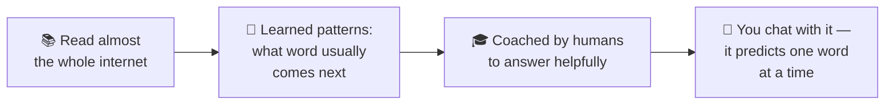
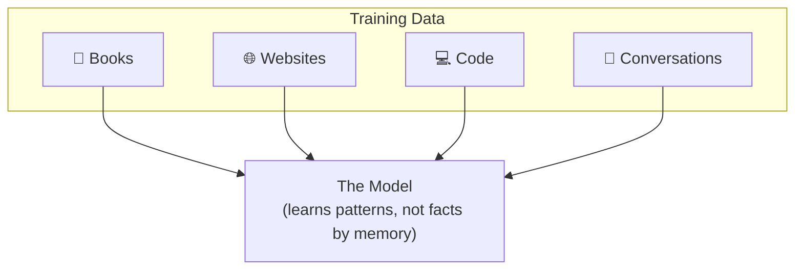
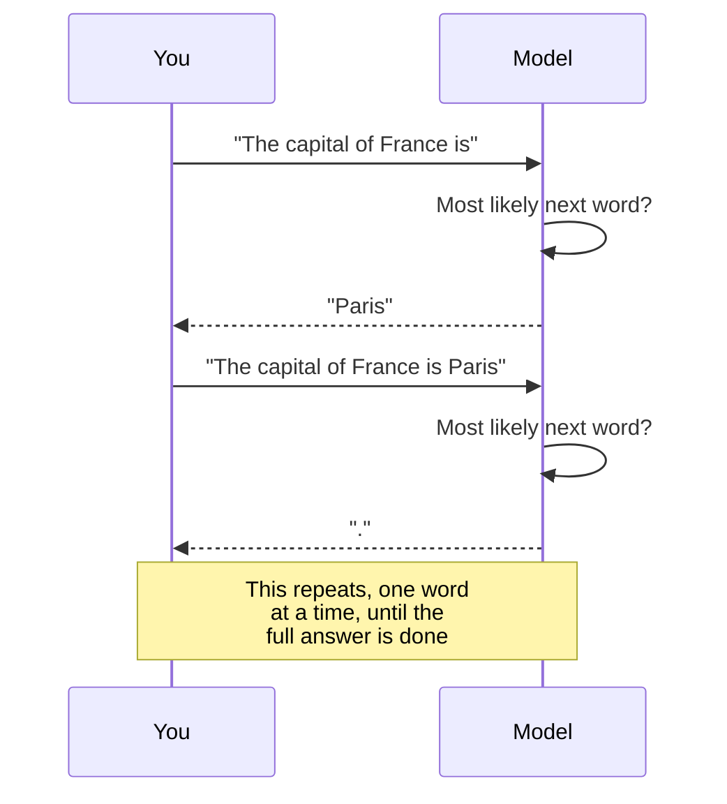
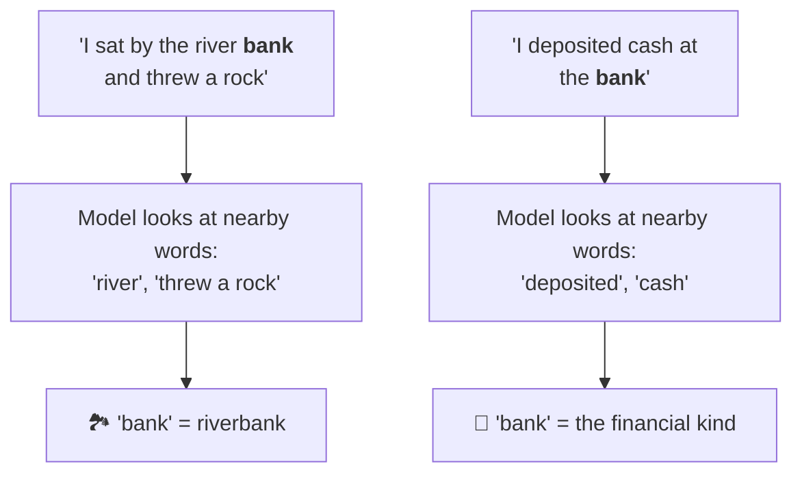
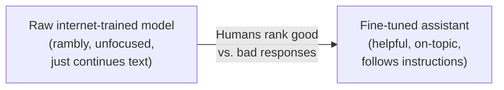
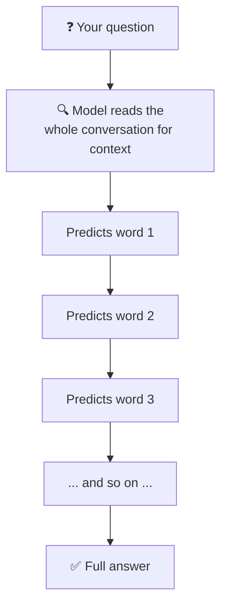

# How ChatGPT / Claude Actually Work (Explained Simply)

Think of it like an incredibly well-read autocomplete that got really, really good.

---

## 1. It learned by reading almost everything

Before you ever typed a message, the model read a massive chunk of the internet — books, articles, code, conversations. Not to memorize facts, but to learn **patterns**: which words tend to follow which words, how ideas connect, how questions get answered.

---

## 2. It talks one word (token) at a time

When you ask something, it doesn't plan the whole answer in advance. It predicts the single most likely next word, adds that word to what's been said, then predicts the *next* word — over and over, super fast — until it forms a full reply.

---

## 3. It pays "attention" to relevant words

While predicting, it looks back over your whole message (and its own reply so far) and weighs which words matter most **right now**. The same word can mean different things depending on context — the model picks up on that from the surrounding words, not a dictionary lookup.

---

## 4. It was trained to be a helpful assistant, not just autocomplete

Raw "predict the next word" would just ramble like a chaotic mash-up of the internet. So afterward, humans showed it examples of good, helpful, honest answers — like a student who read everything, then had a teacher coach them on *how* to actually answer questions well.

---

## The Simplest Mental Model

> A huge pattern-matching machine that read a huge amount of text, learned **"what word usually comes next,"** and was coached to use that skill to be genuinely helpful — one word at a time, incredibly fast.

---

## What It's *Not*

It's not thinking or understanding the way a person does:

| It has... | It does NOT have... |
|---|---|
| Learned patterns from text | Beliefs or opinions of its own |
| A way to weigh context | Memory between separate, unrelated conversations |
| Trained "helpfulness" habits | An inner experience or consciousness |
| Statistics at a massive scale | True understanding the way humans have it |

It's statistics and pattern-matching at a massive scale, shaped by training to *feel* conversational — even though nothing about how it works resembles a human brain thinking things through.
