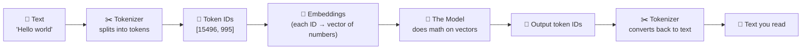
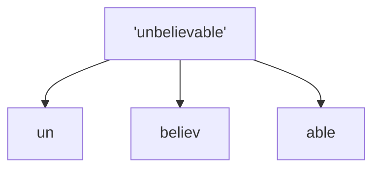
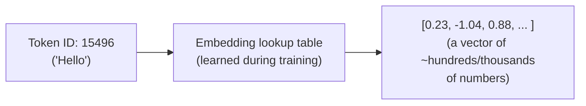
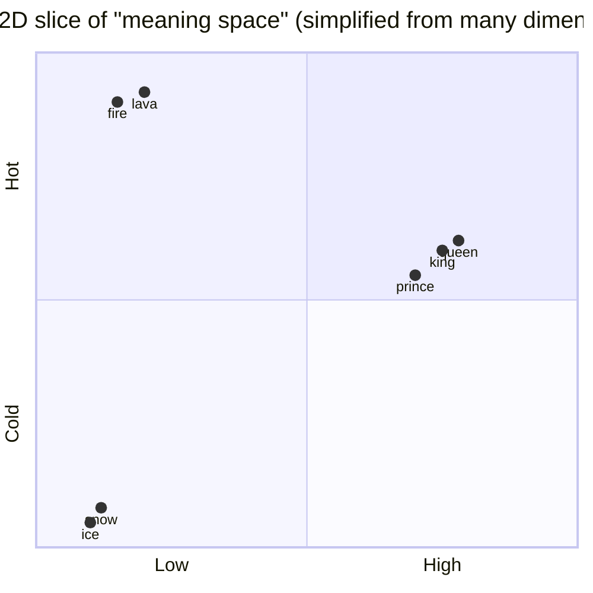
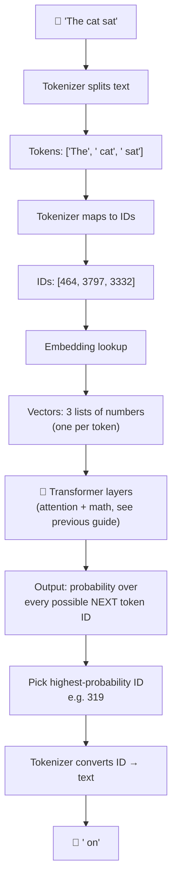
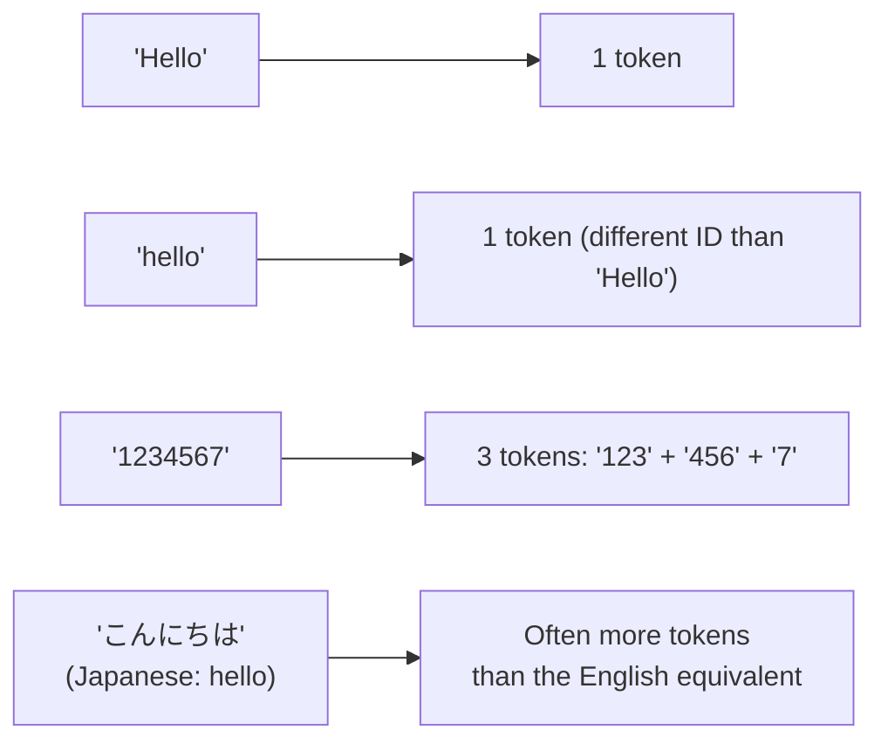

# The Language of LLMs: Words → Tokens → Numbers

Computers can't read words. They can only do math on numbers. So before an LLM can process "Hello world," it has to convert that text into numbers — and convert its numeric output back into text you can read. This is the whole journey.



---

## 1. Words vs. Tokens — they're not the same thing

A **token** is the actual unit an LLM operates on. Sometimes a token *is* a whole word. Often it's a **piece** of a word. This surprises most beginners.



Why chop words into pieces instead of using whole words?

| Approach | Problem |
|---|---|
| One token per **character** | Sequences become huge; loses meaning ("c-a-t" has no relation to "cat" as a concept) |
| One token per **whole word** | Vocabulary would need millions of entries (typos, rare words, other languages, made-up words all break it) |
| One token per **sub-word piece** ✅ | Sweet spot: manageable vocabulary (~50,000–100,000 tokens), handles *any* text, even words it's never seen |

**Example — a made-up word still works:**
```
"Claudeification" → ["Claude", "ification"]
```
Even though "Claudeification" isn't a real word, the tokenizer breaks it into familiar pieces it *has* seen before, so the model can still make sense of it.

---

## 2. The Tokenizer — the translator

The **tokenizer** is a separate, simpler program (not the neural network itself) that has a fixed **vocabulary**: a lookup list of every possible token, each with its own ID number.

```mermaid
flowchart LR
    subgraph Tokenizer's Vocabulary List
    v1["0: 'a'"]
    v2["...": "..."]
    v3["995: ' world'"]
    v4["...": "..."]
    v5["15496: 'Hello'"]
    end
    Text["'Hello world'"] -->|look up each piece| Tokenizer
    Tokenizer --> IDs["[15496, 995]"]
```

**Try this mental exercise:**
```
Text:      "Hello world"
Tokens:    ["Hello", " world"]     ← note the space is often PART of the token
Token IDs: [15496, 995]
```

Notice the space before "world" — most tokenizers bake the leading space *into* the token itself, since "the way a word starts" (mid-sentence vs. sentence-start) matters for meaning.

### Quick facts about tokens
- Roughly: **1 token ≈ ¾ of an English word** (so 100 tokens ≈ 75 words)
- Common words ("the", "is", "and") = usually 1 token each
- Rare words, typos, or other languages = often broken into several tokens
- Emojis, code symbols, and numbers each get their own tokenization rules

---

## 3. From Token IDs to Meaning: Embeddings

A token ID like `15496` is just an arbitrary label — it carries no meaning on its own (ID `15496` isn't "more" or "less" than ID `995`, the way real numbers relate). So the model converts each ID into an **embedding**: a long list of numbers (a *vector*) that captures the token's *meaning*.



**The key idea: similar meanings → similar vectors.** Think of it as plotting every word in a giant multi-dimensional map, where related concepts land near each other.



In reality this "map" has hundreds or thousands of dimensions (not just 2), which is what lets the model capture incredibly subtle relationships — but the idea is the same: **nearby vectors = related meanings.**

A famous demonstration of this: embeddings can support "vector math" that lines up with real-world relationships —
```
vector("king") - vector("man") + vector("woman") ≈ vector("queen")
```

---

## 4. Putting It All Together: the Full Pipeline



So the full loop for generating **one word** is:

1. **Text → Tokens** (tokenizer splits your sentence into pieces)
2. **Tokens → IDs** (tokenizer looks up each piece's number)
3. **IDs → Vectors** (embedding table turns numbers into meaning-rich vectors)
4. **Vectors → Math** (the neural network processes them, using attention to weigh context)
5. **Math → Next ID** (model outputs probabilities over all possible next tokens, picks one)
6. **ID → Text** (tokenizer converts the winning ID back into readable text)

Then the whole thing repeats for the *next* word, now with the new word included as context.

---

## 5. Quick Reference Table

| Term | What it is | Example |
|---|---|---|
| **Word** | A unit of human language | "unbelievable" |
| **Token** | The actual chunk of text the model sees — can be a whole word, part of a word, punctuation, or even a space | `"un"`, `"believ"`, `"able"` |
| **Token ID** | A unique number assigned to each possible token in the vocabulary | `15496` |
| **Vocabulary** | The full fixed list of every token the tokenizer knows (usually ~50,000–100,000 entries) | GPT-4's vocab, Claude's vocab, etc. |
| **Tokenizer** | The program that converts text ⟷ token IDs (runs *before/after* the neural network, not part of it) | `tiktoken`, `SentencePiece`, `BPE` |
| **Embedding** | A vector of numbers representing a token's *meaning*, learned during training | `[0.23, -1.04, 0.88, ...]` |
| **Context window** | The max number of tokens the model can "see" at once (prompt + conversation + response) | e.g. 200,000 tokens |

---

## 6. See It Yourself

Try pasting text into a public tokenizer visualizer (like OpenAI's "Tokenizer" tool) and watch words get sliced into colored chunks. A few fun things to notice:

- `"hello"` → 1 token, but `"Hello"` (capital H) can be a *different* token than `"hello"`
- Numbers get split oddly: `"1234567"` might become `["123", "456", "7"]`
- Non-English text (like Japanese or Arabic) often uses **more tokens per word** than English, since tokenizers are trained mostly on English-heavy data — this is why usage costs/limits can differ by language.



**Bottom line:** an LLM never actually "sees" words. It sees a stream of numbers that *represent* pieces of words, converted into meaning-vectors it can do math on — and every reply it gives you started life as a probability distribution over a big list of numbers.

---

## 7. Hands-On Websites — Go Explore

| Site | What you can do there |
|---|---|
| [platform.openai.com/tokenizer](https://platform.openai.com/tokenizer) | OpenAI's official tool. Paste any text, see it color-coded into tokens, and see the exact token IDs. Best starting point. |
| [tiktokenizer.vercel.app](https://tiktokenizer.vercel.app/) | A popular community tool — lets you switch between different model tokenizers (GPT-4, GPT-3.5, Llama, etc.) and compare how the *same* text gets split differently. |
| [gpt-tokenizer.dev](https://gpt-tokenizer.dev/) | Another interactive playground: token counts, cost estimation, and side-by-side model comparison. |
| [gptforwork.com/tools/tokenizer](https://gptforwork.com/tools/tokenizer) | Lets you compare tokenization across GPT, Claude, Gemini, and Grok in one place. |
| [projector.tensorflow.org](https://projector.tensorflow.org/) | Google's **Embedding Projector** — visualize real word embeddings in interactive 3D space and literally *see* related words cluster together. |
| [huggingface.co/docs/transformers/tokenizer_summary](https://huggingface.co/docs/transformers/tokenizer_summary) | Hugging Face's technical-but-readable explainer on how BPE, WordPiece, and SentencePiece tokenizers work under the hood. |
| [github.com/openai/tiktoken](https://github.com/openai/tiktoken) | The actual open-source Python library OpenAI uses to tokenize text — install it and tokenize text yourself in a few lines of code. |

**Suggested first experiment:** open the OpenAI Tokenizer, paste in your own name, a made-up word, and a sentence in a non-English language — then compare how many tokens each one takes. It's the fastest way to make everything in this guide click.

