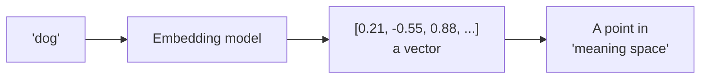
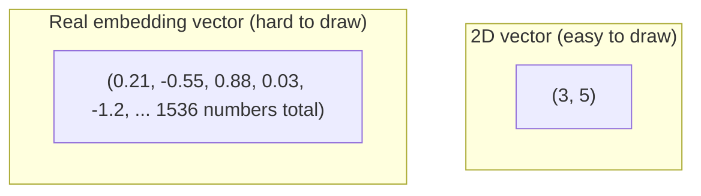
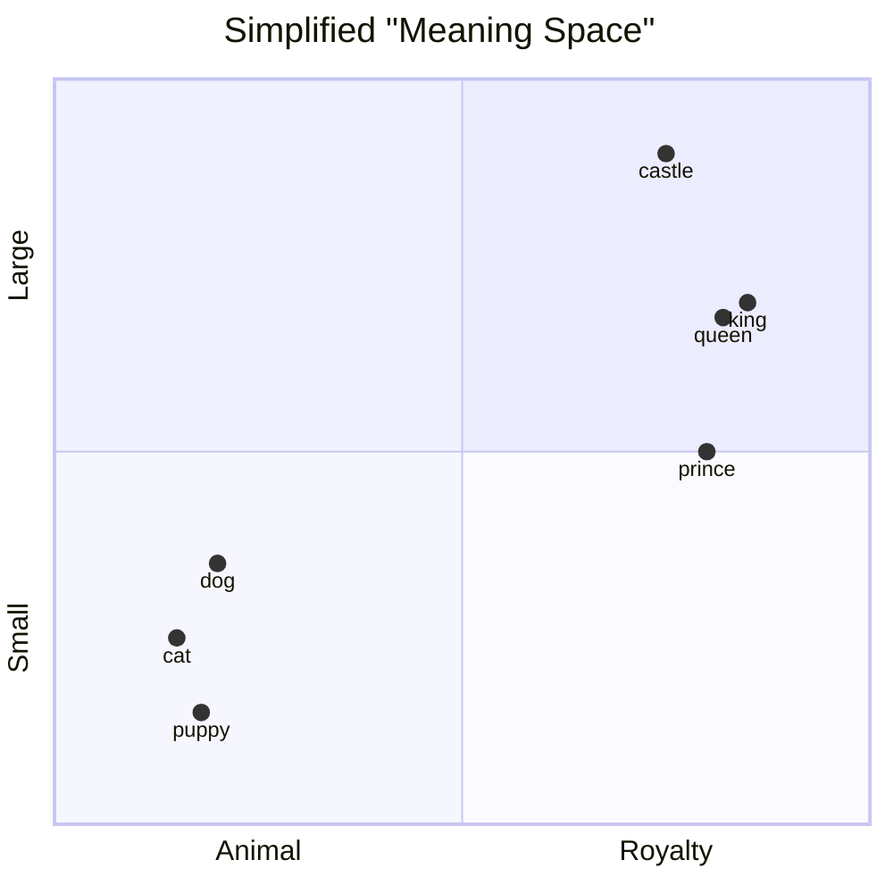
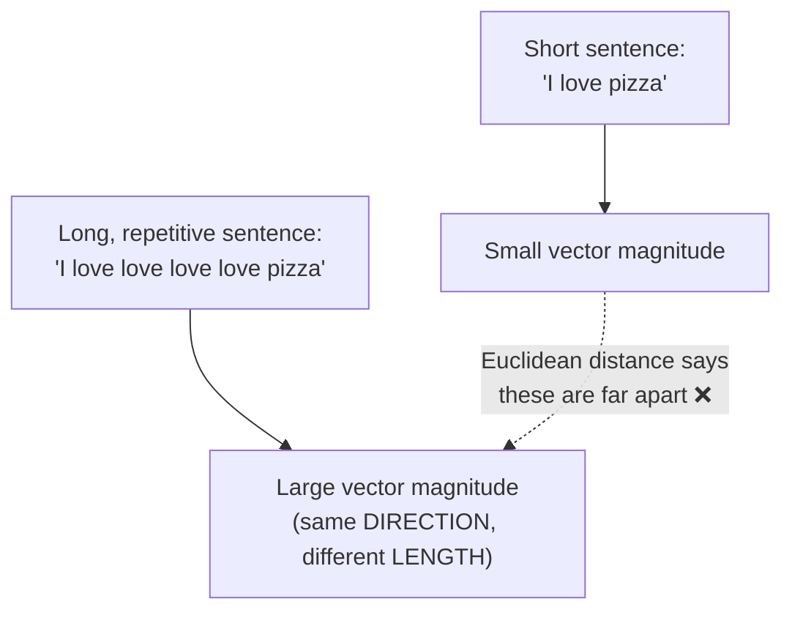
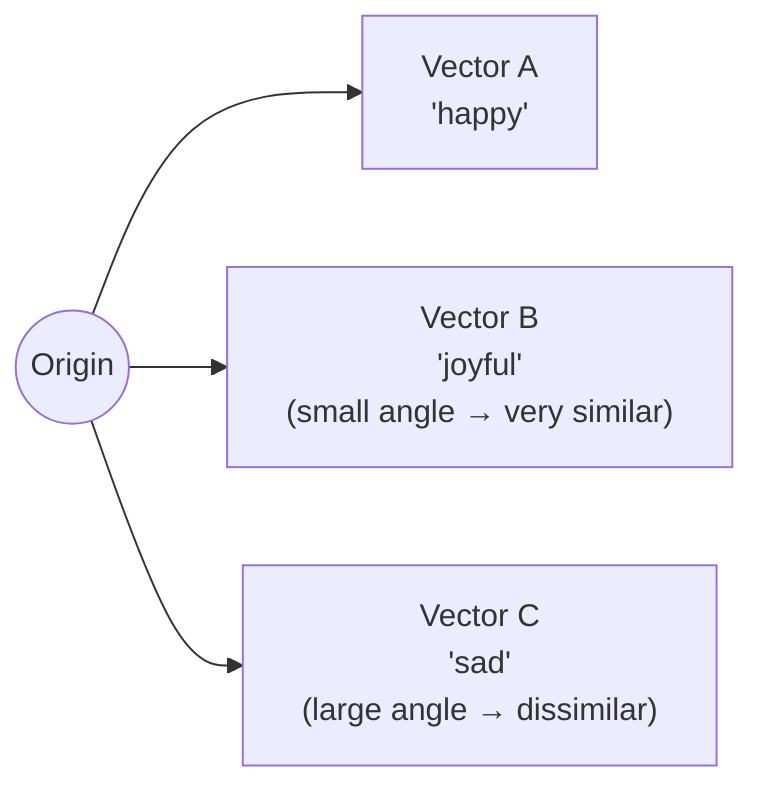
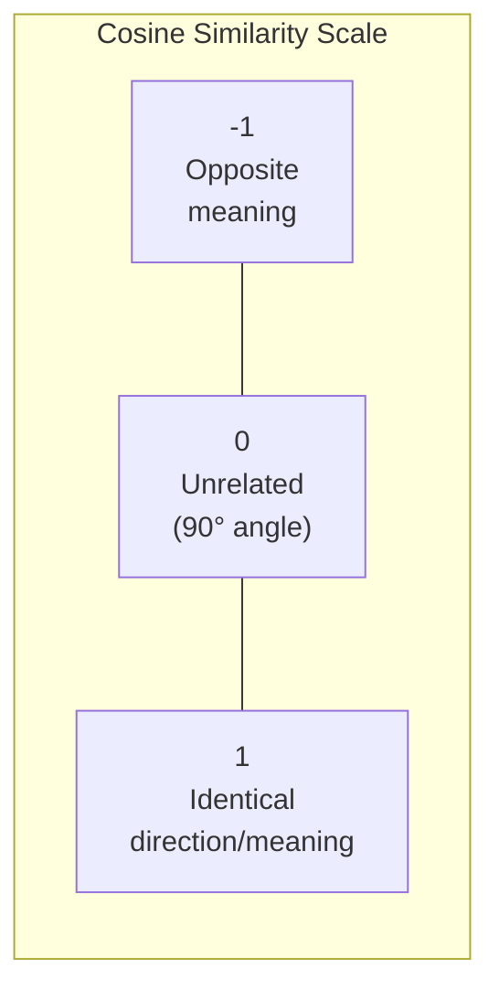
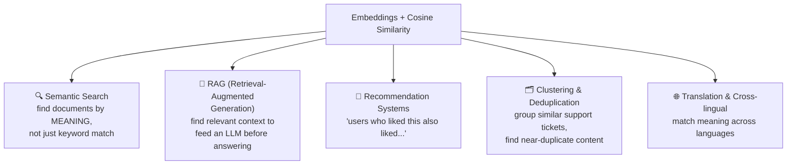

# How Machines Represent Meaning: Vectors, Embeddings & Cosine Similarity

Computers don't understand "king" or "happiness" — they understand **numbers**. So to let a machine reason about *meaning*, we convert every word (or sentence, image, anything) into a list of numbers called a **vector**, positioned in a giant imaginary space where **distance and direction represent meaning**.



---

## 1. What Is a Vector, Really?

A vector is just an ordered list of numbers. You already know 2D vectors from school — a point like `(3, 5)` on a graph. An **embedding** is the exact same idea, just with hundreds or thousands of numbers instead of 2.



Each number in the vector doesn't correspond to one human-readable trait ("furriness = 0.8") — instead, the *combination and pattern* of all the numbers together encodes meaning, learned automatically during training. Think of it like a fingerprint: no single ridge means anything on its own, but the whole pattern uniquely identifies something.

---

## 2. Embeddings: Plotting Meaning on a Map

The key idea, illustrated on a simplified 2D map (real embeddings use hundreds of dimensions, but 2D is easier to picture):



Notice: `cat`, `dog`, and `puppy` cluster together (all animals), while `king`, `queen`, and `prince` cluster together elsewhere (all royalty). **Words with similar meaning end up as nearby points.** This isn't hand-coded — the model discovers these clusters automatically just by learning to predict words from context during training. Words that appear in similar contexts ("the king ruled..." / "the queen ruled...") naturally get pulled toward similar vectors.

### Famous example: vector arithmetic captures relationships

```
vector("king") - vector("man") + vector("woman") ≈ vector("queen")
```

This works because the *direction* from "man" to "king" (adding "royalty") is roughly the same direction as from "woman" to "queen." The model learned that "royalty" is a consistent, reusable direction in the space — without ever being told that concept exists.

---

## 3. Measuring "Closeness": Why Distance Isn't Quite Right

Once meaning is a point in space, a natural question is: **how do we measure if two words/sentences mean similar things?** Your first instinct might be "measure the straight-line distance between the two points" (like measuring distance on a map). That's called **Euclidean distance**, and it mostly works — but it has a flaw for meaning:



Two sentences can point in almost the *exact same direction* (same meaning/topic) but have different **lengths** (magnitudes) just because one is longer or uses more intense words. We don't want length to distort our similarity measurement — we care about **direction**, not magnitude. That's exactly what cosine similarity fixes.

---

## 4. Cosine Similarity — Measuring the *Angle*, Not the Distance

Instead of measuring the straight-line distance between two vectors, **cosine similarity measures the angle between them.** Two vectors pointing the same direction are "similar," regardless of how long each one is.



### The formula (don't worry, it's simpler than it looks)

```
                  A · B
cosine_similarity(A, B) = -----------
                  |A| × |B|
```

- **A · B** (dot product): multiply matching numbers in both vectors, then add them all up
- **|A|** and **|B|**: the "length" of each vector
- Dividing by the lengths cancels out magnitude, leaving *only* the angle information

### The result is always between -1 and 1:



| Score | Meaning | Example pair |
|---|---|---|
| ~1.0 | Nearly identical meaning | "happy" & "joyful" |
| ~0.7–0.9 | Related / similar topic | "dog" & "puppy" |
| ~0.0–0.3 | Mostly unrelated | "dog" & "spreadsheet" |
| Negative | Opposite meaning (rare for word embeddings, more common in other contexts) | "hot" & "cold" (sometimes) |

---

## 5. See It in Code

A tiny, dependency-free example computing cosine similarity by hand:

```python
import math

def cosine_similarity(vec_a, vec_b):
    dot_product = sum(a * b for a, b in zip(vec_a, vec_b))
    magnitude_a = math.sqrt(sum(a * a for a in vec_a))
    magnitude_b = math.sqrt(sum(b * b for b in vec_b))
    return dot_product / (magnitude_a * magnitude_b)

# Pretend these are simplified embeddings (in reality: hundreds of dimensions)
happy   = [0.9, 0.8, 0.1]
joyful  = [0.85, 0.75, 0.15]   # similar meaning to "happy"
sad     = [0.1, 0.2, 0.9]      # different meaning

print("happy vs joyful:", cosine_similarity(happy, joyful))  # close to 1 (similar)
print("happy vs sad:", cosine_similarity(happy, sad))        # much lower (different)
```

**Output (approximately):**
```
happy vs joyful: 0.995   ← very similar!
happy vs sad:    0.427   ← much less similar
```

### Real embeddings, using a library

```python
# pip install sentence-transformers --break-system-packages
from sentence_transformers import SentenceTransformer, util

model = SentenceTransformer('all-MiniLM-L6-v2')

sentences = [
    "The cat sat on the mat.",
    "A feline rested on the rug.",     # different words, same meaning
    "The stock market crashed today."  # unrelated meaning
]

embeddings = model.encode(sentences)

sim_1_2 = util.cos_sim(embeddings[0], embeddings[1])
sim_1_3 = util.cos_sim(embeddings[0], embeddings[2])

print("Sentence 1 vs 2 (similar meaning):", sim_1_2.item())   # high, e.g. ~0.75
print("Sentence 1 vs 3 (unrelated):", sim_1_3.item())         # low, e.g. ~0.05
```

Notice sentence 1 and 2 share almost **no words in common**, but the model still recognizes they mean nearly the same thing — because it compares *meaning vectors*, not literal text.

---

## 6. Why This Matters — Real Uses of Embeddings + Cosine Similarity



**Concrete example — semantic search:** if you search "how to fix a flat tire," a keyword search fails to match a document titled "repairing a punctured wheel" (zero shared words). But their **embeddings** land near each other in meaning-space, so a cosine-similarity search finds it instantly. This is the core mechanism behind modern search engines, chatbots that "search your documents," and how Claude/ChatGPT-style tools retrieve relevant info before answering.

---

## 7. Quick Reference

| Term | Plain-English meaning |
|---|---|
| **Vector** | An ordered list of numbers representing a point in space |
| **Embedding** | A vector specifically learned to represent the *meaning* of a word, sentence, image, etc. |
| **Meaning space / embedding space** | The (high-dimensional) space where all embeddings live; similar meanings cluster near each other |
| **Dot product** | Multiply matching numbers from two vectors and sum them — the core building block of cosine similarity |
| **Magnitude** | The "length" of a vector |
| **Euclidean distance** | Straight-line distance between two points; sensitive to vector length |
| **Cosine similarity** | Measures the angle between two vectors, ignoring length — the standard way to compare meaning |
| **Semantic similarity** | How close two pieces of text are in *meaning* (as opposed to exact word overlap) |

---

## 8. Explore It Yourself

| Site | What you can do there |
|---|---|
| [projector.tensorflow.org](https://projector.tensorflow.org/) | Google's Embedding Projector — explore real word embeddings in interactive 3D, search a word and watch its nearest neighbors light up |
| [huggingface.co/spaces](https://huggingface.co/spaces) (search "sentence similarity") | Live demos where you type two sentences and instantly see their similarity score |
| [word2vec playground (turbomaze.github.io)](https://turbomaze.github.io/word2vecjson/) | Small in-browser demo of word-vector arithmetic (king − man + woman ≈ queen) |
| [Hugging Face `sentence-transformers` docs](https://www.sbert.net/) | Documentation for the library used in the code example above — run real semantic similarity in a few lines |

**Try this:** open the TensorFlow Embedding Projector, search for a word like "bank," and see whether its nearest neighbors relate to rivers or finance — a nice hands-on look at how a single embedding blends multiple senses of a word based on its training data.
