# Advanced Embeddings: Text vs Token, Static vs Contextual, Bias, Search & Multimodal

Building on the basics of vectors and cosine similarity, this covers five deeper questions people run into once they start actually *using* embeddings.

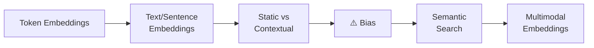

---

## 1. Text Embedding vs. Token Embedding — Different Zoom Levels

These two terms confuse beginners because they sound similar, but they represent embeddings at **different levels of granularity**.

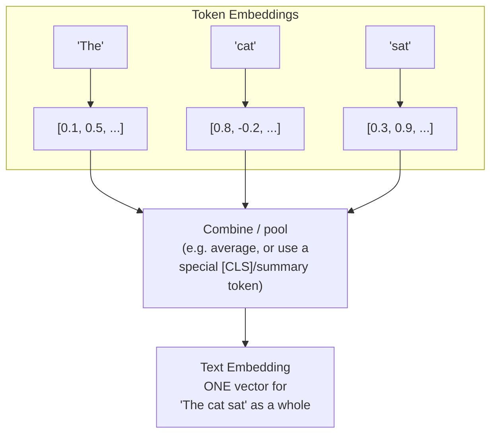

| | Token Embedding | Text (Sentence/Document) Embedding |
|---|---|---|
| **What it represents** | One word-piece | An entire sentence, paragraph, or document |
| **How many vectors for "The cat sat"?** | 3 (one per token) | 1 (one for the whole sentence) |
| **Used for** | Feeding words into the model layer by layer; each token needs its own vector so the model can process sequences | Comparing whole sentences/documents — search, clustering, recommendation |
| **Analogy** | The meaning of each brick | The meaning of the whole building |

**Why you need both:** an LLM's internal Transformer layers operate on *token* embeddings (see previous guide) because it needs to track word-by-word relationships and attention. But when you want to compare two *entire* documents for similarity (like in search), you need a single *text embedding* — so token embeddings get combined ("pooled") into one summary vector, often by averaging them or using a special summary token trained just for this purpose.

```python
# Conceptual example (not exact model internals)
tokens = ["The", " cat", " sat"]
token_embeddings = [[0.1, 0.5], [0.8, -0.2], [0.3, 0.9]]  # one vector per token

# Simple pooling: average all token vectors into one sentence vector
text_embedding = [
    sum(dim) / len(token_embeddings) 
    for dim in zip(*token_embeddings)
]
print(text_embedding)  # -> one vector representing the whole sentence
```

---

## 2. Static vs. Contextual Meaning — The Word "Bank" Problem

This is one of the most important upgrades in the history of NLP.

### Static embeddings (older approach: Word2Vec, GloVe — ~2013-2017)

Each word gets **exactly one fixed vector**, no matter how it's used.

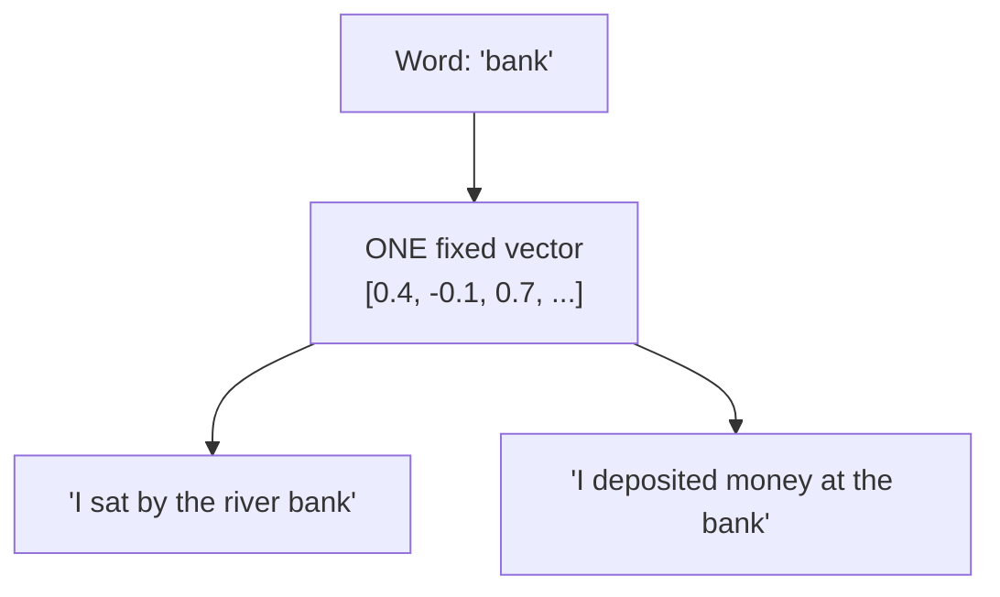

**The problem:** "bank" gets the *same* vector whether it means riverbank or a financial institution — the vector ends up as a blurry average of both meanings, which hurts accuracy.

### Contextual embeddings (modern approach: BERT, GPT, Claude — 2018+)

The vector for a word is computed **fresh, every time**, based on the surrounding sentence (this is exactly what the attention mechanism from the earlier guide enables).

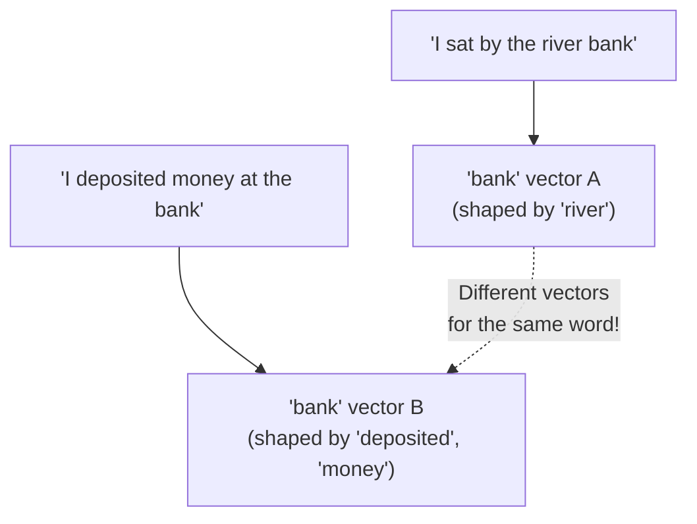

| | Static Embeddings | Contextual Embeddings |
|---|---|---|
| **Example models** | Word2Vec, GloVe | BERT, GPT, Claude, all modern LLMs |
| **"bank" (river) vs "bank" (money)** | Same vector for both | Different vectors — captures the actual meaning used |
| **Speed** | Fast — just a lookup table | Slower — must run the whole model to compute |
| **Still used today?** | Rarely, for large-scale systems | Yes — this is the modern standard |

**Quick intuition:** static embeddings are like a dictionary that gives you *one* definition per word. Contextual embeddings are like a human reading a sentence and figuring out *which* definition applies right now.

---

## 3. Bias in Embeddings — When the Data's Prejudices Leak In

Embeddings are learned entirely from real-world text (books, websites, news). If that text contains **societal biases**, the model can absorb and reproduce them as geometric patterns in the vector space.

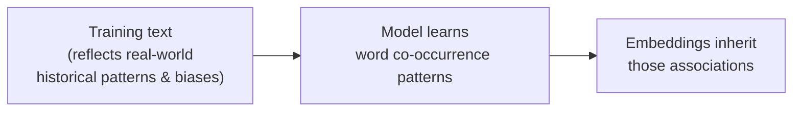

### A famous documented example

Researchers found that early static embeddings, when asked to complete analogies, produced results like:
```
man : computer programmer :: woman : homemaker
```
The model wasn't "trying" to be sexist — it simply learned that in its training text, "programmer" appeared near male-associated words more often, and "homemaker" near female-associated words. **The bias in the data became a bias in the geometry.**

### Where bias shows up

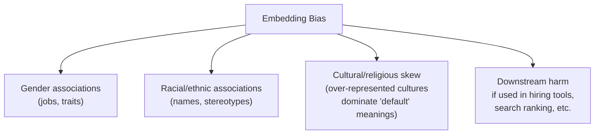

### What's done about it

- **Bias auditing**: testing embeddings with analogy tests and association benchmarks before deployment
- **Debiasing techniques**: mathematically identifying a "bias direction" in the vector space (e.g., the gender direction) and reducing a word's projection onto it
- **Curated/balanced training data**: filtering or rebalancing text sources
- **Human oversight & fine-tuning**: using RLHF-style training (see earlier guide) to steer model outputs away from biased patterns, even if some bias remains in the raw embeddings underneath
- **Ongoing limitation**: fully removing bias is an unsolved research problem — debiasing one measurable direction doesn't guarantee all bias is gone, since bias can hide in subtler combinations of dimensions

**Why this matters practically:** if you build a resume-screening tool using raw embeddings, biased associations can silently influence which resumes get ranked higher — even if no one intended it. This is why responsible deployment involves testing, not just trusting the model.

---

## 4. Embeddings in Semantic Search — How It Actually Works End-to-End

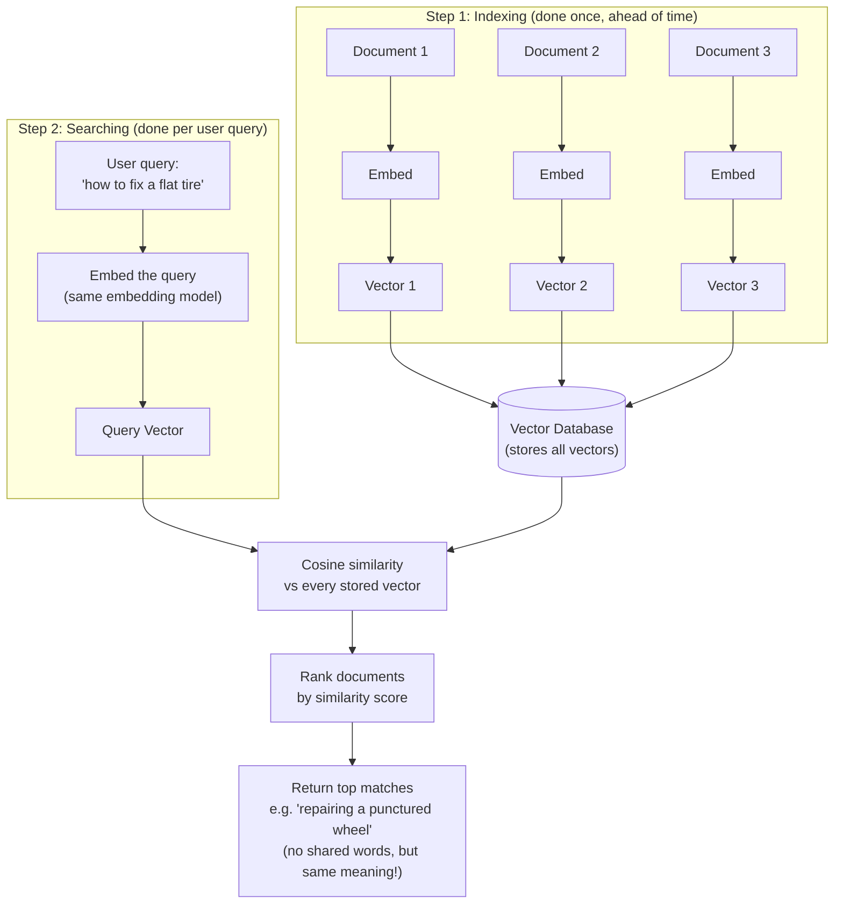

### Why this beats old-school keyword search

| Keyword Search | Semantic (Embedding) Search |
|---|---|
| Matches exact words | Matches meaning |
| "flat tire" ≠ "punctured wheel" | "flat tire" ≈ "punctured wheel" ✅ |
| Struggles with synonyms, typos, phrasing | Handles synonyms and rephrasing naturally |
| Fast, simple, cheap | Requires computing + storing embeddings, plus a vector database |

### This is the backbone of RAG (Retrieval-Augmented Generation)

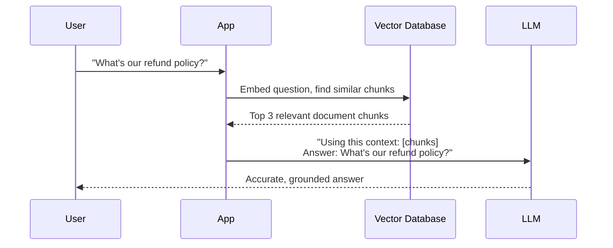

This is exactly how tools that "chat with your documents" work — including features that let Claude or ChatGPT search your uploaded files or connected knowledge base. Instead of the LLM guessing from memory, it retrieves the *actually relevant* text first via embedding similarity, then answers using that real context.

---

## 5. Multimodal Embeddings — One Space for Text, Images, Audio, and More

So far, everything has been about text. But the real breakthrough of recent years is putting **different types of media into the *same* meaning space**, so they become directly comparable.

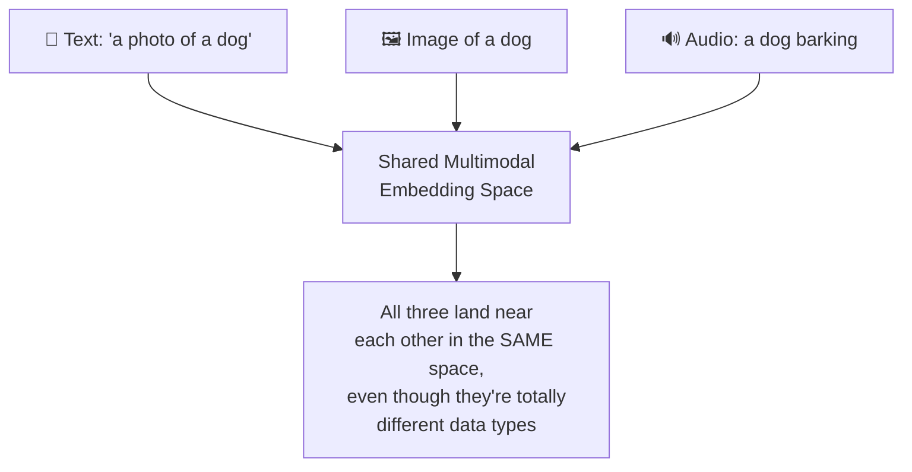

**The core trick:** train the model on huge amounts of *paired* data (millions of images with their captions, for example), and teach it to pull the embedding of an image and the embedding of its matching caption **close together**, while pushing unrelated pairs apart.

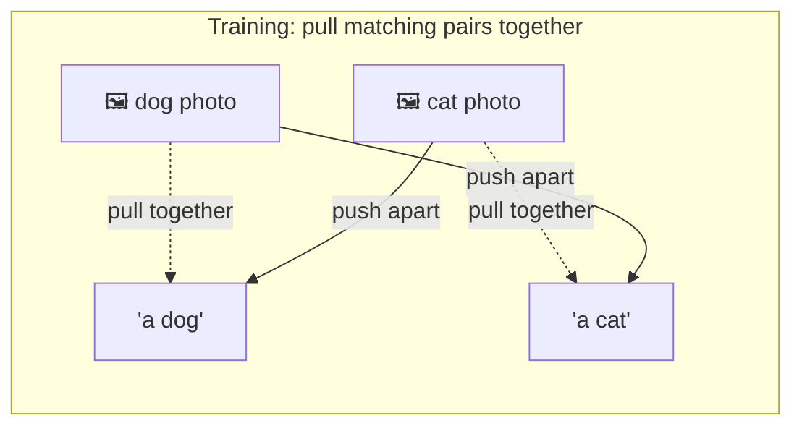

### What this unlocks

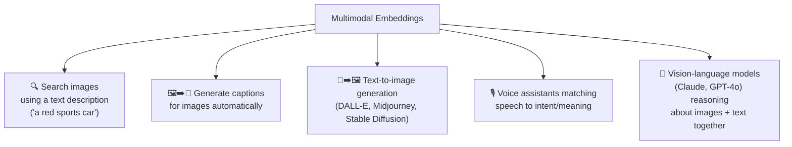

**Real example — CLIP (OpenAI, 2021):** one of the most influential multimodal models. It learned to embed images and text captions into the same space, purely by training on hundreds of millions of image-caption pairs scraped from the web. This is the technology underneath most modern "search images by describing them in words" features, and it laid groundwork for text-to-image generators.

**Why this matters for assistants like Claude:** when you upload a photo and ask a question about it, the model isn't running two separate systems — it's using a shared representation space where the image content and your text question can be reasoned about together, the same way it reasons about pure text.

---

## Quick Reference Table

| Term | Plain-English Meaning |
|---|---|
| **Token embedding** | Vector for one word-piece; used inside the model's internal layers |
| **Text/sentence embedding** | One vector summarizing a whole sentence or document; used for comparison tasks like search |
| **Static embedding** | Fixed vector per word, same regardless of context (older approach, e.g. Word2Vec) |
| **Contextual embedding** | Vector computed fresh based on surrounding words (modern approach, e.g. BERT/GPT/Claude) |
| **Embedding bias** | Real-world prejudices in training text becoming encoded as geometric patterns in vectors |
| **Semantic search** | Finding results by meaning similarity (via embeddings), not exact keyword match |
| **Vector database** | A database optimized to store embeddings and quickly find the "nearest" ones to a query |
| **RAG** | Retrieval-Augmented Generation — using semantic search to fetch relevant context before an LLM answers |
| **Multimodal embedding** | A shared vector space where text, images, audio, etc. can all be compared directly |
| **CLIP** | A landmark multimodal model connecting images and text in one embedding space |

---

## Explore Further

| Site | What you can do there |
|---|---|
| [projector.tensorflow.org](https://projector.tensorflow.org/) | Explore real word embeddings in 3D — try searching "bank" or "programmer" to see clustering (and potential bias) firsthand |
| [huggingface.co/spaces](https://huggingface.co/spaces) (search "CLIP") | Live demos of multimodal image-text search using CLIP |
| [Hugging Face `sentence-transformers` docs (sbert.net)](https://www.sbert.net/) | Practical library docs for generating text embeddings and running semantic search yourself |
| [OpenAI CLIP paper/blog](https://openai.com/index/clip/) | Official explanation of how the landmark CLIP multimodal model works |
| [Word Embedding Association Test resources](https://arxiv.org/abs/1608.07187) | The original research paper documenting bias in word embeddings ("Man is to Computer Programmer as Woman is to Homemaker?") |

**Try this:** in the Embedding Projector, search a profession-related word and see which other words cluster nearby — a hands-on way to notice (and think critically about) the kinds of associations discussed in the bias section above.
