# Neural Networks: The Brain of AI Models

Every AI model discussed so far — the tokenizer's embeddings, the attention mechanism, the LLM predicting the next word — ultimately runs *on top of* a neural network. This is the engine underneath everything. Here's how it actually works, from biological inspiration to real code.

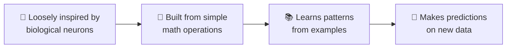

---

## 1. The Biological Inspiration (loosely)

The name "neural network" comes from a rough analogy to the brain — but it's important to know upfront: **artificial neural networks are not accurate brain simulations.** They borrow one core idea and build something entirely mathematical from it.

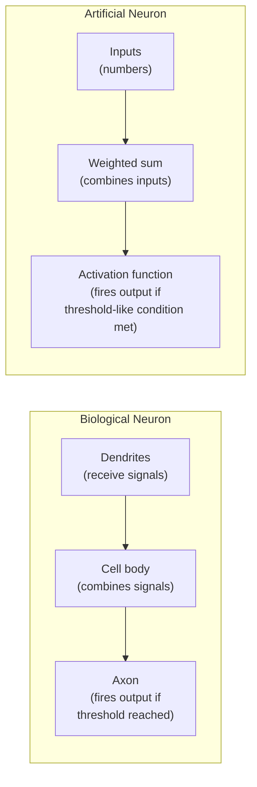

The borrowed idea: **many simple units, connected together, each deciding whether to "fire" based on combined input** — collectively producing complex behavior that no single unit could achieve alone. Everything past that idea (the actual math, training method, and architecture) is a human-engineered system, not a copy of biology.

---

## 2. The Artificial Neuron — The Atomic Unit

A single neuron does three simple steps:

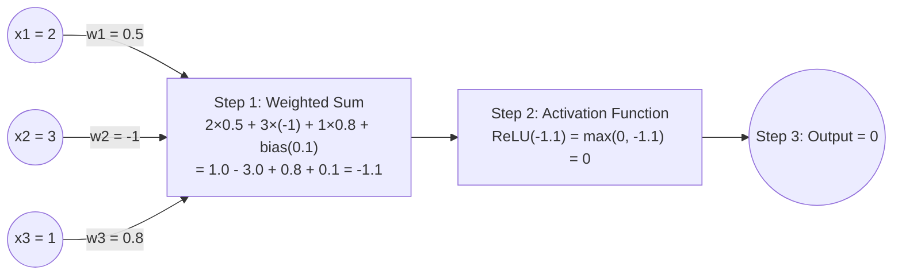

1. **Weighted sum**: multiply every input by its own learned weight, add them up, add a bias
2. **Activation function**: pass that sum through a nonlinear function
3. **Output**: the result gets passed on to the next layer of neurons

### Why the activation function matters (the most-skipped concept)

Without it, stacking layers would be pointless — a chain of purely linear operations collapses into a *single* linear operation, no matter how many layers you stack. The activation function's **nonlinearity** is what lets networks learn curves, thresholds, and complex patterns instead of only straight lines.

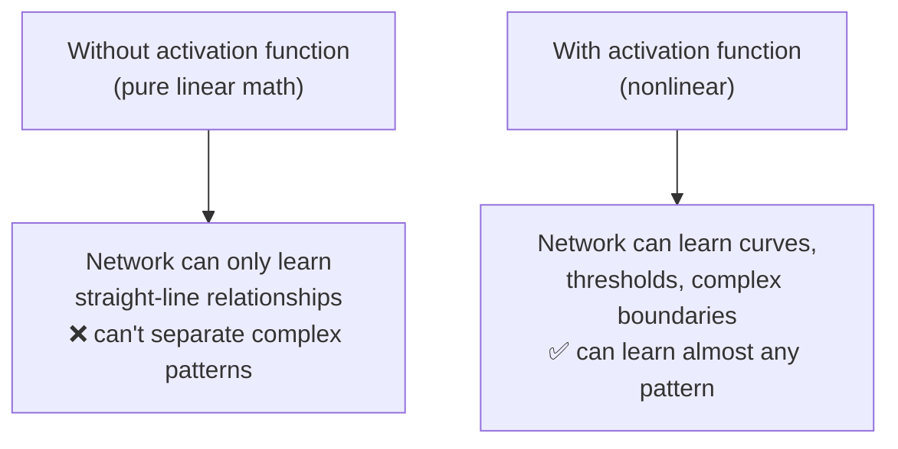

### Common activation functions

| Function | What it does | Where it's used |
|---|---|---|
| **ReLU** (Rectified Linear Unit) | Outputs the input if positive, else 0: `max(0, x)` | The default choice in most modern hidden layers — simple, fast, effective |
| **Sigmoid** | Squashes any number into a range between 0 and 1 | Output layer for yes/no (binary) predictions |
| **Softmax** | Converts a list of numbers into probabilities that sum to 1 | Output layer for "pick one of many" tasks — exactly how an LLM picks its next word |
| **GELU/SiLU** | Smoother variants of ReLU | Used inside modern Transformers (GPT, Claude, etc.) |

---

## 3. Layers: Stacking Neurons Into a Network

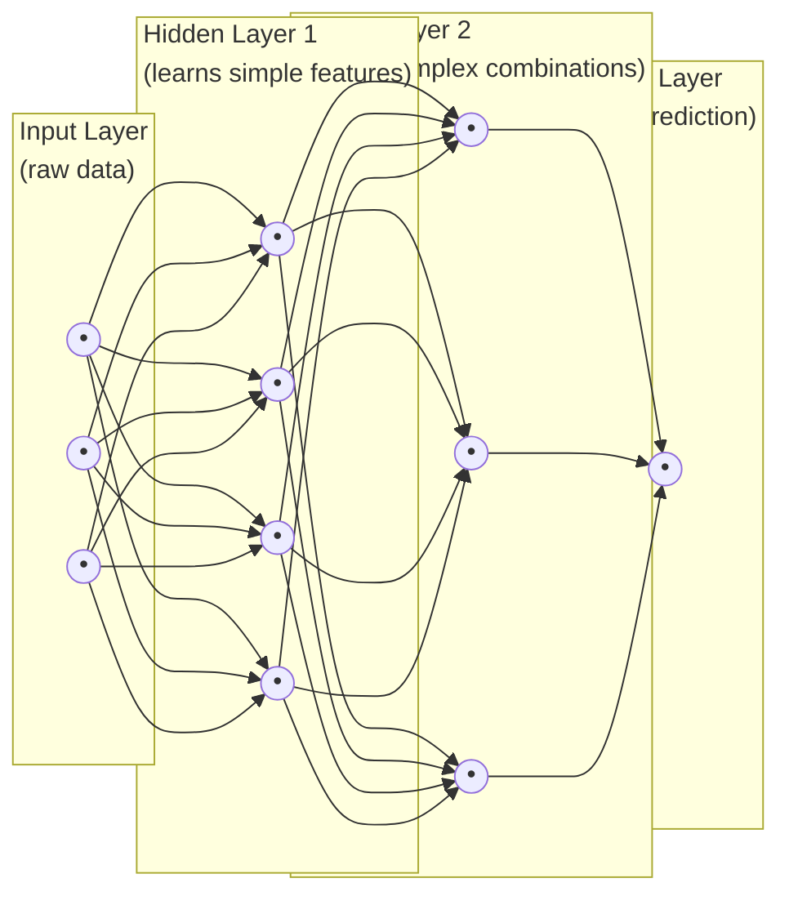

- **Input layer**: the raw numbers going in (pixel brightness values, token embeddings, sensor readings — whatever the data is)
- **Hidden layers**: the "thinking" happens here — each layer learns increasingly abstract combinations of what the previous layer detected
- **Output layer**: the final answer (a class label, a number, a probability distribution over the next word)

### A concrete example: recognizing a handwritten digit

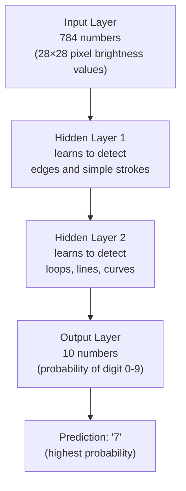

**"Deep" learning simply means many hidden layers stacked** — this depth is what allows the network to build up understanding in stages, from raw pixels → simple shapes → complex patterns → final answer, much like how you don't recognize a face by staring at individual pixels, but by noticing edges, then features, then the whole picture.

---

## 4. How the Network Learns: Forward Pass → Loss → Backpropagation

This loop is the entire "training" process, whether you're training a tiny classifier or a trillion-parameter LLM.

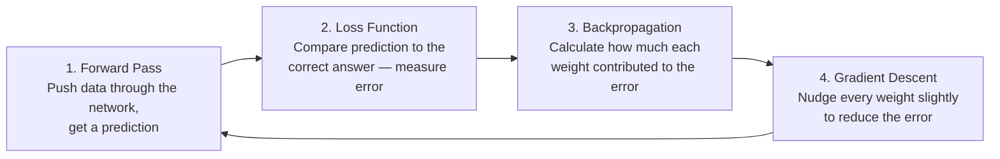

### Step 1 — Forward Pass
Data flows through the network left to right: input → hidden layers → output. Every neuron does its weighted-sum-then-activation calculation, layer by layer, until a final prediction comes out.

### Step 2 — Loss Function
Compare the prediction to the *actual correct answer* (which you know during training) with a formula that outputs a single number: how wrong was it?

```
Example: predicted "cat" with 60% confidence, but it was actually a "dog"
→ Loss function outputs a high error number
```

### Step 3 — Backpropagation (the clever part)
This is calculus (the chain rule), applied automatically, working *backward* from the output to every single weight in the network, answering: **"if I nudge this specific weight slightly, does the error go up or down, and by how much?"**

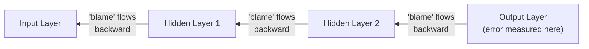

Think of it like a company retrospective after a failed project: you trace the outcome backward through every decision that led to it, figuring out exactly how much each decision contributed to the failure — except here it's done with exact math (derivatives), for every single weight, automatically.

### Step 4 — Gradient Descent (the update)
Once you know *which direction* would reduce the error for each weight, nudge every weight a tiny step in that direction. Do this over and over, across millions of examples, and the weights gradually settle into values that make good predictions.

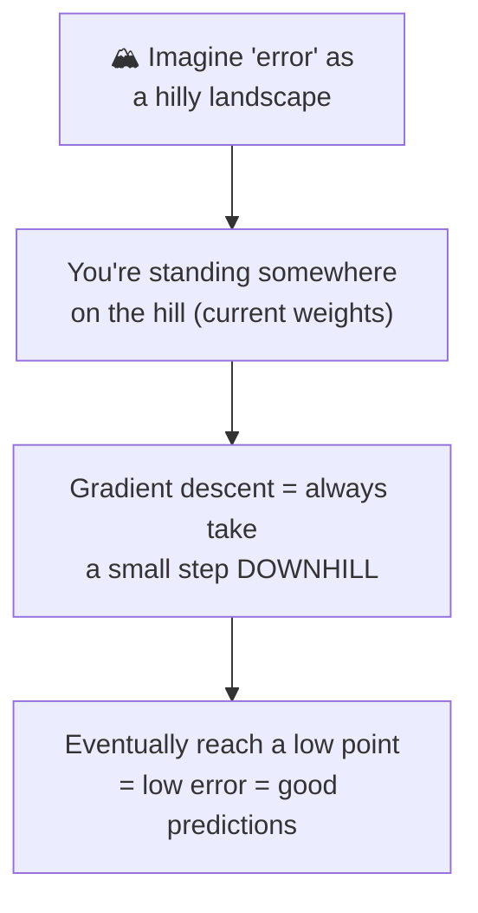

This is why it's called **gradient descent** — you're descending toward the lowest point of "error," one small step at a time, guided by the gradient (slope) calculated via backpropagation.

---

## 5. See It in Code: A Neural Net Learning XOR

XOR is a classic test because it's a pattern a *single* neuron mathematically cannot learn (it's not separable with one straight line) — but a network with a hidden layer can.

```python
import random
import math

# XOR truth table: output is 1 only when inputs DIFFER
data = [
    ([0, 0], 0),
    ([0, 1], 1),
    ([1, 0], 1),
    ([1, 1], 0),
]

def sigmoid(x):
    return 1 / (1 + math.exp(-x))

def sigmoid_derivative(x):
    return x * (1 - x)

# Tiny network: 2 inputs -> 2 hidden neurons -> 1 output
random.seed(1)
w_input_hidden = [[random.uniform(-1, 1) for _ in range(2)] for _ in range(2)]
w_hidden_output = [random.uniform(-1, 1) for _ in range(2)]
bias_hidden = [random.uniform(-1, 1) for _ in range(2)]
bias_output = random.uniform(-1, 1)

lr = 0.5

for epoch in range(10000):
    for inputs, target in data:
        # ---- forward pass ----
        hidden = [
            sigmoid(sum(inputs[j] * w_input_hidden[i][j] for j in range(2)) + bias_hidden[i])
            for i in range(2)
        ]
        output = sigmoid(sum(hidden[i] * w_hidden_output[i] for i in range(2)) + bias_output)

        # ---- backpropagation ----
        output_error = target - output
        output_delta = output_error * sigmoid_derivative(output)

        hidden_deltas = [
            output_delta * w_hidden_output[i] * sigmoid_derivative(hidden[i])
            for i in range(2)
        ]

        # ---- update weights (gradient descent) ----
        for i in range(2):
            w_hidden_output[i] += lr * output_delta * hidden[i]
            for j in range(2):
                w_input_hidden[i][j] += lr * hidden_deltas[i] * inputs[j]
            bias_hidden[i] += lr * hidden_deltas[i]
        bias_output += lr * output_delta

# Test the trained network
print("Testing learned XOR function:")
for inputs, target in data:
    hidden = [
        sigmoid(sum(inputs[j] * w_input_hidden[i][j] for j in range(2)) + bias_hidden[i])
        for i in range(2)
    ]
    output = sigmoid(sum(hidden[i] * w_hidden_output[i] for i in range(2)) + bias_output)
    print(f"  {inputs} -> {output:.3f} (expected {target})")
```

**Expected output:** predictions close to `0, 1, 1, 0` — the network discovered the XOR pattern purely from the four labeled examples, using exactly the forward-pass/backprop/gradient-descent loop described above.

---

## 6. Not All Neural Networks Are Built the Same — Common Architectures

The layers-of-neurons idea is the foundation, but different problems call for different *arrangements* of that foundation:

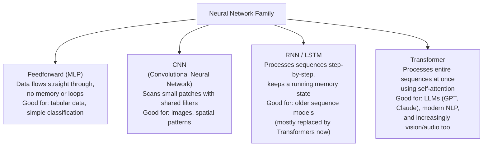

| Architecture | Core trick | Best for |
|---|---|---|
| **Feedforward** | Straightforward layer-by-layer | Simple structured data |
| **CNN** | Small filters slide across the input, detecting local patterns (edges, textures) | Images, video |
| **RNN/LSTM** | Processes one step at a time, carrying a memory forward | Older speech/text models (largely succeeded by Transformers) |
| **Transformer** | Self-attention — every element looks at every other element at once | Modern LLMs, and now vision & multimodal models too |

**The throughline:** every one of these is still built from the same atomic unit — neurons doing weighted sums + activation functions — and trained with the same forward-pass/backprop/gradient-descent loop. The *architecture* just changes how neurons are wired together to suit the shape of the problem.

---

## 7. Parameters — Why People Say "175 Billion Parameter Model"

Every weight and every bias in a network is called a **parameter**. When you hear a model described by its parameter count, that's literally the total number of these adjustable numbers, all tuned during training.

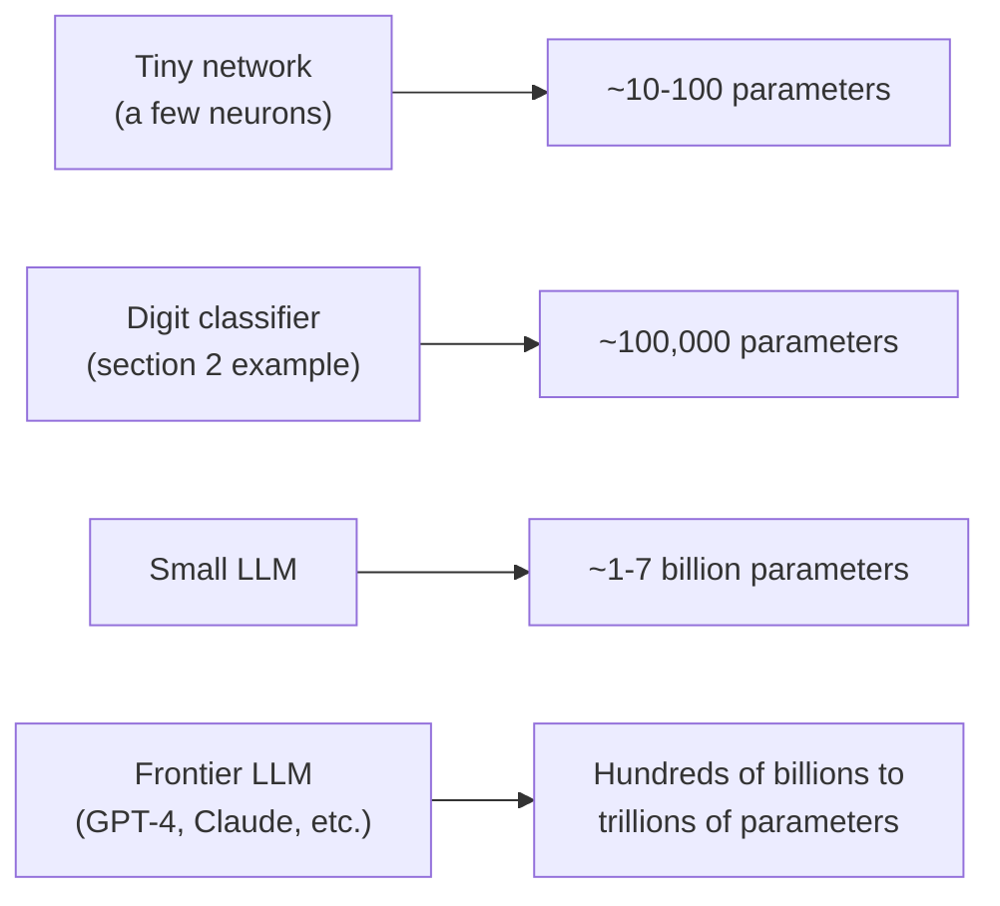

More parameters generally means the network can represent more complex patterns — but it also needs proportionally more training data and compute to tune all those numbers well, which is why building frontier models requires massive datasets and enormous computing infrastructure.

---

## Quick Reference

| Term | Plain-English Meaning |
|---|---|
| **Neuron** | A unit that computes a weighted sum of inputs, then applies an activation function |
| **Weight** | A learned number controlling how much one input matters |
| **Bias** | A learned offset added to a neuron's sum |
| **Activation function** | A nonlinear function (ReLU, sigmoid, softmax) letting networks learn complex patterns |
| **Layer** | A group of neurons operating in parallel at the same "depth" |
| **Forward pass** | Pushing data through the network to get a prediction |
| **Loss function** | Measures how wrong a prediction is |
| **Backpropagation** | The algorithm computing how much each weight contributed to the error |
| **Gradient descent** | The optimization method that nudges weights to reduce error, step by step |
| **Epoch** | One full pass through the entire training dataset |
| **Parameter** | Any single learnable weight or bias — "a 70B model" means 70 billion of these |
| **Architecture** | The specific way neurons/layers are arranged (feedforward, CNN, RNN, Transformer) |

---

## Explore Further

| Site | What you can do there |
|---|---|
| [playground.tensorflow.org](https://playground.tensorflow.org/) | Build and train a tiny neural network live in your browser — adjust layers, watch it learn in real time, no coding needed. **Best hands-on starting point.** |
| [3blue1brown Neural Networks series (YouTube)](https://www.3blue1brown.com/topics/neural-networks) | The most-loved visual explanation of neurons, backpropagation, and gradient descent, with beautiful animations |
| [cs231n.github.io](https://cs231n.github.io/) | Stanford's famous (free) course notes on neural networks and CNNs, from fundamentals up |
| [pytorch.org/tutorials](https://pytorch.org/tutorials/) | Official tutorials for building real neural networks in PyTorch, from a first neuron to full architectures |

**Try this:** open the TensorFlow Playground, pick the "spiral" dataset (the hardest one), and try adding hidden layers/neurons until the network can separate it — a very fast, visceral way to feel *why* depth and nonlinearity matter.
