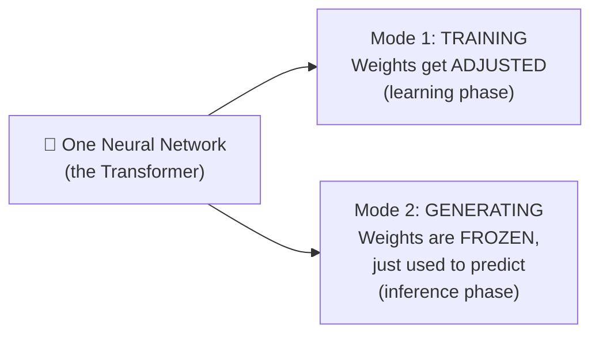
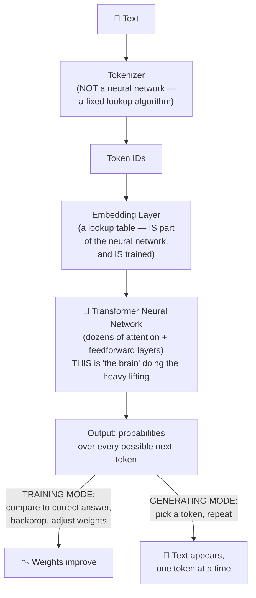
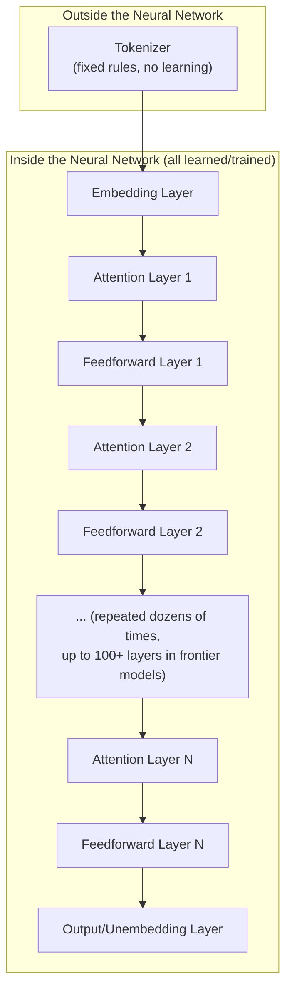
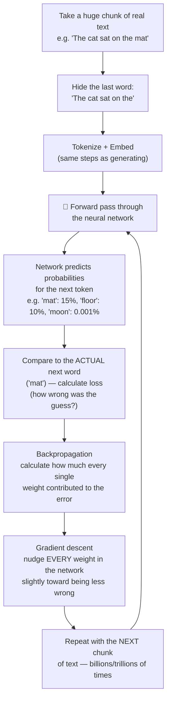
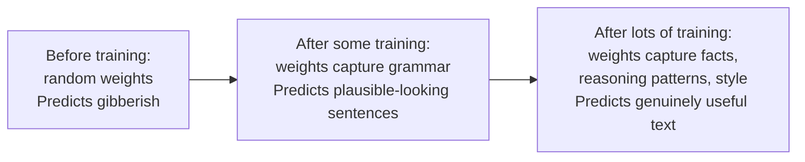
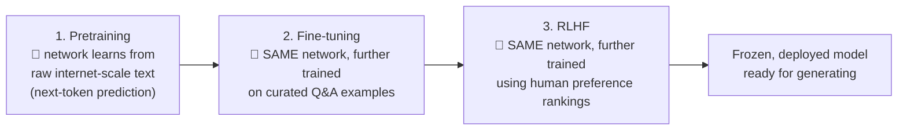
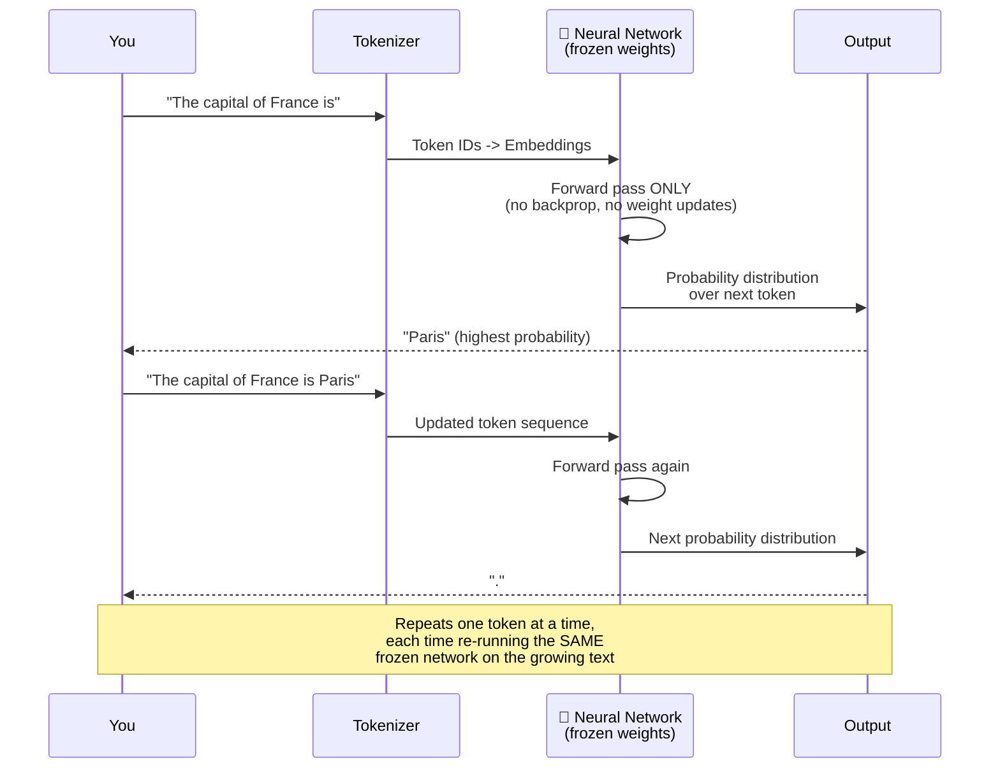
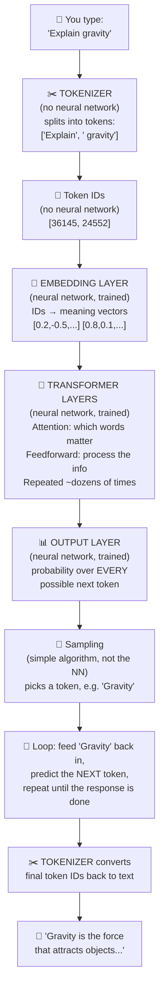
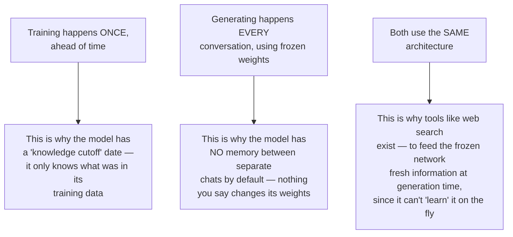

# Where the Neural Network Lives in an LLM: Training vs. Generating, Start to Finish

Short answer: **the same neural network is used for both** — training and generating are two different *modes* of running the exact same network. Training is how the network's weights get set; generating is using those already-set weights to produce answers. This guide walks the entire pipeline end to end and marks exactly where the neural network does its work at each stage.

---

## 1. The Big Picture: One Pipeline, Two Modes

Two things are **not** neural network computation, and it's worth being precise about this:
- **The tokenizer** (splitting text into tokens) is a fixed, rule-based algorithm — no learning involved, no weights.
- Everything from the **embedding layer onward** *is* the neural network — including the embedding table itself, which is trained just like every other weight.

---

## 2. Where Exactly Is "The Neural Network"?

Every box inside "INSIDE" has **weights** — numbers that started random and were tuned during training. That entire stack, repeated dozens or hundreds of times, *is* the neural network. When people say an LLM has "70 billion parameters," they're counting every single weight across every one of these layers.

---

## 3. TRAINING MODE — Where the Network Actually Learns

Training is where the neural network's weights go from random noise to something that captures language, knowledge, and reasoning patterns. This happens **once** (an expensive, months-long process), before the model is ever released to users.

**This is the exact same forward-pass → loss → backpropagation → gradient-descent loop from the earlier neural network guide** — just running on a network with billions of neurons, on a dataset with trillions of tokens, on thousands of specialized computer chips (GPUs/TPUs), running for weeks or months.

### What actually changes during training

### The three training stages (from an earlier guide, now placed correctly)

Notice: it's **one continuous network** across all three stages — pretraining doesn't produce one model that gets thrown away and replaced. The same weights keep getting refined, stage after stage.

---

## 4. GENERATING MODE — Where the (Now-Frozen) Network Gets Used

Once training is complete, the weights are **frozen** — locked in place. Every time you chat with the model, it runs the exact same neural network, using those fixed weights, purely to compute predictions. No learning happens during your conversation (nothing you say updates the model's actual weights).

**Key distinction from training:**

| | Training | Generating (Inference) |
|---|---|---|
| **Weights** | Being adjusted constantly | Completely frozen |
| **Backpropagation** | Happens every step | Never happens |
| **Direction of computation** | Forward AND backward | Forward only |
| **Goal** | Make the network more accurate | Use the (already accurate) network to answer |
| **Cost** | Extremely expensive (months, huge compute) | Much cheaper per response (still real, but far less) |
| **Happens** | Once, before release (occasionally updated with new versions) | Every single time you send a message |

---

## 5. The Full End-to-End Walkthrough: One Sentence, Start to Finish

Let's trace "Explain gravity" through the *entire* system, marking every step:

**So, to directly answer the question:** the neural network is used for **both** training and generating — but it does fundamentally different *jobs* in each:
- **In training**, the network is the *thing being changed* — every weight inside it gets adjusted to reduce prediction error, over trillions of examples.
- **In generating**, the network is the *thing doing the work* — its already-learned weights are used, unchanged, to compute a probability distribution over what word should come next, repeatedly, to build your response.

---

## 6. Why This Split Matters (Practical Implications)

This also explains why an assistant can be given new information mid-conversation (like a document you upload, or a memory summary of past chats) — that information isn't changing the network's weights, it's just extra text added to the input that flows through the same frozen network as additional context, exactly the way your original question does.

---

## Quick Reference

| Stage | Neural network involved? | What happens |
|---|---|---|
| **Tokenization** | ❌ No — fixed algorithm | Text split into tokens, tokens mapped to IDs |
| **Embedding lookup** | ✅ Yes — trained weights | Token IDs converted into meaning-vectors |
| **Transformer layers (attention + feedforward)** | ✅ Yes — trained weights | The "thinking" — context is weighed, patterns processed |
| **Output layer** | ✅ Yes — trained weights | Produces probability distribution over next token |
| **Sampling** | ❌ No — simple algorithm | Picks an actual token from the probability distribution |
| **Training update (backprop)** | ✅ Yes — this IS training | Weights adjusted based on prediction error |

| Mode | Weights | Direction | When it happens |
|---|---|---|---|
| **Training** | Being adjusted | Forward + backward | Once, before release (by the AI company) |
| **Generating** | Frozen | Forward only | Every time you chat with the model |

---

## Explore Further

| Site | What you can do there |
|---|---|
| [transformer-circuits.pub](https://transformer-circuits.pub/) | Anthropic's research publications visually breaking down what's actually happening inside trained Transformer networks |
| [bbycroft.net/llm](https://bbycroft.net/llm) | An incredible interactive 3D visualization of a real LLM's full architecture — watch tokens flow through embeddings, attention, and output layers live |
| [jalammar.github.io/illustrated-transformer](https://jalammar.github.io/illustrated-transformer/) | The most famous visual, step-by-step walkthrough of the Transformer architecture |
| [playground.tensorflow.org](https://playground.tensorflow.org/) | Revisit this to reinforce the training loop (forward pass, loss, gradient descent) on a tiny scale before mapping it onto LLM-scale training |

**Try this:** open bbycroft.net/llm and pick the smallest model shown. Type a sentence and watch it visually animate the exact pipeline from this guide — tokenization, embedding, attention layers lighting up, and the final probability distribution — happening in real time on a real (small) model.
