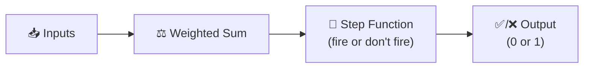
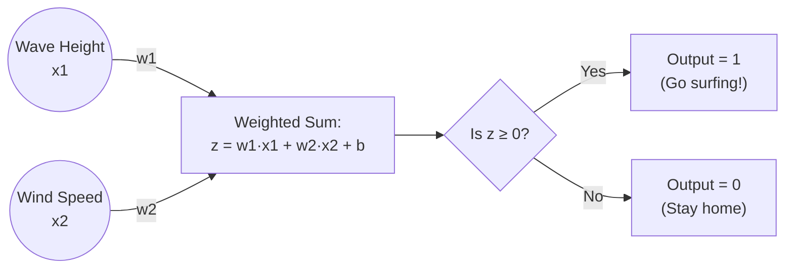
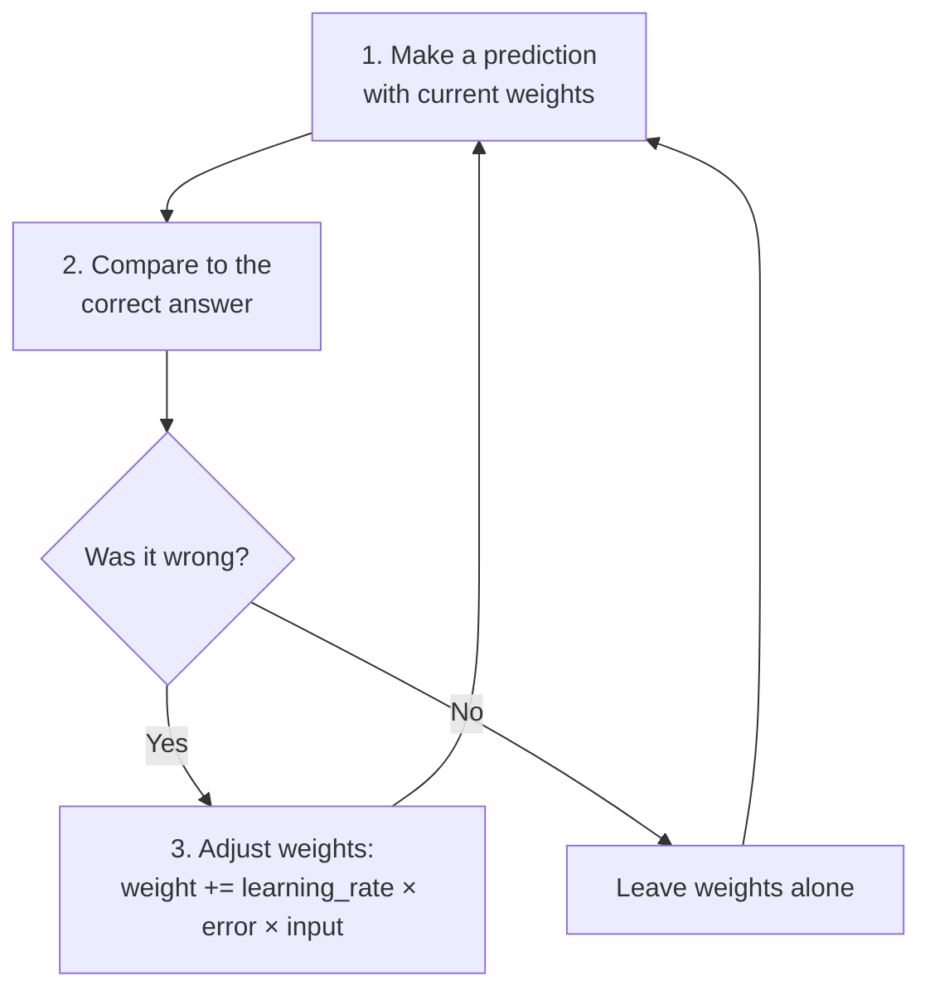
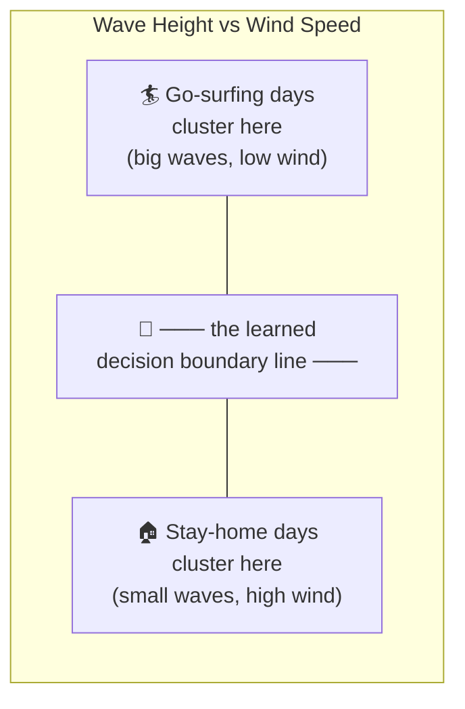
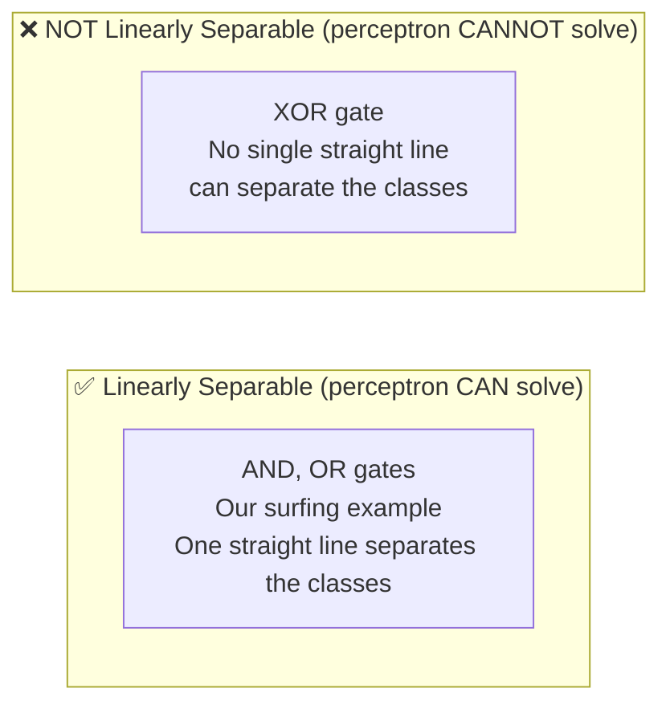

# The Perceptron: The Simplest "Brain Cell" — Solved With a Real Example

The perceptron is the original neural network — invented in 1958, and still the best way to *feel* how a neuron learns, since it's simple enough to trace by hand.



---

## 1. The Problem: "Should I Go Surfing Today?"

Let's teach a perceptron to make a real decision using two pieces of information:
- **Wave height** (feet)
- **Wind speed** (mph — lower is better for surfing)

We'll give it some past experience (labeled examples of good/bad surf days) and watch it *learn the rule on its own*.

| Wave Height (ft) | Wind Speed (mph) | Went Surfing? |
|---|---|---|
| 6 | 5 | ✅ Yes (1) |
| 7 | 8 | ✅ Yes (1) |
| 2 | 4 | ❌ No (0) |
| 1 | 20 | ❌ No (0) |
| 8 | 3 | ✅ Yes (1) |
| 3 | 25 | ❌ No (0) |

Notice: good days tend to have **big waves + low wind**. We never *tell* the perceptron this rule — it has to discover it purely from the labeled examples.

---

## 2. How a Perceptron Makes a Decision



The **step function** is what makes this a perceptron specifically — it's the simplest possible activation function: a hard yes/no threshold, unlike the smoother ReLU/sigmoid used in modern networks.

```
z = (w1 × wave_height) + (w2 × wind_speed) + bias
output = 1 if z ≥ 0, else 0
```

---

## 3. The Perceptron Learning Rule

This is simpler than full backpropagation (it predates it!) — but it's the same core spirit: **predict, check the error, nudge the weights.**



The update rule, in words: *"If I predicted too low, increase the weights on the inputs that were positive (push the sum up next time). If I predicted too high, decrease them."*

```
error = correct_answer - prediction
new_weight = old_weight + (learning_rate × error × input_value)
new_bias   = old_bias   + (learning_rate × error)
```

---

## 4. Solving It By Hand — First Few Steps

Let's trace the very first few updates manually so you can see the mechanics (using normalized/scaled inputs for cleaner numbers, learning rate = 0.1):

**Start:** `w1 = 0`, `w2 = 0`, `bias = 0` (the perceptron knows nothing yet)

**Example 1:** Wave=6, Wind=5, Correct answer=1
```
z = (0 × 6) + (0 × 5) + 0 = 0
Since z ≥ 0 → prediction = 1
error = 1 - 1 = 0   →  Correct! No update needed.
```

**Example 3:** Wave=2, Wind=4, Correct answer=0
```
z = (0 × 2) + (0 × 4) + 0 = 0
Since z ≥ 0 → prediction = 1
error = 0 - 1 = -1   →  Wrong! Update weights:
  w1 = 0 + (0.1 × -1 × 2) = -0.2
  w2 = 0 + (0.1 × -1 × 4) = -0.4
  bias = 0 + (0.1 × -1) = -0.1
```

Notice what just happened: because this was a **bad surf day** that got wrongly predicted as "go," the perceptron *lowered* the weights on wave height and wind speed — making it harder for similar inputs to cross the threshold next time. This is the entire learning mechanism, repeated for every example, across many passes (epochs), until it stops making mistakes.

---

## 5. Full Working Code

```python
class Perceptron:
    def __init__(self, num_inputs, learning_rate=0.1):
        self.weights = [0.0] * num_inputs
        self.bias = 0.0
        self.lr = learning_rate

    def predict(self, inputs):
        z = sum(w * x for w, x in zip(self.weights, inputs)) + self.bias
        return 1 if z >= 0 else 0

    def train(self, training_data, epochs=20):
        for epoch in range(epochs):
            total_errors = 0
            for inputs, target in training_data:
                prediction = self.predict(inputs)
                error = target - prediction
                if error != 0:
                    total_errors += 1
                    for i in range(len(self.weights)):
                        self.weights[i] += self.lr * error * inputs[i]
                    self.bias += self.lr * error
            if total_errors == 0:
                print(f"Converged after {epoch} epochs! No more mistakes.")
                break


# Data: [wave_height, wind_speed] -> went surfing? (1=yes, 0=no)
# Wind speed is "inverted" conceptually (high wind = bad) so we negate it
# to make the relationship easier for the perceptron: bigger number = better
training_data = [
    ([6, -5], 1),
    ([7, -8], 1),
    ([2, -4], 0),
    ([1, -20], 0),
    ([8, -3], 1),
    ([3, -25], 0),
]

model = Perceptron(num_inputs=2, learning_rate=0.1)
model.train(training_data, epochs=20)

print(f"\nLearned weights: {model.weights}")
print(f"Learned bias: {model.bias}\n")

# Test on NEW days it has never seen
test_days = [
    ([5, -6], "5ft waves, 6mph wind"),
    ([1, -15], "1ft waves, 15mph wind"),
    ([9, -2], "9ft waves, 2mph wind"),
]

for inputs, description in test_days:
    result = model.predict(inputs)
    print(f"{description} -> {'🏄 Go surfing!' if result == 1 else '🏠 Stay home'}")
```

**Expected output (approximately):**
```
Converged after 4 epochs! No more mistakes.

Learned weights: [0.8, 0.9]
Learned bias: -3.5

5ft waves, 6mph wind -> 🏄 Go surfing!
1ft waves, 15mph wind -> 🏠 Stay home
9ft waves, 2mph wind -> 🏄 Go surfing!
```

The perceptron correctly generalizes to **brand-new days it never saw during training** — it didn't memorize the 6 examples, it learned the underlying *rule* (roughly: "big waves good, high wind bad") as a mathematical boundary.

---

## 6. Visualizing What It Learned: A Decision Boundary

A perceptron essentially draws **one straight line** (or in higher dimensions, a flat plane) that separates the two classes:



Every point on one side of that line gets classified "surf," every point on the other side gets classified "stay home." Training a perceptron is literally the process of searching for the position and angle of that line that best separates the two groups.

---

## 7. The Famous Limitation: What a Perceptron *Can't* Do

This matters enough that it caused an entire AI Winter (mentioned in the evolution timeline earlier). A single perceptron can only solve problems that are **linearly separable** — where one straight line can cleanly divide the two classes.



```
AND gate (perceptron CAN learn this):
  0,0 -> 0        0,1 -> 0
  1,0 -> 0        1,1 -> 1
  (all the 0s cluster together, separable by one line)

XOR gate (perceptron CANNOT learn this):
  0,0 -> 0        0,1 -> 1
  1,0 -> 1        1,1 -> 0
  (the 1s are diagonal from each other — no straight line works!)
```

This limitation, published in the 1969 book *Perceptrons* by Minsky and Papert, contributed to funding drying up for neural network research for over a decade. **The fix** (as covered in the previous guide's XOR example) was stacking multiple layers of perceptron-like neurons together — a "multi-layer perceptron" — which *can* bend and combine multiple lines to carve out any shape, however complex. That single limitation-and-fix is a major turning point in the entire history of AI.

---

## Quick Reference

| Term | Plain-English Meaning |
|---|---|
| **Perceptron** | The simplest possible neural network: one neuron, weighted sum, hard step-function output |
| **Step function** | Perceptron's activation: outputs exactly 0 or 1 based on a threshold, no in-between |
| **Perceptron learning rule** | predict → measure error → nudge weights toward the correct answer |
| **Decision boundary** | The line (or plane) the perceptron draws to separate two classes |
| **Linearly separable** | A problem solvable by a single straight-line boundary |
| **Convergence** | When the perceptron stops making mistakes on the training data |
| **Multi-layer perceptron (MLP)** | Multiple perceptron-like layers stacked, overcoming the linear-separability limit |

---

## Explore Further

| Site | What you can do there |
|---|---|
| [playground.tensorflow.org](https://playground.tensorflow.org/) | Try the simplest "two clusters" dataset with zero hidden layers — that's a live perceptron. Then try the "XOR" or "circle" dataset with zero hidden layers and watch it fail to converge. |
| [3blue1brown Neural Networks series](https://www.3blue1brown.com/topics/neural-networks) | Beautifully animated walkthrough of how a single neuron and full networks compute and learn |

**Try this:** in TensorFlow Playground, set hidden layers to **zero** and pick the "two Gaussian blobs" dataset — watch a live perceptron converge in seconds. Then switch to the "XOR" dataset with still zero hidden layers, and watch it hopelessly fail to separate the points — the exact 1969 discovery, reproduced live in your browser.
