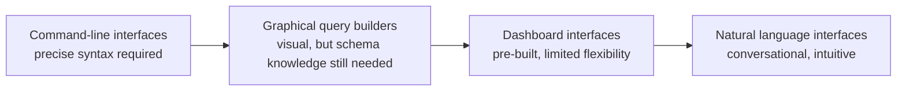
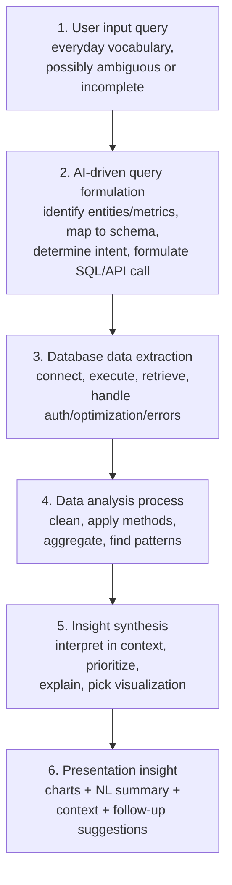
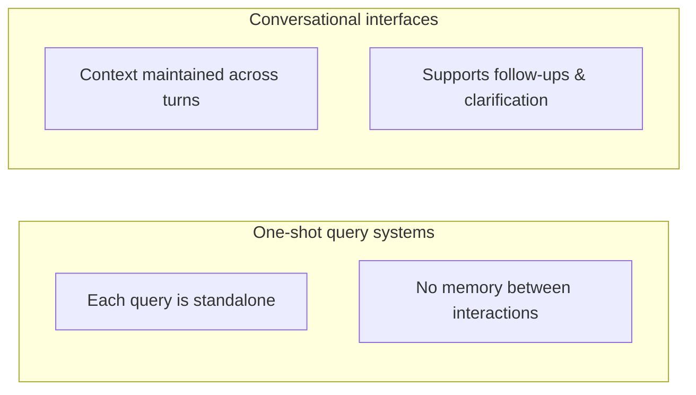
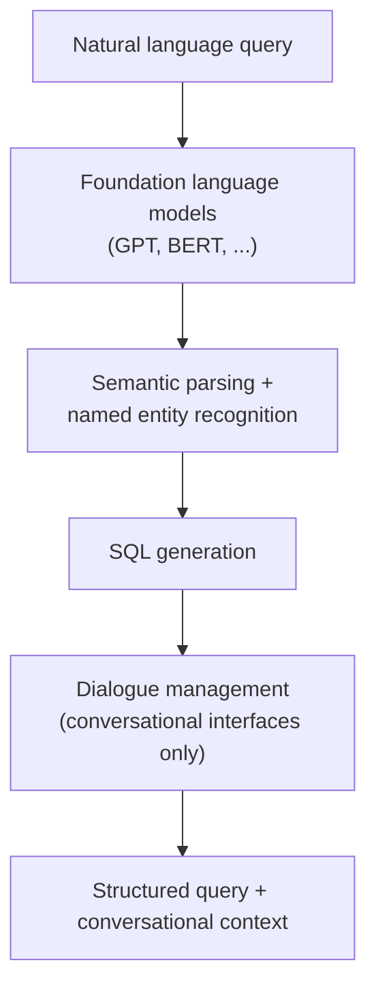
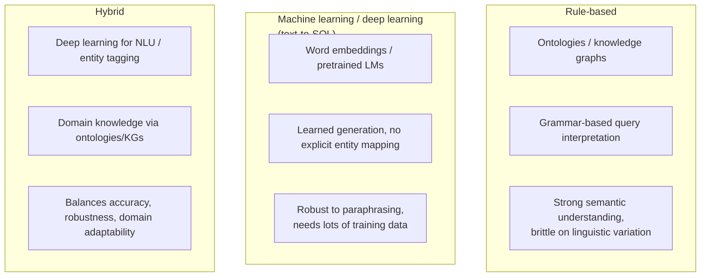
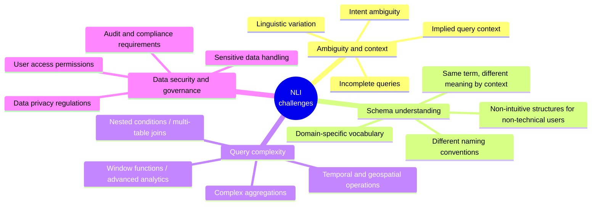
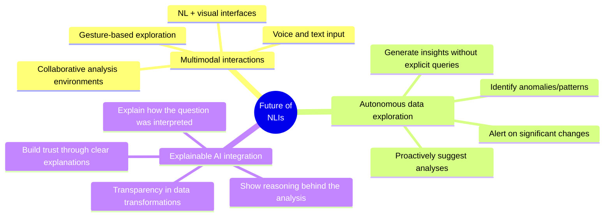

# Natural Language Interfaces for Data Systems

## Learning objectives

- Explain how natural language interfaces (NLIs) convert user queries into data insights
- Differentiate between rule-based, machine learning, and hybrid NLI approaches

## Introduction

Data is only valuable if people can actually access and analyze it.
Traditionally that required SQL or BI-tool skills, creating a divide
between people who can query data directly and people who need insights
but lack that technical expertise.

**Natural language interfaces (NLIs)** close that gap: instead of writing
SQL, a user asks "What were the sales in the Northeast region last
quarter?" and the system does the translation.

## The evolution of data access interfaces

Each stage shifts more of the burden from the human learning the computer's
language toward the computer understanding human language.

## How natural language interfaces work

NLIs transform a human question into a structured, executable query, then
transform the result back into something a human can understand.

1. **User input query** — everyday vocabulary rather than technical terms;
   may be ambiguous, incomplete, or carry implicit assumptions about what
   data matters.
2. **AI-driven query formulation** — identifies key entities/metrics, maps
   natural language terms to schema elements, determines analytical intent
   (comparison, trend, distribution, ...), and formulates the technical
   query (SQL, API call, etc.).
3. **Database data extraction** — connects to the relevant source(s),
   executes the query, retrieves the raw data, and handles authentication,
   optimization, and error management.
4. **Data analysis process** — cleans/preprocesses, applies statistical
   methods, aggregates, and identifies patterns/trends/anomalies.
5. **Insight synthesis** — interprets results in context, identifies key
   findings, prioritizes by relevance, generates natural-language
   explanations, and selects an appropriate visualization. This is where
   AI adds value beyond computation — understanding *significance*.
6. **Presentation insight** — visualizations, natural-language summaries,
   contextual explanations, and suggested follow-up questions, combining
   visual and textual output for any technical background.

## Types of natural language interfaces

| | One-shot query systems | Conversational interfaces |
| --- | --- | --- |
| Context | None — each query independent | Maintained across multiple turns |
| Strengths | Simpler to implement; good for direct, specific queries; easier to optimize for performance | Supports follow-ups and clarifications; enables iterative exploration; more natural interaction; can disambiguate vague queries through dialogue |
| Limitations | Cannot handle follow-ups; no memory of previous interactions; limited ability to refine/clarify | More complex to implement; requires dialogue state tracking; may have higher latency from context processing |

Conversational interfaces are gaining popularity because they let users
explore data and derive insights in small incremental steps — clarifying
ambiguity through dialogue while the system persists context across turns.

## Key technologies powering NLIs

### 1. Foundation language models

LLMs like GPT and BERT provide the backbone for understanding natural
language queries:

- Interpret user intent from natural language
- Handle various phrasings of the same question
- Understand domain-specific terminology
- Generate human-like explanations and summaries

### 2. Semantic parsing and named entity recognition

These identify the key components of a query:

- Extract entities (products, regions, metrics) from text
- Understand relationships between entities
- Map natural language terms to database schema elements
- Identify query operations (filtering, sorting, aggregating, ...)

Semantic parsing is critical because it produces a **structured semantic
representation** of the query — detecting intents and entities that are
then mapped onto schema elements.

### 3. SQL generation

Converting natural language into a database query requires:

- Building syntactically correct SQL statements
- Handling complex queries (joins, nested conditions)
- Managing different database dialects
- Optimizing queries for performance

The complexity of structured query languages (SQL, SPARQL) makes this
translation genuinely hard — the system must infer correct entity mappings
and derive correct query structure from linguistic patterns.

### 4. Dialogue management

For conversational interfaces specifically:

- **State tracking** — keeps track of the current state of data
  exploration given the prior queries in the session
- **Decision making** — chooses the appropriate external knowledge source
  and generates structured queries to retrieve data
- **Natural language response generation** — produces a response
  conditioned on identified intents, extracted entities, conversation
  context, and results from the knowledge source

## Approaches to building NLIs

### 1. Rule-based approaches

Use semantic indices, ontologies, and knowledge graphs to identify entities
and their relationships:

- Map parts of a query to concepts/relationships in the data model
- Use grammar-based techniques for interpretation and SQL generation
- Strong in semantic understanding and domain adaptation
- **Weakness:** brittle when handling linguistic variation

### 2. Machine learning / deep learning approaches (text-to-SQL)

Use deep learning to translate natural language directly to SQL:

- Encode input as features via word embeddings or pretrained LMs
- Train models to generate SQL without explicit entity mapping
- More robust to paraphrasing and linguistic variation
- **Weakness:** needs large training data, can struggle on complex
  queries or new domains

### 3. Hybrid approaches

Combine the strengths of both:

- Deep learning for entity tagging / natural language understanding
- Domain knowledge incorporated via ontologies or knowledge graphs
- Statistical models combined with rule-based techniques for different
  parts of the pipeline
- Aim: balance accuracy, robustness, and domain adaptability

## Applications and use cases

### Business intelligence

- Executives ask direct questions about business performance
- Sales teams query CRM data without technical assistance
- Operations staff access metrics through simple questions
- Finance teams explore financial data through conversation

Conversational BI systems are especially valuable — they let business
users and analytics teams quickly understand not just *what* happened but
*why*, through natural dialogue.

### Data science and analytics

- Simplifies exploratory data analysis
- Enables quick hypothesis testing through natural questions
- Democratizes access to analytics capabilities
- Accelerates the data-to-insight pipeline

### Enterprise information systems

- Provides unified access to siloed data sources
- Enables cross-departmental data exploration
- Reduces dependency on IT for data access
- Accelerates decision-making with timely insights

## Challenges and limitations

### Ambiguity and context

"How are sales this year?" could mean total sales vs. last year, sales by
category, sales by region, or monthly trends. Ambiguity in intent and
entities, implicit context, linguistic variation, and incomplete queries
all make interpretation genuinely difficult.

### Schema understanding

The system must map natural language terms to the *correct* database
entities — but naming conventions differ across databases, the same term
can mean different things in different contexts, and structures aren't
always intuitive to non-technical users. Domains like finance and
healthcare each carry their own vocabulary; a good NLI needs to understand
domain semantics *and* generalize across domains.

### Query complexity

Simple queries are handled well; harder cases include nested conditions,
multi-table joins, window functions, temporal/geospatial operations, and
complex aggregations. Even detecting *whether* a query needs a nested
structure is non-trivial — the system has to identify proper sub-queries
and the right conditions to join or combine them.

### Data security and governance

NLIs must still respect security boundaries: user access permissions, data
privacy regulations, sensitive data handling, and audit/compliance
requirements — natural language doesn't get an exemption from access
control.

## Recent advances and benchmarks

| Benchmark | What it tests |
| --- | --- |
| **WikiSQL** | NL question / SQL query pairs over Wikipedia tables |
| **Spider** | Cross-domain dataset with complex SQL (joins, nested queries) |
| **SParC** | Context-dependent, multi-turn version — follow-up questions |
| **CoSQL** | Dialogue version simulating real database-querying scenarios |

These benchmarks have driven steady progress, with recent systems
achieving increasingly higher accuracy on complex, multi-domain queries.

## The future of natural language interfaces for data

## Summary

- NLIs represent a fundamental shift in how organizations leverage data —
  removing the technical barrier to access democratizes analytics and
  speeds up data exploration.
- The pipeline is: **user query → AI-driven query formulation → data
  extraction → analysis → insight synthesis → presentation**.
- **One-shot** systems are simpler but stateless; **conversational**
  interfaces maintain context and support iterative, clarifying dialogue —
  and are gaining popularity for exactly that reason.
- Core technologies: **foundation language models**, **semantic
  parsing/NER**, **SQL generation**, and (for conversational systems)
  **dialogue management**.
- Three build approaches: **rule-based** (strong semantics, brittle on
  variation), **ML/deep learning text-to-SQL** (robust to paraphrasing,
  data-hungry), and **hybrid** (aims to balance both).
- Real challenges remain: ambiguity/context, schema understanding, query
  complexity, and data security/governance — but benchmarks like Spider,
  SParC, and CoSQL show steady progress.
- Future direction: multimodal interaction, autonomous/proactive insight
  generation, and explainable AI to build trust in the system's
  interpretations.
