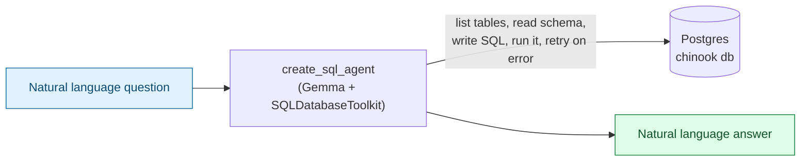

# Natural Language SQL Agent

> Companion code for [../ai-powered-sql-agent.md](../ai-powered-sql-agent.md) and [../Natural-Language-Interfaces-for-Data-Systems.md](../Natural-Language-Interfaces-for-Data-Systems.md). Builds on the local Gemma setup in [00-local-model-setup](../../code/00-local-model-setup/README.md).

## What This Is

A natural-language-to-SQL agent built entirely from LangChain's own toolkit — `SQLDatabase`, `SQLDatabaseToolkit`, and `create_sql_agent` — against a **Postgres** database running in Docker, seeded with a small Chinook-style digital media store schema (artists, albums, tracks, customers, invoices, invoice_items).



The agent doesn't just translate one question into one query — it's a small ReAct loop: it lists the available tables, pulls the schema for only the ones it thinks are relevant, drafts a query, sanity-checks it with `sql_db_query_checker`, runs it, and if the query errors out it reads the traceback and retries with a corrected query, all before composing the final natural-language answer.

## Setup

### 1. Start Postgres

```bash
docker compose up -d
```

This starts a `postgres:16-alpine` container (`nlsql-postgres`, mapped to `localhost:5432`, user/password/db all `chinook`) and, on first boot only, runs [db/init/01_chinook.sql](db/init/01_chinook.sql) to create and seed the schema — 10 artists, 15 albums, 40 tracks, 8 customers, 12 invoices, 27 invoice line items. Postgres only runs files under `/docker-entrypoint-initdb.d` when the data volume is empty, so re-running `docker compose up -d` on an existing volume won't reseed it (see [Resetting the database](#resetting-the-database) below).

Verify it loaded:

```bash
docker exec nlsql-postgres psql -U chinook -d chinook -c "SELECT COUNT(*) FROM albums;"
```

### 2. Start the local model

Gemma via Docker Model Runner — see [00-local-model-setup/README.md](../../code/00-local-model-setup/README.md) if it's not already enabled and pulled:

```bash
curl http://localhost:12434/v1/models   # should list docker.io/ai/gemma4:E4B
```

### 3. Install dependencies

```bash
uv sync
```

## Run

```bash
uv run sql_agent.py
```

With no arguments it runs four default questions (album count, top artist by album count, top 3 tracks by revenue, top customer by spend). Pass your own questions instead:

```bash
uv run sql_agent.py "Which genre has the most tracks?"
uv run sql_agent.py "List customers from South Korea"
```

`verbose=True` in [sql_agent.py](sql_agent.py) prints the full reasoning trace — every tool call the agent makes (`sql_db_list_tables`, `sql_db_schema`, `sql_db_query_checker`, `sql_db_query`) and the actual SQL it generated — not just the final answer.

## How It's Wired Together

| Piece | Role |
| --- | --- |
| `SQLDatabase.from_uri(...)` | LangChain's wrapper around a SQLAlchemy engine — introspects tables/columns and runs queries |
| `SQLDatabaseToolkit(db, llm)` | Bundles the four SQL tools (list tables, get schema, check query, run query) the agent picks from |
| `create_sql_agent(llm, toolkit, agent_type="tool-calling")` | Wires the LLM + toolkit into a tool-calling agent executor — the same `bind_tools` mechanism used in [../agent-with-tool-example](../agent-with-tool-example/), just pre-built for SQL |

Connection settings (Postgres host/port/user/db, and the Gemma model/base URL) all read from environment variables with the defaults above baked in — override them if you point this at a different database or model without editing the code.

## Resetting the Database

The seed script only runs against an empty data volume. To reseed from scratch:

```bash
docker compose down -v   # drops the container AND the pgdata volume
docker compose up -d
```

## Swapping in a Hosted Model

Like the other LangChain examples in this repo, swap `ChatOpenAI`'s `base_url`/`api_key` in [sql_agent.py](sql_agent.py) for a hosted provider if you'd rather not run Gemma locally — everything else (the toolkit, the agent wiring, the database) stays the same.
