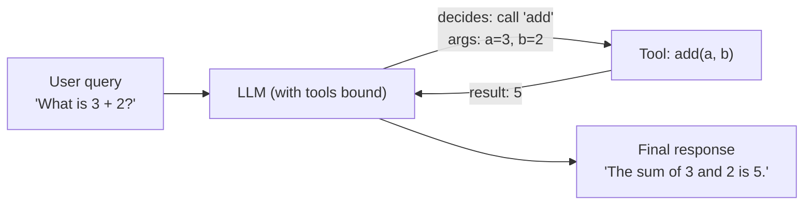
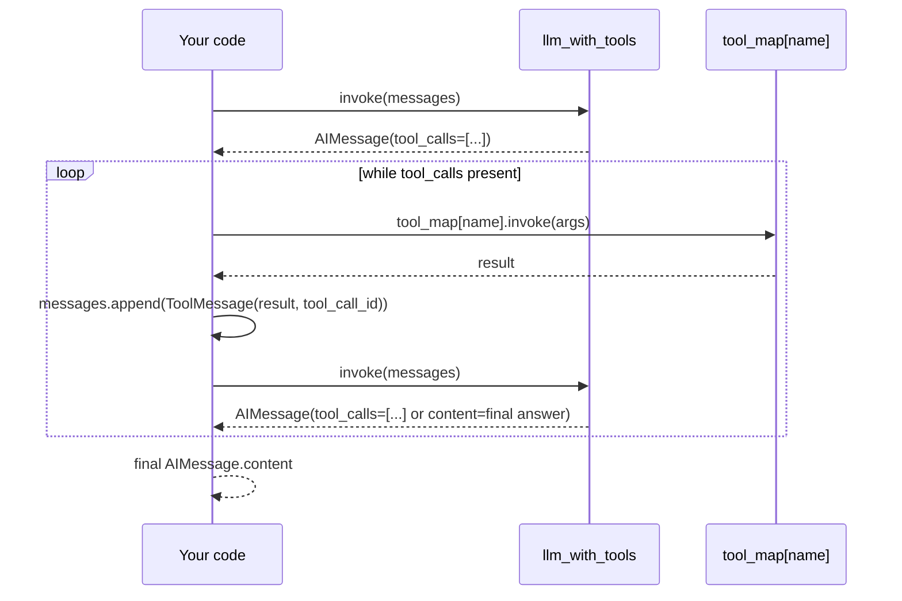

# Building LLM Agents with Tools (Manual Tool Calling)

> Runnable code for the example below: [agent-with-tool-example/](agent-with-tool-example/) (`uv run calculator_agent.py`, tested against a local Gemma model via Docker Model Runner).

## Overview

An LLM on its own can only produce text — it can't add two numbers reliably,
look up live data, or take an action in the real world. **Tools** close that
gap: a tool is a normal function that you describe to the model, and the
model can decide to "call" it (by returning the tool's name and arguments
instead of a plain-text answer). Manual tool calling is the pattern where
*you*, the developer, are responsible for:

1. Binding tools to the model so it knows they exist
2. Reading the tool call(s) the model decides to make
3. Actually executing the corresponding function
4. Feeding the result back to the model so it can produce a final answer

This is the foundational building block behind every LangChain/LangGraph
"agent" — an agent is essentially an LLM sitting in a loop with tools and a
way to decide when it's done.



The LLM never runs the function itself — it only ever *requests* a call
(name + arguments). Your code is the thing that actually executes it and
reports the result back.

## Step-by-step walkthrough

### Step 1 — Initialize the chat model

Use `init_chat_model` to create a single, reusable model instance. Every
`llm.invoke(...)` call from here on talks to this same model.

```python
from langchain.chat_models import init_chat_model

llm = init_chat_model("gpt-4o-mini", model_provider="openai")
```

### Step 2 — Define a tool

Decorate a plain Python function with `@tool`. The function's **docstring**
is not decoration — it's what the model reads to decide *when* this tool is
relevant, and the type hints tell it what arguments to send.

```python
from langchain_core.tools import tool

@tool
def add(a: int, b: int) -> int:
    """Add a and b."""
    return a + b
```

At this point `add` is a fully-formed tool object, but the LLM doesn't know
it exists yet — it hasn't been connected to the model.

### Step 3 — Bind the tool to the model

Put the tool in a list and call `.bind_tools()`. This returns a **new**
model object (`llm_with_tools`) that is aware of the tool; the original
`llm` is untouched.

```python
tools = [add]
llm_with_tools = llm.bind_tools(tools)
```

From now on, whenever `llm_with_tools.invoke(...)` is called and the query
looks like addition, the model can choose to call `add` instead of
answering directly.

### Step 4 — Invoke and inspect the tool call

```python
response = llm_with_tools.invoke("What is 3 plus 2?")
print(response.tool_calls)
# [{'name': 'add', 'args': {'a': 3, 'b': 2}, 'id': 'call_abc123', 'type': 'tool_call'}]
```

Note that `response.content` is usually **empty** here — the model replied
with a tool call, not text. Extracting the final natural-language answer
requires actually running the tool and sending the result back (Step 7).

### Step 5 — Add more tools

Repeat Step 2 for subtraction, multiplication, and division:

```python
@tool
def subtract(a: int, b: int) -> int:
    """Subtract b from a."""
    return a - b

@tool
def multiply(a: int, b: int) -> int:
    """Multiply a and b."""
    return a * b

@tool
def divide(a: int, b: int) -> float:
    """Divide a by b."""
    return a / b
```

### Step 6 — Build a name → function mapping

The model returns the tool name as a **string**. To dynamically dispatch to
the right Python function, build a dictionary that maps tool names to the
tool objects:

```python
tool_map = {
    "add": add,
    "subtract": subtract,
    "multiply": multiply,
    "divide": divide,
}
```

### Step 7 — Execute a tool call dynamically

Look the function up by name, then call `.invoke(args)` on it — LangChain
tools accept a dict whose keys match the function's parameter names and
match them up automatically.

```python
tool_call = response.tool_calls[0]         # {'name': 'add', 'args': {'a': 3, 'b': 2}, ...}
selected_tool = tool_map[tool_call["name"]]
result = selected_tool.invoke(tool_call["args"])
print(result)
# 5
```

### Step 8 — Bind the full tool list

```python
tools = [add, subtract, multiply, divide]
llm_with_tools = llm.bind_tools(tools)
```

## A better, more complete example: closing the loop

The steps above stop after extracting *one* tool's arguments — useful for
learning the mechanics, but a real agent needs to **send the tool result
back to the model** so it can produce a final, human-readable answer, and it
needs to handle queries that require **more than one tool call** (e.g.
`"What is (3 + 2) * 4?"` needs `add` then `multiply`).

This is done by appending a `ToolMessage` (containing the tool's result) to
the conversation and calling the model again — repeating until the model
stops requesting tools and returns plain text.



```python
from langchain_core.messages import HumanMessage, ToolMessage

def run_agent(query: str, history: list | None = None) -> str:
    """Manual tool-calling agent loop with multi-step + multi-turn support."""
    messages = history if history is not None else []
    messages.append(HumanMessage(query))

    ai_msg = llm_with_tools.invoke(messages)
    messages.append(ai_msg)

    # Keep resolving tool calls until the model answers in plain text
    while ai_msg.tool_calls:
        for tool_call in ai_msg.tool_calls:
            selected_tool = tool_map[tool_call["name"]]
            result = selected_tool.invoke(tool_call["args"])
            messages.append(
                ToolMessage(content=str(result), tool_call_id=tool_call["id"])
            )
        ai_msg = llm_with_tools.invoke(messages)
        messages.append(ai_msg)

    return ai_msg.content


# Single-step call
history = []
print(run_agent("What is 3 plus 2?", history))
# "The sum of 3 and 2 is 5."

# Multi-step call: the model calls add, then multiply, in sequence
print(run_agent("What is (3 + 2) times 4?", history))
# "(3 + 2) times 4 is 20."

# Multi-turn: history is preserved, so this resolves using prior context
print(run_agent("Now divide that by 5.", history))
# "20 divided by 5 is 4."
```

Why this is a better example than a single `tool_map["add"].invoke(...)`
call:

- It handles **any** number of tool calls the model decides to make in one
  turn (the model may call several tools in parallel, e.g. two independent
  sub-calculations).
- It handles **chained** reasoning (`add` → `multiply`) without you having
  to hardcode the order — the model decides which tool to call next based
  on the running conversation.
- It **preserves chat history** across turns, so follow-up questions like
  "now divide that by 5" resolve correctly using context from earlier in
  the conversation, instead of every call starting from scratch.
- It returns the model's **final natural-language answer**, not just raw
  tool output — this is what you'd actually show a user.

## Key takeaways

- A **tool** is a regular Python function decorated with `@tool`; its
  docstring and type hints are what the model uses to decide when and how
  to call it.
- `llm.bind_tools([...])` returns a *new* model object that is aware of the
  tools — the original model is unaffected.
- The model never executes a tool itself — it only returns a **request**
  (`tool_calls`: name + args). Your application code executes the function.
- A `{name: function}` mapping dictionary lets you dispatch dynamically to
  the right tool based on the string name the model returned.
- A real agent loop appends each tool's result back into the conversation
  as a `ToolMessage` and re-invokes the model, repeating until the model
  responds with plain text instead of another tool call.
- Preserving the running `messages` list across calls gives the agent
  **memory**, enabling accurate multi-turn, context-aware conversations.
