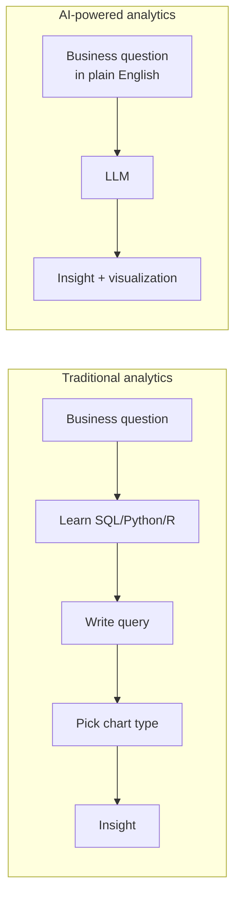
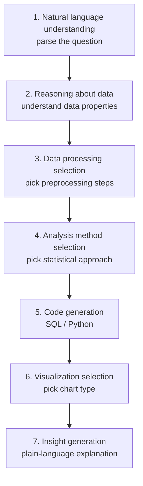
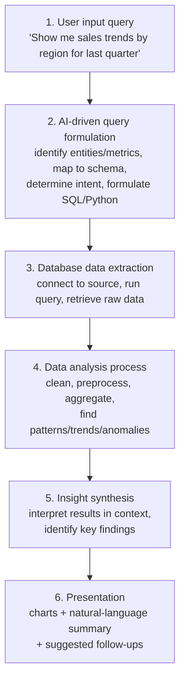
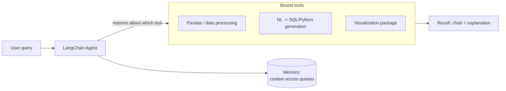
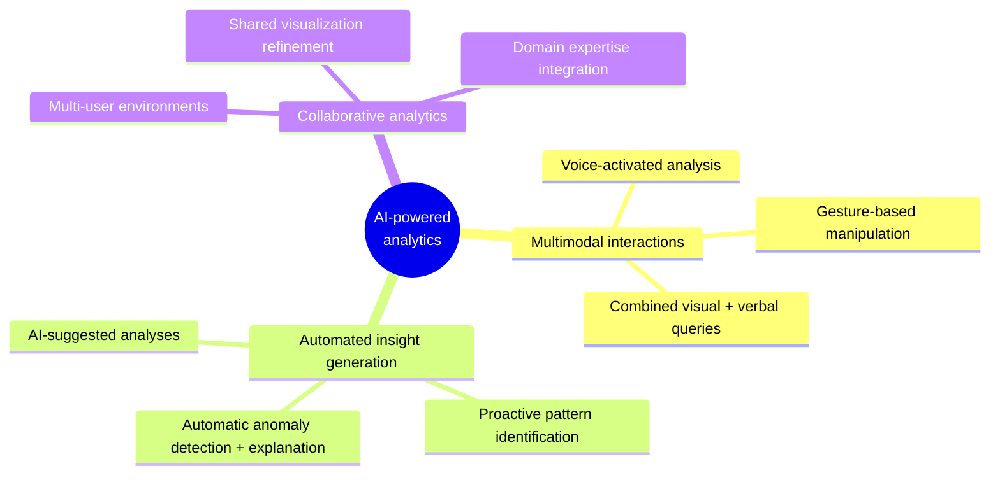

# AI-Powered Data Analytics

## Why this matters

Data analysis has traditionally required technical expertise — SQL, Python,
R, or tools like Tableau — plus knowledge of schema/data relationships and
visualization skills. That barrier has kept insights locked away from
business users and domain experts who understand *what* they want to know
but not *how* to query for it.

LLMs remove that barrier: users ask questions in plain English and get back
both analysis and visualizations, no code required.

## The natural language revolution

LLMs bridge the gap between human questions and data systems through a
chain of capabilities, each feeding the next:

## How AI-powered analytics works — the pipeline

A natural-language query becomes a data insight through six stages:

### 1. User input query

Everyday language, not technical syntax:

- "Show me sales trends by region for the last quarter"
- "Create a pie chart of customer distribution by age group"
- "What's the correlation between marketing spend and revenue?"

### 2. AI-driven query formulation

The critical translation step. It:

- Identifies key entities and metrics in the query
- Maps natural language terms to database schema elements
- Determines analytical intent (comparison, trend, distribution, correlation, ...)
- Formulates the actual technical query (SQL, Python code, etc.)

This is where the LLM bridges language semantics and data structure.

### 3. Database data extraction

Turns the formulated query into real data retrieval:

- Connects to the relevant data source(s)
- Executes the query against databases, warehouses, or files
- Retrieves exactly the data needed — nothing more

### 4. Data analysis process

Raw data becomes meaningful results:

- Cleans and preprocesses (missing values, outliers, etc.)
- Applies the appropriate statistical/analytical method
- Performs calculations and aggregations
- Identifies patterns, trends, or anomalies
- Prepares data for visualization

### 5. Insight synthesis

The step that separates "a number" from "an insight":

- Interprets results in context
- Identifies key findings and significant patterns
- Generates a natural-language explanation of what was found

### 6. Presentation

Delivers the answer back combining both modalities:

- Visualizations (charts, graphs, dashboards)
- Natural-language summary of key findings
- Suggested follow-up questions or analyses

## Tools and frameworks

**LangChain** is the most common framework for building this pipeline. It
provides:

- **Agents** that reason about which tool to use for a given analysis step
- **Tool integration** with data libraries (Pandas) and visualization packages
- **NL → SQL/Python** conversion frameworks
- **Memory systems** to maintain context across multiple queries in a session

LangChain's architecture supports specialized agents such as a
`PandasDataFrameAgent` that can analyze a dataframe and generate
visualizations directly from natural-language input.

### Key LLM capabilities behind this

- **Code generation** — producing Python or SQL from natural language
- **Data reasoning** — knowing which operations make sense for which data types
- **Chart selection** — knowing which visualization fits which kind of analysis
- **Explanation generation** — turning raw results into human-readable interpretation

## Applications

### Business intelligence

- Identifying highest-growth product categories in a given period
- Visualizing customer retention metrics across segments
- Comparing regional performance with product-specific breakdowns

### Personal analytics

- Tracking personal spending patterns over time
- Correlating exercise routines with health metrics
- Analyzing productivity variations across different time periods

## Future directions

## Summary

- Natural language understanding + data visualization is a fundamental
  shift in how humans interact with data — it removes the technical
  barrier that historically restricted analysis to programmers/analysts.
- The pipeline is: **query → AI formulates a structured query → data
  extraction → analysis → insight synthesis → presentation** (chart +
  plain-language summary).
- **LangChain** (agents, tool integration, memory) is a common framework
  for building this pipeline, enabling agents like a `PandasDataFrameAgent`.
- Core LLM capabilities that make this possible: code generation, data
  reasoning, chart selection, and explanation generation.
- Applications span business intelligence and personal analytics; future
  directions point toward multimodal (voice/gesture) interaction,
  automated/proactive insight generation, and collaborative analytics.
- The overall trajectory: data analytics becomes conversational, intuitive,
  and accessible regardless of technical background.
