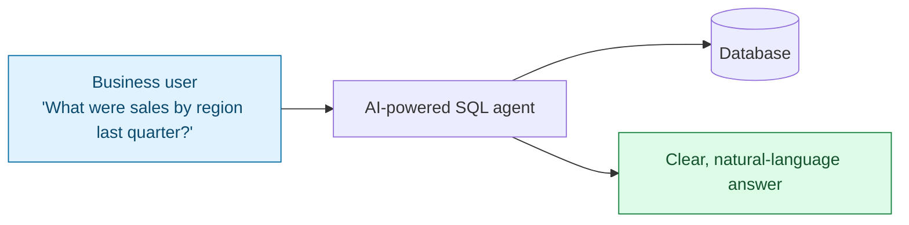
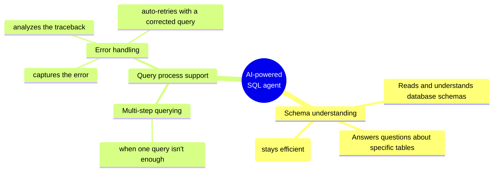
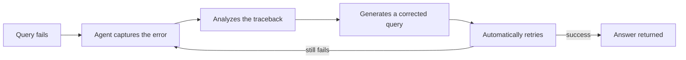
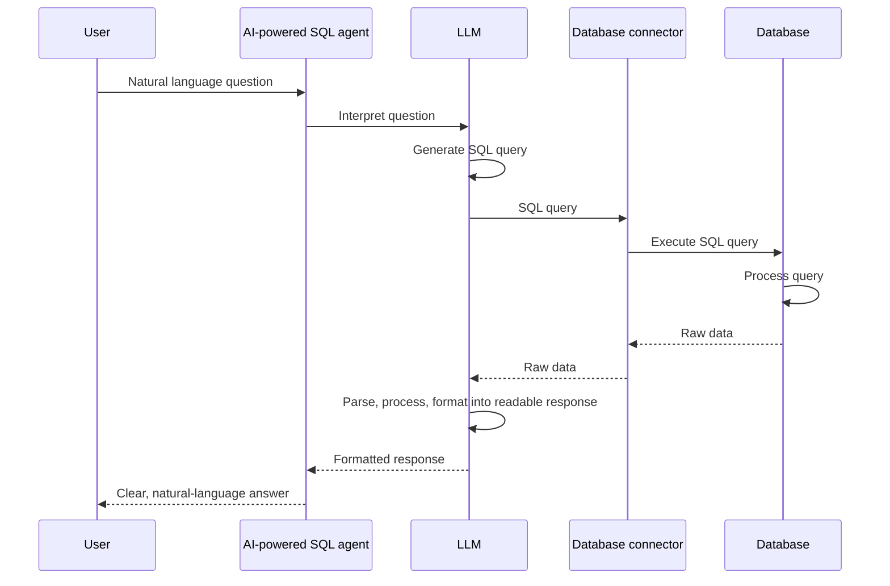

# AI-Powered SQL Agents

## Overview

SQL is powerful but requires specialized knowledge — schema understanding,
query syntax, join logic. **AI-powered SQL agents** bridge the gap between
natural language and SQL, letting a broader range of users access and
interpret data without deep technical skills.

## Benefits

- **Democratizes data access** — a natural language interface means users
  don't need to know SQL to get answers from a database.
- **Lowers the skill barrier** for interpreting data, not just querying it —
  the agent also explains results in plain language.

## Capabilities

### Schema understanding

The agent reads and understands database schemas, which is what lets it
answer questions about specific tables. To stay efficient, it doesn't load
the *entire* database schema for every query — it retrieves schemas only
for the tables relevant to the question being asked.

### Multi-step querying

When a single query can't fully answer the question, the agent breaks the
task into multiple queries, chaining them together to arrive at the answer.

### Error handling and auto-retry

If a query fails, the agent doesn't just surface the raw database error to
the user:

## Limitations and considerations

- **AI interpretation of a query can be inaccurate** — the agent might map
  natural language to the wrong table, column, or intent.
- **Complex queries might require manual adjustment** — not every question
  can be fully automated end-to-end without human review.
- **Continuous testing and validation are essential** for reliability —
  these agents are not "set and forget"; outputs need to be checked,
  especially before decisions are made on them.

## How an AI-powered SQL agent retrieves information

The full round trip from a natural-language question to a natural-language
answer:

Step by step:

1. The user asks a question in natural language.
2. The AI-powered SQL agent receives the question.
3. The LLM interprets the natural language input and generates an SQL query.
4. A database connector sends the SQL query to the database.
5. The database processes the SQL query.
6. The database sends the raw data back to the database connector.
7. The database connector passes the data back to the LLM.
8. The LLM parses, processes, and formats the raw data into a clear,
   readable response.
9. The agent displays the answer to the user in clear, natural language —
   completing the flow from question to final response.

## Summary

- AI-powered SQL agents give a broader range of users the ability to access
  and interpret data without deep technical skills.
- They efficiently interpret database schemas (retrieving only what's
  relevant), handle query errors with automatic retries, and support
  multi-step querying for questions a single query can't answer.
- They have real limitations: AI interpretation of a query can be
  inaccurate, complex queries may need manual adjustment, and continuous
  testing/validation is essential for reliability.
- The retrieval flow is: natural language question → LLM generates SQL →
  database connector executes it against the database → raw data flows back
  → LLM formats it into a clear, readable, natural-language response.
