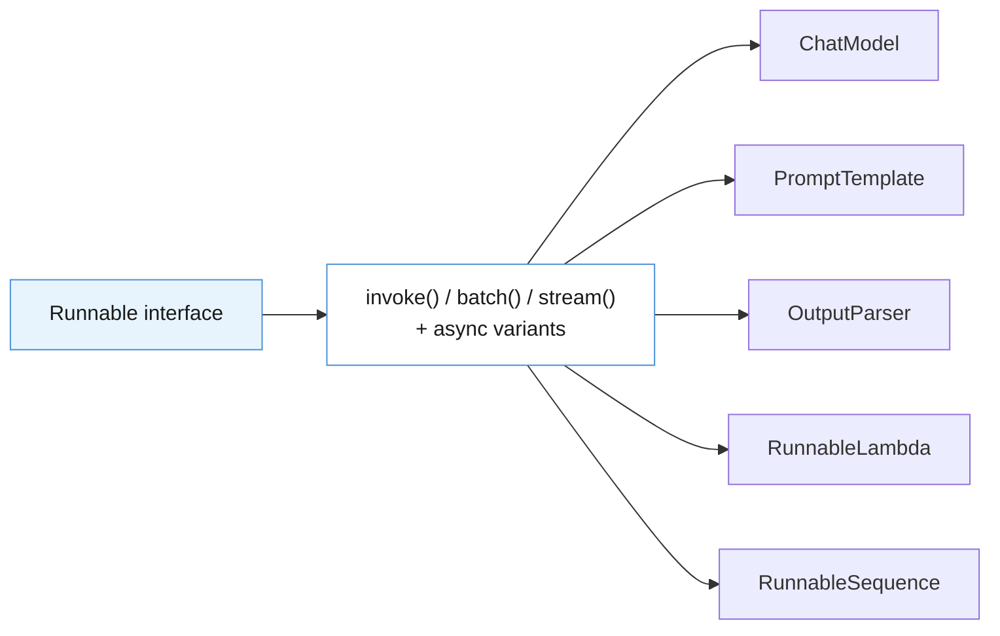
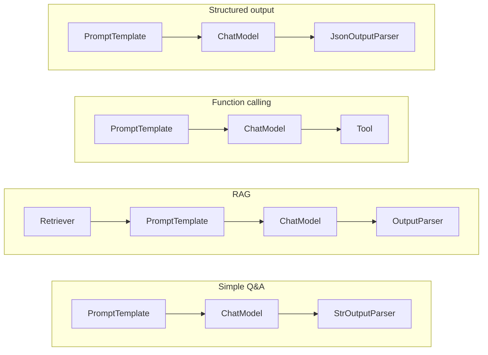
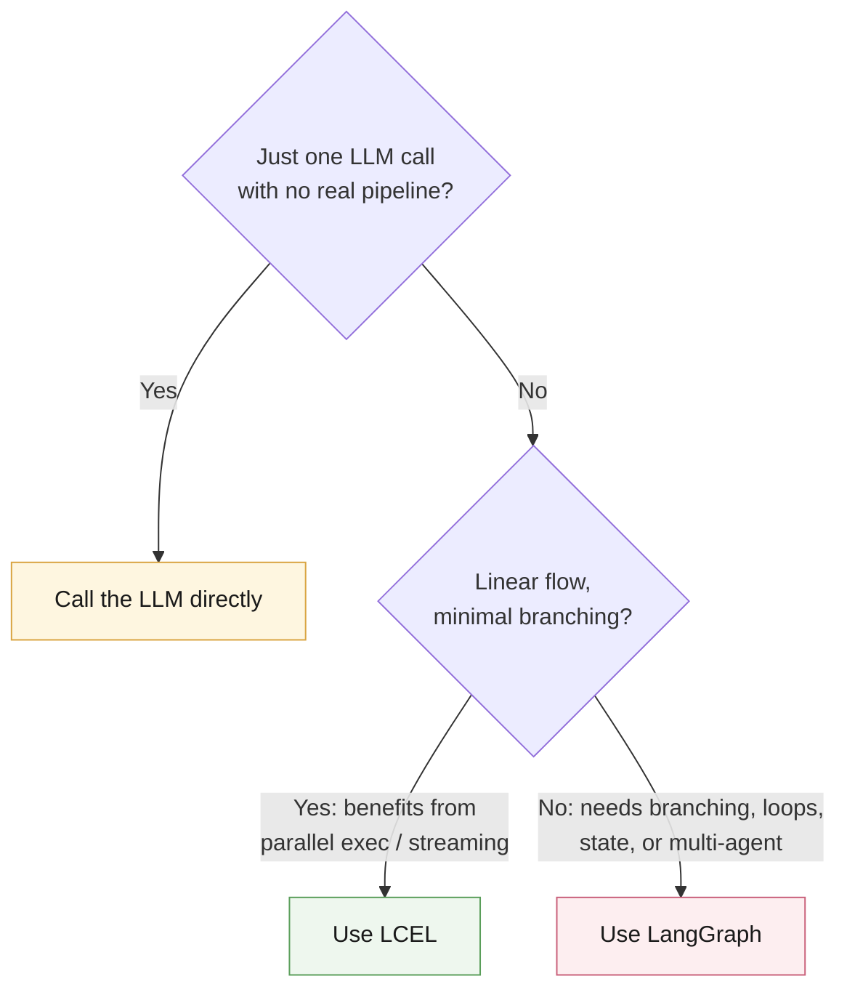

# LangChain Expression Language (LCEL) — Cheatsheet

> **LCEL** is a declarative method for assembling chains from modular components in LangChain. Instead of prescribing step-by-step instructions, you specify the *outcome* — LangChain optimizes execution under the hood.

This cheatsheet covers LCEL's key capabilities, patterns, function reference, and orchestration strategy at a glance.

---

## 1. Capabilities & Benefits

| Capability | Benefit |
|---|---|
| Run optimized **parallel execution** | Reduces latency and increases throughput by running components concurrently |
| Guaranteed **async support** | Enables smooth, non-blocking workflows — improves responsiveness in complex chains |
| **Stream outputs** incrementally | Immediate feedback to users; lowers perceived latency; monitor progress per stage |
| **Auto-trace with LangSmith** | Full visibility into chain behavior — debug, monitor, and improve reliability fast |
| Shared **LCEL API** across all chains | Simplifies integration and gives consistent behavior across workflows |
| Deploy with **LangServe** | Accelerates dev → production with minimal overhead |
| **Concise, expressive syntax** | Eases connecting components into robust data pipelines |

---

## 2. Runnables

Every LCEL component implements the standardized **`Runnable`** interface — a shared set of methods (`invoke()`, `batch()`, `stream()`, …) that makes components interoperable and pipeable.



| Runnable type | Description | Example use case |
|---|---|---|
| `ChatModel` | Interfaces with LLM APIs for chat | Generate conversational responses |
| `PromptTemplate` | Creates formatted prompts from variables | Prepare structured inputs for LLMs |
| `OutputParser` | Converts raw outputs to structured data | Extract structured data from LLM responses |
| `RunnableLambda` | Wraps custom Python functions | Implement custom business logic |
| `RunnableSequence` | Chains multiple Runnables together | Create multi-step processing pipelines |

---

## 3. Runnable Chains — Use Cases & Workflows

Chains are built by connecting `Runnable` components — each one's output feeds directly into the next.

| Use case | Components | Workflow summary |
|---|---|---|
| **Simple question answering** | `PromptTemplate` → `ChatModel` → `StrOutputParser` | Format a question, send to LLM, return text response |
| **Retrieval augmented generation (RAG)** | `Retriever` → `PromptTemplate` → `ChatModel` → `OutputParser` | Find relevant documents, combine with prompt, generate response |
| **Function calling** | `PromptTemplate` → `ChatModel` → `Tool` | Format prompt, generate function call, parse parameters, execute function |
| **Structured output** | `PromptTemplate` → `ChatModel` → `JsonOutputParser` | Format prompt, generate response, parse to JSON object |



---

## 4. LCEL Function Reference

> Functions prefixed with **`a`** (e.g. `ainvoke`, `abatch`) are the **async** variants.

### Basic Operations

| Function | Description | Usage |
|---|---|---|
| `invoke()` / `ainvoke()` | Execute a Runnable with a single input | Process one input, get one output |
| `batch()` / `abatch()` | Process multiple inputs efficiently in parallel | Run the same operation on multiple inputs at once |
| `stream()` / `astream()` | Return incremental results as they're generated | Show partial responses as they're created |

### Composition Patterns

| Function | Description | Usage |
|---|---|---|
| Pipe operator `\|` or `.pipe()` | Create a sequence of Runnables | Chain components where output of one becomes input to the next |
| `RunnableParallel` | Execute multiple Runnables with the same input, concurrently | Process the same input in different ways simultaneously |
| `RunnableLambda` | Convert Python functions into Runnables | Add custom logic within a chain |

### Data Manipulation Patterns

| Function | Description | Usage |
|---|---|---|
| `RunnablePassthrough.assign()` | Add new fields to the input dictionary | Augment input with additional data while preserving the original |
| `RunnablePassthrough()` | Return input unchanged | Include the original input as part of the output |
| `.pick()` | Select specific keys from the dictionary output | Filter output to only needed fields |

### Advanced Patterns

| Function | Description | Usage |
|---|---|---|
| `.bind()` | Set default values for parameters | Fix certain parameters while leaving others configurable |
| `.with_fallbacks()` | Try alternative Runnables if the primary fails | Handle errors by providing backup components |
| `.with_retry()` | Add automatic retry capability | Retry operations on failure (e.g., network issues) |

### Configuration

| Function | Description | Usage |
|---|---|---|
| `config` parameter | Control runtime execution | Pass to `invoke()`/`batch()`/`stream()` with settings like concurrency limits and tracing |
| `.with_config()` | Create a Runnable with default configuration | Apply the same configuration to all invocations automatically |

### Streaming & Batching

| Function | Description | Usage |
|---|---|---|
| `astream_events()` | Detailed stream of execution events | Monitor the entire execution process, including intermediate steps |
| `batch_as_completed()` / `abatch_as_completed()` | Process inputs in parallel, return as completed | Start processing results as soon as they're available |

---

## 5. Orchestration: Direct Call vs. LCEL vs. LangGraph

| Use case | When to use | Recommended tool |
|---|---|---|
| **Single LLM call** | You just need to generate text from a prompt; chain setup overhead isn't justified | **LLM directly** |
| **Simple chains** | Straightforward pipeline (e.g. prompt + LLM + parser + basic retrieval); benefits from parallelization/streaming; clear linear flow, minimal branching | **LCEL** |
| **Complex logic with branching** | Complex state management; conditional flows, loops, or cycles; multi-agent systems | **LangGraph** |



---

## Quick Syntax Reference

```python
# Sequence (pipe operator)
chain = prompt | llm | output_parser

# Parallel (dict auto-coerces to RunnableParallel)
parallel_chain = {
    "summary": summary_prompt | llm,
    "sentiment": sentiment_prompt | llm,
}

# Custom function as a Runnable
from langchain_core.runnables import RunnableLambda
chain = RunnableLambda(my_function) | llm

# Passthrough + assign (augment input without losing it)
from langchain_core.runnables import RunnablePassthrough
chain = RunnablePassthrough.assign(context=retriever) | prompt | llm

# Bind default params
chain = llm.bind(stop=["\n"])

# Fallbacks
chain = primary_llm.with_fallbacks([backup_llm])

# Retry
chain = llm.with_retry(stop_after_attempt=3)

# Invoke / batch / stream
chain.invoke({"input": "..."})
chain.batch([{"input": "..."}, {"input": "..."}])
for chunk in chain.stream({"input": "..."}):
    print(chunk, end="")
```
