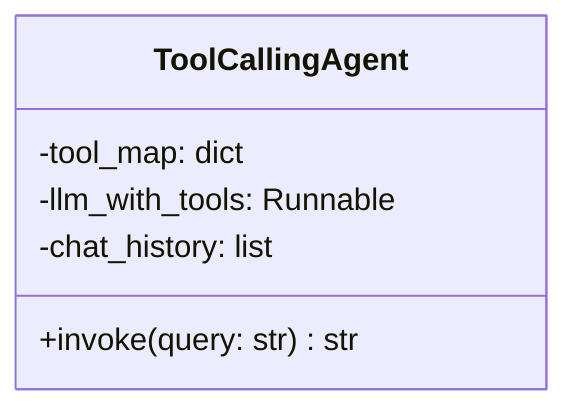

# Interactive LLM Agents (Manually Managing Tool Calls & Chat History)

> Runnable code for this page: [agent-with-tool-example/tool_calling_agent.py](../agent-with-tool-example/tool_calling_agent.py) (`uv run tool_calling_agent.py`, tested against a local Gemma model via Docker Model Runner). Builds on [agent-with-tool.md](../agent-with-tool.md).

## Overview

[agent-with-tool.md](../agent-with-tool.md) covered the mechanics of a single
tool call in isolation. A genuinely *interactive* agent needs two more
things:

1. **Chat history** — every user message, every tool-call request the model
   makes, and every tool result must live in one ordered list, so the model
   always sees the full conversation, not just the latest turn.
2. **Precise extraction** — the model's response is an `AIMessage` whose
   `tool_calls` field is a list of structured requests. You need to pull the
   tool **name**, **arguments**, and **call id** out of it correctly to
   execute the right function and report the result back to the right call.

Once both pieces are solid, they can be wrapped into a reusable
**`ToolCallingAgent`** class that hides the loop entirely — callers just do
`agent.invoke("some question")`.

```mermaid
flowchart LR
    Q["User query<br/>'What is 3 plus 2?'"] --> H["Wrap in HumanMessage<br/>append to chat_history"]
    H --> I1["llm_with_tools.invoke(chat_history)"]
    I1 --> AI["AIMessage with tool_calls<br/>(appended to chat_history)"]
    AI --> E["Extract name / args / id<br/>from tool_calls[0]"]
    E --> X["Execute via tool_map[name].invoke(args)"]
    X --> TM["Wrap result in ToolMessage(tool_call_id=id)<br/>append to chat_history"]
    TM --> I2["llm_with_tools.invoke(chat_history)"]
    I2 --> R["Final AIMessage<br/>natural-language answer"]
```



## Step-by-step walkthrough (manual process)

This mirrors exactly what you'd do by hand before wrapping it in a class —
worth doing once so the class isn't a black box.

### Step 1 — Put the user's question into chat history

The model only sees what's in the message list you pass it, so the first
step is turning the raw question into a `HumanMessage` and starting the
list.

```python
from langchain_core.messages import HumanMessage

query = "What is 3 plus 2?"
chat_history = [HumanMessage(content=query)]
```

`chat_history` will accumulate **every** message from here on — user input,
tool-call requests, tool outputs, and model replies — so the model always
has full context.

### Step 2 — Invoke the tool-bound model

Pass the whole history (not just the latest message) to the model that has
tools bound to it (`llm_with_tools`, built the same way as in
[agent-with-tool.md](../agent-with-tool.md) via `llm.bind_tools(tools)`).

```python
response_1 = llm_with_tools.invoke(chat_history)
```

The model reviews the conversation, decides a tool is needed, picks the
right one, and extracts the parameters — but it does **not** run anything
itself.

### Step 3 — Inspect the AIMessage's tool_calls

`response_1` is an `AIMessage`. Instead of plain text, its `content` is
usually empty and the interesting part is `tool_calls`:

```python
print(response_1.tool_calls)
# [{'name': 'add', 'args': {'a': 3, 'b': 2}, 'id': 'call_abc123', 'type': 'tool_call'}]
```

Each entry has four parts:

| Field | Meaning |
| --- | --- |
| `name` | The tool the model wants to call (e.g. `"add"`) |
| `args` | A dict of arguments to pass in (e.g. `{"a": 3, "b": 2}`) |
| `id` | A unique id linking this request to its eventual result — critical when multiple tools are called at once |
| `type` | Always `"tool_call"`, distinguishing it from plain text output |

### Step 4 — Append the AIMessage to chat history

Before doing anything else, record the model's tool-call request in the
history so the next invocation has the full picture — the original
question **and** what the model decided to do about it.

```python
chat_history.append(response_1)
```

### Step 5 — Extract name, args, and id

Pull the three fields you need out of the first tool call:

```python
tool_call = response_1.tool_calls[0]

tool_1_name = tool_call["name"]     # "add"
tool_1_args = tool_call["args"]     # {"a": 3, "b": 2}
tool_1_id = tool_call["id"]         # "call_abc123"
```

### Step 6 — Execute the tool via the tool map

Use a `{name: tool}` mapping (built once, same as in
[agent-with-tool.md](../agent-with-tool.md)) to dynamically dispatch to the
right function:

```python
tool_map = {"add": add, "subtract": subtract, "multiply": multiply, "divide": divide}

tool_1_result = tool_map[tool_1_name].invoke(tool_1_args)
print(tool_1_result)
# 5
```

### Step 7 — Wrap the result in a ToolMessage and append it

The model needs the result tagged with the **same `id`** as the request, so
it knows which tool call this answers.

```python
from langchain_core.messages import ToolMessage

tool_message = ToolMessage(content=str(tool_1_result), tool_call_id=tool_1_id)
chat_history.append(tool_message)
```

At this point `chat_history` contains, in order: the original
`HumanMessage`, the `AIMessage` with the tool-call request, and the new
`ToolMessage` with the result.

### Step 8 — Invoke again for the final answer

```python
final_response = llm_with_tools.invoke(chat_history)
print(final_response.content)
# "3 plus 2 is 5."
```

The model now formats the tool's raw output as a natural, conversational
answer — because it can see the full exchange in `chat_history`.

## Building the `ToolCallingAgent` class

Steps 1–8 are always the same shape, so wrap them in a class that owns its
own `chat_history` and exposes a single `invoke(query)` method. This also
naturally handles the case the manual walkthrough doesn't: **more than one
tool call in a single turn**, by looping over `tool_calls` and re-invoking
until the model stops requesting tools.



```python
from langchain_core.messages import AIMessage, BaseMessage, HumanMessage, SystemMessage, ToolMessage

class ToolCallingAgent:
    """Owns chat history and the model-tool loop, so callers just call .invoke(query)."""

    def __init__(self, llm, tools: list, system_message: str | None = None, max_steps: int = 5):
        self.tool_map = {t.name: t for t in tools}
        self.llm_with_tools = llm.bind_tools(tools)
        self.max_steps = max_steps
        self.chat_history: list[BaseMessage] = []
        if system_message:
            self.chat_history.append(SystemMessage(content=system_message))

    def invoke(self, query: str) -> str:
        self.chat_history.append(HumanMessage(content=query))

        ai_msg: AIMessage = self.llm_with_tools.invoke(self.chat_history)
        self.chat_history.append(ai_msg)

        steps = 0
        while ai_msg.tool_calls and steps < self.max_steps:
            for call in ai_msg.tool_calls:
                tool_name = call["name"]
                tool_args = call["args"]
                tool_id = call["id"]

                result = self.tool_map[tool_name].invoke(tool_args)
                self.chat_history.append(ToolMessage(content=str(result), tool_call_id=tool_id))

            ai_msg = self.llm_with_tools.invoke(self.chat_history)
            self.chat_history.append(ai_msg)
            steps += 1

        return ai_msg.content
```

Because `chat_history` is kept on `self` instead of a local variable, the
agent has memory **for free** across calls — every `.invoke()` builds on
everything before it.

## Example run — imprecise, multi-turn queries

The point of this structure is that the user doesn't need to phrase things
precisely — the model resolves intent, the agent resolves execution:

```python
from langchain_openai import ChatOpenAI

llm = ChatOpenAI(
    model="docker.io/ai/gemma4:E4B",
    base_url="http://localhost:12434/v1",
    api_key="not-needed",
    temperature=0,
)

agent = ToolCallingAgent(
    llm=llm,
    tools=[add, subtract, multiply, divide],
    system_message="You are a helpful assistant with access to arithmetic tools.",
)

print(agent.invoke("What is 3 plus 2?"))
print(agent.invoke("1 minus 2"))                 # imprecise phrasing, no "what is"
print(agent.invoke("and now multiply that by 10"))# depends on prior turn's result
```

Actual output from a local Gemma 3 model (Docker Model Runner):

```text
User: What is 3 plus 2?
  -> called add({'a': 3, 'b': 2}) = 5.0
Agent: 3 plus 2 is 5.

User: 1 minus 2
  -> called subtract({'a': 1, 'b': 2}) = -1.0
Agent: 1 minus 2 is -1.

User: and now multiply that by 10
  -> called multiply({'a': -1, 'b': 10}) = -10.0
Agent: Multiplying -1 by 10 gives -10.
```

Note the third query has no explicit numbers at all — the model resolves
"that" using `chat_history`, correctly picks up `-1` from the previous
turn, and still selects the right tool (`multiply`).

## Key takeaways

- **Chat history is the source of truth.** Every `HumanMessage`,
  `AIMessage` (including ones that only carry a tool-call request), and
  `ToolMessage` must be appended in order — skipping any of them breaks the
  model's ability to link a tool result back to its request.
- **`AIMessage.tool_calls`** is a list of `{name, args, id, type}` dicts.
  `id` matters most once more than one tool call can happen in a turn — it's
  what lets you match each `ToolMessage` back to the request it answers.
- **`ToolMessage(content=..., tool_call_id=...)`** must reuse the exact
  `id` from the tool call it's responding to.
- **Looping, not a single call-and-respond**, is what makes an agent
  "interactive" — the `while ai_msg.tool_calls` loop supports chained and
  parallel tool calls without any special-casing.
- **Wrapping the loop in a class** (`ToolCallingAgent`) turns chat history
  from something you manage by hand into something the object owns,
  enabling natural multi-turn conversations where later queries can be
  informal and depend on earlier results.
