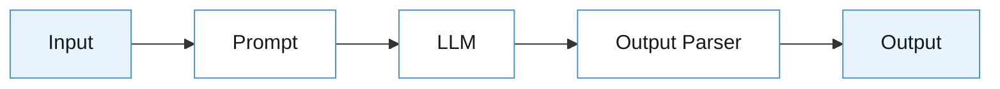
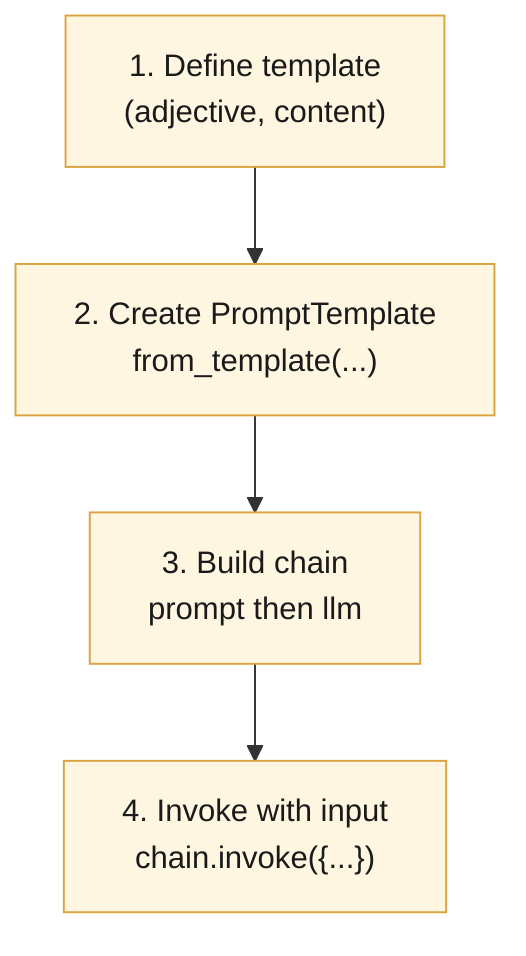
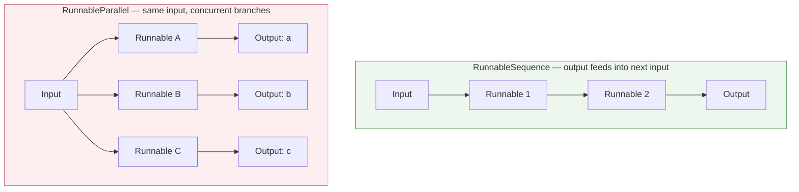
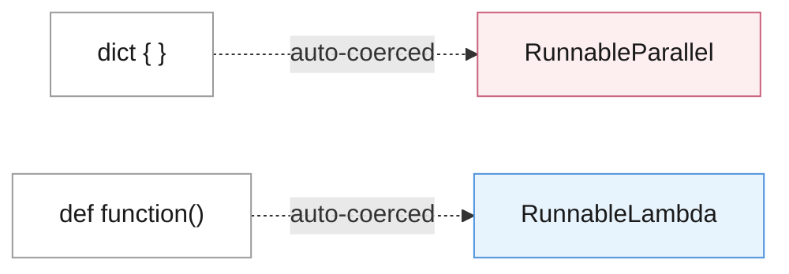
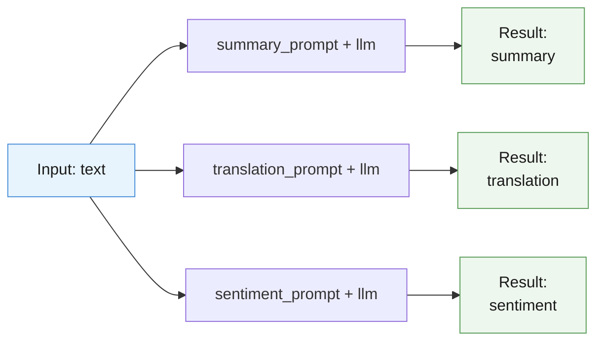
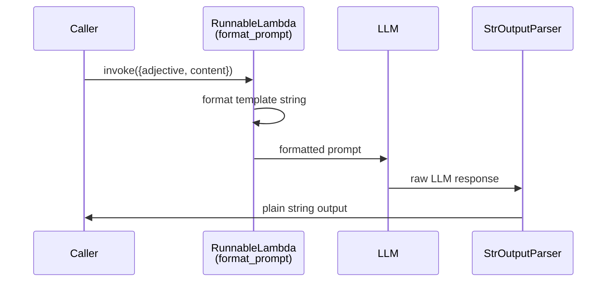
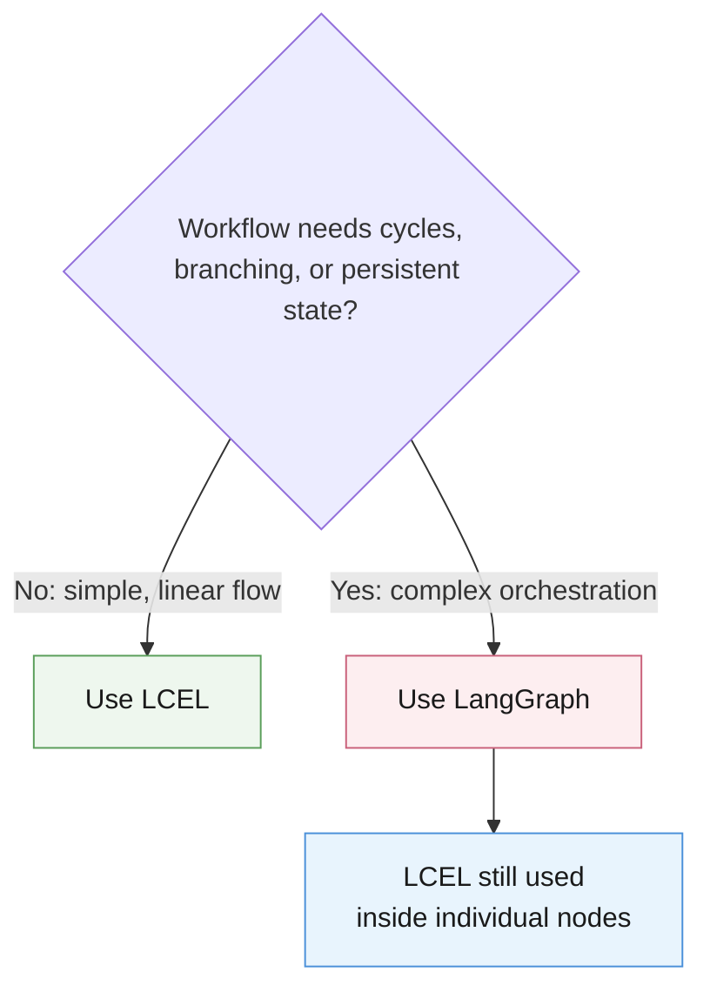

# LangChain Expression Language (LCEL)

## Learning Objectives
- Build flexible, composable chains using LangChain's modern approach to prompt engineering
- Structure prompts effectively using templates
- Connect components using the pipe (`|`) operator to streamline workflows
- Develop reusable patterns for a variety of AI applications

---

## 1. What Is LCEL?

**LangChain Expression Language (LCEL)** is a pattern for building LangChain applications that uses the **pipe operator (`|`)** to connect components, ensuring a clean, readable flow of data from input to output.

> LangChain has evolved significantly. LCEL is the modern, **recommended** pattern — favored over the legacy `LLMChain` approach.

**Why LCEL over the traditional `LLMChain` approach?**

| Legacy (`LLMChain`) | LCEL |
|---|---|
| Verbose, class-based wiring | Declarative, pipe-based composition |
| Data flow less visible | Clear, linear visualization of data flow |
| Harder to extend | Easily composable — swap/add components |
| Limited flexibility for complex chains | Built for flexibility and scale |



*The pipe operator (`prompt | llm | parser`) chains these Runnables into one linear flow.*

---

## 2. Anatomy of a Typical LCEL Pattern

Building an LCEL chain generally follows four steps:

1. **Define a template** with variables in curly braces `{}`
2. **Create a prompt template instance** from that template
3. **Build a chain** using the pipe operator to connect components
4. **Invoke the chain** with input values

```python
from langchain_core.prompts import PromptTemplate
from langchain_openai import ChatOpenAI

# 1. Define a template with variables
template = "Tell me a {adjective} joke about {content}."

# 2. Create a prompt template instance
prompt = PromptTemplate.from_template(template)

# 3. Build a chain with the pipe operator
llm = ChatOpenAI()
chain = prompt | llm

# 4. Invoke the chain with input values
response = chain.invoke({"adjective": "funny", "content": "parrots"})
```



---

## 3. Runnables — The Building Blocks

**Runnables** are the core interface in LangChain. They act as building blocks that connect components — LLMs, retrievers, tools, functions, prompts — into a single pipeline.

Every piece in an LCEL chain (a prompt, an LLM, a parser, a plain Python function) is or becomes a **Runnable**, which gives them a shared interface: `.invoke()`, `.batch()`, `.stream()`, and their async equivalents.

### Two Main Composition Primitives

| Primitive | Behavior |
|---|---|
| **`RunnableSequence`** | Chains components **sequentially** — the output of one component becomes the input of the next |
| **`RunnableParallel`** | Runs multiple components **concurrently**, feeding the **same input** to each |



```python
from langchain_core.runnables import RunnableSequence, RunnableParallel

# Explicit RunnableSequence
sequence = RunnableSequence(runnable_1, runnable_2)

# Explicit RunnableParallel
parallel = RunnableParallel(
    task_a=runnable_1,
    task_b=runnable_2,
)
```

### The Pipe Shortcut

LCEL provides a syntax shortcut for `RunnableSequence` — instead of the verbose class constructor, simply connect components with `|`:

```python
# Instead of RunnableSequence(runnable_1, runnable_2)...
chain = runnable_1 | runnable_2
```

This makes chains more **readable** and **intuitive** while producing the exact same underlying composition.

---

## 4. Automatic Type Coercion

LCEL automatically converts plain Python objects into Runnable components behind the scenes — you don't need to wrap things manually.

| You write... | LCEL coerces it into... | Behavior |
|---|---|---|
| A `dict` | `RunnableParallel` | Runs all dict values concurrently against the same input |
| A `function` | `RunnableLambda` | Wraps the function so it can transform inputs within a chain |



### Example: Dictionary → `RunnableParallel`

```python
chain = prompt_template | llm

multi_task_chain = {
    "summary": summary_prompt | llm,
    "translation": translation_prompt | llm,
    "sentiment": sentiment_prompt | llm,
}

result = multi_task_chain.invoke({"text": text})
# result = {"summary": ..., "translation": ..., "sentiment": ...}
```



- The dictionary structure is automatically coerced into a `RunnableParallel`.
- Each task (`summary`, `translation`, `sentiment`) receives the **same input** (`text`) but processes it differently.
- All three LLM calls run **simultaneously**.
- The result is a dict with keys matching each task, holding that task's respective output.

### Example: Function → `RunnableLambda`

```python
from langchain_core.runnables import RunnableLambda
from langchain_core.output_parsers import StrOutputParser

def format_prompt(inputs: dict) -> str:
    return f"Tell me a {inputs['adjective']} joke about {inputs['content']}."

joke_chain = RunnableLambda(format_prompt) | llm | StrOutputParser()

result = joke_chain.invoke({"adjective": "funny", "content": "parrots"})
```

**How this chain executes, step by step:**

1. `RunnableLambda` takes the input dict (`{"adjective": ..., "content": ...}`) and passes it to `format_prompt`.
2. `format_prompt` formats the template string using those variables.
3. The pipe operator passes the formatted prompt string to the **LLM**.
4. Another pipe passes the LLM's raw response to `StrOutputParser`, which extracts the plain string output.



This is the core LCEL pattern: **Runnable → pipe → Runnable → pipe → Runnable ...**

---

## 5. When to Use LCEL vs. LangGraph

- **LCEL** is best suited for **simpler orchestration tasks** — linear or lightly-branched pipelines.
- For **more complex workflows** (cycles, conditional branching, multi-agent coordination, persistent state), use **LangGraph** — while still leveraging LCEL *within individual nodes* of the graph.



---

## 6. Key Strengths of LCEL

- ⚡ **Parallel execution** — via `RunnableParallel` / dict coercion
- 🔄 **Async support** — every Runnable exposes async methods out of the box
- 🌊 **Simplified streaming** — stream tokens/output through the whole chain
- 🔍 **Automatic tracing** — built-in observability for debugging chain execution

These capabilities improve both the **power** and **maintainability** of LCEL-based applications.

---

## 7. Summary / Key Takeaways

- LCEL structures workflows using the **pipe operator (`|`)** for a clear, linear data flow.
- Prompts are defined using **templates with variables in curly braces** (`{variable}`).
- Components can be linked sequentially via **`RunnableSequence`** (or its pipe shorthand).
- **`RunnableParallel`** allows multiple components to run concurrently against the same input.
- The pipe operator is a **more concise syntax** that replaces explicit `RunnableSequence` construction.
- **Type coercion** in LCEL automatically converts:
  - `dict` → `RunnableParallel`
  - `function` → `RunnableLambda`
- Use **LCEL** for simple orchestration; use **LangGraph** for complex, stateful, or branching workflows (LCEL still works inside its nodes).
