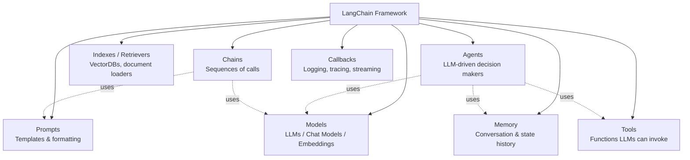
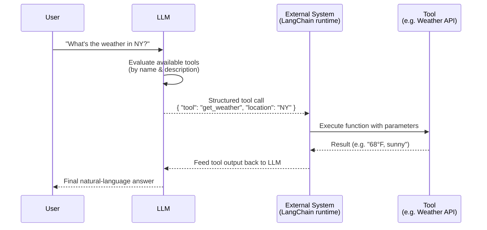
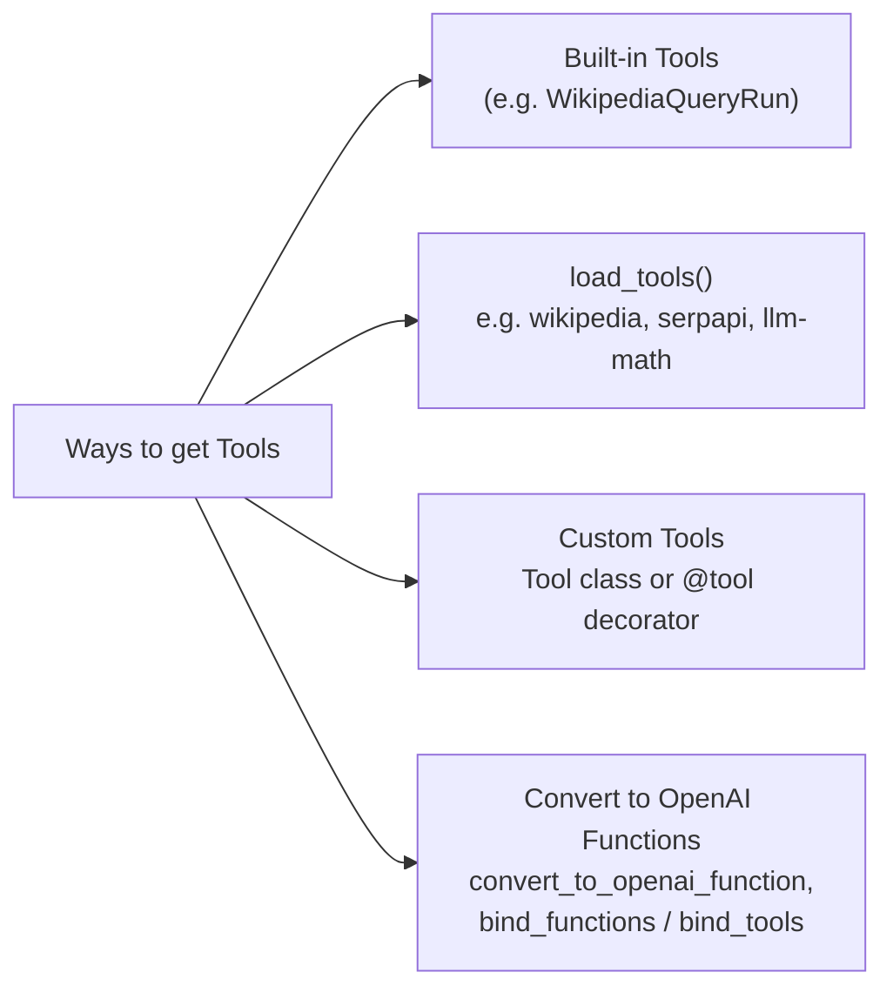
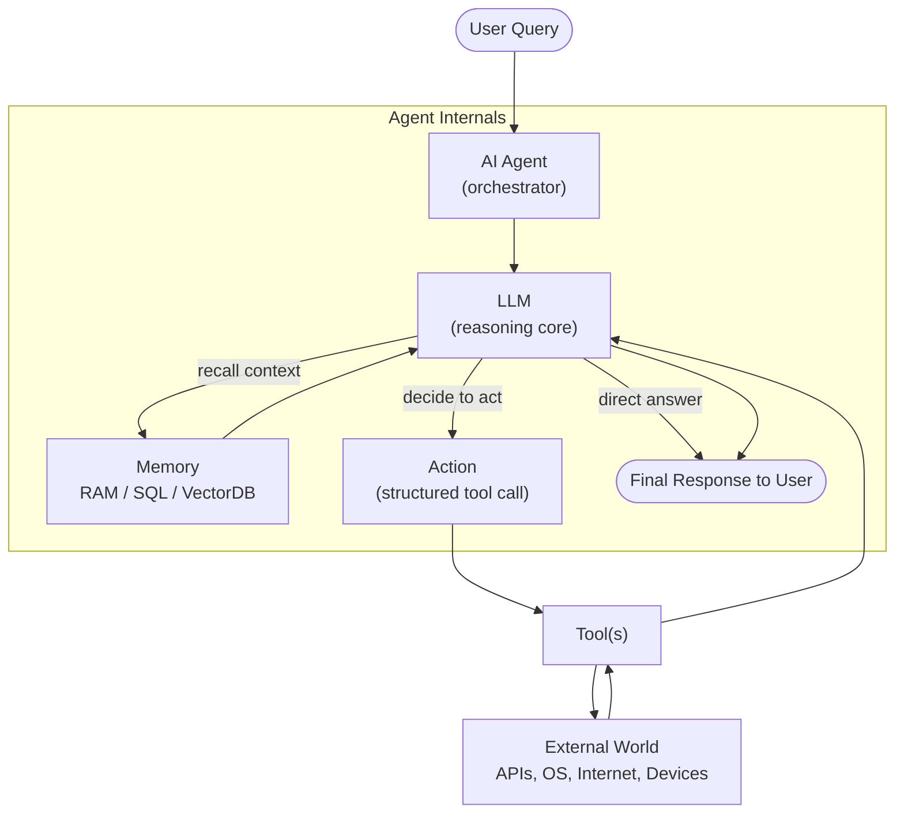

# LangChain

**LangChain** is a framework for building applications powered by large language models (LLMs). It provides a standardized way to connect LLMs with external data, tools, memory, and orchestration logic, so you can build things like chatbots, RAG systems, and autonomous agents instead of writing that plumbing from scratch each time.

## Core Components

| Component | Purpose |
|---|---|
| **Models** | Wrappers around LLMs, chat models, and embedding models (OpenAI, Anthropic, etc.) |
| **Prompts** | Templates for structuring input to models |
| **Chains** | Fixed sequences of calls (e.g., prompt → LLM → parser) |
| **Memory** | Stores conversation/context across turns |
| **Indexes/Retrievers** | Connects LLMs to external documents/data (RAG) |
| **Tools** | Functions an LLM can request to be executed |
| **Agents** | LLM-driven systems that reason and decide which tools/actions to use |
| **Callbacks** | Hooks for logging, monitoring, streaming |

---

## Tools in LangChain

A **tool** is a function made available to an LLM — e.g., a weather lookup, a database query, or a web search. Every tool has a schema:

- **Name** — unique identifier
- **Description** — what it does (helps the LLM decide when to use it)
- **Parameters** — expected inputs

A **toolkit** is just a bundle of related tools (e.g., all the tools needed to interact with a SQL database).

### Important: LLMs don't execute tools

The LLM never runs code directly. It only **generates structured text** (typically JSON) describing which tool to call and with what arguments. An external system (LangChain's runtime) parses that output, actually executes the function, and feeds the result back to the LLM.

**Note:** "Function calling" (OpenAI's term) and "tool calling" (used by Anthropic, LangChain, and the broader industry) describe the exact same mechanism — just different naming.

### Ways to create/use tools in LangChain

Common built-in tool categories: **Wikipedia**, **search engines** (Bing, Google, DuckDuckGo), and various **APIs** (weather, finance, etc.).

---

## Agents (tools in context)

An **agent** is a higher-level orchestration system — it wraps an LLM together with tools, memory, and execution logic so it can reason about *what to do*, not just generate text.

### Ways to build agents in LangChain

- **Built-in agent types** — e.g. `zero-shot-react-description` for simple tool-selection reasoning
- **OpenAI function agents** — `create_openai_functions_agent`
- **LangGraph agents** — `create_react_agent` for complex reasoning, chaining, and streaming
- **AgentExecutor** — runs the loop: call LLM → process tool output → decide if done
- **Memory (e.g. `MemorySaver`)** — lets agents keep context across turns

### Quick distinction

| | **Tool** | **Agent** |
|---|---|---|
| What it is | A single callable function | An orchestration system |
| Contains | Name, description, parameters | LLM + tools + memory + execution loop |
| Decides anything? | No — just executes when called | Yes — decides *when/whether* to use tools |
