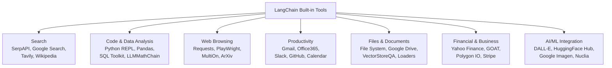

# Popular Built-in Tools in LangChain

LangChain ships a wide range of built-in **tools** and **toolkits** (a toolkit is just a bundle of related tools meant to be used together) that extend what an agent can do — searching the web, running code, querying databases, sending emails, generating images, and more. Each still follows the same schema from [langchain-overview.md](langchain-overview.md): a name, a description, and parameters the model can generate.

> **Free vs. paid:** many of these wrap a third-party API that requires its own account/API key and may charge per call. The "Typical access" column below is a rough guide only — always confirm current pricing and quotas on the tool's official documentation before integrating it.

## 1. Search Tools

| Tool/Toolkit | Function | Purpose | Typical access |
| --- | --- | --- | --- |
| **SerpAPI** | Web search | Performs web searches and returns answers | Paid API (free trial quota) |
| **Google Search** | Web search | Executes Google searches, returns URLs, snippets, titles | Paid API (Google Custom Search) |
| **Tavily Search** | AI-optimized search | Search engine built specifically for AI agents — returns URLs, content, titles, images, and answers | Free tier + paid plans |
| **Wikipedia** | Knowledge base search | Searches Wikipedia articles, returns relevant information and summaries | Free, no API key |

## 2. Code Interpretation and Data Analysis

| Tool/Toolkit | Function | Purpose | Typical access |
| --- | --- | --- | --- |
| **Python REPL** | Code execution | Executes Python code for complex calculations, data analysis, and automation | Free (runs locally) |
| **Pandas DataFrame** | Data manipulation | Lets agents interact with and analyze tabular data in Pandas DataFrames | Free (local) |
| **SQL Database Toolkit** | Database querying | Lets agents query and manipulate SQL databases using natural language | Free (uses your own DB) |
| **LLMMathChain** | Mathematical computation | Solves math problems by translating them to Python code and evaluating them | Free |
| **JSON Toolkit** | JSON manipulation | Helps agents interact with large JSON/dictionary objects efficiently | Free |

## 3. Web Browsing and Interaction

| Tool/Toolkit | Function | Purpose | Typical access |
| --- | --- | --- | --- |
| **Requests Toolkit** | HTTP requests | Constructs HTTP requests to interact with web APIs and fetch web content | Free |
| **PlayWright Browser** | Browser automation | Controls web browsers to navigate websites and interact with pages | Free (local browser) |
| **MultiOn Toolkit** | Web app interaction | Enables AI agents to interact with popular web applications | Paid API |
| **ArXiv** | Scientific paper search | Searches and retrieves scientific papers from the arXiv repository | Free |

## 4. Productivity and Collaboration

| Tool/Toolkit | Function | Purpose | Typical access |
| --- | --- | --- | --- |
| **Gmail Toolkit** | Email management | Reads, sends, and manages emails through Gmail | Free API (OAuth, usage quotas) |
| **Office365 Toolkit** | Office suite integration | Interacts with Microsoft 365 apps, including Outlook, OneDrive, etc. | Free API (Microsoft account, quotas) |
| **Slack Toolkit** | Team communication | Sends and reads messages in Slack channels and DMs | Free (Slack app/bot token) |
| **GitHub Toolkit** | Code repository management | Manages repositories, issues, pull requests, and other GitHub features | Free (rate-limited API) |
| **Google Calendar** | Calendar management | Creates, reads, and updates calendar events | Free API (OAuth, quotas) |

## 5. File and Document Processing

| Tool/Toolkit | Function | Purpose | Typical access |
| --- | --- | --- | --- |
| **File System** | Local file operations | Interacts with the local file system to read, write, and manage files | Free (local) |
| **Google Drive** | Cloud storage | Connects to Google Drive to access, search, and manage cloud files | Free API (OAuth, quotas) |
| **VectorStoreQA** | Document querying | Queries information from documents stored in vector databases | Depends on the vector store used |
| **Document Loaders** | Content extraction | Extracts content from various document formats (PDF, DOCX, etc.) | Free |

## 6. Financial and Business Tools

| Tool/Toolkit | Function | Purpose | Typical access |
| --- | --- | --- | --- |
| **Yahoo Finance** | Financial news | Retrieves financial news articles and market information | Free |
| **GOAT** | Financial transactions | Creates/receives payments, purchases goods, and makes investments | Requires funded wallet/account |
| **Polygon IO** | Market data | Real-time and historical market data for stocks, options, etc. | Free tier + paid plans |
| **Stripe** | Payment processing | Manages payments, subscriptions, and other e-commerce functions | Paid (transaction fees) |

## 7. AI and Machine Learning Integration

| Tool/Toolkit | Function | Purpose | Typical access |
| --- | --- | --- | --- |
| **DALL-E Image Generator** | Image creation | Generates images from text descriptions using OpenAI's DALL-E models | Paid API |
| **HuggingFace Hub Tools** | Model access | Connects to various ML models hosted on HuggingFace | Free / paid depending on model |
| **Google Imagen** | Image generation | Accesses Google's image generation via Vertex AI | Paid API |
| **Nuclia Understanding** | Unstructured data indexing | Indexes unstructured data from various sources for enhanced retrieval | Paid (tiered service) |

## Summary

- LangChain integrates tools and toolkits to extend LLM functionality across search, data analysis, web browsing, productivity, files, finance, and AI/ML.
- Each tool serves a specific function — e.g., **SerpAPI** performs web searches, while **Python REPL** executes code for data analysis or automation.
- **Toolkits** group related tools (e.g., **SQL Database Toolkit**, **Gmail Toolkit**) to enable more complex task orchestration behind one interface.
- Some tools are free, others require payment — always verify pricing and availability in the official documentation before integrating.
- Use-case-specific tools (e.g., **Tavily** for AI-optimized search, **MultiOn** for web app interaction) help tailor a LangChain app to real business or research needs, rather than defaulting to one generic search/browsing tool for everything.
