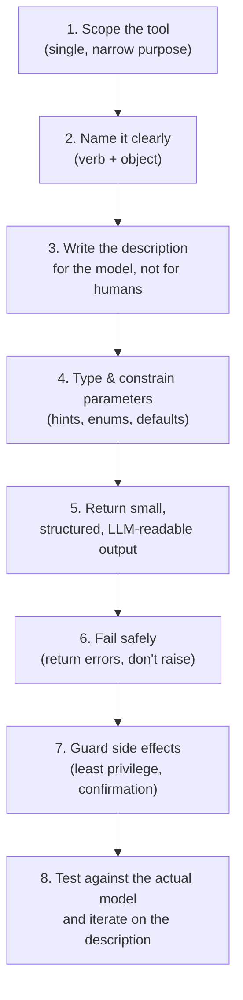

# Best Practices for Creating Tools

A tool's schema (name, description, parameters) is the *only* thing the model sees when deciding whether and how to call it — it never reads your implementation. Most tool-calling failures trace back to that schema being ambiguous, not to the underlying function being buggy. These practices are organized around that idea.



## 1. Keep each tool narrowly scoped

Give a tool **one job**. A `manage_calendar` tool that creates, deletes, and searches events forces the model to guess which mode it's in from free-text arguments. Prefer `create_event`, `delete_event`, `search_events` as separate tools — each with an unambiguous name and a small, well-defined parameter set.

- **Why:** the model picks a tool almost entirely from its name + description. Overloaded tools increase the chance of the wrong action or wrong parameters being generated.
- **Anti-pattern:** a single `do_database_thing(action: str, ...)` tool where `action` is a free-text string like `"insert"` / `"update"` / `"delete"` — this just re-implements tool selection *inside* the tool, where the model has no schema to guide it.

## 2. Name tools clearly and consistently

Use a `verb_object` pattern: `get_weather`, `search_wikipedia`, `send_email`. Avoid vague names (`helper`, `process`, `run`) and avoid near-duplicate names across a toolkit (`get_user` vs. `fetch_user` vs. `lookup_user`) — the model has no way to know they're the same thing or how they differ.

## 3. Write the description for the model, not for a human reader

The docstring **is** the tool's description sent to the LLM. It should say:

- **What the tool does** (not how it's implemented)
- **When to use it** (and, if relevant, when *not* to)
- **What each parameter means**, including units, formats, or valid ranges

```python
@tool
def get_stock_price(ticker: str) -> str:
    """Look up the current stock price for a given ticker symbol.

    Use this for real-time price questions. Do not use for historical
    prices or financial analysis — this only returns the latest quote.

    Args:
        ticker: A stock ticker symbol, e.g. "AAPL", "MSFT".
    """
```

A vague description (`"Gets stock stuff"`) is functionally equivalent to giving the model no information at all — it will either avoid the tool or call it incorrectly.

## 4. Type and constrain parameters tightly

- Always use type hints — LangChain derives the parameter schema from them.
- Prefer `Literal["celsius", "fahrenheit"]` or enums over free-text strings when the valid values are known — this eliminates an entire class of malformed calls.
- Give optional parameters sensible defaults so the model isn't forced to guess a value it doesn't need to.
- For complex inputs, define an explicit `args_schema` (a Pydantic model) instead of relying on primitive types — this lets you add per-field descriptions and validation.

## 5. Return small, structured, model-readable output

- Return concise, structured data (a short dict/string) — not an entire raw API response or a multi-thousand-token HTML dump. Every token returned by a tool is a token the model has to read and pay for.
- Prefer consistent, predictable shapes (e.g., always `{"results": [...], "has_more": bool}`) so the model can reason about the output reliably across calls.
- If a result set could be large, cap it and say so explicitly (e.g., `has_more`), rather than silently truncating.

## 6. Fail safely — return errors, don't let exceptions propagate

A tool that raises an unhandled exception breaks the agent loop. Instead, catch expected failure modes and return a short, informative error string the model can react to (e.g., retry with different arguments, or tell the user it failed):

```python
@tool
def get_weather(location: str) -> str:
    """Get current weather for a city name."""
    try:
        return fetch_weather(location)
    except CityNotFoundError:
        return f"No weather data found for '{location}'. Check the spelling or try a nearby city."
```

This turns a crash into something the model can self-correct from, rather than a dead end.

## 7. Guard side effects and apply least privilege

- For tools that mutate state or cost money (sending an email, deleting a record, placing an order), consider requiring explicit confirmation before execution, or routing them through a human-in-the-loop step.
- Scope credentials/permissions the tool holds to the minimum needed — a `read_file` tool shouldn't have write access; a `query_database` tool should use a read-only connection unless writes are the explicit purpose.
- Set timeouts and rate limits on tools that call external APIs so a hanging or abusive call can't stall or overload the agent loop.

## 8. Test against the real model and iterate

Tool descriptions are prompts — they need the same iteration as any other prompt. Run the tool against representative queries and check:

- Does the model call it when it should?
- Does it *avoid* calling it when it shouldn't (e.g., answering from general knowledge instead of over-calling a search tool)?
- Are the generated parameter values correct and well-formed?

Small local/open models are especially sensitive to vague descriptions — what works with a frontier hosted model may need a more explicit description or added examples to work reliably with a smaller one.

## Quick checklist

| Practice | Red flag it prevents |
| --- | --- |
| One job per tool | Model picks the right tool but the wrong "mode" inside it |
| Clear verb_object name | Model can't distinguish between similar tools |
| Description states when (not) to use it | Over-calling or under-calling the tool |
| Typed / enum-constrained parameters | Malformed or hallucinated argument values |
| Small, structured output | Context bloat, model losing track of relevant fields |
| Errors returned, not raised | Agent loop crashing on a bad input |
| Least-privilege, confirm destructive actions | Irreversible action taken on a hallucinated or wrong call |
| Tested against the target model | Descriptions that only work in theory |
