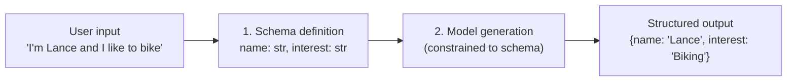
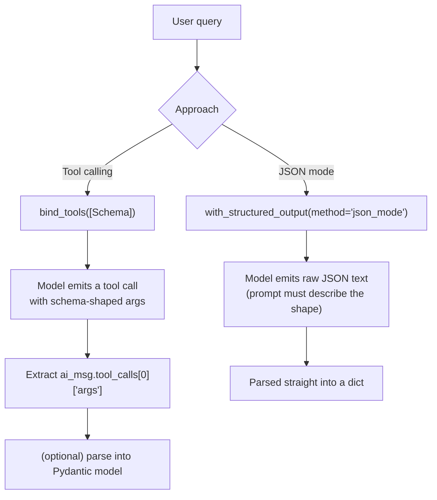
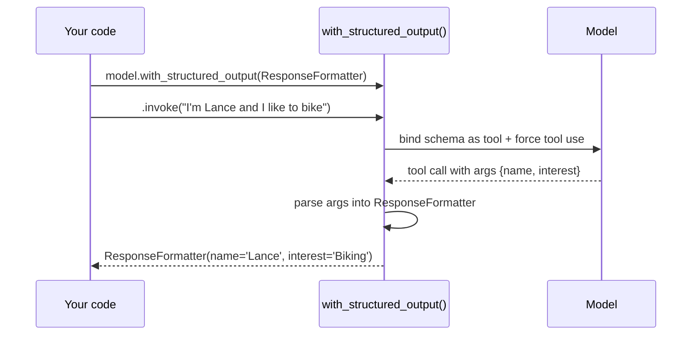

# Structured Outputs in LangChain

## Why structured outputs?

LLMs default to free-form natural language, which is hard to store or process
programmatically. Structured outputs constrain the model to return data in a
predictable, schema-compliant shape. This enables you to:

- Store model responses in databases with consistent formats
- Process outputs programmatically in your application
- Ensure responses include specific fields in a predictable structure
- Validate output against a defined schema

## The two-step process

1. **Schema definition** — define the structure the output should have.
2. **Returning structured output** — have the model generate output that
   conforms to that schema.

Example: given the input `"I'm Lance and I like to bike"`, a schema with
`name` and `interest` fields produces:

```json
{ "name": "Lance", "interest": "Biking" }
```



## 1. Schema definition

### Option A — JSON-like structure (dict / TypedDict)

The simplest option: a plain Python dict or `TypedDict`.

```python
from typing import TypedDict

class ResponseFormatter(TypedDict):
    """Format the response to the user."""
    name: str
    interest: str
```

### Option B — Pydantic models (recommended)

Pydantic models are preferred because they give you:

- Type validation
- Clear field descriptions
- Built-in documentation
- Integration with LangChain's tooling

```python
from pydantic import BaseModel, Field

class ResponseFormatter(BaseModel):
    """Format the response to the user."""
    name: str = Field(description="The person's name")
    interest: str = Field(description="The person's stated interest or hobby")
```

The docstring and `Field(description=...)` values aren't just documentation —
LangChain passes them to the model as part of the tool/schema definition, so
they directly influence how well the model fills in each field.

## 2. Returning structured output

There are two main approaches.



### Approach 1 — Tool calling

The schema is bound to the model *as a tool*. The model is instructed to
always call that tool instead of replying in plain text, and you read the
structured arguments back out of the tool call.

Steps:
1. Create a model
2. Bind the `ResponseFormatter` schema as a tool to the model
3. Invoke the model with a user query
4. Extract the tool call arguments as a dictionary
5. (Optional) Parse the dictionary into a Pydantic object

```python
from langchain_anthropic import ChatAnthropic

model = ChatAnthropic(model="claude-sonnet-5")

model_with_tools = model.bind_tools([ResponseFormatter])

ai_msg = model_with_tools.invoke("I'm Lance and I like to bike")

# Tool call arguments come back as a dict
tool_call_args = ai_msg.tool_calls[0]["args"]
print(tool_call_args)
# {'name': 'Lance', 'interest': 'Biking'}

# Optionally parse into the Pydantic model
result = ResponseFormatter(**tool_call_args)
```

### Approach 2 — JSON mode

Some models support a native JSON mode that guarantees syntactically valid
JSON output. In LangChain, this is accessed via `with_structured_output`
with `method="json_mode"`.

Requirements:
- The underlying model must support JSON mode.
- The prompt must still tell the model *what* JSON shape you want (JSON mode
  guarantees valid JSON, not a particular schema, unless you describe it).

```python
model_json = model.with_structured_output(method="json_mode")

response = model_json.invoke(
    "Return a JSON object with 'name' and 'interest' keys. "
    "I'm Lance and I like to bike."
)
print(response)
# {'name': 'Lance', 'interest': 'Biking'}   <- already a Python dict
```

## `with_structured_output()` — the recommended helper

`with_structured_output()` wraps the entire tool-calling workflow so you
don't have to manage binding, prompting, and parsing yourself.

```python
structured_model = model.with_structured_output(ResponseFormatter)

result = structured_model.invoke("I'm Lance and I like to bike")
print(result)
# ResponseFormatter(name='Lance', interest='Biking')
print(type(result))
# <class '__main__.ResponseFormatter'>
```

What it does under the hood:
1. Binds the schema to the model as a tool.
2. Forces the model to always use that tool (rather than replying in text).
3. Parses the returned tool call back into the schema you passed in
   (a Pydantic instance if you passed a Pydantic model, a dict if you
   passed a `TypedDict`/JSON schema).



This automatically handles:
- Binding the schema to the model as a tool
- Instructing the model to always use the tool
- Parsing the output back into the specified schema

## Tool calling vs. JSON mode — when to use which

| | Tool calling (`with_structured_output(Schema)`) | JSON mode (`method="json_mode"`) |
|---|---|---|
| Output type | Parsed Pydantic object / dict | Raw Python dict (from JSON) |
| Schema enforcement | Strong — model is forced to call the tool matching your schema | Weaker — you must describe the shape in the prompt yourself |
| Model support needed | Any model that supports tool/function calling | Model must explicitly support JSON mode |
| Best for | Strict schema compliance, nested/complex objects | Simple cases, models without native tool calling |

**Recommendation:** default to `with_structured_output(PydanticModel)` (tool
calling) for anything going into a database, API, or UI component — it gives
the strongest schema guarantees and the least post-processing.

## Use cases

- **Database storage** — format responses for direct storage in databases
- **API integration** — structure outputs to match API request/response shapes
- **UI components** — format data for display in specific UI elements
- **Multi-step workflows** — break complex tasks into structured intermediate steps
- **Data extraction** — pull specific fields out of unstructured text

## Worked example — extraction into a database record

```python
from pydantic import BaseModel, Field
from langchain_anthropic import ChatAnthropic

class ContactInfo(BaseModel):
    """Structured contact record extracted from free text."""
    full_name: str = Field(description="Full name of the person")
    email: str | None = Field(default=None, description="Email address, if present")
    company: str | None = Field(default=None, description="Company name, if mentioned")

model = ChatAnthropic(model="claude-sonnet-5")
extractor = model.with_structured_output(ContactInfo)

text = (
    "Hi, I'm Priya Shah from Northwind Traders, "
    "you can reach me at priya.shah@northwind.example"
)

record = extractor.invoke(text)
print(record)
# ContactInfo(full_name='Priya Shah', email='priya.shah@northwind.example', company='Northwind Traders')

# record is a validated Pydantic object -> safe to insert into a DB row
db_row = record.model_dump()
```

## Summary

- Structured outputs let LLMs produce predictable, schema-compliant
  responses instead of free-form text.
- Schemas can be plain JSON-like dicts/`TypedDict`s or Pydantic models;
  Pydantic adds validation, descriptions, and documentation.
- **Tool calling** binds the schema as a tool and forces the model to call
  it, giving strong schema enforcement.
- **JSON mode** relies on a model's native JSON-output capability; it's
  simpler but enforcement is weaker unless you describe the shape yourself.
- `with_structured_output()` is the recommended entry point: it binds the
  schema, forces tool use, and parses the result back into your schema in
  one call.
