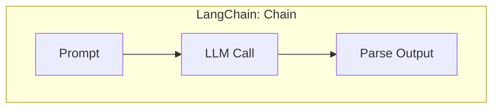
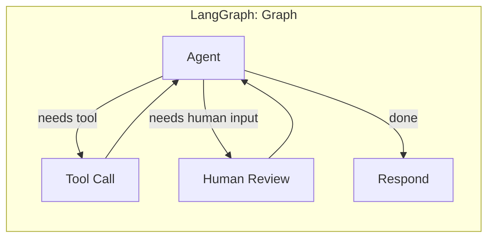
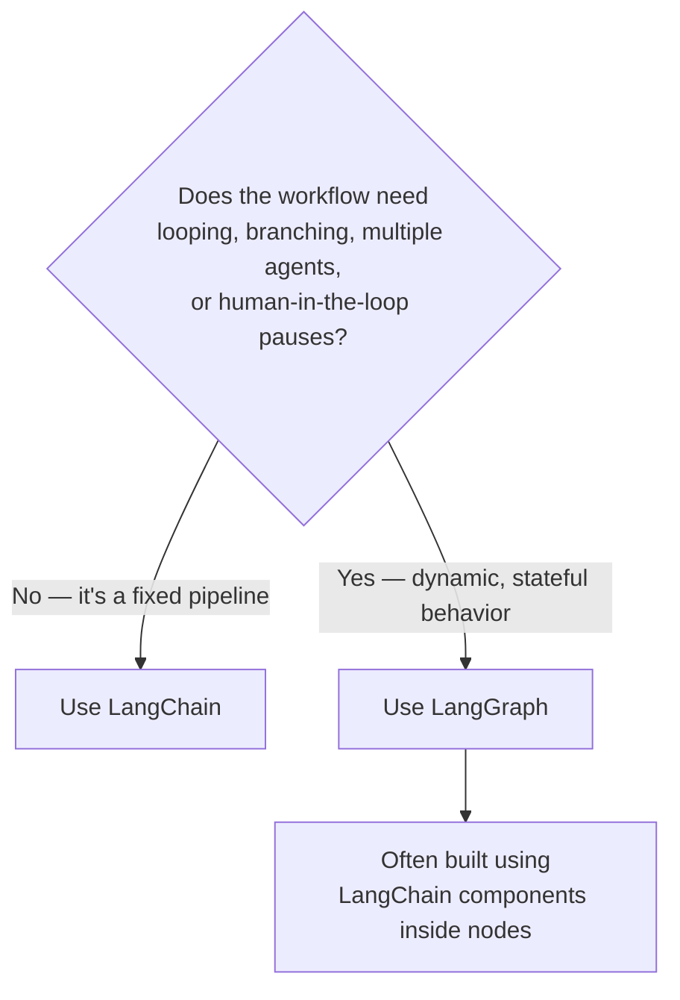

# LangChain vs LangGraph

Both live in the same ecosystem and are often used together, but they solve different problems.

## Core Difference

| | LangChain | LangGraph |
| --- | --- | --- |
| **Model** | Chains — mostly linear sequences of steps | Graphs — nodes + edges + shared state |
| **Control flow** | Sequential (`A → B → C`), with limited branching via agents/routers | Explicit branching, looping, and cycles |
| **State** | Implicit, often just passed between chain steps | First-class, persistent, shared across the whole graph |
| **Best for** | Straightforward, mostly one-directional pipelines | Complex, stateful, multi-step or multi-agent workflows |
| **Human-in-the-loop** | Not a native concept | Built-in (pause, resume, review) |
| **Debugging** | Trace the chain execution | Visualize the graph, time-travel through states |

Think of LangChain as giving you the **building blocks** (prompts, LLM wrappers, retrievers, memory, chains) and LangGraph as giving you the **orchestration layer** to wire those blocks into workflows that branch, loop, and persist state — in practice, LangGraph workflows often call LangChain components *inside* their nodes.

## Use Cases

### LangChain fits well when the task is a pipeline

- **Q&A over documents (RAG)**: retrieve chunks → stuff into prompt → call LLM → return answer
- **Summarization**: load document → split into chunks → summarize each → combine
- **Simple chatbot with memory**: prompt template + conversation memory + LLM call
- **Data extraction**: prompt → LLM → structured output parser

**Example scenario:** You need a bot that answers questions from a company's internal PDF wiki. The flow is always: embed the question → search the vector store → pass matched docs + question to the LLM → return the answer. There's no real branching or multi-turn reasoning — a LangChain `RetrievalQA`-style chain handles this cleanly.

### LangGraph fits well when the task needs a workflow

- **Customer support agent**: classify issue → try automated resolution → loop on retries → escalate to human if stuck, while remembering the whole conversation
- **Multi-agent research assistant**: a planner agent delegates to a search agent and a writer agent, looping until the plan is satisfied
- **Approval workflows**: an agent drafts an action (e.g., send an email, execute a trade) and pauses for human approval before continuing
- **Self-correcting code agent**: write code → run tests → on failure, loop back and fix → repeat until tests pass or a retry limit is hit

**Example scenario:** You're building a customer support agent that should classify a complaint, attempt to resolve it, retry up to 3 times if the resolution fails validation, and hand off to a human agent if it still can't resolve the issue — all while keeping the full conversation in context. That branching + looping + human handoff + persistent memory is exactly what LangGraph's node/edge/state model is built for; a linear chain can't express the retry loop or the conditional escalation cleanly.

## When to Reach for Which

- **Start with LangChain** if your workflow is a straight line: input → a fixed sequence of steps → output. Simpler to write, simpler to reason about.
- **Reach for LangGraph** as soon as you need any of: looping/retries, conditional branching based on runtime state, multiple cooperating agents, human-in-the-loop pauses, or long-running state that must persist across many steps.
- **Use both together** in most real systems: LangChain supplies the components (prompts, retrievers, output parsers, tool wrappers), and LangGraph supplies the graph that decides *when* and *in what order* those components run.

## Quick Decision Guide

