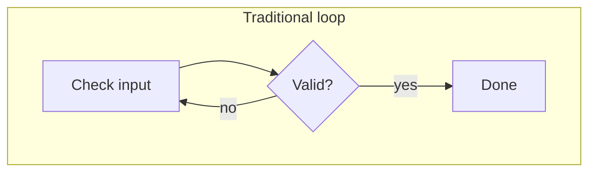
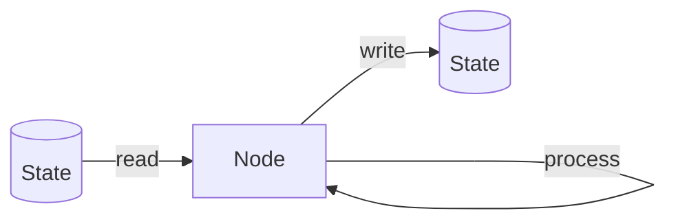
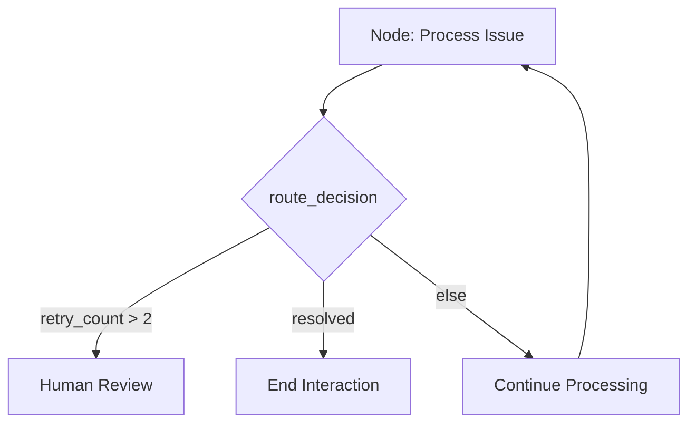
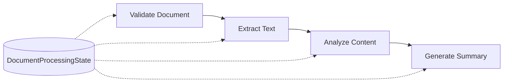

# LangGraph Architecture

Now that you know the basics of LangGraph — nodes, edges, and persistent state — this covers the architectural principles behind clear, effective workflows.

## Why Graph Architecture?

Traditional loops and `if` statements break down fast in complex AI workflows. Graphs give you:

- **Dynamic decision-making** — paths branch based on runtime conditions
- **Clear visualization** — mermaid diagrams make debugging intuitive
- **Reusable components** — modular nodes developed and tested independently

A customer support agent shows the contrast well: a traditional loop can only handle simple, repetitive checks. A LangGraph workflow can branch, loop, and pause for human interaction — all while keeping full context.



## State Design

State is the workflow's shared context and data. Good state design follows two rules:

- **Clear naming** — `user_query`, `agent_response`, not `x`, `data`
- **Flat structure** — avoid deep nesting so state is easy to read and update

```python
from typing import TypedDict

class SupportAgentState(TypedDict):
    user_input: str
    agent_response: str
    issue_type: str
    retry_count: int
```

## Node Design

Each node should do **one clear job**. Common node types:

| Type | Responsibility |
| ---- | --------------- |
| **Processing** | Data transformation or computation |
| **Validation** | Check conditions or data integrity |
| **Integration** | Talk to external systems (APIs, databases) |
| **Decision** | Route the workflow based on conditions |

Every node follows the same lifecycle: **read** the inputs it needs from state, **do** its task, **write** the result back to state.



## Edges and Workflow Patterns

Edges control the flow between nodes, often via conditional routing logic:

```python
def route_decision(state):
    if state["retry_count"] > 2:
        return "human_review"
    elif state["issue_type"] == "resolved":
        return "end_interaction"
    else:
        return "continue_processing"
```



## Error Handling

Plan for failure up front, not as an afterthought:

- Add error-specific fields to state
- Create dedicated error-handling nodes
- Implement graceful fallbacks

Common strategies:

- **Retry nodes** — attempt the action again
- **Error nodes** — after repeated failures, route to human intervention or logging

## Testing and Debugging

Keep workflows testable by design:

- **Node isolation** — test each node on its own
- **Predictable state** — same inputs always produce the same outputs
- **Incremental development** — add and verify one node at a time

## Performance Considerations

- Minimize state complexity
- Isolate costly computations into their own nodes
- Cache repeated expensive operations

## Integration Tips

- Keep integration logic (external APIs, DBs) separate from core logic
- Anticipate failures with timeouts and fallback paths
- For human-in-the-loop steps: pause clearly for approval/review, and give the human a straightforward decision path

## Common Mistakes to Avoid

| Avoid | Do instead |
| ----- | ---------- |
| Oversized nodes handling multiple tasks | Modular nodes with one clear responsibility |
| Deeply nested or unclear state | Explicit, flat state schemas |
| Ignoring error conditions | Plan error handling early in the design |

## Example Workflow: Document Processing

1. Validate uploaded document
2. Extract text
3. Analyze content
4. Generate summary



```python
from typing import TypedDict

class DocumentProcessingState(TypedDict):
    file_path: str
    text_content: str
    summary: str
    analysis_results: dict
```

## Conclusion

Effective LangGraph architecture comes down to simplicity, clarity, and modularity:

- Start simple, add complexity incrementally
- Keep state explicit and manageable
- Design independent, clearly-scoped nodes
- Handle errors proactively, not reactively
