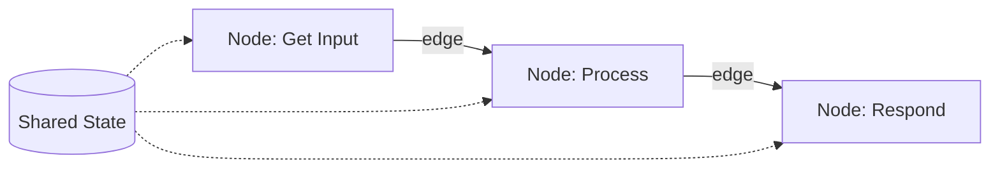
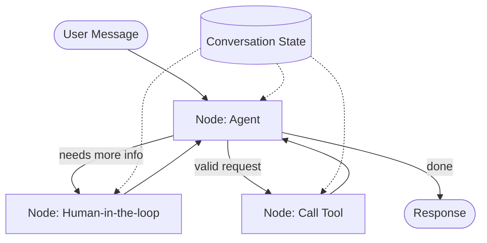

# Introduction to LangGraph

LangGraph is a framework in the LangChain ecosystem for building **stateful, multi-agent applications**. It's low-level and flexible — you get full control instead of restrictive abstractions.

## The Core Idea: Workflows as Graphs

LangGraph models an agent's workflow as a graph made of three core pieces:

| Component  | What it does                                                          |
| ---------- | ---------------------------------------------------------------------- |
| **Node**   | An individual step or function that does the actual computation       |
| **Edge**   | Defines how execution flows from one node to the next                  |
| **State**  | Shared memory that persists across all nodes, keeping context alive    |

## Why Not Just Use `for` / `while` / `if`?

Plain loops and conditionals are linear — they repeat code or branch once, then move on. They don't naturally hold onto context or make evolving decisions. LangGraph adds:

- **State management** — context persists and updates across nodes
- **Conditional transitions** — the workflow decides its own path at runtime
- **Modularity** — each node is developed and tested independently
- **Observability** — the execution path is visible, making debugging easier

## Key Capabilities

- **Looping & branching** — agents make dynamic decisions as they go
- **State persistence** — context survives long-running interactions
- **Human-in-the-loop** — pause execution for manual input
- **Time travel** — rewind to a previous state for debugging

## Example: Why It Matters

A `while` loop can keep re-asking a user for valid input, but it forgets everything once the loop ends. A LangGraph workflow can **branch, loop, pause for human input, and resume** — all while remembering the full conversation.

## Takeaway

LangGraph turns agent logic into an explicit, visualizable graph of **nodes** (computation), **edges** (flow), and **state** (memory) — giving you the branching, looping, persistence, and human oversight that plain code loops can't provide.
